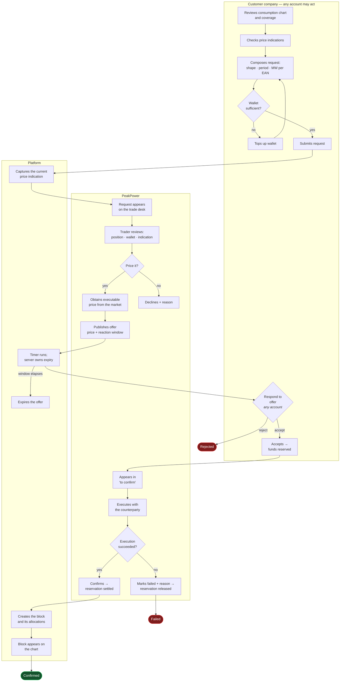
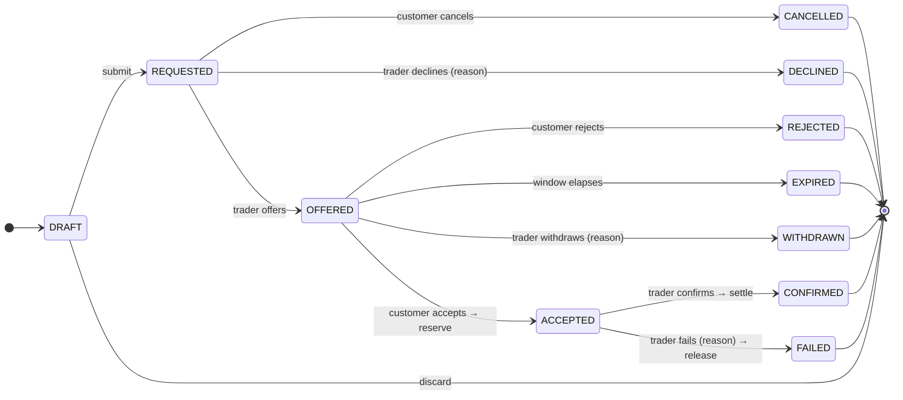
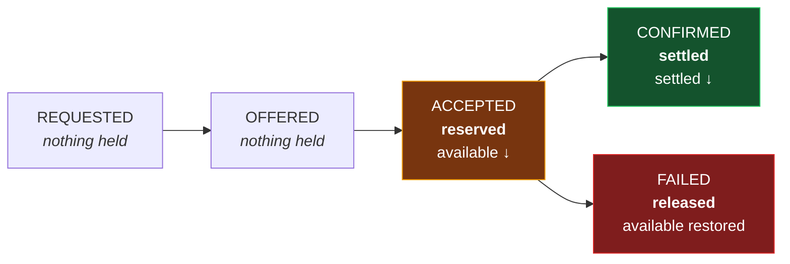
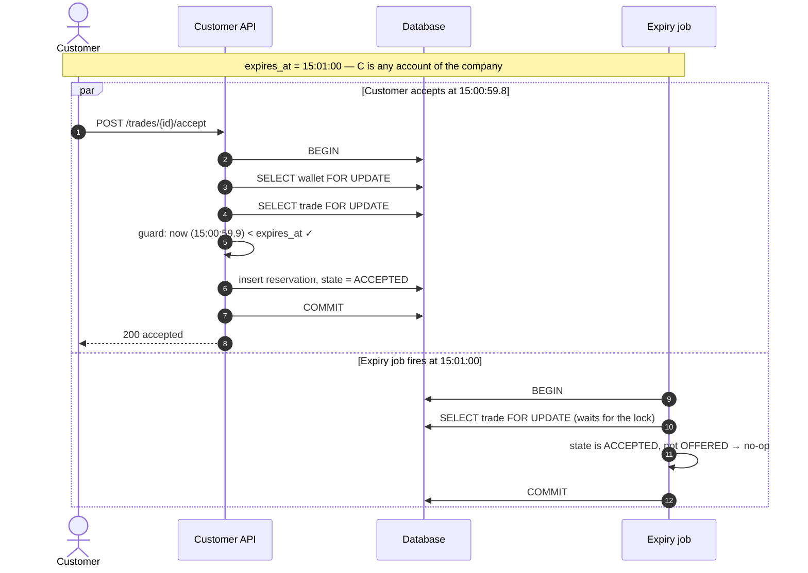

# Process — Trade Lifecycle

End-to-end, from a customer noticing an exposure to a confirmed position on the chart.

Feature spec: [F05](../10-features/F05-energy-block-trading.md).

---

## 1. The whole process

## 2. State machine

## 3. Timing

```mermaid
gantt
    title Target timings for one trade
    dateFormat HH:mm
    axisFormat %H:%M

    section Customer
    Composes request      :a1, 14:15, 10m
    Reads offer, decides  :a2, 14:32, 12m

    section PeakPower
    Request in queue      :crit, b1, 14:25, 3m
    Trader prices it      :b2, 14:28, 4m
    Reaction window open  :active, b3, 14:32, 30m
    Executes on market    :b4, 14:44, 8m
    Confirms              :b5, 14:52, 3m
```

| Interval | Target | Alert |
| --- | --- | --- |
| Request → offer | median **< 30 min** | Request unpriced after 60 min |
| Offer → customer response | within the window, default 30 min | Notification at T−5 min |
| Acceptance → confirmation | median **< 30 min** | Escalation after 4 h **[F05-R39]** |

## 4. Money at each step

Ledger entries produced: `TRADE_RESERVED` on acceptance, then either `TRADE_SETTLED`
(or `TRADE_PROCEEDS` for a sell) on confirmation, or `TRADE_RESERVATION_RELEASED` on failure.

## 5. The two dangerous moments

### 5.1 Acceptance at the expiry boundary

Row-level locking makes the race a queue. Whichever transaction takes the lock first decides; the
second observes the resulting state and does nothing. There is no window in which both succeed.

### 5.2 Confirmation

Wallet and trade change together, in one transaction, with a fixed lock order — **wallet first, then
trade** ([Database design](../20-architecture/04-database-design.md) §5). A partially applied
confirmation is not a state the system can reach.

## 6. Failure paths

| Path | Trigger | Money | Customer sees |
| --- | --- | --- | --- |
| Cancelled | Customer, before pricing | — | Cancelled |
| Declined | Trader will not price it | — | Declined + reason |
| Rejected | Customer says no | — | Rejected |
| Expired | Window elapsed | — | Expired |
| Withdrawn | Trader pulls the offer | — | Withdrawn + reason |
| Failed | Execution failed after acceptance | **Released in full** | Failed + reason |

Every PeakPower-initiated negative outcome carries a mandatory reason that the customer reads
**[F05-R38]**.

## 7. Notifications

| Moment | To | Channel |
| --- | --- | --- |
| Request submitted | Traders | In-app (real-time) + email |
| Offer published | **Every active account** of the company | In-app (real-time) + email — **immediate** |
| 5 minutes remaining | Every active account | In-app + email |
| Offer expired | Every active account, traders | In-app + email |
| Accepted | Traders | In-app (real-time) |
| Confirmed | Every active account | In-app + email |
| Failed | Every active account | In-app + email — **immediate** |
| Unconfirmed > 4 h | Traders | In-app escalation |

Offers go to everyone who could answer them, not only to the person who asked — see
[F11 §2](../10-features/F11-notifications.md) and **[OQ-81]**.

## 8. Audit output

Every transition appends a `trade_event`. A complete history for a typical trade:

| # | Event | Actor | Recorded |
| --: | --- | --- | --- |
| 1 | `SUBMITTED` | Customer account — **J. de Vries** *(Energy Manager)* | Volumes per EAN, comment, captured indication |
| 2 | `OFFERED` | Employee — M. Bakker | Price, reaction window, expiry |
| 3 | `ACCEPTED` | Customer account — **M. Vandersteen** *(Finance Director)* | Amount reserved, reservation id |
| 4 | `CONFIRMED` | Employee — M. Bakker | External reference, block id, settled amount |

Events 1 and 3 are **two different people at the same company** — the normal split between spotting
an exposure and approving the spend **[DEC-18]**. Each event stores the account id plus a snapshot of
the name and job title as at that moment, so the record still reads correctly years later even if
someone is promoted or leaves **[DEC-17]**.

Rendered as one timeline for both audiences, from the same rows **[F15](../10-features/F15-audit-and-observability.md)**.
