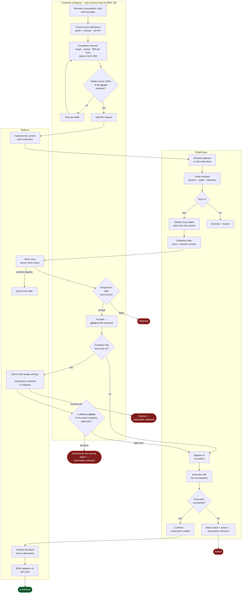
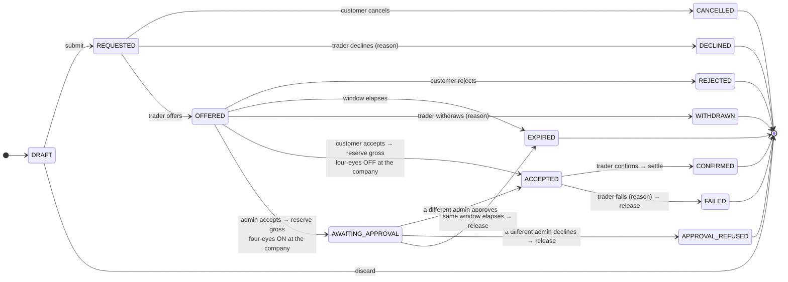
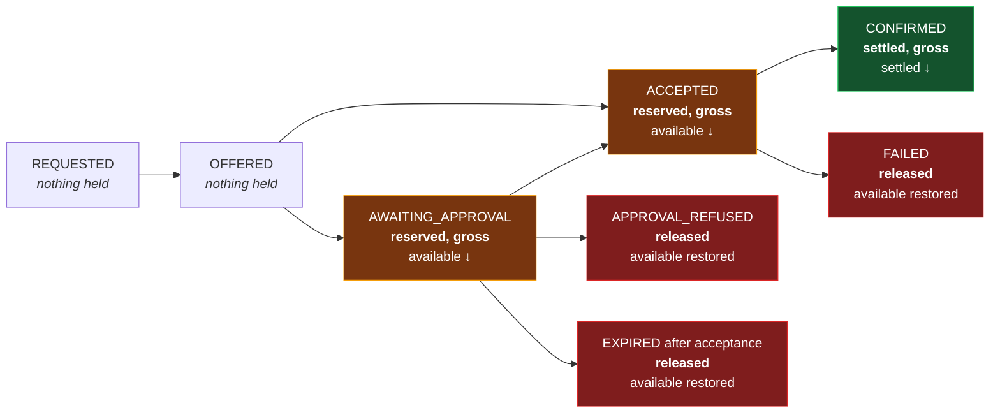
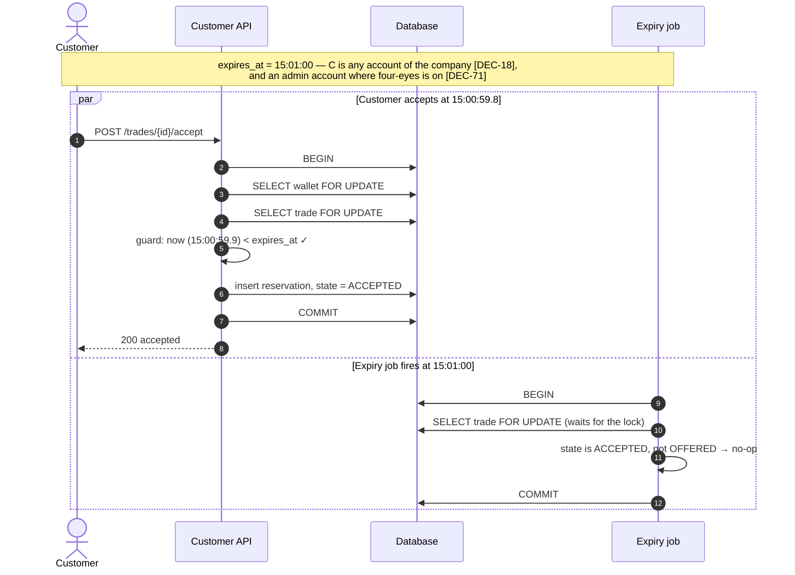
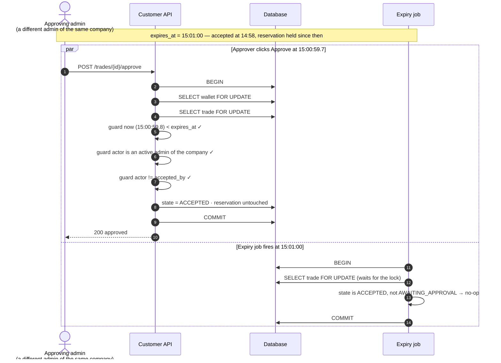

# Process — Trade Lifecycle

End-to-end, from a customer noticing an exposure to a confirmed position on the chart.

Feature spec: [F05](../10-features/F05-energy-block-trading.md).

> **What the 2026-08-19 round changed in this process.** Four-eyes is no longer a value threshold but
> a **per-customer-company mode** **[DEC-71]**, so the branch at acceptance asks *which company is
> this*, not *how big is this*. The reservation and the wallet debit are **VAT-inclusive**
> **[DEC-78]** while the price stays quoted ex-VAT **[DEC-26]**. Volumes step in **0,01 MW**
> **[DEC-70]**. The sell path no longer checks holdings **[DEC-72]**. The wallet funds **trading
> only** — nothing in this lifecycle touches an invoice **[DEC-77]**. And an offer is notified to the
> **account that raised the request** plus, under four-eyes, the **approving admin** **[DEC-111]**,
> not to every active account. Two more things move at the edges of the process: the indication the
> customer starts from is a **quote plus a configurable markup**, default 2%, and is **never firm
> unless PeakPower says so** **[DEC-80]**; and a confirmed block **runs to the end of its delivery
> period even when the customer's contract ends first** **[DEC-82]**.

---

## 1. The whole process

~~The four-eyes branch **[DEC-33]** hangs off acceptance, not off the offer: the money is already
reserved when it is entered, and the offer's own timer is still the only clock.~~ ⚠ **Amended
2026-08-19 by [DEC-71]**, which replaces **[DEC-33]**. The branch still hangs off acceptance and the
clock is still the offer's own — what changed is the question `A9` asks. It **reads a boolean on the
customer company** instead of comparing an amount to a threshold. There is no threshold, in euros or
in megawatts (**[OQ-85]** closed), so a 0,01 MW trade **[DEC-70]** is gated exactly as hard as a
5 MW one, and `A10` can only be answered by a **different admin account of the same company**.
Note that `C6` feeds both the approval decision and the expiry exit — that is the whole of the rule
that acceptance and approval must both fall inside the reaction window.

Three boxes on the customer side do more than their labels admit.

| Box | What it actually does | Why |
| --- | --- | --- |
| `A2` | Shows the **marked-up** indication — the quote plus a configurable percentage, default 2%, held as reference data — labelled as an indication and **never firm unless PeakPower says so** **[DEC-80]** | The markup is the platform's only margin instrument now that surcharges have left it **[DEC-73]**. A raw quote here would give that margin away and imply a firmness the trader has not committed to **[F04](../10-features/F04-price-indications.md)** |
| `A3` | Accepts volumes in steps of **0,01 MW**, minimum 0,01 MW per line **[DEC-70]**, reversing [DEC-32]'s 0,1 MW | Ten times finer. The per-EAN total now almost never lands on a whole MW, so the "PeakPower rounds on the market side" notice next to it is routine information rather than a warning **[F05-R07]** |
| `A4` | Compares available balance against **100% of the gross estimate** — no buffer **[DEC-41]**, grossed up at the 21% of **[DEC-64]** **[DEC-78]** | §4.1 works the figures. An ex-VAT check here clears a request whose own reservation it under-covers by 21%, and there is no buffer to absorb the difference |

For a `SELL` the same path runs with **no holdings check at all** **[DEC-72]** — the customer may sell
a block they do not hold. What that does to `A4` is the subject of §5.4.

## 2. State machine

Fourteen transitions over thirteen states since **[DEC-33]**. ⚠ **Amended 2026-08-19 by [DEC-71]** —
the counts do not move, because [DEC-71] replaces the *trigger*, not the shape: the same fourteen
tuples over the same thirteen states, with `AWAITING_APPROVAL` entered on a per-company flag instead
of a value comparison. What disappears is everything behind the old label — the threshold table, its
most-specific-scope resolution order, the version pinned on the trade, the admin screen to maintain
it, and the deployment in which a platform holding no threshold row cannot accept a trade at all. The
authoritative, exhaustively testable tuple set lives in
[Domain model §4.2](../20-architecture/03-domain-model.md); this diagram is a rendering of it and must
not drift from it.

Three guards sit on the way into and out of `AWAITING_APPROVAL`, and all three are checked against
ids taken from the token, never from the request body **[DEC-17]**:

| Guard | Checked on | If it fails |
| --- | --- | --- |
| The accepting account is an **active admin** of the owning company **[DEC-71]** | `accept`, when the company has four-eyes on | Rejected. A non-admin must not be able to commit the company and leave only the counter-signature governed |
| The approving account is an **active admin of the same company** and is **not** `accepted_by` **[DEC-71]** | `approve` **and** `decline` | Rejected with a specific error. This is the entire content of four eyes: two account ids on two rows |
| `now < expires_at` **[DEC-13]** | `accept`, `approve` and `decline` | The expiry job wins the race and the reservation is released — §5.3 |

The middle row is where **[DEC-71]** costs something the old rule did not: **declining is no longer
open to anyone**. [DEC-33]'s design let any account, the acceptor included, release the reservation
early; [DEC-71] gives the decision — *approve or decline* — to a different admin in both directions,
so an acceptor who realises their mistake cannot undo it themselves. They must reach the other admin
or wait for `expires_at`. No money is trapped (expiry releases in full), but on a 1440-minute window
**[F05-R17]** that wait is a day.

## 3. Timing

```mermaid
gantt
    title Target timings for one trade
    dateFormat HH:mm
    axisFormat %H:%M

    section Customer
    Composes request      :a1, 14:15, 10m
    Reads offer, decides  :a2, 14:32, 12m

    section PeakPower
    Request in queue      :crit, b1, 14:25, 3m
    Trader prices it      :b2, 14:28, 4m
    Reaction window open  :active, b3, 14:32, 30m
    Executes on market    :b4, 14:44, 8m
    Confirms              :b5, 14:52, 3m
```

| Interval | Target | Alert |
| --- | --- | --- |
| Request → offer | median **< 30 min** | Request unpriced after 60 min |
| Offer → customer response | within the window, default 30 min | Notification at T−5 min, to the **requesting account** and, under four-eyes, the **approving admins** **[DEC-111]** |
| Acceptance → approval **[DEC-33]**, **[DEC-71]** | **inside the same window** — no separate clock | The **other admin accounts** are notified immediately, and again at T−5 min **[DEC-111]** |
| Acceptance → confirmation | median **< 30 min** | Escalation after 4 h **[F05-R39]** |

~~The middle row is the one that changes how the gantt above should be read for a large trade.~~
⚠ **Amended 2026-08-19 by [DEC-71]** — read it for **every** trade of a customer with four-eyes on,
at any value, because there is no size below which the second signature is skipped. The 30-minute
reaction window has to accommodate **two** people, not one, so a trader pricing a request for such a
customer should quote a longer window **[F05-R58]**, not the default. The window is configurable to
1440 minutes **[F05-R17]**, so nothing new is needed for this; what is needed is that the trader is
*told*, which is why **[F12-R35]** exists.

**[DEC-111]** makes that timing harder rather than easier. Under **[DEC-63]** the offer landed in
every active account's inbox, so any of them could rescue a window that was running out. Now only two
people are told — the requester and the approving admin — and the reaction window has to fit both of
their diaries. The mitigation is the portal rather than the mailbox: **[DEC-18]** still lets any
account accept, and the offer is visible in-app to the whole company. Nobody else is *prompted*.

## 4. Money at each step

Ledger entries produced: `TRADE_RESERVED` on acceptance, then either `TRADE_SETTLED`
(or `TRADE_PROCEEDS` for a sell) on confirmation, or `TRADE_RESERVATION_RELEASED` on failure,
on approval refusal, or on expiry after acceptance **[DEC-33]**, **[DEC-71]**.

**Nothing in this lifecycle touches an invoice** **[DEC-77]**. The wallet funds **trading only**;
delivery — day-ahead, export and energiebelasting — is calculated monthly, pushed to the bookkeeping
program as a **draft invoice** **[DEC-88]** and paid to the bank. ⚠ **[AS-12] is reversed**, so the
`INVOICE_DEBIT` entry type is gone from the wallet and the four types named above are the only ones
this process can produce. The consequence for the diagram is exact: between `S3` and `S4` the
available balance can be moved by **another trade** and by nothing else, which is what keeps the
"no second balance check on approval" rule safe now that the reservation is the larger, gross figure.

⚠ The diagram's held amounts describe a **BUY**. A `SELL` holds nothing — `TRADE_PROCEEDS` carries no
reserved delta at all ([F06 §3](../10-features/F06-wallet-and-ledger.md)), it simply credits the
wallet on confirmation. That is unremarkable while a sell is covered by a position, and it is the
whole problem once **[DEC-72]** allows one that is not: see §5.4.

### 4.1 The money, worked

⚠ **[DEC-78]** — the amount reserved at acceptance and debited at confirmation is **VAT-inclusive**:
`totalMWh × price × (1 + VAT rate)` at the 21% of **[DEC-64]**. The price itself is still quoted,
offered and stored **ex-VAT** **[DEC-26]**. This is a **sizing rule for a wallet hold, not a tax
calculation** — it produces no VAT line anywhere, because the platform computes no VAT at all and the
bookkeeping program applies a rate per ledger account **[DEC-76]**.

One trade, TRD-1051 at *Vandersteen Koeling B.V.* — base shape, May 2026, three metering points:

| Step | Calculation | Result |
| --- | --- | --- |
| Volume per EAN **[DEC-70]** | `1.37 + 0.86 + 0.52` MW, each a whole multiple of 0,01 MW | **2,75 MW** |
| Delivery intervals | May 2026: `31 × 96`. No DST change in May — the 2026 changes are 29 March and 25 October | **2 976 intervals** |
| Total volume | `2.75 × 2976 × 0.25` | **2 046,00 MWh** |
| Indication shown at `A2` **[DEC-80]** | raw bid `66.50` × `(1 + 0.02)` markup | **€ 67,83/MWh** |
| Pre-submission estimate, ex VAT | `2046.00 × 67.83` | **€ 138.780,18** |
| Pre-submission check at `A4` **[DEC-41]**, **[DEC-78]** | `138780.18 × 1.21` — 100% of the **gross** estimate, no buffer | **€ 167.924,02** must be available |
| Offer price, firm for the window, ex VAT **[DEC-26]** | quoted by the trader | **€ 68,00/MWh** |
| Trade value, ex VAT **[AS-10]** | `2046.00 × 68.00` | **€ 139.128,00** |
| VAT at the **[DEC-64]** reference rate | `139128.00 × 0.21` | **€ 29.216,88** |
| **Reserved at acceptance — and debited unchanged at confirmation** **[DEC-78]** | `139128.00 × 1.21` | **€ 168.344,88** |

Reservation and debit are the **same stored number**, never two calculations, so a VAT-rate change
between acceptance and confirmation cannot open a gap and settlement cannot fall short. The gross-up
is rounded half-away-from-zero to 2 decimals once, at the point it becomes a wallet movement
([Energy block maths](../50-calculations/01-energy-block-maths.md) §4.1).

What the rule costs, in one line: a wallet holding **€ 150.000,00** passes an ex-VAT check on this
trade — € 139.128,00 — and then cannot cover its own reservation, short by **€ 18.344,88**.
**[DEC-41]** deliberately leaves no buffer to absorb that, which is precisely why the gross-up is not
optional.

⚠ The same arithmetic at the new minimum **[DEC-70]**: `0.01 × 744 = 7,44 MWh`, `7.44 × 68.00 =
€ 505,92` ex VAT, and `505.92 × 1.21 = € 612,1632` → **€ 612,16** reserved. At a customer with
four-eyes on, that trade needs the same second admin as the € 168.344,88 one **[DEC-71]**. There is
no small-trade exemption to fall back on, and at 0,01 MW steps the number of trades — and therefore
of approvals — is the thing that grows.

**The reservation is created once, at acceptance, whichever state that lands in.** Approval moves no
money at all — which is exactly why an approval can never fail for want of funds, and why the
available balance cannot be spent underneath a pending approval. Note the consequence for `EXPIRED`:
before **[DEC-33]** an expiry could never touch the wallet, because nothing was held before
acceptance. It can now.

⚠ **[DEC-71]** widens that last sentence rather than changing it. An expiry that releases money used
to be reachable only above a threshold; it is now reachable on **every** trade of a four-eyes
customer and on **none** of anyone else's. And the amount released is the gross one **[DEC-78]**, so
what comes back to the available balance is 21% more than the trade was ever worth ex-VAT.

## 5. The dangerous moments

### 5.1 Acceptance at the expiry boundary

Row-level locking makes the race a queue. Whichever transaction takes the lock first decides; the
second observes the resulting state and does nothing. There is no window in which both succeed.

### 5.2 Confirmation

Wallet and trade change together, in one transaction, with a fixed lock order — **wallet first, then
trade** ([Database design](../20-architecture/04-database-design.md) §5). A partially applied
confirmation is not a state the system can reach.

### 5.3 Approval at the expiry boundary — the sharpest edge in [DEC-71]

The rule is that there is **no second clock**. The offer's reaction window governs the customer's
whole response, so a trade sitting in `AWAITING_APPROVAL` is racing the same `expires_at` the
acceptance was guarded against, and losing that race releases real money — the **gross** amount
**[DEC-78]**. ⚠ Under ~~**[DEC-33]**~~ **[DEC-71]** this edge is no longer reserved for the largest
trades: every trade of a four-eyes customer runs it, so the failure mode is uniform across that
customer's book rather than rare and large.

Identical in shape to §5.1, deliberately: same lock order, same guard, same job. **[DEC-33]** adds a
state to the machine but no new concurrency mechanism, which is the main reason for placing the
approval after acceptance rather than before it. **[DEC-71]** adds no mechanism either — it adds one
boolean read and one flag check to the guard list, both on rows already loaded under the same lock,
so nothing here becomes able to fail for a new reason.

Had the job won the race, it would have moved the trade to `EXPIRED` **and released the reservation
in the same transaction**, and the approve attempt would then have failed its own state guard. Either
way exactly one outcome is recorded, and in neither case is money left held against a trade that no
longer exists.

Two more things follow from having one clock, and both are properties rather than problems. A
customer cannot bind PeakPower past the quoted window by accepting at the last second and approving
later. And PeakPower is never left holding a firm price with no deadline while a customer looks for a
second signatory — ~~which, since the rule only applies to the largest trades, is precisely where that
exposure would hurt most.~~ ⚠ **Amended 2026-08-19 by [DEC-71]**: the rule applies to *every* trade
of a four-eyes customer, so the exposure the single clock prevents is smaller per trade and far more
frequent. The argument for one clock is unchanged; only the shape of what it protects against is.

### 5.4 A sell with nothing behind it

⚠ **[DEC-34] reversed 2026-08-19 by [DEC-72]** — **short selling is permitted.** The sell path
performs **no validation against confirmed holdings** for the period. The case that motivates it is
real rather than speculative: a customer with solar production selling expected surplus.

The exposure this opens has to be stated plainly, because **none** of the three controls in this
document bites on it.

| Control | What it does for a BUY | What it does for a short SELL |
| --- | --- | --- |
| Pre-trade balance check **[DEC-41]** at `A4` | Blocks a request the wallet cannot cover, at 100% of the gross estimate **[DEC-78]** | **Nothing.** A sell credits the wallet; there is no spend to bound |
| Prepaid wallet, never negative **[AS-11]** | Caps the loss at the balance | **Nothing.** A short is a *promise to deliver*, not a spend, and the promise is not on the balance sheet the wallet keeps |
| Reservation at acceptance | Puts the money beyond reach until confirmation | Reserves nothing; `TRADE_PROCEEDS` is credited at confirmation |

So a customer whose panels underperform must buy back the shortfall — under **[DEC-23]** and
**[DEC-87]** the uncovered volume settles at the day-ahead price for the interval, raw, at whatever
that price turns out to be. Nothing in this lifecycle bounds how far that can move against them, and
the platform's only recourse is a wallet that may be empty.

⚠ **[OQ-94]** — *what collateral or exposure limit applies to a short position?* — is registered
against that gap and **blocks the sell path opening to customers**, even though the state machine in
§2 already permits the transition. Do not read §2 as authority to ship it.

### 5.5 The customer's contract ends before the block does

**[DEC-82]** — a block **runs to the end of its delivery period whatever happens to the contract**,
closing **[OQ-29]**. Offboarding does not unwind, transfer or mark-to-market anything, and the
contract end date is not an input to the block.

| Moment | What happens |
| --- | --- |
| Contract ends mid-period | The block is untouched. No state in §2 is entered and no reservation moves — the trade reached `CONFIRMED` long before |
| Metering data after that date | There is none. The connection is no longer read **[F02](../10-features/F02-metering-data-ingestion.md)** |
| Covered volume after that date | Zero, because covered volume is computed against net usage **[DEC-22]** and there is no usage |
| The block volume after that date | **All of it is surplus**, and surplus is sold at the day-ahead price for the interval **[DEC-23]**, raw, with no spread **[DEC-87]** |

The customer therefore keeps the full market risk on 100% of the remaining block. That is the answer
rather than an oversight: it is the over-covered month **[DEC-23]** already specifies, taken to its
limit. The lifecycle above needs no new branch for it, which is the whole reason the decision is
cheap.

## 6. Failure paths

| Path | Trigger | Money | Customer sees |
| --- | --- | --- | --- |
| Cancelled | Customer, before pricing | — | Cancelled |
| Declined | Trader will not price it | — | Declined + reason |
| Rejected | Customer says no | — | Rejected |
| Expired | Window elapsed **before acceptance** | — | Expired |
| Expired | Window elapsed **while awaiting approval** **[DEC-33]**, **[DEC-71]** | **Released in full**, gross **[DEC-78]** | Expired — not approved in time |
| Withdrawn | Trader pulls the offer | — | Withdrawn + reason |
| Approval refused | ~~A second account will not approve the acceptance **[DEC-33]**~~ ⚠ **[DEC-71]**: **a different admin of the same company declines** it | **Released in full**, gross **[DEC-78]** | Not approved, by whom, optional reason |
| Failed | Execution failed after acceptance | **Released in full**, gross | Failed + reason |

Every PeakPower-initiated negative outcome carries a mandatory reason that the customer reads
**[F05-R38]**. Approval refusal is customer-initiated, so its reason is optional — symmetric with
rejecting an offer **[F05-R30]** — but the *name and job title* of the refusing account are always
shown, because that is the record the control exists to produce.

⚠ **Amended 2026-08-19 by [DEC-71]** on **who** may produce that record. Declining is the negative
half of the same counter-signature as approving, so it is open to **a different active admin of the
same company** and to nobody else — not to any account, and not to the acceptor. The row's money and
customer-facing text are unchanged; only the eligible actor narrows. ⚠ The cost is named in §2: the
acceptor's fast escape hatch is gone, and the only remaining self-service exit from a mistaken
acceptance is the clock.

## 7. Notifications

⚠ **Rewritten 2026-08-19 by [DEC-111]**, which reverses **[DEC-63]**, and by **[DEC-71]**. The
recipient column below is the post-decision truth; the rule it replaces — *every active account* — is
kept underneath the table.

| Moment | To | Channel |
| --- | --- | --- |
| Request submitted | Traders | In-app (real-time) + email |
| Offer published | ~~Every active account of the company~~ **The account that raised the request**, plus — when the company has four-eyes on — **the admin accounts that would have to approve it** **[DEC-111]**, **[DEC-71]** | In-app (real-time) + email — **immediate** |
| 5 minutes remaining | The same set **[DEC-111]** | In-app + email |
| Offer expired | The same set **[DEC-111]**, traders | In-app + email |
| ~~**Approval needed** **[DEC-33]**~~ **Approval requested** **[DEC-71]** | ~~Every active account except the acceptor~~ **The other admin accounts of the company** — every active admin except the one who accepted | In-app (real-time) + email — **immediate**, with the volume, the **gross** amount already held **[DEC-78]**, the acceptor's name and job title, and the time left |
| 5 minutes remaining, awaiting approval | The other admin accounts, traders | In-app + email |
| Approved | Traders, the **acceptor** and the other admins | In-app (real-time) |
| Approval declined | The **acceptor** and the other admins, traders | In-app + email |
| Accepted | Traders | In-app (real-time) |
| Confirmed | The requester, plus the admins where four-eyes applied **[DEC-111]** | In-app + email |
| Failed | The requester, plus the admins where four-eyes applied **[DEC-111]** | In-app + email — **immediate** |
| Unconfirmed > 4 h | Traders | In-app escalation |

~~Offers go to everyone who could answer them, not only to the person who asked — see
[F11 §2](../10-features/F11-notifications.md) and **[DEC-63]**.~~
⚠ **Reversed 2026-08-19 by [DEC-111].** An offer goes to the **account that raised the request** and,
under four-eyes, to the **approving admin**. Nobody else at the company is told, in-app or by email.
See [F11 §2](../10-features/F11-notifications.md).

⚠ **The cost, recorded because [DEC-63]'s rationale named exactly this:** a 30-minute offer can now
die because one person is in a meeting. **[DEC-18]** is untouched — *any* active account may still
accept — so the platform has deliberately narrowed who **knows** while leaving open who **may act**,
and those two sets are no longer the same. That gap is an accepted risk rather than an oversight. The
mitigation is the portal, not the mailbox: the offer is visible in-app to the whole company, and the
T−5 reminder still fires. The alternative, telling everyone, was rejected by the customer as noise.

Approval requests go to the other admins and **not** to the acceptor **[DEC-33]**, **[DEC-71]**. That
is the one row in the table with a deliberate exclusion, and the exclusion is the control: sending it
to the acceptor as well would invite them to click a button the server will refuse. The *outcome*
rows — approved, declined — do go back to the acceptor, because they are the person whose commitment
it was, and an expiry or a decline moves their money.

Two rows carry an inference rather than a decision, and are flagged as such: **confirmed** and
**failed**. [DEC-111] speaks about *offer* notifications. A trade outcome belongs to the same request
and the only decision that ever gave it a wider audience was [DEC-63], which is reversed, so it
inherits the offer's audience. ⚠ **Confirm at the next session** — the same flag
[F11 §2](../10-features/F11-notifications.md) carries.

## 8. Audit output

Every transition appends a `trade_event`. A complete history for a typical trade — TRD-1051, the one
costed in §4.1:

| # | Event | Actor | At | Recorded |
| --: | --- | --- | --- | --- |
| 1 | `SUBMITTED` | Customer account — **J. de Vries** *(Energy Manager)* | 14:25:03 | Volumes per EAN — 1,37 + 0,86 + 0,52 MW **[DEC-70]** — comment, and the captured indication **including its markup** **[DEC-80]** |
| 2 | `OFFERED` | Employee — M. Bakker | 14:31:20 | Price € 68,00/MWh ex VAT, 30-minute window, `expires_at` 15:01:00 |
| 3 | `ACCEPTED` | Customer account — **M. Vandersteen** *(Finance Director)* | 14:44:12 | Gross amount reserved **€ 168.344,88** **[DEC-78]**, ex-VAT value € 139.128,00, reservation id |
| 4 | `CONFIRMED` | Employee — M. Bakker | 14:52:07 | External reference, block id, settled amount € 168.344,88 |

Events 1 and 3 are **two different people at the same company** — the normal split between spotting
an exposure and approving the spend **[DEC-18]**. Each event stores the account id plus a snapshot of
the name and job title as at that moment, so the record still reads correctly years later even if
someone is promoted or leaves **[DEC-17]**.

### 8.1 ~~A trade above the four-eyes threshold~~ A trade at a customer with four-eyes on

~~The same trade, above the threshold **[DEC-33]**.~~ ⚠ **Amended 2026-08-19 by [DEC-71]** — the same
trade at a company whose **four-eyes flag is on**, at any value. One event more, and one more name:

| # | Event | Actor | At | Recorded |
| --: | --- | --- | --- | --- |
| 1 | `SUBMITTED` | Customer account — **J. de Vries** *(Energy Manager)* | 14:25:03 | Volumes per EAN, comment, captured indication with markup **[DEC-80]** |
| 2 | `OFFERED` | Employee — M. Bakker | 14:31:20 | Price € 68,00/MWh ex VAT, 30-minute window, `expires_at` 15:01:00 |
| 3 | `ACCEPTED` | Customer account — **M. Vandersteen** *(Finance Director, admin)* | 14:44:12 | Gross amount reserved € 168.344,88, reservation id, ~~**threshold version and the amount compared**~~ **the company's four-eyes flag read as ON** **[DEC-71]**, resulting state `AWAITING_APPROVAL` |
| 4 | `APPROVED` | Customer account — **S. Aydin** *(Managing Director, admin)* | 14:52:41 | Decision `APPROVED`, initiator M. Vandersteen, **8 min 19 s** remaining of the window, resulting state `ACCEPTED` |
| 5 | `CONFIRMED` | Employee — M. Bakker | 15:04:30 | External reference, block id, settled amount € 168.344,88 |

The four-eyes decision is one row with five load-bearing fields, and they are what an auditor reads:

| Field | Value in this trade | Why it is stored |
| --- | --- | --- |
| Initiator (`accepted_by_account_id`) | M. Vandersteen *(Finance Director)*, admin | Half of the pair. Snapshotted with name and job title **[DEC-17]** |
| Approver (`approved_by_account_id`) | S. Aydin *(Managing Director)*, admin | The other half. Must differ from the initiator and be an active admin of the same company **[DEC-71]** |
| Decision | `APPROVED` — the alternative is `APPROVAL_REFUSED` | Both are recorded; a decline is a decision, not an absence of one |
| Initiated at | 14:44:12 | With `expires_at` it gives the time the second admin actually had: 16 min 48 s |
| Decided at | 14:52:41 | With `expires_at` it gives the margin: 8 min 19 s. An expiry instead of a decision leaves this null and the trade in `EXPIRED` |

There is deliberately **no threshold field** on the row any more **[DEC-71]** — the state itself
records that the mode was on, and the flag read is stored with the acceptance so a later change to
the company's mode cannot restate a past trade.

Note that event 3 is still called `ACCEPTED` even though the resulting state is `AWAITING_APPROVAL`.
The acceptance genuinely happened and the money genuinely moved; the event names what the person did,
the state names what the trade is waiting for. Event 4 is `APPROVED` or `APPROVAL_REFUSED`.

The audit answer to "could one person have done this alone?" is now a comparison of two account ids
on two rows, which is the entire content of four eyes in a platform with no intra-company roles
**[DEC-16]**. ⚠ **Qualified 2026-08-19 by [DEC-71]**: the comparison is unchanged, but both ids must
belong to **admin** accounts. That is the smallest role model that can express the rule — exactly two
levels, existing for no other purpose — and it is what an auditor has to check alongside the
inequality.

Rendered as one timeline for both audiences, from the same rows **[F15](../10-features/F15-audit-and-observability.md)**.

## 9. Open questions

Post-2026-08-19 state for the questions this process turns on. The register of record is
[Open questions](../80-open-questions.md).

| Ref | Question | Status |
| --- | --- | --- |
| **[OQ-94]** | What collateral or exposure limit applies to a short position? | 🟠 **Open** — opened 2026-08-19 by **[DEC-72]**. The wallet is prepaid **[AS-11]** and a short is a promise to deliver rather than a spend, so neither §4's reservation nor **[DEC-41]**'s balance check bounds it. **Blocks the sell path opening to customers** — §5.4 |
| **[OQ-92]** | Are the hedge and the day-ahead delivery one invoice document or two? | 🟠 **Open**. Outside this lifecycle since **[DEC-77]** — no invoice is touched here — but it decides what the confirmed block eventually appears on, and under **[DEC-88]** how many drafts are pushed per customer per month |
| ~~[OQ-09]~~ | ~~Is four-eyes approval required above a value threshold?~~ | ✅ **Closed — [DEC-71]**, replacing **[DEC-33]**. There is no threshold. Four-eyes is a **per-customer-company mode**; a different **admin** of the same company approves or declines |
| ~~[OQ-85]~~ | ~~What is the four-eyes threshold amount, and is it one figure or per customer?~~ | ✅ **Closed — [DEC-71]**. No figure exists in euros or in megawatts, so the threshold reference table is **not built** and acceptance can no longer fail for want of a row in force |
| ~~[OQ-81]~~ | ~~When an offer arrives, is every account notified or only the requester?~~ | ✅ **Closed — [DEC-111]**, reversing **[DEC-63]**: the requesting account, plus the approving admins under four-eyes. §7 records the cost |
| ~~[OQ-10]~~ | ~~May a customer sell a block they do not hold?~~ | ✅ **Closed — [DEC-72]**, reversing **[DEC-34]**: yes. The sell path performs no holdings check — and hands on **[OQ-94]** |
| ~~[OQ-08]~~ | ~~Minimum and increment for a requested volume?~~ | ✅ **Closed — [DEC-70]**, reversing **[DEC-32]**: **0,01 MW** minimum, 0,01 MW increment. Every volume in this document is a multiple of it |
| ~~[OQ-83]~~ | ~~Does the wallet debit settle the ex-VAT subtotal or the inclusive total?~~ | ✅ **Closed — [DEC-78]**: **inclusive**, for the reservation and the debit that settles it, grossed up at the **[DEC-64]** rate. **[AS-10]** is amended with it. §4.1 |
| ~~[OQ-19]~~ | ~~When a wallet cannot cover an invoice: full debit into negative, or partial settlement with a receivable?~~ | ✅ **Closed — [DEC-77]**, reversing **[AS-12]**: the wallet funds trading only and is never asked to cover an invoice, so the question disappears with the debit |
| ~~[OQ-29]~~ | ~~What happens to a block when the customer's contract ends mid-period?~~ | ✅ **Closed — [DEC-82]**: nothing unwinds. The block runs to the end of its delivery period and the whole volume settles at the day-ahead price — §5.5 |
| ~~[OQ-25]~~ | ~~Are indications shown raw, or with a PeakPower spread?~~ | ✅ **Closed — [DEC-80]**: never raw. Quote plus a configurable markup, default 2% and held as reference data, and never firm unless PeakPower says so — `A2` in §1 |
| ~~[OQ-42]~~ | ~~How many concurrent employees, and does the trade desk need real-time collaboration beyond a soft lock?~~ | ✅ **Closed — [DEC-50]**: a soft lock is enough. ⚠ **Amended 2026-08-19 by [DEC-91]** — the cross-customer same-period warning [DEC-50] added is **withdrawn**; two customers may request the same period. No branch in §1 depends on it |
