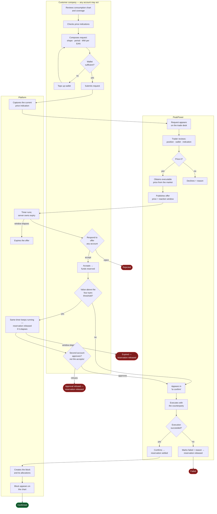
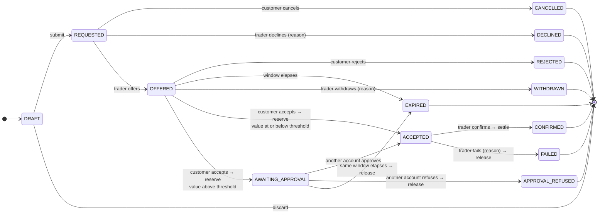
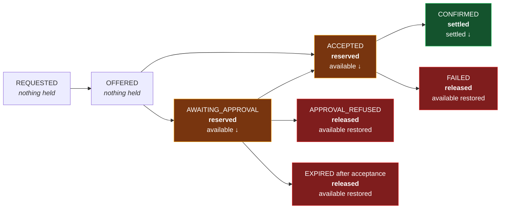
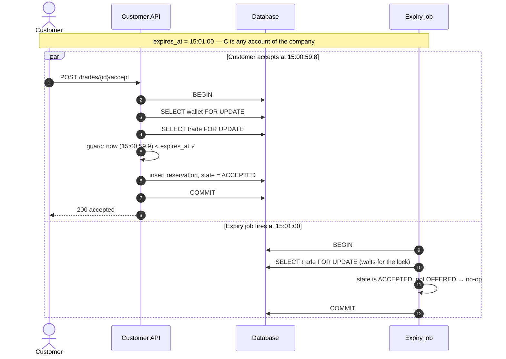
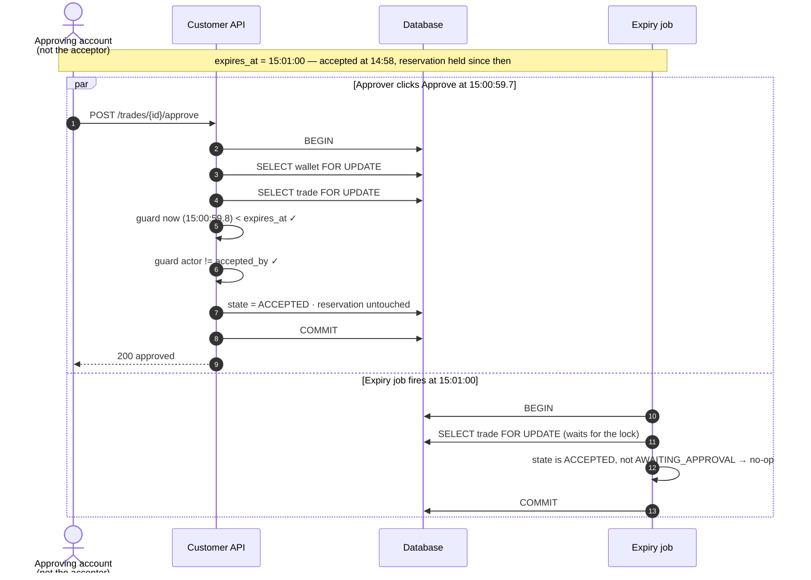

# Process — Trade Lifecycle

End-to-end, from a customer noticing an exposure to a confirmed position on the chart.

Feature spec: [F05](../10-features/F05-energy-block-trading.md).

---

## 1. The whole process

The four-eyes branch **[DEC-33]** hangs off acceptance, not off the offer: the money is already
reserved when it is entered, and the offer's own timer is still the only clock. Note that `C6` feeds
both the approval decision and the expiry exit — that is the whole of the rule that acceptance and
approval must both fall inside the reaction window.

## 2. State machine

Fourteen transitions over thirteen states since **[DEC-33]**. The authoritative, exhaustively
testable tuple set lives in [Domain model §4.2](../20-architecture/03-domain-model.md); this diagram
is a rendering of it and must not drift from it.

## 3. Timing

```mermaid
gantt
    title Target timings for one trade
    dateFormat HH:mm
    axisFormat %H:%M

    section Customer
    Composes request      :a1, 14:15, 10m
    Reads offer, decides  :a2, 14:32, 12m

    section PeakPower
    Request in queue      :crit, b1, 14:25, 3m
    Trader prices it      :b2, 14:28, 4m
    Reaction window open  :active, b3, 14:32, 30m
    Executes on market    :b4, 14:44, 8m
    Confirms              :b5, 14:52, 3m
```

| Interval | Target | Alert |
| --- | --- | --- |
| Request → offer | median **< 30 min** | Request unpriced after 60 min |
| Offer → customer response | within the window, default 30 min | Notification at T−5 min |
| Acceptance → approval **[DEC-33]** | **inside the same window** — no separate clock | Every active account except the acceptor is notified immediately, and again at T−5 min |
| Acceptance → confirmation | median **< 30 min** | Escalation after 4 h **[F05-R39]** |

The middle row is the one that changes how the gantt above should be read for a large trade. The
30-minute reaction window now has to accommodate **two** people, not one — so a trader pricing a
request above the customer's threshold should quote a longer window **[F05-R58]**, not the default.
The window is configurable to 1440 minutes **[F05-R17]**, so nothing new is needed for this; what is
needed is that the trader is *told*, which is why **[F12-R35]** exists.

## 4. Money at each step

Ledger entries produced: `TRADE_RESERVED` on acceptance, then either `TRADE_SETTLED`
(or `TRADE_PROCEEDS` for a sell) on confirmation, or `TRADE_RESERVATION_RELEASED` on failure,
on approval refusal, or on expiry after acceptance **[DEC-33]**.

**The reservation is created once, at acceptance, whichever state that lands in.** Approval moves no
money at all — which is exactly why an approval can never fail for want of funds, and why the
available balance cannot be spent underneath a pending approval. Note the consequence for `EXPIRED`:
before **[DEC-33]** an expiry could never touch the wallet, because nothing was held before
acceptance. It can now.

## 5. The dangerous moments

### 5.1 Acceptance at the expiry boundary

Row-level locking makes the race a queue. Whichever transaction takes the lock first decides; the
second observes the resulting state and does nothing. There is no window in which both succeed.

### 5.2 Confirmation

Wallet and trade change together, in one transaction, with a fixed lock order — **wallet first, then
trade** ([Database design](../20-architecture/04-database-design.md) §5). A partially applied
confirmation is not a state the system can reach.

### 5.3 Approval at the expiry boundary — the sharpest edge in [DEC-33]

The rule is that there is **no second clock**. The offer's reaction window governs the customer's
whole response, so a trade sitting in `AWAITING_APPROVAL` is racing the same `expires_at` the
acceptance was guarded against, and losing that race releases real money.

Identical in shape to §5.1, deliberately: same lock order, same guard, same job. **[DEC-33]** adds a
state to the machine but no new concurrency mechanism, which is the main reason for placing the
approval after acceptance rather than before it.

Had the job won the race, it would have moved the trade to `EXPIRED` **and released the reservation
in the same transaction**, and the approve attempt would then have failed its own state guard. Either
way exactly one outcome is recorded, and in neither case is money left held against a trade that no
longer exists.

Two more things follow from having one clock, and both are properties rather than problems. A
customer cannot bind PeakPower past the quoted window by accepting at the last second and approving
later. And PeakPower is never left holding a firm price with no deadline while a customer looks for a
second signatory — which, since the rule only applies to the largest trades, is precisely where that
exposure would hurt most.

## 6. Failure paths

| Path | Trigger | Money | Customer sees |
| --- | --- | --- | --- |
| Cancelled | Customer, before pricing | — | Cancelled |
| Declined | Trader will not price it | — | Declined + reason |
| Rejected | Customer says no | — | Rejected |
| Expired | Window elapsed **before acceptance** | — | Expired |
| Expired | Window elapsed **while awaiting approval** **[DEC-33]** | **Released in full** | Expired — not approved in time |
| Withdrawn | Trader pulls the offer | — | Withdrawn + reason |
| Approval refused | A second account will not approve the acceptance **[DEC-33]** | **Released in full** | Not approved, by whom, optional reason |
| Failed | Execution failed after acceptance | **Released in full** | Failed + reason |

Every PeakPower-initiated negative outcome carries a mandatory reason that the customer reads
**[F05-R38]**. Approval refusal is customer-initiated, so its reason is optional — symmetric with
rejecting an offer **[F05-R30]** — but the *name and job title* of the refusing account are always
shown, because that is the record the control exists to produce.

## 7. Notifications

| Moment | To | Channel |
| --- | --- | --- |
| Request submitted | Traders | In-app (real-time) + email |
| Offer published | **Every active account** of the company | In-app (real-time) + email — **immediate** |
| 5 minutes remaining | Every active account | In-app + email |
| Offer expired | Every active account, traders | In-app + email |
| **Approval needed** **[DEC-33]** | **Every active account except the acceptor** | In-app (real-time) + email — **immediate**, with the value, the acceptor and the time left |
| 5 minutes remaining, awaiting approval | Every active account except the acceptor, traders | In-app + email |
| Approved | Traders, every active account | In-app (real-time) |
| Approval refused | Every active account, traders | In-app + email |
| Accepted | Traders | In-app (real-time) |
| Confirmed | Every active account | In-app + email |
| Failed | Every active account | In-app + email — **immediate** |
| Unconfirmed > 4 h | Traders | In-app escalation |

Offers go to everyone who could answer them, not only to the person who asked — see
[F11 §2](../10-features/F11-notifications.md) and **[DEC-63]**.

Approval requests go to everyone **except** the acceptor **[DEC-33]**. That is the one notification
in the table with a deliberate exclusion, and the exclusion is the control: sending it to the
acceptor as well would invite them to click a button the server will refuse.

## 8. Audit output

Every transition appends a `trade_event`. A complete history for a typical trade:

| # | Event | Actor | Recorded |
| --: | --- | --- | --- |
| 1 | `SUBMITTED` | Customer account — **J. de Vries** *(Energy Manager)* | Volumes per EAN, comment, captured indication |
| 2 | `OFFERED` | Employee — M. Bakker | Price, reaction window, expiry |
| 3 | `ACCEPTED` | Customer account — **M. Vandersteen** *(Finance Director)* | Amount reserved, reservation id |
| 4 | `CONFIRMED` | Employee — M. Bakker | External reference, block id, settled amount |

Events 1 and 3 are **two different people at the same company** — the normal split between spotting
an exposure and approving the spend **[DEC-18]**. Each event stores the account id plus a snapshot of
the name and job title as at that moment, so the record still reads correctly years later even if
someone is promoted or leaves **[DEC-17]**.

### 8.1 A trade above the four-eyes threshold

The same trade, above the threshold **[DEC-33]**. One event more, and one more name:

| # | Event | Actor | Recorded |
| --: | --- | --- | --- |
| 1 | `SUBMITTED` | Customer account — **J. de Vries** *(Energy Manager)* | Volumes per EAN, comment, captured indication |
| 2 | `OFFERED` | Employee — M. Bakker | Price, reaction window, expiry |
| 3 | `ACCEPTED` | Customer account — **M. Vandersteen** *(Finance Director)* | Amount reserved, reservation id, **threshold version and the amount compared**, resulting state `AWAITING_APPROVAL` |
| 4 | `APPROVED` | Customer account — **S. Aydin** *(Managing Director)* | Time remaining when approved, resulting state `ACCEPTED` |
| 5 | `CONFIRMED` | Employee — M. Bakker | External reference, block id, settled amount |

Note that event 3 is still called `ACCEPTED` even though the resulting state is `AWAITING_APPROVAL`.
The acceptance genuinely happened and the money genuinely moved; the event names what the person did,
the state names what the trade is waiting for. Event 4 is `APPROVED` or `APPROVAL_REFUSED`.

The audit answer to "could one person have done this alone?" is now a comparison of two account ids
on two rows, which is the entire content of four eyes in a platform with no intra-company roles
**[DEC-16]**.

Rendered as one timeline for both audiences, from the same rows **[F15](../10-features/F15-audit-and-observability.md)**.
