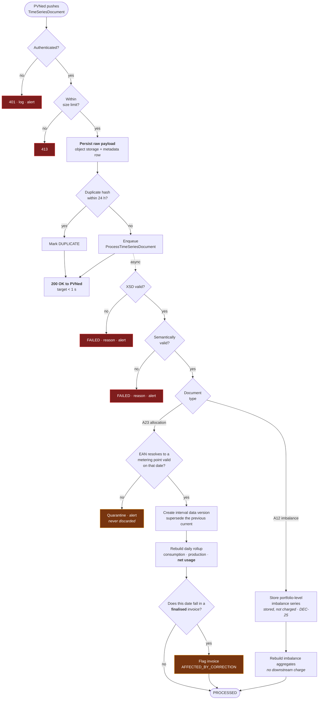
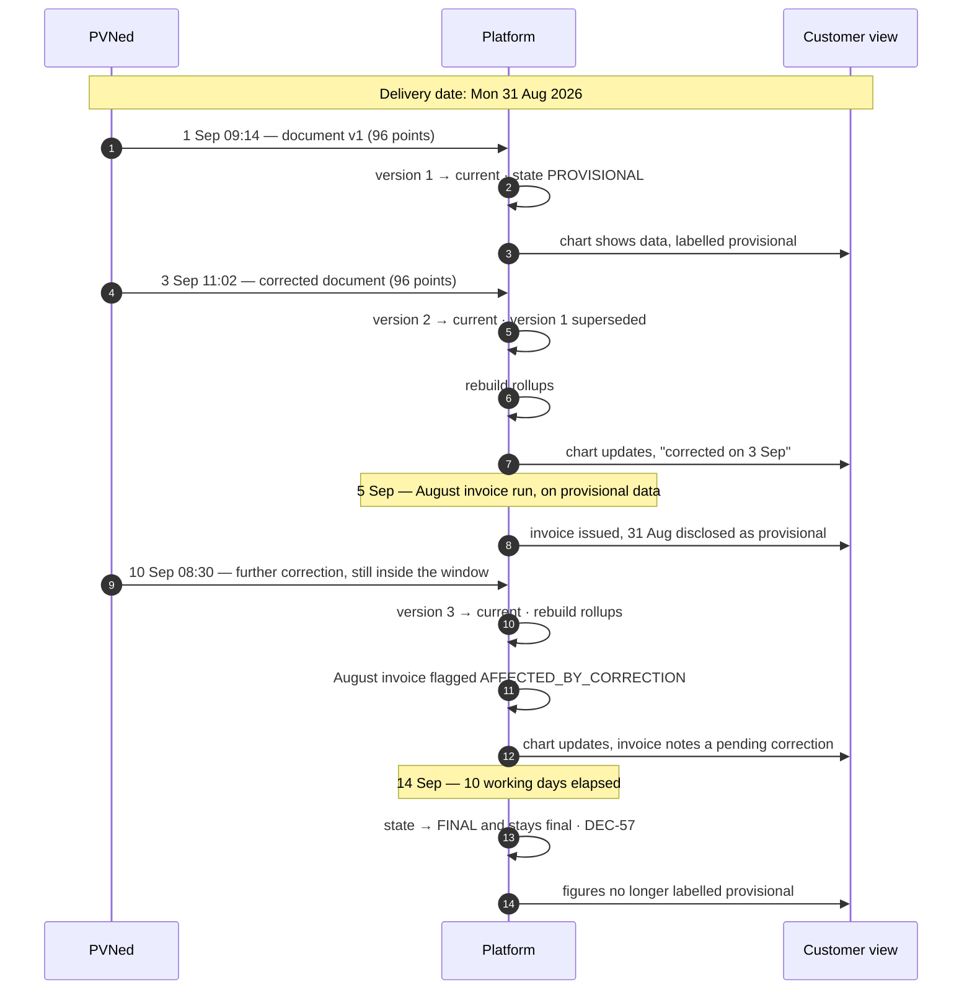
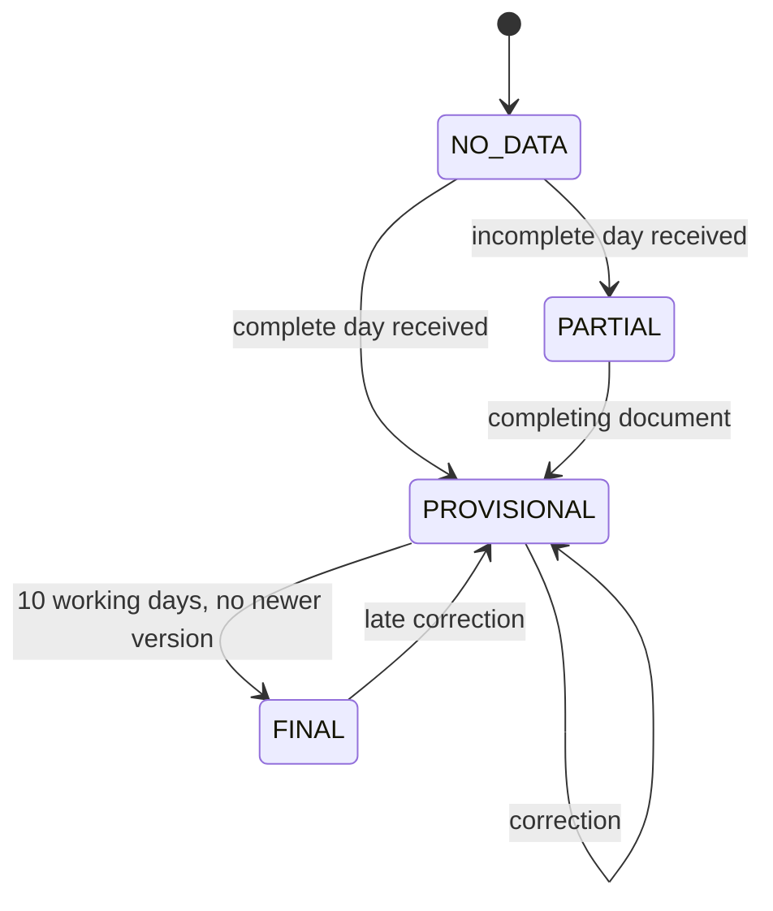
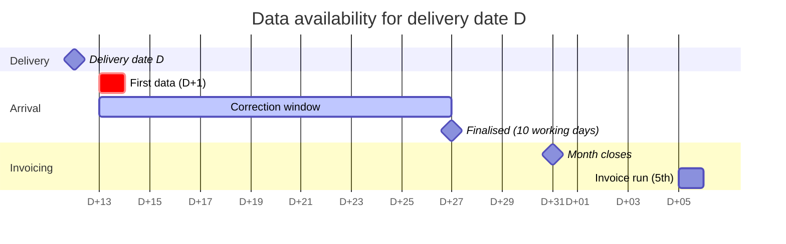

# Process — Metering Data Flow

From a PVNed push to a number on a customer's chart and a line on an invoice.

Feature spec: [F02](../10-features/F02-metering-data-ingestion.md) ·
Integration: [PVNed](../30-integrations/01-pvned-timeseries.md).

---

## 1. End-to-end

**The acknowledgement happens before any business processing** **[DEC-03]**. PVNed's retry behaviour
is triggered by a non-2xx, so a slow or failing parse must never be visible to it — otherwise a bug
in the platform turns into a flood of redeliveries.

In the PoC the pusher is the `DevStubs` generator rather than PVNed **[DEC-21]** — the same webhook,
the same parser, the same validation path
([PVNed timeseries](../30-integrations/01-pvned-timeseries.md) §1.1).

**The flow above runs once per EAN per day, not once per batch** **[DEC-38]**. That is a shape as much
as a volume: the whole path from webhook to rollup carries one metering point's data, so the
per-(metering point, delivery date) serialisation that protects supersession is also the **unit of
concurrency** — documents for different EANs never wait on each other, and a slow one delays only its
own connection.

### 1.1 Both directions, and net usage **[DEC-22]**

The `A01` and `A02` series arriving on the `A23` path are now equally load-bearing: **[DEC-22]** makes
the volume basis **net usage = consumption − production** per interval per metering point. Production
is no longer a display series.

| Consequence | Detail |
| --- | --- |
| `daily_position` derives net usage | Consumption and production are both rolled up, and **net usage is derived per interval and then summed** — deriving it from the two daily totals instead would let a complete consumption total mask an incomplete production series |
| Net usage may be **negative** | An interval where production exceeds consumption is an export. It is not clamped to zero at ingestion. ⚠ **Where it settles has changed**: unused block cover still settles at day-ahead **[DEC-23]**, but **physical export now settles at the feed-in tariff** **[DEC-44]** — [Invoice calculation §7A](../50-calculations/03-invoice-calculation.md). Ingestion is unaffected; the derivation here feeds both |
| The direction mapping is a financial control | `A01` → `PRODUCTION`, `A02` → `CONSUMPTION`. A mis-mapped direction is now a **settlement** error, not a display error ([PVNed timeseries](../30-integrations/01-pvned-timeseries.md) §4.1) |
| **Whether production is expected is master data** | **[DEC-65]**: PVNed sends no `A01` series at all for a connection that never produces, so `metering_point.production_expectation` — `UNKNOWN`, `NEVER` or `EXPECTED` **[F01-R39]** — decides whether an absent series is normal or a fault. See §3 |
| A missing production series makes net usage **missing** | Not zero — **on a connection that is expected to produce**. On one that is not, production is a **declared** zero and net usage is the consumption value **[F02-R33]**. See §3 |

## 2. Version lifecycle for one delivery date

The example below deliberately uses a **late-month** delivery date, because that is the case where a
correction and an invoice run collide. **[DEC-57]** closes the window at 10 working days with nothing
after it, so the interesting overlap is no longer *late reconciliation* — it is an **in-window**
correction arriving **after** the invoice has gone out.

Two things this sequence is asserting.

**A correction after invoicing does not change the invoice.** It is captured by the flag and settled
through the [annual true-up](05-annual-true-up.md) **[F02-R20]** — the run that **[DEC-24]** deferred
to exactly this residual role. Until it is built, the flag is set and the invoice stays flagged: the
capture side works, the settlement side is deferred.

**`FINAL` is the end of the line [DEC-57].** No reconciliation feed follows the window, so nothing
routine reopens step 12. A document arriving after 14 Sep for this date is an **exception**: it is
still stored, versioned and flagged, and it **alerts**, because it contradicts what PVNed states it
sends ([PVNed timeseries](../30-integrations/01-pvned-timeseries.md) §2.2). The only other way this
date changes afterwards is a manual entry **[DEC-60]**, §6.

## 3. Data state transitions

| State | Chart | KPI | Invoicing |
| --- | --- | --- | --- |
| `NO_DATA` | Gap | Excluded | Blocks the run |
| `PARTIAL` | Gap for missing intervals, marked | Flagged | Blocks the run |
| `PROVISIONAL` | Normal | Labelled provisional | **Allowed**, disclosed on the invoice |
| `FINAL` | Normal | Clean | Allowed |

The state is tracked **per direction series**, and which series are expected is decided by
`metering_point.production_expectation` **[F01-R39]**, **[DEC-65]** — not by what happened to arrive.

**The completeness test.** A (metering point, delivery date) is complete when the **consumption**
series is present with the expected interval count for that date (92 / 96 / 100) **and** the
**production** series is too, *unless* the expectation is `NEVER` **[F02-R32]**. Written the obvious
way — *both directions present* — it would hold every non-producing connection at `PARTIAL` for ever
and block its invoicing, because **PVNed sends no `A01` series at all for a connection that never
produces** **[DEC-65]**. `UNKNOWN` counts as `EXPECTED`, deliberately: the conservative failure is a
blocked invoice run, the unconservative one is a producing site billed on consumption alone.

**[DEC-22]** does not change the underlying rule — *zero is a value; missing is not*
([Position & coverage](../50-calculations/02-position-and-coverage.md) §8) — it changes its blast
radius, and **[DEC-65]** says where the rule does **not** apply:

| Situation | `production_expectation` | Net usage for the interval | Why |
| --- | :--: | --- | --- |
| Consumption `12.4`, production `0` | any | `12.4` — a real value | A reported zero is a measurement |
| Consumption `12.4`, **no `A01` series for this connection at all** | `NEVER` | **`12.4`** — production is a **declared zero** | The absence was declared in master data, with a source and a setter **[F02-R33]**, so it is a statement rather than a gap. This is the case **[DEC-65]** exists to name |
| Consumption `12.4`, production **absent** | `EXPECTED` | **Missing**, not `12.4` | A series that should have arrived did not. Suppresses a settlement volume |
| Consumption `12.4`, production **absent** | `UNKNOWN` | **Missing**, not `12.4` | Nobody has established whether it produces, so the platform does not get to assume the convenient answer **[F02-R35]** |
| Consumption absent, production `3.1` | any | **Missing**, not `−3.1` | Already missing before **[DEC-22]** |

Rows two, three and four are **byte-identical on the wire**
([PVNed timeseries](../30-integrations/01-pvned-timeseries.md) §4.1.1). Only the master data separates
them, which is why it is prompted at registration and why it must never be inferred from whether data
has arrived — inferring it would make an ingestion outage look like a factory that stopped generating.
The one permitted inference runs the other way: production that **is** observed on a connection
recorded as `NEVER` promotes it to `EXPECTED`, because a series that exists is evidence **[F02-R34]**.

A missing production interval on a producing connection suppresses a **settlement** volume rather than
degrading a chart, so it must not be inferred as zero at any point in the rollup. A *declared*
`NEVER` connection is the one case where a zero is written without a measurement behind it, and it is
traceable to whoever declared it and on what basis.

## 4. Expected arrival pattern

Note the overlap: for a delivery date near the end of the month, the correction window is still open
when the invoice run starts. **This is why invoicing on provisional data with an annual true-up is
the design**, rather than waiting for every date to finalise — waiting would push invoicing to
mid-month at best.

**[DEC-57] bounds the overlap on one side only.** There is **no reconciliation feed after the 10
working days**, so the correction window in the chart above is the whole of it — nothing arrives at
D+30 or D+60. What remains, and what §2 illustrates, is the in-window correction that lands *after*
the invoice run. That is the routine case the `AFFECTED_BY_CORRECTION` flag exists for, and it is
bounded: for a delivery date `D`, the last correction that can affect an already-issued invoice lands
10 working days after `D`, so an August invoice run on 5 September is exposed only until roughly
mid-September. Before **[DEC-57]** the exposure had no end date at all.

**[DEC-24]** defers the true-up to precisely this residual role — correcting late metering data — so
the design rationale survives the deferral, but the settlement leg does not yet exist. Corrections
are captured, versioned and flagged now; they are settled when the true-up is built
([Annual true-up](05-annual-true-up.md) §1.2).

## 5. Monitoring

| Check | Frequency | Alert |
| --- | --- | --- |
| Any PVNed message received | Hourly | No message in 6 h during the expected window → **P1** |
| Per-metering-point silence | Daily 10:00 | No data for 3 days → P2. Exact under **[DEC-38]**: one document per EAN per day is expected, so a missing EAN is observed rather than inferred |
| **Expected-production series missing** | Daily 10:00 | `production_expectation = 'EXPECTED'` and no `A01` for a delivery date past D+1 → P2, naming **both** candidate causes: a PVNed gap, or wrong master data **[F02-R35]** |
| **Production expectation never established** | Daily 10:00 | Any metering point still at `UNKNOWN` → P3 worklist. It is not an incident, but it blocks completeness for as long as it lasts **[F01-R41]** |
| **Unexpected production series** | Per document | `A01` received for a metering point recorded as `NEVER` → P3. Data is stored and used, and the point is promoted to `EXPECTED` with source `OBSERVED` in the same transaction **[F02-R34]** |
| **Document after the correction window** | Per document | Any document for a delivery date more than 10 working days old → P2. Contradicts **[DEC-57]**, so it is worth a human look rather than silent absorption |
| Failed messages | Continuous | Any → P2, immediate for a burst |
| Quarantined series | Daily | Any outstanding → P2 |
| Volume anomaly | Per document | Deviation beyond a configured factor from the trailing average → P2, does not block |
| Processing lag | Continuous | p95 > 5 min → P2 |

The volume anomaly check is the one that catches a technically valid document containing wrong data —
the failure mode that no schema can detect. The two production checks are its counterpart for
**[DEC-65]**: they catch a metering point whose master data and whose data feed disagree, which no
document-level validation can see because each document is individually valid.

## 6. Recovery

| Situation | Action |
| --- | --- |
| Message failed on a platform bug | Fix, then replay from the raw store. Idempotent |
| Unknown EAN | Register the metering point, then resolve the quarantine entry — the same replay path |
| Rollups inconsistent | Trigger a rebuild for a metering point and date range; no replay needed |
| **Whole day missing and PVNed cannot resend** | **Employee-entered data — acceptable and decided [DEC-60]**, **[F02-R36]**. Whole day only, mandatory reason, recorded as an ordinary version with source `MANUAL`, and **flagged on every derived figure and every invoice** that uses it **[F02-R37]**, **[NFR-48]**. Under **[DEC-57]** this is the *only* remaining route for a date the window has closed on, so it is a real part of the process rather than a theoretical fallback |
| **A real document turns up for a manually entered day** | Ordinary supersession by receipt order; the manual version is retained and the flag clears from derived figures **[F02-R38]** |
| **The production expectation was wrong** | Correct it **[F01-R41]**, then **trigger a rebuild for the affected date range** **[F02-R28]**. The change alone applies forward only, deliberately, so past dates wrongly held at `PARTIAL` are cleared by an explicit, audited rebuild rather than by a silent retroactive sweep over data that may already have been invoiced |
| Bulk backfill after an outage | Batched replay with progress reporting; ingestion queue scales out. Sized on **[DEC-38]**: one document per EAN per day, so a week's outage for 200 EANs is ~1 400 documents rather than 7 batches |
