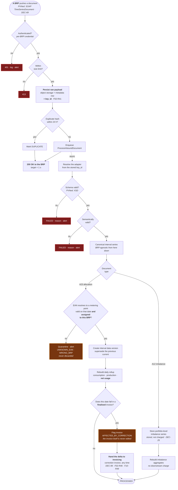
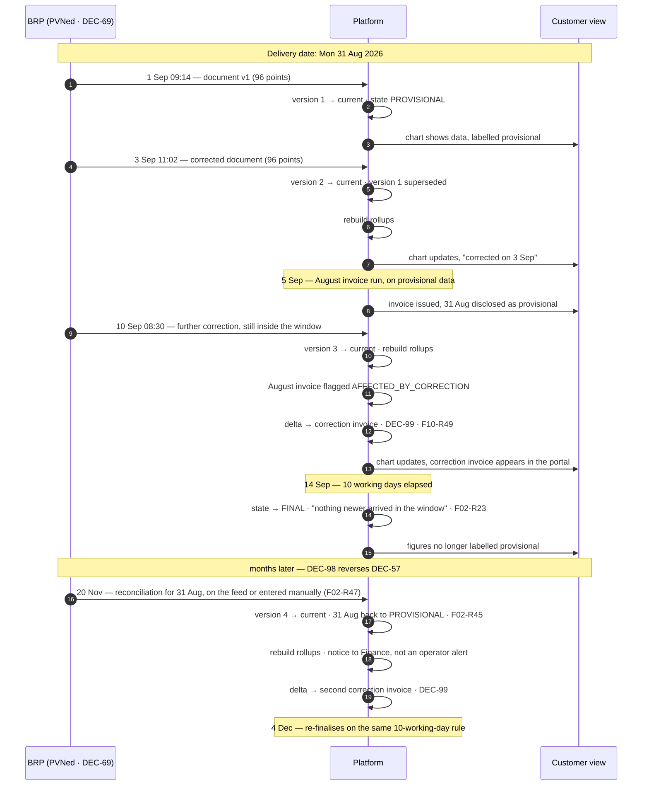
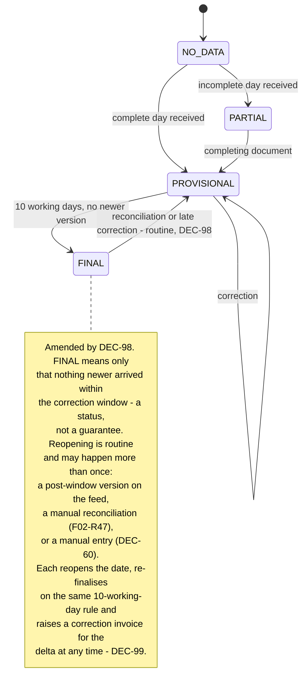
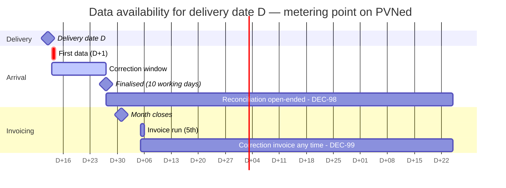

# Process — Metering Data Flow

~~From a PVNed push to a number on a customer's chart and a line on an invoice.~~
⚠ **Amended 2026-08-19 by [DEC-69].** From **a BRP's** push to a number on a customer's chart and a
line on an invoice. PVNed is the first BRP and its adapter is the only one built in phase 1
**[F02-R44]**; everything below the adapter is BRP-agnostic **[F02-R39]**, **[F02-R40]**.

> **Revised 2026-08-19** by the decision round **[DEC-68]**…**[DEC-112]**. Four decisions land here:
>
> - **[DEC-69]** — the metering source is a **configurable BRP behind a port**, not PVNed
>   specifically. §1's end-to-end flow and §4's arrival pattern are stated **per BRP**.
> - **[DEC-98]** — PVNed **does** supply reconciliation data after the 10-working-day window,
>   sometimes as a manual process. ⚠ **Reverses [DEC-57]**, so the window is no longer terminal:
>   §2's lifecycle and §3's state machine stop treating `FINAL` as an end state, and a delivery date
>   can be superseded months later.
> - **[DEC-99]** — a late correction produces a **correction invoice for the delta, at any time**
>   **[F10-R49]**. The `AFFECTED_BY_CORRECTION` flag gains a live destination instead of accumulating
>   against a deferred annual run.
> - **[DEC-112]** — the production expectation is **customer-declared at onboarding** **[F01-R54]**,
>   with SJV (*standaardjaarverbruik*) and profile fractions as a reference rather than a source.
>   §5's `UNKNOWN` worklist therefore has an owner. **[OQ-91] closes**.
>
> **[DEC-22]** (net usage as the volume basis) and **[DEC-07]** (versioning and supersession) are
> **unchanged** — this round moves who sends the data and what happens after the window, not how a
> reading becomes a number.

Feature spec: [F02](../10-features/F02-metering-data-ingestion.md) ·
First adapter: [PVNed](../30-integrations/01-pvned-timeseries.md) ·
Correction invoicing: [F10](../10-features/F10-invoicing-and-settlement.md),
[Monthly invoicing](04-monthly-invoicing.md).

---

## 1. End-to-end

⚠ **Three changes in the diagram above, all 2026-08-19.** The pusher is **a BRP** and the credential
that authenticated is what identifies it **[DEC-69]** — never a field in the payload
([Security](../20-architecture/07-security.md) §4.1). The stored `brp_id` selects the adapter at
processing time, so a replay years later is parsed by the adapter that first parsed it
**[F02-R41]**. And the flag is no longer a dead end: it hands a delta to invoicing **[DEC-99]**.

**The acknowledgement happens before any business processing** **[DEC-03]**. A BRP's retry behaviour
is triggered by a non-2xx, so a slow or failing parse must never be visible to it — otherwise a bug
in the platform turns into a flood of redeliveries. This is a **pipeline** property and holds for
every adapter, which is why the ack precedes the parser rather than following it.

In the PoC the pusher is the `DevStubs` generator **[DEC-21]**, pushing **as a configured BRP**
rather than as "PVNed" **[DEC-69]** — the same endpoint, the same adapter, the same parser and the
same validation path ([PVNed timeseries](../30-integrations/01-pvned-timeseries.md) §1.1,
[Solution structure](../20-architecture/02-solution-structure.md) §4.1).

**The flow above runs once per EAN per day, not once per batch** **[DEC-38]**. That is a shape as much
as a volume: the whole path from webhook to rollup carries one metering point's data, so the
per-(metering point, delivery date) serialisation that protects supersession is also the **unit of
concurrency** — documents for different EANs never wait on each other, and a slow one delays only its
own connection.

### 1.1 Both directions, and net usage **[DEC-22]**

The `A01` and `A02` series arriving on the `A23` path are now equally load-bearing: **[DEC-22]** makes
the volume basis **net usage = consumption − production** per interval per metering point. Production
is no longer a display series.

| Consequence | Detail |
| --- | --- |
| `daily_position` derives net usage | Consumption and production are both rolled up, and **net usage is derived per interval and then summed** — deriving it from the two daily totals instead would let a complete consumption total mask an incomplete production series |
| Net usage may be **negative** | An interval where production exceeds consumption is an export. It is not clamped to zero at ingestion. ~~⚠ **Where it settles has changed**: unused block cover still settles at day-ahead **[DEC-23]**, but **physical export now settles at the feed-in tariff** **[DEC-44]** — [Invoice calculation §7A](../50-calculations/03-invoice-calculation.md).~~ ⚠ **Amended 2026-08-19 by [DEC-87]** — the feed-in tariff and its line are **withdrawn**, reversing the second half of **[DEC-44]**. Export is credited **raw at the day-ahead price** for the interval, exactly as surplus block cover is under **[DEC-23]**, on the sale leg of line 2 ([Invoice calculation](../50-calculations/03-invoice-calculation.md) §7A). Ingestion is unaffected either way; the derivation here feeds both |
| The direction mapping is a financial control | `A01` → `PRODUCTION`, `A02` → `CONSUMPTION`. A mis-mapped direction is now a **settlement** error, not a display error ([PVNed timeseries](../30-integrations/01-pvned-timeseries.md) §4.1) |
| **Whether production is expected is master data** | **[DEC-65]**: PVNed sends no `A01` series at all for a connection that never produces, so `metering_point.production_expectation` — `UNKNOWN`, `NEVER` or `EXPECTED` **[F01-R39]** — decides whether an absent series is normal or a fault. See §3. ⚠ **Extended 2026-08-19 by [DEC-112]** — that master data is now **the customer's declaration, made at onboarding** **[F01-R54]**, sanity-checked against SJV and profile fractions but never derived from them |
| A missing production series makes net usage **missing** | Not zero — **on a connection that is expected to produce**. On one that is not, production is a **declared** zero and net usage is the consumption value **[F02-R33]**. See §3 |

## 2. Version lifecycle for one delivery date

The example below deliberately uses a **late-month** delivery date, because that is the case where a
correction and an invoice run collide. ~~**[DEC-57]** closes the window at 10 working days with
nothing after it, so the interesting overlap is no longer *late reconciliation* — it is an
**in-window** correction arriving **after** the invoice has gone out.~~
⚠ **Reversed 2026-08-19 by [DEC-98].** Reconciliation data **does** arrive after the window,
sometimes as a manual process, so the sequence now runs past finalisation: **both** overlaps are
live, the in-window correction after the invoice run *and* the post-window reconciliation months
later.

Three things this sequence is asserting.

**A correction after invoicing does not change the invoice.** ~~It is captured by the flag and
settled through the [annual true-up](05-annual-true-up.md) **[F02-R20]** — the run that **[DEC-24]**
deferred to exactly this residual role. Until it is built, the flag is set and the invoice stays
flagged: the capture side works, the settlement side is deferred.~~
⚠ **Amended 2026-08-19 by [DEC-99].** The issued invoice is still immutable and still flagged
**[F02-R20]** — what changed is where the delta goes. It is handed to invoicing immediately and
raises a **correction invoice for the difference, at any time**, priced at the original month's
prices **[F02-R46]**, **[F10-R49]**. The detail of that document — its lines, its draft push, its
number from the bookkeeping program **[DEC-88]** — belongs to
[F10](../10-features/F10-invoicing-and-settlement.md) and
[Monthly invoicing](04-monthly-invoicing.md) and is not restated here. The
[annual true-up](05-annual-true-up.md) keeps only the energiebelasting close **[DEC-74]**; it no
longer carries late metering data.

~~**`FINAL` is the end of the line [DEC-57].** No reconciliation feed follows the window, so nothing
routine reopens step 12. A document arriving after 14 Sep for this date is an **exception**: it is
still stored, versioned and flagged, and it **alerts**, because it contradicts what PVNed states it
sends ([PVNed timeseries](../30-integrations/01-pvned-timeseries.md) §2.2). The only other way this
date changes afterwards is a manual entry **[DEC-60]**, §6.~~
⚠ **Reversed 2026-08-19 by [DEC-98].** **`FINAL` is a status, not a guarantee** **[F02-R23]**: it
says *nothing newer arrived within the correction window*, which is what makes a date safe to invoice
on — not that it will never move. The 20 November version is **routine, not an exception**: it is
ingested as an ordinary version, reopens the date to `PROVISIONAL`, re-finalises on the same rule, and raises
an **informational notice to Finance** rather than the operator alert **[DEC-57]** required
**[F02-R45]**. A date may traverse `FINAL → PROVISIONAL` more than once, and nothing in **[DEC-98]**
bounds how late.

**The reconciliation may not arrive as a document at all.** **[DEC-98]** says the process is
sometimes manual — a mail, a file, a figure read off a BRP portal — and that has no adapter to parse
it. It is entered through the manual path **[DEC-60]** with reason category `RECONCILIATION` and a
mandatory reference to what it was copied from **[F02-R47]**, §6. That is the one case where a manual
version may be entered **over** a date that already has current BRP data, because it *is* the BRP's
own corrected figure arriving by another route **[F02-R38]**.

## 3. Data state transitions

| State | Chart | KPI | Invoicing |
| --- | --- | --- | --- |
| `NO_DATA` | Gap | Excluded | Blocks the run |
| `PARTIAL` | Gap for missing intervals, marked | Flagged | Blocks the run |
| `PROVISIONAL` | Normal | Labelled provisional | **Allowed**, disclosed on the invoice |
| `FINAL` | Normal | Clean | Allowed. ⚠ **Amended 2026-08-19 by [DEC-98]** — allowed because nothing newer arrived in the window, **not** because nothing can arrive later. A later version reopens the date and settles through a correction invoice **[DEC-99]** rather than being prevented |

⚠ **What [DEC-98] costs, stated rather than absorbed.** Every consumer of `FINAL` — the invoice run,
the data-quality panel, the customer's chart, the annual energiebelasting close **[DEC-74]** — has to
tolerate a figure moving after it read it, and the annual close becomes **re-runnable per (EAN,
year)** producing a delta rather than a rewrite. The guarantee finance relies on is **[F02-R46]** —
that whatever moves gets invoiced — not that nothing moves.

The state is tracked **per direction series**, and which series are expected is decided by
`metering_point.production_expectation` **[F01-R39]**, **[DEC-65]** — not by what happened to arrive.
Since **[DEC-112]** that property is **the customer's declaration at onboarding** **[F01-R54]**, so
the rule is unchanged and its input finally has an owner.

**The completeness test.** A (metering point, delivery date) is complete when the **consumption**
series is present with the expected interval count for that date (92 / 96 / 100) **and** the
**production** series is too, *unless* the expectation is `NEVER` **[F02-R32]**. Written the obvious
way — *both directions present* — it would hold every non-producing connection at `PARTIAL` for ever
and block its invoicing, because **PVNed sends no `A01` series at all for a connection that never
produces** **[DEC-65]**. `UNKNOWN` counts as `EXPECTED`, deliberately: the conservative failure is a
blocked invoice run, the unconservative one is a producing site billed on consumption alone.

**[DEC-22]** does not change the underlying rule — *zero is a value; missing is not*
([Position & coverage](../50-calculations/02-position-and-coverage.md) §8) — it changes its blast
radius, and **[DEC-65]** says where the rule does **not** apply:

| Situation | `production_expectation` | Net usage for the interval | Why |
| --- | :--: | --- | --- |
| Consumption `12.4`, production `0` | any | `12.4` — a real value | A reported zero is a measurement |
| Consumption `12.4`, **no `A01` series for this connection at all** | `NEVER` | **`12.4`** — production is a **declared zero** | The absence was declared in master data, with a source and a setter **[F02-R33]**, so it is a statement rather than a gap. This is the case **[DEC-65]** exists to name |
| Consumption `12.4`, production **absent** | `EXPECTED` | **Missing**, not `12.4` | A series that should have arrived did not. Suppresses a settlement volume |
| Consumption `12.4`, production **absent** | `UNKNOWN` | **Missing**, not `12.4` | Nobody has established whether it produces, so the platform does not get to assume the convenient answer **[F02-R35]** |
| Consumption absent, production `3.1` | any | **Missing**, not `−3.1` | Already missing before **[DEC-22]** |

Rows two, three and four are **byte-identical on the wire**
([PVNed timeseries](../30-integrations/01-pvned-timeseries.md) §4.1.1). Only the master data separates
them, which is why it is ~~prompted at registration~~ ⚠ **declared by the customer at onboarding
[DEC-112]**, **[F01-R54]** and why it must never be inferred from whether data
has arrived — inferring it would make an ingestion outage look like a factory that stopped generating.
SJV and profile fractions may be shown next to the declaration as a sanity check; they never set it.
The one permitted inference runs the other way: production that **is** observed on a connection
recorded as `NEVER` promotes it to `EXPECTED`, because a series that exists is evidence **[F02-R34]**.

A missing production interval on a producing connection suppresses a **settlement** volume rather than
degrading a chart, so it must not be inferred as zero at any point in the rollup. A *declared*
`NEVER` connection is the one case where a zero is written without a measurement behind it, and it is
traceable to whoever declared it and on what basis.

## 4. Expected arrival pattern

⚠ **Per BRP, not per PVNed [DEC-69].** The pattern below is PVNed's — one document per EAN per day at
D+1 **[DEC-38]** — and it is a property of **the BRP a metering point is assigned to**, not of the
platform. A second BRP may batch, deliver at D+2, or drop files rather than push. The expected cadence
and the silence threshold `N` are therefore **configured per BRP** and the detector stays BRP-agnostic
**[F02-R26]**, **[F02-R39]**. Read every date below as "for a metering point on PVNed".

The two open-ended bars are drawn to 25 November only because a Gantt bar needs an end; **[DEC-98]**
and **[DEC-99]** give them none. The arithmetic of the milestone is unchanged: D is Wednesday
12 August 2026, the ten working days run 13–26 August with no Dutch public holiday among them, so the
date is marked `FINAL` by the 04:00 finalisation job on **Thursday 27 August**.

Note the overlap: for a delivery date near the end of the month, the correction window is still open
when the invoice run starts. **This is why invoicing on provisional data with an ~~annual true-up~~
correction invoice is the design**, rather than waiting for every date to finalise — waiting would
push invoicing to mid-month at best. ⚠ **Amended 2026-08-19 by [DEC-99]** — the trade-off is
unchanged and its settlement leg is now **continuous rather than annual**.

~~**[DEC-57] bounds the overlap on one side only.** There is **no reconciliation feed after the 10
working days**, so the correction window in the chart above is the whole of it — nothing arrives at
D+30 or D+60. What remains, and what §2 illustrates, is the in-window correction that lands *after*
the invoice run. That is the routine case the `AFFECTED_BY_CORRECTION` flag exists for, and it is
bounded: for a delivery date `D`, the last correction that can affect an already-issued invoice lands
10 working days after `D`, so an August invoice run on 5 September is exposed only until roughly
mid-September. Before **[DEC-57]** the exposure had no end date at all.~~

⚠ **Reversed 2026-08-19 by [DEC-98]: the overlap is bounded on neither side.** Reconciliation data
*does* follow the window, so something **can** arrive at D+30 or D+60, and the exposure of an issued
invoice has no end date again — exactly the position **[DEC-57]** was read as removing. Two
consequences, both real costs:

| Consequence | Detail |
| --- | --- |
| An issued invoice is never out of reach | An August run finalised on 7 September can be corrected in November or in the following year. Nothing expires. The mitigation is that the invoice itself is still immutable **[F02-R20]** and the movement is a separate document **[F10-R49]** |
| The correction path must be live from day one | Under **[DEC-57]** plus **[DEC-24]** a flag with nowhere to go was tolerable, because nothing was expected to arrive. Now something is, so a flag with no destination would be a customer-visible error rather than a parked item |

~~**[DEC-24]** defers the true-up to precisely this residual role — correcting late metering data — so
the design rationale survives the deferral, but the settlement leg does not yet exist. Corrections
are captured, versioned and flagged now; they are settled when the true-up is built
([Annual true-up](05-annual-true-up.md) §1.2).~~
⚠ **Reversed 2026-08-19 by [DEC-99]** (and **[DEC-24]** itself by **[DEC-74]**). Corrections are
captured, versioned, flagged **and settled now**, through a correction invoice raised whenever the
delta lands **[F02-R46]**, **[F10-R49]** — see [Monthly invoicing](04-monthly-invoicing.md) §7. The
[annual true-up](05-annual-true-up.md) keeps only the energiebelasting bracket close **[DEC-74]**,
which genuinely cannot be done any other way because a bracket is defined per EAN per calendar year.

## 5. Monitoring

| Check | Frequency | Alert |
| --- | --- | --- |
| Any message received ~~from PVNed~~ **per BRP** **[DEC-69]** | Hourly | No message in 6 h during **that BRP's** expected window → **P1**. The alert names the BRP that owes the data; a second BRP going quiet must not be masked by a first one that is healthy |
| Per-metering-point silence | Daily 10:00 | No data for `N` days (default 3) → P2. Exact under **[DEC-38]**: one document per EAN per day is expected, so a missing EAN is observed rather than inferred. ⚠ **Amended by [DEC-69]** — the expected cadence and `N` are **per BRP** **[F02-R26]** |
| **Series attributed to the wrong BRP** | Per document | A series for a metering point assigned to a different BRP → quarantined `WRONG_BRP` and P2 **[F02-R42]**. New with **[DEC-69]**: it is a master-data conflict for an employee, never a supersession race, so it must not be resolved by guesswork |
| **Expected-production series missing** | Daily 10:00 | `production_expectation = 'EXPECTED'` and no `A01` for a delivery date past D+1 → P2, naming **both** candidate causes: a BRP gap, or wrong master data **[F02-R35]** |
| **Production expectation never established** | Daily 10:00 | Any metering point still at `UNKNOWN` → P3 worklist. It is not an incident, but it blocks completeness for as long as it lasts **[F01-R41]**. ⚠ **Amended 2026-08-19 by [DEC-112]** — the worklist is **routed to onboarding**, which owns the declaration **[F01-R54]**, and the alert names the **missing customer declaration** rather than a missing feed. An owner is what stopped this queue degrading into permanent false alarms nobody clears; SJV and profile fractions are shown beside each row as a sanity check, never as an auto-fill |
| **Unexpected production series** | Per document | `A01` received for a metering point recorded as `NEVER` → P3. Data is stored and used, and the point is promoted to `EXPECTED` with source `OBSERVED` in the same transaction **[F02-R34]** |
| ~~**Document after the correction window**~~ | ~~Per document~~ | ~~Any document for a delivery date more than 10 working days old → P2. Contradicts **[DEC-57]**, so it is worth a human look rather than silent absorption~~ ⚠ **Reversed 2026-08-19 by [DEC-98]** — a post-window version is **expected behaviour**, so it raises an **informational notice to Finance**, not an operator alert **[F02-R45]**. Alerting on it would train the operator to ignore the queue |
| **Correction delta not invoiced** | Daily | A version that reopened a finalised delivery date with no correction invoice raised against it → **P2** **[F02-R46]**, **[F10-R49]**. New with **[DEC-99]**: the flag now has a destination, so a flag that never reaches it is a customer-visible under- or over-charge rather than a parked item |
| Failed messages | Continuous | Any → P2, immediate for a burst |
| Quarantined series | Daily | Any outstanding → P2 |
| Volume anomaly | Per document | Deviation beyond a configured factor from the trailing average → P2, does not block |
| Processing lag | Continuous | p95 > 5 min → P2 |

The volume anomaly check is the one that catches a technically valid document containing wrong data —
the failure mode that no schema can detect. The two production checks are its counterpart for
**[DEC-65]**: they catch a metering point whose master data and whose data feed disagree, which no
document-level validation can see because each document is individually valid. Since **[DEC-112]**
those two checks produce a queue with a named owner instead of a standing anomaly, which is the
difference between a control and a decoration.

## 6. Recovery

| Situation | Action |
| --- | --- |
| Message failed on a platform bug | Fix, then replay from the raw store. Idempotent |
| Unknown EAN | Register the metering point, then resolve the quarantine entry — the same replay path |
| **Series attributed to the wrong BRP** | Fix the metering point's BRP assignment **[F01-R51]** or the sender's configuration, then resolve the quarantine entry — the same replay path. The assignment in force at **receipt** time decides the check, and versions already stored keep the BRP that produced them **[F02-R43]**. New with **[DEC-69]** |
| Rollups inconsistent | Trigger a rebuild for a metering point and date range; no replay needed |
| **Whole day missing and the BRP cannot resend** | **Employee-entered data — acceptable and decided [DEC-60]**, **[F02-R36]**. Whole day only, mandatory reason, recorded as an ordinary version with source `MANUAL`, and **flagged on every derived figure and every invoice** that uses it **[F02-R37]**, **[NFR-48]**. ~~Under **[DEC-57]** this is the *only* remaining route for a date the window has closed on, so it is a real part of the process rather than a theoretical fallback~~ ⚠ **Amended 2026-08-19 by [DEC-98]** — it is no longer the *only* route past the window, because reconciliation data does arrive; it is the route for a day that will never arrive at all |
| **A reconciliation arrives outside the feed** | **[DEC-98]** says the process is sometimes manual — a mail, a file, a figure read off a BRP portal — and there is no adapter for that. The employee enters it through the same whole-day, mandatory-reason path with reason category `RECONCILIATION` and a **mandatory reference to the source**, retained with the version **[F02-R47]**. It reopens the date **[F02-R45]** and triggers the correction invoice **[F02-R46]**. This is the **only** case where a manual version may be entered over a date that already has current BRP data, because it is the BRP's own corrected figure arriving by another route; an employee's own judgement about a metered value stays inadmissible **[F02-R38]** |
| **A real document turns up for a manually entered day** | Ordinary supersession by receipt order; the manual version is retained and the flag clears from derived figures **[F02-R38]** |
| **The production expectation was wrong** | Correct it **[F01-R41]**, then **trigger a rebuild for the affected date range** **[F02-R28]**. The change alone applies forward only, deliberately, so past dates wrongly held at `PARTIAL` are cleared by an explicit, audited rebuild rather than by a silent retroactive sweep over data that may already have been invoiced |
| Bulk backfill after an outage | Batched replay with progress reporting; ingestion queue scales out. Sized on **[DEC-38]**: one document per EAN per day, so a week's outage for 200 EANs is ~1 400 documents rather than 7 batches |

## 7. Open questions

New section, 2026-08-19. The questions this process depends on, at their post-round state. The
register of record is [Open questions](../80-open-questions.md); this table says only what each one
means *here*.

| Ref | Status | What it means for this process |
| --- | :--: | --- |
| ~~[OQ-66]~~ | ✅ | ~~Does PVNed supply reconciliation data after the 10-working-day window?~~ **CLOSED — it does, sometimes as a manual process** **[DEC-98]**, ⚠ **reversing [DEC-57]** and with it the closure this file previously recorded. §2, §3 and §4 are rewritten around it |
| ~~[OQ-56]~~ | ✅ | ~~What happens to a correction that lands after a month is invoiced?~~ **CLOSED — a correction invoice for the delta, at any time** **[DEC-99]**, **[F10-R49]**. The `AFFECTED_BY_CORRECTION` flag has a live destination |
| ~~[OQ-91]~~ | ✅ | ~~Who owns the production expectation, and where does it come from?~~ **CLOSED — the customer declares it at onboarding** **[DEC-112]**, **[F01-R54]**; SJV and profile fractions are a sanity check. §5's `UNKNOWN` worklist has an owner |
| ~~[OQ-75]~~ | ✅ | ~~Is manual entry acceptable for a permanently missing day?~~ **CLOSED — yes** **[DEC-60]**, and under **[DEC-98]** it also carries the manual reconciliation, §6 |
| ~~[OQ-84]~~ | ✅ | ~~Does PVNed send an `A01` series at all for a connection that never produces?~~ **CLOSED — it does not** **[DEC-65]**. §3's completeness test exists because of this |
| [OQ-05] | ⏸ | PVNed endpoint authentication, acknowledgement expectations, retry policy, test environment. **[DEC-69]** does **not** close it — a configurable BRP changes who the adapter talks to, not whether the first one has a sandbox. `DevStubs` **[DEC-21]** remains the mitigation for §1 |
| [OQ-20] | 🟠 | The `Period.TimeInterval` / `MeasurementPeriode` inconsistency in the PVNed sample. A parsing question inside the **PVNed adapter** **[F02-R44]**; under **[DEC-69]** it can no longer become a pipeline question |
| [OQ-65] | 🟠 | The nine PVNed documentation inconsistencies, still unwalked. Same containment: adapter, not pipeline |
| [OQ-53] | 🟠 | Metering-point count in year 1 and year 3. It sizes §6's bulk backfill — the ~1 400-document figure there is 200 EANs × 7 days and moves with the answer |
