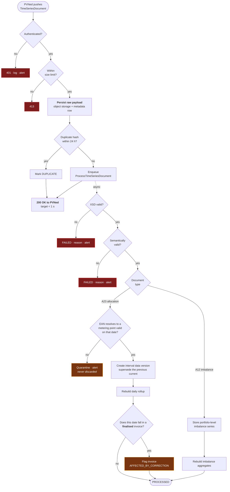
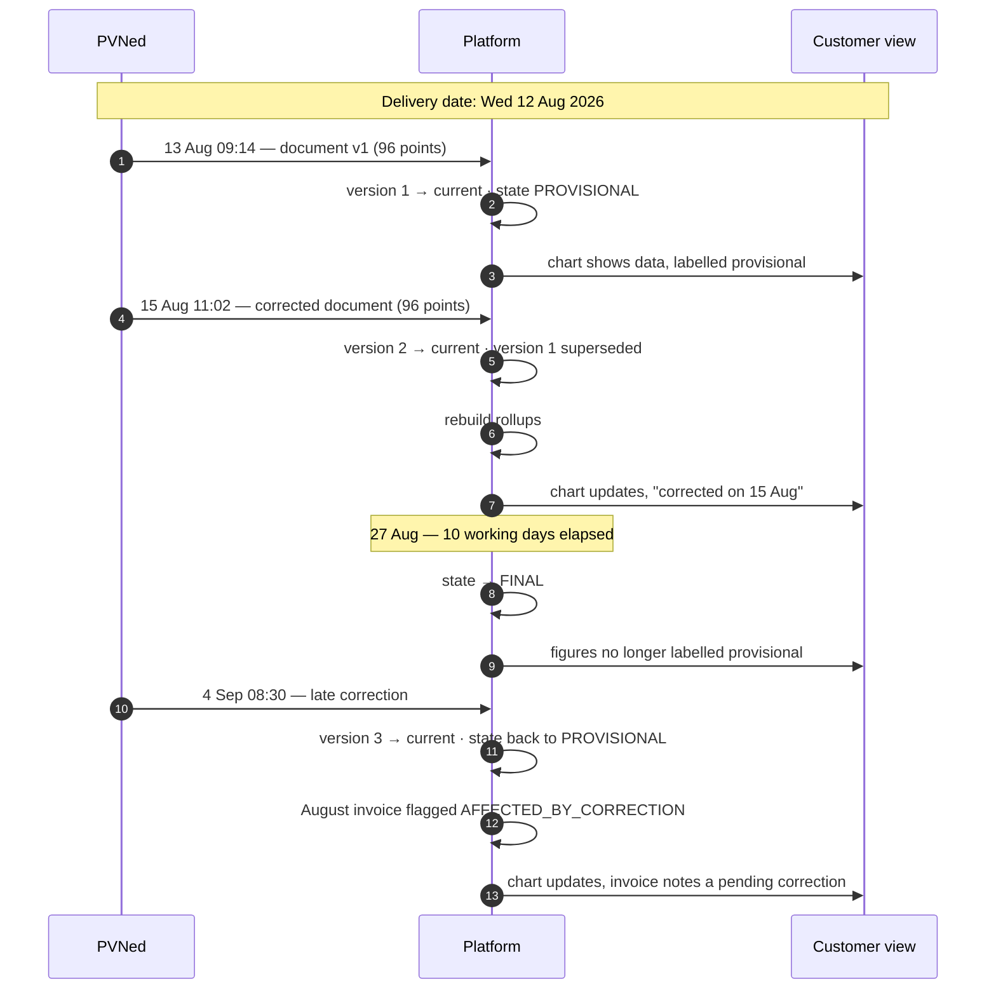
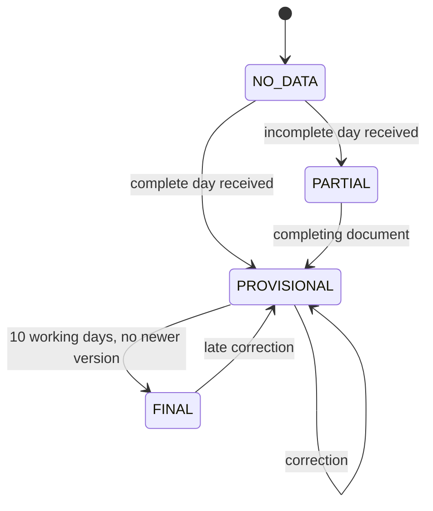
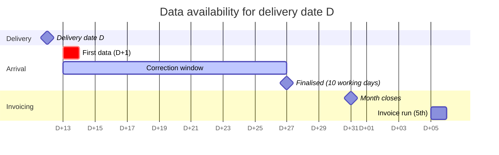

# Process — Metering Data Flow

From a PVNed push to a number on a customer's chart and a line on an invoice.

Feature spec: [F02](../10-features/F02-metering-data-ingestion.md) ·
Integration: [PVNed](../30-integrations/01-pvned-timeseries.md).

---

## 1. End-to-end

**The acknowledgement happens before any business processing** **[DEC-03]**. PVNed's retry behaviour
is triggered by a non-2xx, so a slow or failing parse must never be visible to it — otherwise a bug
in the platform turns into a flood of redeliveries.

## 2. Version lifecycle for one delivery date

The last step is the one that matters commercially: a correction after invoicing does **not** change
the invoice. It is captured and settled through the
[annual true-up](05-annual-true-up.md) **[F02-R20]**.

## 3. Data state transitions

| State | Chart | KPI | Invoicing |
| --- | --- | --- | --- |
| `NO_DATA` | Gap | Excluded | Blocks the run |
| `PARTIAL` | Gap for missing intervals, marked | Flagged | Blocks the run |
| `PROVISIONAL` | Normal | Labelled provisional | **Allowed**, disclosed on the invoice |
| `FINAL` | Normal | Clean | Allowed |

## 4. Expected arrival pattern

Note the overlap: for a delivery date near the end of the month, the correction window is still open
when the invoice run starts. **This is why invoicing on provisional data with an annual true-up is
the design**, rather than waiting for every date to finalise — waiting would push invoicing to
mid-month at best.

## 5. Monitoring

| Check | Frequency | Alert |
| --- | --- | --- |
| Any PVNed message received | Hourly | No message in 6 h during the expected window → **P1** |
| Per-metering-point silence | Daily 10:00 | No data for 3 days → P2 |
| Failed messages | Continuous | Any → P2, immediate for a burst |
| Quarantined series | Daily | Any outstanding → P2 |
| Volume anomaly | Per document | Deviation beyond a configured factor from the trailing average → P2, does not block |
| Processing lag | Continuous | p95 > 5 min → P2 |

The volume anomaly check is the one that catches a technically valid document containing wrong data —
the failure mode that no schema can detect.

## 6. Recovery

| Situation | Action |
| --- | --- |
| Message failed on a platform bug | Fix, then replay from the raw store. Idempotent |
| Unknown EAN | Register the metering point, then resolve the quarantine entry — the same replay path |
| Rollups inconsistent | Trigger a rebuild for a metering point and date range; no replay needed |
| Whole day missing and PVNed cannot resend | Employee-entered data, flagged as manual, surfaced on every derived figure and invoice **[OQ-75]** |
| Bulk backfill after an outage | Batched replay with progress reporting; ingestion queue scales out |
