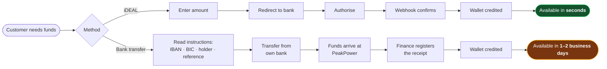
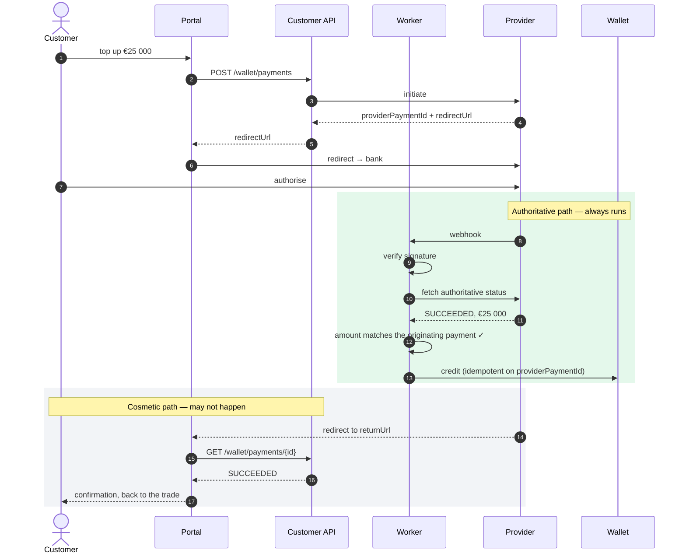
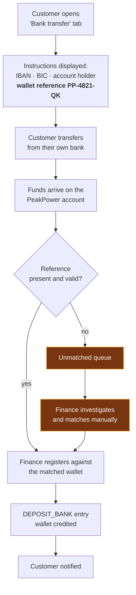
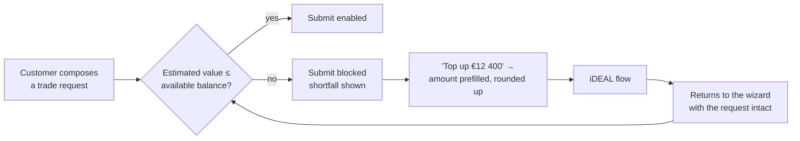

# Process — Wallet Top-up

Two routes, very different latency. Feature spec:
[F07](../10-features/F07-wallet-topup-and-payments.md).

---

## 1. Route comparison

The latency difference is the whole reason iDEAL is a *Must*. A customer who discovers a funding gap
while looking at a 30-minute offer cannot use the bank-transfer route at all.

## 2. iDEAL — the important detail

Two rules follow from this shape:

1. **The browser never credits a wallet.** If the customer closes the tab, they are still credited.
2. **The webhook is a signal, not a source.** The worker fetches the authoritative status before
   crediting, so a replayed or stale callback cannot create money.

### 2.1 When the browser wins the race

The customer is returned before the webhook lands. The portal shows *processing* and polls for up to
60 seconds, then explains that the payment is being confirmed and that the wallet will update
automatically. It never shows a failure for a payment that is merely in flight.

## 3. Bank transfer

### 3.1 The reference

`PP-4821-QK` — designed to be retyped correctly by a human into a banking app:

- Fixed `PP-` prefix so it is recognisable on a statement.
- Grouped, uppercase.
- Alphabet excludes `I`, `O`, `0` and `1` — the characters people confuse.
- Final character is a check character, so an obvious typo can be rejected before it becomes an
  unmatched payment.

Unmatched payments are the main operational cost of this route, and the reference design is the
cheapest place to reduce it.

## 4. Triggered from a blocked trade

The request draft survives the round trip. Losing it would mean re-entering per-EAN volumes across
several sites, which is exactly the moment a customer gives up and phones instead.

## 5. Failure handling

| Situation | Handling |
| --- | --- |
| Customer abandons at the bank | Payment expires; no credit; visible in payment history |
| Webhook never arrives | Reconciliation job resolves within 15 minutes |
| Duplicate webhook | Idempotent; one credit |
| Amount differs from the initiated payment | Quarantined, alerted, **not credited** |
| Payment succeeds after expiry | Credited, state corrected, audit note |
| Provider outage | iDEAL disabled in the UI with an explanation; bank transfer remains |
| Transfer without a reference | Unmatched queue; finance resolves |
| Transfer from a third party | Flagged for finance review before crediting |

## 6. Notifications

| Event | To | Channel |
| --- | --- | --- |
| iDEAL succeeded | Customer | In-app + email |
| iDEAL failed / cancelled | Customer | In-app + email |
| Bank deposit registered | Customer | In-app + email |
| Unmatched transfer received | Finance | In-app |
| Payment stuck > 1 h | Finance | In-app |
