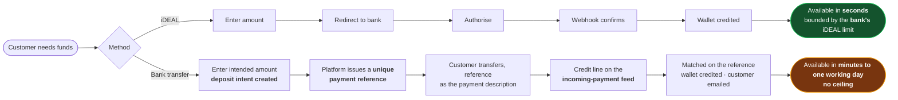
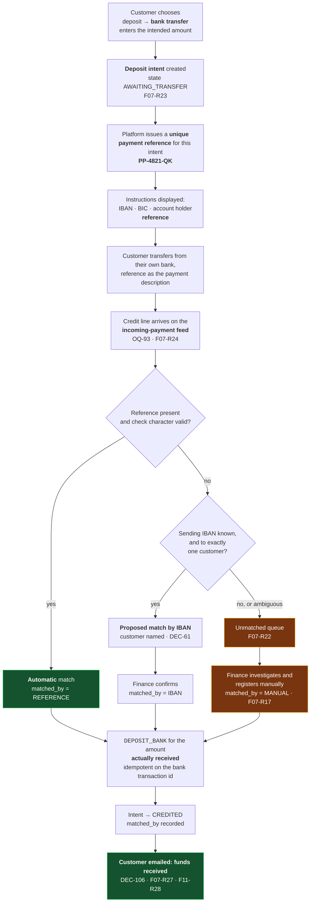
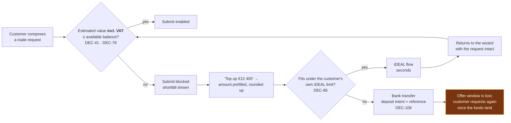
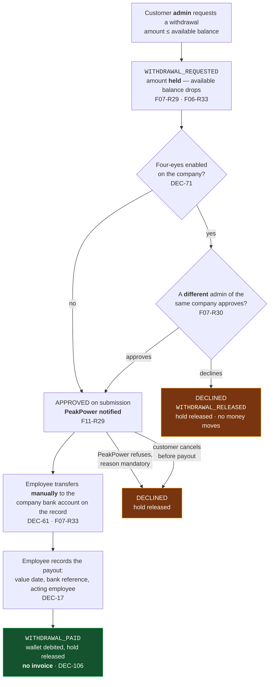

# Process — Wallet Top-up & Withdrawal

Two deposit routes with very different latency **and** very different ceilings, and — since
**[DEC-83]** — one payout route. Feature spec:
[F07](../10-features/F07-wallet-topup-and-payments.md).

> **Two routes, and only two [DEC-58].** iDEAL and manual bank transfer. No SEPA-via-provider, no
> Bancontact, no card **[F07-R20]**.
>
> ⚠ **Amended 2026-08-19 by [DEC-106] and [DEC-86].** The method *set* is unchanged and the
> exclusions stand verbatim. Two things change. **Bank transfer stops being "manual"**: the customer
> chooses deposit → bank transfer, the platform issues a **unique payment reference** for that
> deposit, matches the incoming payment on it, credits the wallet and **emails the customer that the
> funds arrived** **[F07-R23]**..**[F07-R27]**. And **no PSP is chosen [DEC-86]** — CM.com is a
> candidate, not a commitment — so the provider-agnostic port **[F07-R20]** stops being tidiness and
> becomes the thing that keeps that decision cheap to make late.

> **iDEAL is limited at the bank side — [DEC-86].** The customer's own bank caps what a single iDEAL
> payment may be, so **iDEAL cannot carry the amounts a trading wallet needs**. It is the *fast*
> route, not the *large* one. This is the operative reason **[DEC-106]** makes bank transfer
> first-class: for a large deposit, bank transfer is the **default**, not the fallback. Both routes
> therefore have to be complete; neither can be a stub.

> **Money is one-way [DEC-43].** There is **no refund payout path**, so this process has no reverse.
> Surplus balance stays in the wallet and is spent on trades and invoices **[F06-R29]**. ⚠ The
> offboarding case that follows — a customer closing with a positive balance — is a **known gap**, not
> an open question: see [F06](../10-features/F06-wallet-and-ledger.md) §1.
>
> ⚠ **Reversed 2026-08-19 by [DEC-83].** Money is two-way. The customer raises a **withdrawal
> request**; PeakPower is notified; an employee pays it out **manually** by bank transfer to the
> company bank account on the customer record **[DEC-61]**; the platform records the request, the
> approval and the debit **[F07-R29]**..**[F07-R33]**, **[F06-R33]**..**[F06-R37]**. Under
> **[DEC-71]** a withdrawal is a four-eyes action when the customer company has four-eyes enabled.
> See §4a. ~~[F06-R29]~~ is retired with **[DEC-43]**; the wallet also no longer settles invoices
> **[DEC-77]**, so the second half of that sentence is gone too.

> **Two matching keys, not one [DEC-61].** A transfer is matched on the wallet reference, and failing
> that on the customer's **registered IBAN** — which is what makes the commonest customer mistake
> stop producing manual work **[F07-R21]**.
>
> ⚠ **Amended 2026-08-19 by [DEC-106].** Both keys survive; the first one changes shape and effect.
> Key 1 is the **deposit-intent reference [F07-R23]** — issued for one expected payment rather than
> standing per customer — and when it matches, the wallet is credited **automatically**
> **[F07-R25]**, not on an act of registration by finance. Key 2 is unchanged: **IBAN matching is the
> fallback for the customer who omits the reference**, still *proposed* and still confirmed by a
> human before crediting.

> **The wallet funds trading, and nothing else — [DEC-77].** A deposit is never sized against an
> invoice, because **no invoice is settled from the wallet**: monthly day-ahead, export and
> energiebelasting amounts are pushed to the bookkeeping program as a draft **[DEC-88]** and paid to
> the bank. The only question a top-up answers is *"can I afford the block I want to buy?"* — see §4.

> **No minimum and no maximum deposit — [DEC-84].** The €100 / €250 000 defaults are **removed
> rather than configured** **[F07-R28]**, on either method: the right deposit is whatever the volume
> the customer intends to trade costs, and no constant knows that. Any ceiling a customer meets is
> **their bank's** iDEAL limit **[DEC-86]** and is reported as the bank's.

> **No invoice is raised for a deposit or a withdrawal** **[DEC-106]**, **[DEC-83]**. Nothing is
> sold — the customer is moving their own money — so there is nothing to invoice and no VAT to state
> **[DEC-76]**. The bookkeeping program learns about both movements from its own **bank feed**
> **[DEC-109]**, not from the platform.

> **Chargebacks and reversals are the bookkeeping program's job — [DEC-85].** There is no reversal
> screen, no automatic unwind and no manual-adjustment-with-a-reason path for one; the deposit matcher
> reads **credit lines only [F07-R34]**. ⚠ The exposure, stated rather than hidden: a wallet can hold
> credit whose underlying payment was later reversed, and nothing in the platform detects it.

> ⚠ **[OQ-07] closes; [OQ-93] opens and blocks the automatic route.** A payment feed into the
> platform **is** in scope, for wallet deposits only — invoice payments are matched in the bookkeeping
> program **[DEC-88]**, **[DEC-105]**. *Which* feed is not chosen: CAMT.053 import, a PSP webhook, or
> a SEPA-instant push from a modern bank **[OQ-93]**, **[F07-R24]**. Everything in §3 downstream of
> "the money arrives" is specified against a feed that has not been picked. Until it is, only manual
> registration by finance **[F07-R17]** is buildable.

---

## 1. Route comparison



⚠ **Rewritten 2026-08-19 by [DEC-106] and [DEC-86].** The old bank-transfer lane read
*read instructions → transfer → funds arrive → **finance registers the receipt** → wallet credited*,
with a fixed "1–2 business days". Finance registering the receipt is now the **exception path**
**[F07-R17]**, and the delay is the feed's, not a person's.

| | **iDEAL** | **Bank transfer** |
| --- | --- | --- |
| Latency | Seconds | As long as the feed takes: minutes on a SEPA-instant push, up to a working day on a daily CAMT.053 import — **undecided, [OQ-93]** |
| Ceiling | **The customer's bank's** iDEAL limit **[DEC-86]**. The platform sets none **[DEC-84]** | None **[DEC-84]** |
| What credits the wallet | Provider webhook → worker, after fetching the authoritative status | A credit line on the incoming-payment feed, matched on the platform-issued reference **[F07-R25]** |
| Human in the loop | None | **None** on a reference match. Finance confirms an **IBAN** match **[DEC-61]** and resolves the unmatched queue **[F07-R22]** |
| Idempotency key | `providerPaymentId` | The **bank transaction id** on the feed line **[F07-R25]** |
| Use it for | The funding gap you discover **inside** an offer window | Funding a position — anything the bank's iDEAL ceiling will not carry |

Two things follow, and they pull in opposite directions:

1. **The latency difference is the whole reason iDEAL is a *Must*.** A customer who discovers a
   funding gap while looking at a 30-minute offer cannot use the bank-transfer route at all.
2. **The ceiling difference is the whole reason bank transfer cannot be a stub [DEC-86].** A trading
   wallet is funded in tens of thousands of euros; a single iDEAL payment is not. For a large deposit
   the *default* route is the transfer.

⚠ **The cost, recorded rather than solved:** when the shortfall on a live offer is larger than the
customer's own iDEAL limit, **no route funds it inside the offer window**. The customer misses the
offer and requests a new one after the transfer lands. Nothing in this platform can fix that — it is
a bank-side limit — which is why the portal must name bank transfer as the route for a large amount
**before** the customer is in a hurry.

## 2. iDEAL — the important detail


⚠ **The example amount changed on 2026-08-19, from €25 000 to €2 500 — [DEC-86].** €25 000 is
precisely the amount an iDEAL payment is likely to be refused for at the bank, so it was a misleading
illustration of the *fast* route. The platform still imposes no limit of its own **[DEC-84]**; the
figure is smaller only because the diagram now has to be a plausible iDEAL payment. The €25 000 case
belongs in §3.

Two rules follow from this shape:

1. **The browser never credits a wallet.** If the customer closes the tab, they are still credited.
2. **The webhook is a signal, not a source.** The worker fetches the authoritative status before
   crediting, so a replayed or stale callback cannot create money.

Nothing here depends on which provider it is **[DEC-86]** — the sequence is drawn against the port,
and `PSP` is the participant that is not chosen yet.

### 2.1 When the browser wins the race

The customer is returned before the webhook lands. The portal shows *processing* and polls for up to
60 seconds, then explains that the payment is being confirmed and that the wallet will update
automatically. It never shows a failure for a payment that is merely in flight.

## 3. Bank transfer **[DEC-106]**

⚠ **Rewritten 2026-08-19.** This was a page of instructions plus a person. It is now a modelled
deposit with its own record, its own platform-issued reference and its own matching. What survives
verbatim is the reference *design* (§3.2) and the second matching key (§3.1).



**The feed is authoritative; the intent is only an expectation.** The customer may transfer more,
less, later or never. The wallet is credited with **what actually arrived**, against the intent the
reference names — never with the intended amount, and never on the strength of the intent alone.

### 3.1 Two matching keys **[DEC-61]**

**The reference is the first key; the registered IBAN is the second.** The order matters: a reference
identifies the payment directly and needs no judgement, while an IBAN identifies the *company* and is
therefore proposed rather than applied **[F07-R21]**.

| Key | Applies when | Credited |
| --- | --- | --- |
| ~~**Wallet reference**~~ | ~~Present and the check character validates~~ | ~~Automatically, on registration by finance~~ ⚠ **Amended 2026-08-19 by [DEC-106]** — see the row below |
| **Deposit-intent reference [F07-R23]** | Present in the payment description and the check character validates | **Automatically, with no human step at all** **[F07-R25]** — finance sees it happened, it does not make it happen |
| **Registered IBAN** | No usable reference, and the sending IBAN resolves to **exactly one** active customer | **Proposed** to finance with the customer named, and confirmed before crediting |
| **Neither** | IBAN unknown or matching more than one customer | Unmatched queue, manual resolution **[F07-R22]**, **[F07-R17]** |

~~The match basis is recorded on the deposit (`matched_by`), so the value of the second key is
**measurable** — if IBAN matching turns out to resolve most of the queue, that is an argument for the
statement import **[OQ-07]**; if it resolves little, that is worth knowing too.~~
⚠ **Amended 2026-08-19 by [DEC-106].** The first sentence stands and is worth more, not less:
`matched_by` is now the measurement of **how much of the route runs unattended**. The argument it was
being collected for has been settled the other way — the feed is in scope **[F07-R24]** rather than
conditional on evidence, so **[OQ-07]** closes and only the *transport* is still open **[OQ-93]**.

### 3.2 The reference

`PP-4821-QK` — designed to be retyped correctly by a human into a banking app:

- Fixed `PP-` prefix so it is recognisable on a statement.
- Grouped, uppercase.
- Alphabet excludes `I`, `O`, `0` and `1` — the characters people confuse.
- Final character is a check character, so an obvious typo can be rejected before it becomes an
  unmatched payment.

⚠ **Amended 2026-08-19 by [DEC-106]** — the design rules above are unchanged and now matter more.
Three properties are added:

| Property | Why |
| --- | --- |
| **Unique per deposit intent**, not per customer **[F07-R23]** | It names one expected payment, which is what lets the matcher credit unattended and lets a mismatch against the intended amount be visible |
| **Not guessable from another customer's** **[F07-R14]** | A guessed reference credits **someone else's** wallet. Per-customer references could be short; per-intent references have to be drawn from a large enough space that guessing is not a route in |
| **Not consumed by use, and does not expire [F07-R26]** | A second payment quoting the same reference is credited again, to the same wallet, against the same intent, and flagged. Refusing it would strand the customer's money on the PeakPower account with no automatic route back — worse than crediting a wallet the customer already owns |

Unmatched payments are the main operational cost of this route. The reference design is the cheapest
place to reduce it, and **[DEC-61]** removes the largest remaining source — the customer who transfers
the right amount from the right account and simply forgets the reference.

### 3.3 What a deposit intent is not

Creating an intent **moves no money and reserves nothing** **[F07-R23]**. It is an expectation, and
the intended amount is used for exactly three things: matching confidence, duplicate detection, and
the customer's own "pending" list. It is never a credit, it never appears in a balance, and a customer
who creates an intent and never transfers has changed nothing.

### 3.4 The feed is not chosen — **[OQ-93]**

The whole automatic path above hangs off one arrow: *a credit line arrives*. CAMT.053 import, a PSP
webhook and a SEPA-instant push all fit the diagram and differ in latency, in who runs the connection,
and in whether the platform ever sees a payment the bookkeeping program does not. The matcher is
therefore specified against a **normalised line** — amount, value date, sender IBAN, sender name,
description, bank transaction id — so the adapter is the only part that changes when **[OQ-93]** is
answered **[F07-R24]**. Until then, manual registration **[F07-R17]** is the only path that can be
built, and the portal must not promise a crediting time it cannot keep **[F07-R16]**.

## 4. Triggered from a blocked trade — the wallet's only reason to exist

**This is the only reason the wallet exists [DEC-77].** The wallet funds **trading**. It does not
settle an invoice, and after **[DEC-77]** it cannot: monthly day-ahead, export and energiebelasting
amounts go to the bookkeeping program as a draft **[DEC-88]** and are paid to the bank. So a top-up
answers exactly one question — *can I afford the block I want to buy?* — and the moment that question
is asked is the moment the customer is blocked at the trade wizard.



The request draft survives the round trip. Losing it would mean re-entering per-EAN volumes across
several sites, which is exactly the moment a customer gives up and phones instead.

**The check and the top-up are both VAT-inclusive — [DEC-78].** Prices are quoted and stored ex-VAT
**[DEC-26]**, but the amount reserved and later debited is grossed up at the **[DEC-64]** 21%
reference rate, so the shortfall the customer is asked to fund must be too. Worked, using the same
trade as [F06](../10-features/F06-wallet-and-ledger.md) §4 — 1,0 MW Peak Q4-26 at **€18 400,00
ex-VAT**, against an available balance of **€9 864,00**:

```
reservation = 18 400.00 * 1.21 = 22 264.00
shortfall   = 22 264.00 - 9 864.00 = 12 400.00     → prefilled top-up €12 400,00
```

Had the shortfall been sized on the ex-VAT price instead, the platform would have asked for
`18 400.00 - 9 864.00 = 8 536.00`, the customer would have paid it, and the trade would **still** be
blocked — short by `22 264.00 - (9 864.00 + 8 536.00) = 3 864.00`, which is exactly the 21% on the
trade value. A second forced top-up inside a 30-minute offer window is how an offer is lost.

**Nothing else tells the customer they are short — [DEC-90].** There are no wallet thresholds and no
low-balance alerts; the balance is visible but not monitored. The blocked trade is therefore the
*only* moment the platform raises the subject, which is why the shortfall figure, the prefill and the
route choice above all have to be right the first time.

## 4a. Withdrawal — money leaving the wallet **[DEC-83]**

⚠ **New 2026-08-19.** **[DEC-43]** (no payout path at all) is **reversed**. The customer requests,
PeakPower pays out **manually**, the platform records. **Nothing in the platform initiates a bank
payment** — no bank API, no batch file, no scheduled SEPA run.



**The hold is the point.** Without it the same euros can be requested for withdrawal and then spent on
a block before finance pays out, and PeakPower transfers money that is no longer there — which
**[AS-11]** (no credit, no negative balance) forbids. The mechanism is the wallet's existing
**reserved amount** ([F06](../10-features/F06-wallet-and-ledger.md) §2), the same one a trade
reservation uses. The settled debit happens only when the payout is **recorded**, because until the
transfer has actually been made nothing has left PeakPower either.

Worked, continuing the [F06](../10-features/F06-wallet-and-ledger.md) §4a example — a wallet at
**€27 736,00** settled, a request for **€10 000,00**:

| Step | Ledger entry | Settled | Reserved | Available |
| --- | --- | --: | --: | --: |
| After the trade settles | — | €27 736,00 | €0,00 | €27 736,00 |
| Admin requests €10 000,00 | `WITHDRAWAL_REQUESTED` | €27 736,00 | €10 000,00 | €17 736,00 |
| Second admin approves **[DEC-71]** | — (an audit record, not a movement) | €27 736,00 | €10 000,00 | €17 736,00 |
| Employee transfers and records it | `WITHDRAWAL_PAID` | €17 736,00 | €0,00 | €17 736,00 |

`27 736.00 - 10 000.00 = 17 736.00` at request time on the **available** balance, and the same
subtraction on the **settled** balance at payout. Had the second admin declined,
`WITHDRAWAL_RELEASED` returns the reserved €10 000,00 and the wallet is back to €27 736,00 available,
with the decline reason on the ledger row.

Four rules, each of which is doing specific work:

1. **The destination cannot be typed in** **[F07-R33]**. It is the company bank account on the
   customer record **[DEC-61]** — the same record the deposit matcher uses as its second key. A
   customer who wants a different account adds one first, which is itself a four-eyes action
   **[DEC-71]**, and an existing account **cannot be edited, only deactivated** **[DEC-71]**. This is
   what stops a compromised account from redirecting money.
2. **Four-eyes applies to withdrawal and not to deposit** **[DEC-71]**. Gating a deposit gates
   nothing — one person can wire money in on their own — while a withdrawal is an outbound payment,
   which is exactly what the control is for.
3. **The payout stays outside the platform** **[DEC-83]**. What that costs is a working day and a
   human; what it buys is that no defect in this platform can, on its own, move money to a bank
   account.
4. **No invoice and no credit note** **[DEC-106]**. Nothing is sold. The bookkeeping program sees the
   payout on its bank feed **[DEC-109]**.

State names: this diagram uses the ledger-facing set — `REQUESTED`, `APPROVED`, `DECLINED`, `PAID`
([F06](../10-features/F06-wallet-and-ledger.md) §4a). **[F07-R32]** names a finer set
(`AWAITING_APPROVAL`, `APPROVAL_DECLINED`, `REJECTED`, `CANCELLED`) that distinguishes *who* refused;
they collapse onto these four for the ledger, and **every state except `PAID` releases the hold**.

⚠ **What this reverses in §5 and in [F06](../10-features/F06-wallet-and-ledger.md) §1:** "the customer
asks for their money back" is no longer a commercial conversation with no platform action behind it,
and the offboarding gap now has a route out.

## 5. Failure handling

| Situation | Handling |
| --- | --- |
| Customer abandons at the bank | Payment expires; no credit; visible in payment history |
| Webhook never arrives | Reconciliation job resolves within 15 minutes |
| Duplicate webhook | Idempotent; one credit |
| Amount differs from the initiated payment **(iDEAL only)** | Quarantined, alerted, **not credited**. ⚠ This rule is iDEAL's, where the payment is initiated through the provider and the amount is fixed at initiation. A **bank transfer** has no such guarantee — see the two rows below |
| Payment succeeds after expiry | Credited, state corrected, audit note |
| Provider outage | iDEAL disabled in the UI with an explanation; bank transfer remains. There is no third method to fall back to **[DEC-58]**. ⚠ Under **[DEC-86]** this is a real fallback rather than a formality — the transfer route is complete **[DEC-106]**, so an outage costs latency, not the deposit |
| **Transfer without a reference** | Matched on the sending IBAN when it resolves to exactly one active customer, and **proposed** to finance for confirmation **[DEC-61]**, **[F07-R21]**. Only an unknown or ambiguous IBAN reaches the unmatched queue |
| **Reference typed with a wrong character** | The check character fails, so it is **not** a reference match; the transfer falls through to the IBAN key **[F07-R21]** and, failing that, to the unmatched queue. A near-miss is never "corrected" into a match — that would credit a wallet on a guess |
| **A customer quotes another customer's reference** | Credited to the wallet the **reference** names: a platform-issued reference identifies one intended payment and is the stronger key **[F07-R21]**. This is why references must be non-guessable **[F07-R14]**, and why a sender IBAN that does not match the credited customer is flagged to finance rather than passing silently |
| **Transfer for less than the intended amount** | Credited for **what arrived** **[F07-R25]**. The intent records what the customer said they would send, so the difference is visible on the intent and shown to finance — but it never blocks the credit. The trade they wanted may still be unaffordable, which the pre-trade check **[DEC-41]** will tell them |
| **Transfer for more than the intended amount** | Same rule — credited for what arrived. There is no maximum to breach **[DEC-84]** |
| **Second payment against an already-credited reference** | Credited again, to the same wallet, against the same intent, and **flagged** for finance to see **[F07-R26]**. Refusing it would strand the money on PeakPower's account with no automatic route back |
| **Same feed line delivered or imported twice** | One credit — idempotent on the **bank transaction id** **[F07-R25]** |
| **Payment feed outage or a delayed import** | Nothing is credited late-but-wrong; deposits sit uncredited until the feed catches up, and finance registers the urgent ones by hand **[F07-R17]**. ⚠ How long "sit" is depends on the transport, which is **[OQ-93]** |
| **Transfer from a customer's second bank account** | Not matched by IBAN — the account is unknown to the platform. With the reference it is credited normally; without it, the unmatched queue. The fix is to record the additional IBAN on the customer, not to match on the account-holder name |
| Transfer from a third party | Flagged for finance review before crediting. An IBAN match cannot arise here, which is the intended behaviour rather than a gap |
| **Chargeback or reversal on a credited deposit** | **Not handled by the platform [DEC-85]** — the bookkeeping program does. The matcher reads **credit lines only**, so a reversal arriving as a debit on the same feed is recorded as seen and not actioned **[F07-R34]**. If a balance must actually be reduced, finance posts an ordinary `ADJUSTMENT` with a mandatory reason **[F06-R26]** on instruction from the bookkeeping side |
| **Deposit larger than the customer's iDEAL limit** | Their **bank** refuses it, not the platform **[F07-R28]**. The UI names bank transfer as the route for a larger amount **[DEC-86]**, which is why that route is first-class **[DEC-106]** |
| **Deposit below some minimum** | No such case — there is no minimum and no maximum **[DEC-84]**, **[F07-R28]**. Only a non-positive amount is rejected |
| ~~**Customer asks for the balance back**~~ | ~~Nothing to invoke — **no refund path exists [DEC-43]**, **[F06-R29]**. A commercial conversation, not a platform action~~ ⚠ **Reversed 2026-08-19 by [DEC-83]** — there is now something to invoke: a **withdrawal request** **[F07-R29]**, approved by a second admin where four-eyes is on **[DEC-71]**, paid manually and recorded **[F07-R31]** |
| **Second admin declines a withdrawal** | `WITHDRAWAL_RELEASED`; the hold is released in full and **no money moves** **[DEC-71]**, **[F06-R34]**. The requester and the other admins are told, with the amount, because the available balance has just changed without anyone spending anything **[F11-R27]** |
| **PeakPower refuses a withdrawal** | Same release, with a **mandatory reason** **[F07-R32]** |
| **Customer spends the balance before the payout** | Cannot happen — the amount is held from the moment of request **[F07-R29]**. This is the whole reason for the hold **[AS-11]** |
| **Destination bank account deactivated between request and payout** | The payout is blocked until an active company bank account exists on the record **[F07-R33]**. The employee does not type an IBAN in to work around it |
| **Manual payout made but not recorded** | The wallet still shows the amount as held and the settled balance is overstated until the employee records it **[F07-R31]**. ⚠ The recording is the ledger entry, so an unrecorded payout is invisible to the platform — an operational risk of the manual route **[DEC-83]**, not something the platform can detect |

## 6. Notifications

| Event | To | Channel |
| --- | --- | --- |
| iDEAL succeeded | Customer — **the initiating account** | In-app + email |
| iDEAL failed / cancelled | Customer — **the initiating account** | In-app + email |
| ~~Bank deposit registered~~ | ~~Customer~~ | ⚠ **Replaced 2026-08-19 by [DEC-106]** — a manually registered transfer becomes a matched deposit; see the row below |
| **Funds received** — transfer matched to its deposit intent **[DEC-106]**, **[F07-R27]**, **[F11-R28]** | Customer — the account that created the intent, plus the company's notification addresses **[F11-R13]** | In-app + email, **immediate**, **not opt-out [F11-R12]** |
| **Transfer proposed by IBAN, awaiting confirmation [DEC-61]** | Finance | In-app |
| Unmatched transfer received | Finance | In-app |
| Payment stuck > 1 h | Finance | In-app |
| **Approval requested — a withdrawal** **[DEC-71]**, **[F11-R26]** | Customer — **the other admin accounts** | In-app + email |
| **Withdrawal requested** — four-eyes off, or approved **[DEC-83]**, **[F11-R29]** | **PeakPower employees** | In-app + email, **immediate** |
| **Withdrawal approved / declined** **[F11-R27]** | Customer — the acting account and the other admins, with the amount | In-app + email |
| **Withdrawal paid out** **[DEC-83]** | Customer — the requester | In-app + email |
| **Withdrawal rejected by PeakPower** **[DEC-83]** | Customer — the requester, with the reason | In-app + email |

~~Customer-facing notifications go to the initiating account for an iDEAL top-up and to **all active
accounts** for a bank deposit, since nobody initiated it in the portal
([F11](../10-features/F11-notifications.md) §2).~~
⚠ **Amended 2026-08-19 by [DEC-106].** The reason has gone: a bank deposit **does** have an initiating
account now, because the deposit intent records who created it **[F07-R23]**. Funds-received therefore
goes to **that** account plus the company's notification-only addresses **[F11-R13]** — not to
everyone. The narrower audience is the same trade-off **[DEC-111]** makes for offers, and it is
deliberate: see [F11](../10-features/F11-notifications.md) §2.

The **withdrawal** notifications are not courtesies. **[F11-R29]** is part of the mechanism — the
payout is a manual bank transfer, so nothing happens at all unless a person is told — and the
four-eyes approval mail **[F11-R26]** is the only way the second admin learns there is something to
approve.
