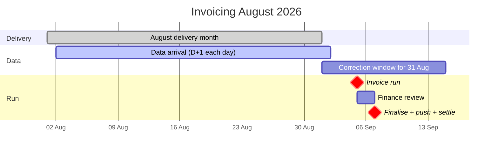
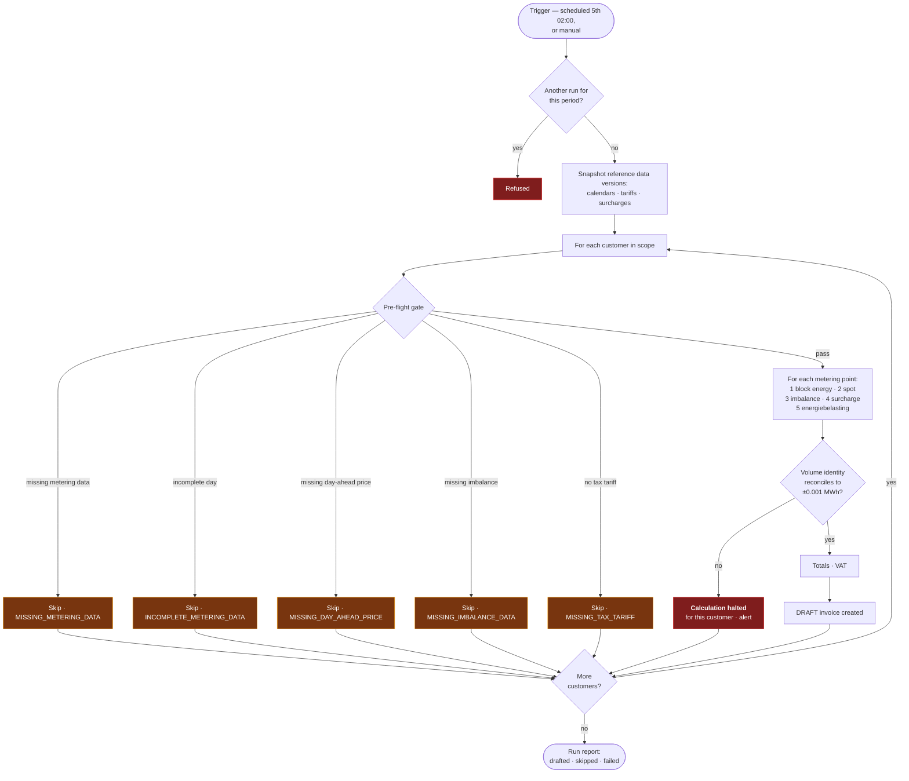
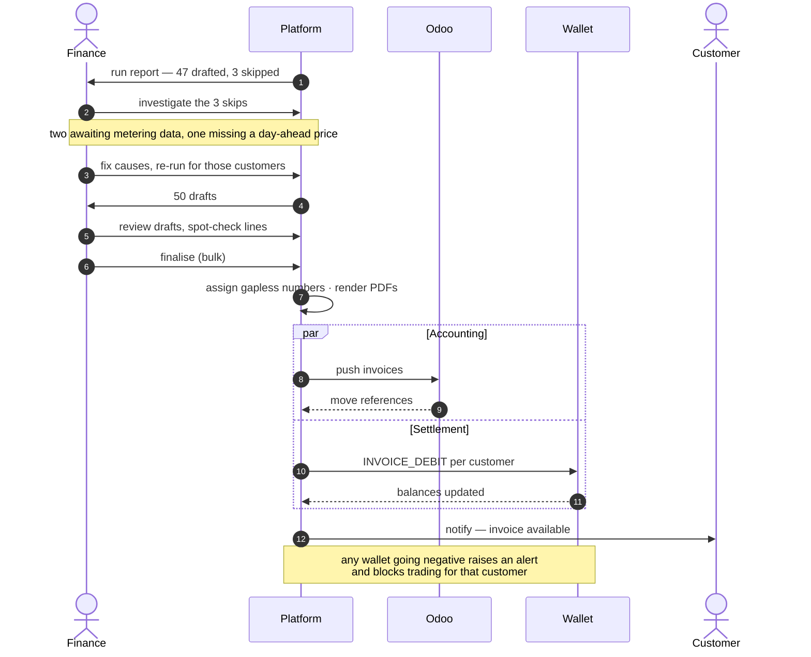
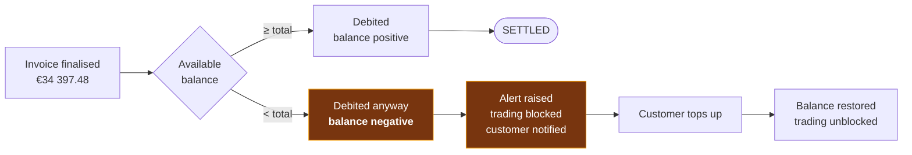

# Process — Monthly Invoicing

The month-close run. Feature spec: [F10](../10-features/F10-invoicing-and-settlement.md) ·
Arithmetic: [Invoice calculation](../50-calculations/03-invoice-calculation.md).

---

## 1. Calendar



The correction window for the last days of August is still open on the 5th of September. Running
anyway, disclosing provisional dates, and correcting through the
[annual true-up](05-annual-true-up.md) is the deliberate trade-off **[OQ-56]**.

## 2. The run



Two properties make this run safe to re-run at will: **reference data is snapshotted at the start**,
so a mid-run change cannot produce two customers billed on different rules; and **a skip is per
customer**, so one customer's missing data never stops the other forty-nine.

## 3. The volume identity

Asserted per metering point before a draft is created:

```
Σ block volume  +  Σ day-ahead purchases  −  Σ day-ahead sales  =  measured consumption
```

within 0.001 MWh. If it fails, something is wrong in coverage, in the calendar, or in the interval
data — and the calculation stops rather than producing a plausible-looking wrong invoice. The
identity is also printed on the invoice, so the customer can perform the same check.

This one assertion is the cheapest available detector of a whole class of bugs, which is why it is a
hard failure and not a warning.

## 4. Review and finalisation



The two branches are independent **[F10-R19]**. An Odoo outage delays accounting; it does not delay
settlement, and it does not delay the customer seeing their invoice.

## 5. Skip reasons and their fixes

| Reason | Meaning | Fix | Typical delay |
| --- | --- | --- | --- |
| `MISSING_METERING_DATA` | A delivery date has no data for an active metering point | Chase PVNed; replay a quarantined message | Hours to days |
| `INCOMPLETE_METERING_DATA` | A day is `PARTIAL` | Await the completing document | Days |
| `MISSING_DAY_AHEAD_PRICE` | Gap in the curve | Re-fetch, or manual entry with a flag **[F08-R10]** | Minutes |
| `MISSING_IMBALANCE_DATA` | No imbalance report for the month | Chase PVNed | Days |
| `MISSING_TAX_TARIFF` | No energiebelasting tariff for the year | Admin loads the tariff | Minutes |
| `MISSING_SURCHARGE` | No rate resolves — **warning only** | Configure, or accept zero | Minutes |
| `OPEN_TRADE_IN_PERIOD` | A trade for the period is still non-terminal — **warning only** | Resolve the trade | Hours |

## 6. Wallet settlement outcomes



This is the **[OQ-19]** behaviour: full debit into negative rather than partial settlement. The debt
is real either way; carrying it in the wallet keeps one number authoritative instead of splitting it
between the wallet and a receivable.

## 7. Corrections

| Situation | Route |
| --- | --- |
| Error found in a **draft** | Recalculate |
| Error found after **finalisation** | Credit note + new invoice |
| Metering correction after finalisation | Flagged, settled in the [annual true-up](05-annual-true-up.md) |
| Wrong surcharge applied | Credit note + new invoice |
| Wrong tax tariff loaded | Credit note + new invoice for every affected customer — which is why editing a used tariff is blocked **[F12-R20]** |

## 8. Monitoring

| Check | Alert |
| --- | --- |
| Run did not start on schedule | **P1** |
| Run failed | **P1** |
| Run duration > 60 min | P2 |
| Skipped customers > 10% | P2 |
| Volume identity failure | **P1** — indicates a calculation defect |
| Drafts unreviewed after 3 days | P2 |
| Odoo push failing > 3 attempts | P2 |
| Wallet negative after settlement | P2 per customer |
