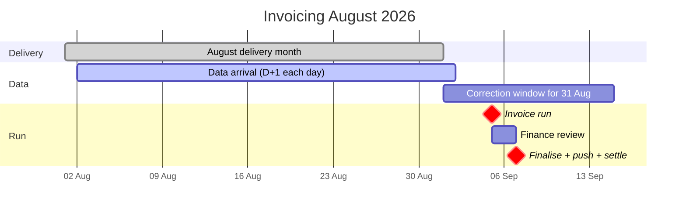
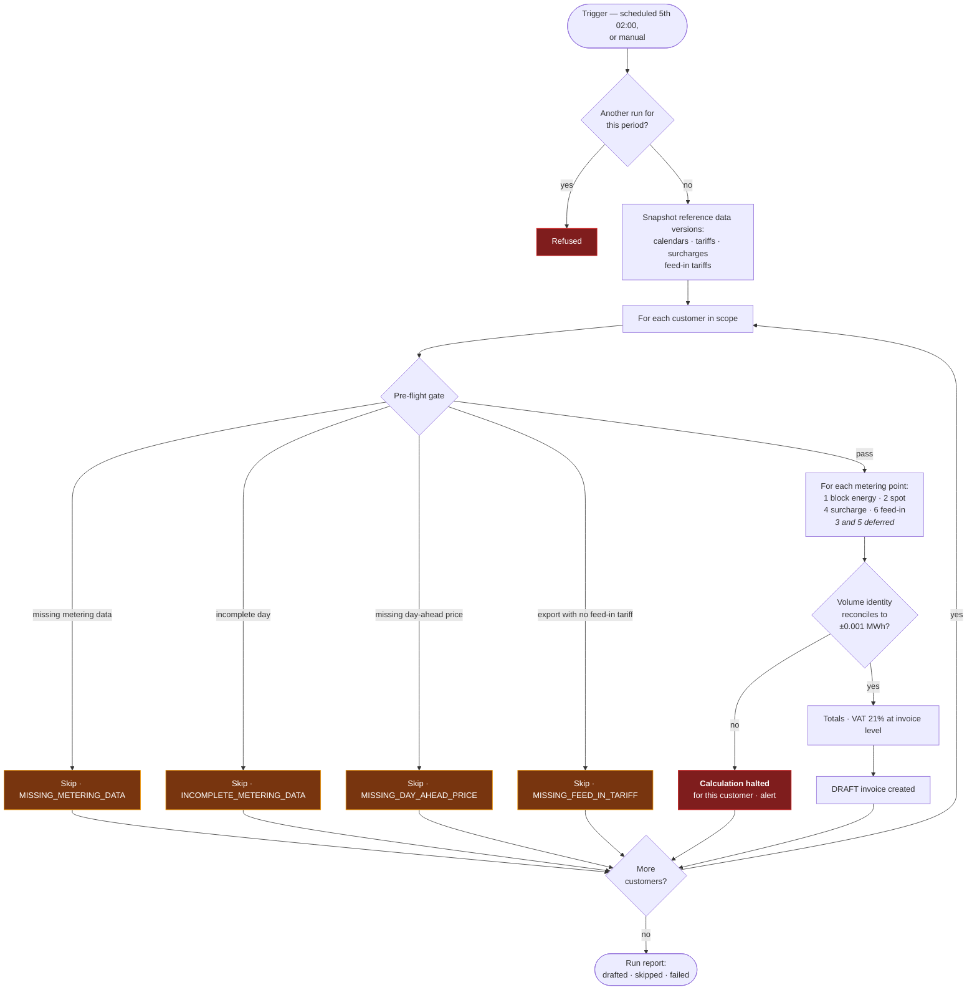
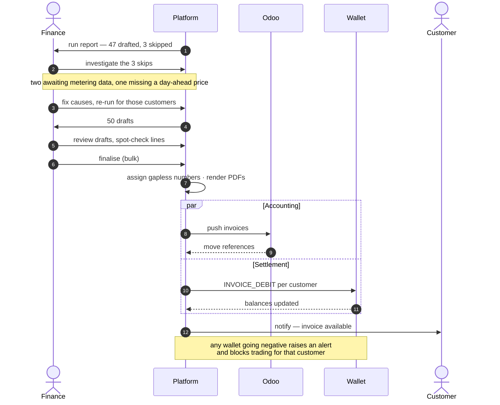

# Process — Monthly Invoicing

The month-close run. Feature spec: [F10](../10-features/F10-invoicing-and-settlement.md) ·
Arithmetic: [Invoice calculation](../50-calculations/03-invoice-calculation.md).

---

## 1. Calendar

The correction window for the last days of August is still open on the 5th of September. Running
anyway, disclosing provisional dates, and correcting through the
[annual true-up](05-annual-true-up.md) is the deliberate trade-off **[OQ-56]** — with the caveat that
**[DEC-24]** defers the true-up to its residual data-correction role, so corrections after
finalisation are flagged and held rather than settled ([Annual true-up](05-annual-true-up.md) §1.2).

## 2. The run

Two properties make this run safe to re-run at will: **reference data is snapshotted at the start**,
so a mid-run change cannot produce two customers billed on different rules; and **a skip is per
customer**, so one customer's missing data never stops the other forty-nine.

**The gate lost two conditions and gained one.** `MISSING_IMBALANCE_DATA` is not evaluated because
**[DEC-25]** takes imbalance out of scope, and `MISSING_TAX_TARIFF` is not evaluated because
**[DEC-24]** takes energiebelasting out of scope. **`MISSING_FEED_IN_TARIFF` is new with [DEC-44]**.
Four skip codes and two warnings remain — §5. Both retired conditions are retained there rather than
deleted, because both are expected back.

### 2.1 Calculation order

**Four** of the six line categories are calculated, in this order. **The numbering is the invoice's
own and is not renumbered by the deferrals** — lines 3 and 5 are absent, not moved, so a line number
means the same thing before and after they return. **[DEC-44]**'s feed-in category takes the next free
number, **6**, rather than occupying a reserved one
([Invoice calculation](../50-calculations/03-invoice-calculation.md)).

| # | Category | Notes |
| --- | --- | --- |
| 1 | Block energy | One line per block per metering point. Price in **€/MWh** |
| 2 | Spot settlement — day-ahead | **Two lines, never one.** A purchase line for uncovered volume, and a **sale line for unused block cover, credited at the raw day-ahead price [DEC-23], [DEC-44]** and **never netted against the purchase line** — the two occur at different times and therefore at different prices. Price in **€/MWh** |
| 3 | Imbalance | **Not implemented [DEC-25].** PVNed `A12` documents are stored but not charged ([PVNed timeseries](../30-integrations/01-pvned-timeseries.md) §7.2) |
| 4 | Surcharge | Rate in **€/kWh [DEC-35]** — applied to the kWh volume with **no `/1000`** |
| 5 | Energiebelasting | **Not implemented [DEC-24].** ⚠ A legal obligation, not a feature — **must be reopened before a single invoice is issued to a real customer** |
| 6 | Feed-in | **New [DEC-44].** Physically exported volume `Σ max(−U, 0)`, credited at the per-customer feed-in tariff. Rate in **€/kWh**, again with **no `/1000`**. One line per rate period, never a blend |
| — | Totals | Subtotal, then **VAT added at invoice level [DEC-26]**, at **21% on every category [DEC-64]** |

Under **[DEC-22]** the surplus is no longer only an over-hedging artefact: net usage is
consumption − production and **may be negative in an interval**, so an exporting metering point
produces surplus volume through the same path. **[DEC-44] then splits that surplus at the point of
pricing.** Unused block cover stays on line 2 at day-ahead; the physically exported part moves to
line 6 at the feed-in tariff. This is a change to work already specified — the sale line's description
changes from *"surplus and export volume"* to *"unused block cover"*, because that is now all it
contains.

> ⚠ **[DEC-44] does not say what applies when a customer exports and no feed-in tariff resolves.**
> Zero and day-ahead-as-fallback are both defensible and differ in money. Until it is decided, the
> gate refuses rather than defaults — see §5 and [F09](../10-features/F09-surcharges.md) §11.1.

### 2.2 VAT

**Every price, wallet balance and reservation feeding this run is VAT-exclusive; VAT is added at
invoice level [DEC-26].** The rate is settled: **[DEC-64] fixes it at 21% on every line category, with
no exemptions and no reverse-charge cases**, closing **[OQ-82]**. The totals step is therefore a
single multiplication over the subtotal, not a sum over rate groups — and the sale and feed-in credit
lines carry 21% on their negative amounts like any other category.

| Status | Bites at | Consequence |
| --- | --- | --- |
| **Rate per line category — closed. 21%, all categories, no exemptions [DEC-64]** | The totals step in §2 | ⚠ Recorded as stated. A customer outside the standard rate — a foreign entity, for instance — reopens this **before their first invoice**, not after |
| Whether the wallet `INVOICE_DEBIT` settles the VAT-**exclusive** subtotal or the VAT-**inclusive** total — **[OQ-83], still open** | Settlement, §4 and §6 | If it is the inclusive total, a reservation sized ex-VAT **[AS-10]** under-covers the eventual debit by the VAT rate, and **[DEC-41]** removed the buffer that would have absorbed it. **[DEC-64]** now makes the gap exactly 21% of the subtotal. Resolve before wallet settlement is built |

## 3. The volume identity

Asserted per metering point before a draft is created, and printed on the invoice so the customer can
perform the same check.

**Two decisions have changed its shape.** **[DEC-22]** made the measured side **net usage =
consumption − production** per interval rather than gross consumption, and net usage may be negative
where production exceeds consumption. **[DEC-44]** then **split the sale term in two** — unused block
cover and physically exported volume are now separate terms, because they leave the invoice at
different prices on different lines. The line categories it reconciles against are the four in §2.1,
so **[DEC-24]** and **[DEC-25]** bound what it has to account for as well.

**The authoritative statement of the identity lives in
[Invoice calculation](../50-calculations/03-invoice-calculation.md) §11.1**, together with its
pointwise proof for all three sign cases, and is deliberately **not restated here** — an identity
written down twice is an identity that will eventually disagree with itself, and it is the last thing
in this system that should. **[DEC-44]** is the case in point: had the formula been copied into this
document, the two copies would now differ by a term. What this process guarantees is unchanged:

| Property | Behaviour |
| --- | --- |
| Tolerance | 0.001 MWh |
| Scope | Per metering point, before a draft is created |
| On failure | **Calculation halted for this customer**, alert raised — never a plausible-looking wrong invoice |
| On the invoice | Printed, so the customer can reconcile it independently — alongside gross consumption, production, net usage and, since **[DEC-44]**, exported volume |

If it fails, something is wrong in coverage, in the calendar, or in the interval data. This one
assertion is the cheapest available detector of a whole class of bugs, which is why it is a hard
failure and not a warning. **[DEC-44]** gives it one more thing to catch: a sale volume divided
wrongly between the day-ahead leg and the feed-in leg totals correctly but reconciles wrongly, and
this is where that shows up.

## 4. Review and finalisation

The two branches are independent **[F10-R19]**. An Odoo outage delays accounting; it does not delay
settlement, and it does not delay the customer seeing their invoice.

## 5. Skip reasons and their fixes

Four skip codes and two warnings are evaluated. Two further codes are **retained but not evaluated**,
so the vocabulary survives the deferrals rather than being re-invented later.

| Reason | Meaning | Fix | Typical delay |
| --- | --- | --- | --- |
| `MISSING_METERING_DATA` | A delivery date has no data for an active metering point, **in either direction [DEC-22]** | Chase PVNed; replay a quarantined message | Hours to days |
| `INCOMPLETE_METERING_DATA` | A day is `PARTIAL` | Await the completing document | Days |
| `MISSING_DAY_AHEAD_PRICE` | Gap in the curve | Re-fetch — the curve arrives at 18:00 Europe/Amsterdam **[DEC-36]**, so a same-day gap may simply be early — or manual entry with a flag **[F08-R10]** | Minutes |
| `MISSING_FEED_IN_TARIFF` | The metering point **exported** in the month and no feed-in tariff resolves — **new [DEC-44]** | Configure the tariff. ⚠ Do **not** work around it by accepting zero: whether zero or day-ahead is the right fallback is **undecided**, and this skip exists to stop the run choosing on its own. See [F09](../10-features/F09-surcharges.md) §11.1 | Minutes, once the rate is agreed |
| `MISSING_IMBALANCE_DATA` | No imbalance report for the month — **not evaluated [DEC-25]** | Reinstated with invoice line 3, if imbalance ever comes into scope | — |
| `MISSING_TAX_TARIFF` | No energiebelasting tariff for the year — **not evaluated [DEC-24]** | Reinstated with invoice line 5, which must happen before a real customer is invoiced | — |
| `MISSING_SURCHARGE` | No rate resolves — **warning only** | Configure, or accept zero | Minutes |
| `MISSING_FEED_IN_TARIFF` *(no export)* | The same condition on a metering point that did not export — **warning only** | Configure before the site next exports | Minutes |
| `OPEN_TRADE_IN_PERIOD` | A trade for the period is still non-terminal — **warning only** | Resolve the trade | Hours |

**Why `MISSING_FEED_IN_TARIFF` is a skip and `MISSING_SURCHARGE` is a warning.** They look symmetric
and are not. A missing surcharge bills nothing and costs the customer nothing, so proceeding is safe.
A missing feed-in tariff would credit exported energy at nothing — a real amount of the customer's
electricity taken and not paid for — and **[DEC-44]** does not say that zero is correct. Skipping is
recoverable in minutes; a wrong credit on a finalised invoice is a credit note.

## 6. Wallet settlement outcomes

This is the **[OQ-19]** behaviour: full debit into negative rather than partial settlement. The debt
is real either way; carrying it in the wallet keeps one number authoritative instead of splitting it
between the wallet and a receivable.

**Which amount is debited is still not settled.** **[DEC-26]** makes wallet balances VAT-exclusive and
adds VAT at invoice level, and **[DEC-64]** fixes the rate at 21%, but neither says whether
`INVOICE_DEBIT` settles the VAT-exclusive subtotal or the VAT-inclusive total — **[OQ-83]**, see §2.2.
The figure in the diagram is the invoice total; if the debit is in fact the subtotal, both the
comparison and the reservation maths change. What **[DEC-64]** did change is that the gap is now
exactly quantifiable: 21% of the subtotal, on every invoice. Resolve before wallet settlement is
built.

## 7. Corrections

| Situation | Route |
| --- | --- |
| Error found in a **draft** | Recalculate |
| Error found after **finalisation** | Credit note + new invoice |
| Metering correction after finalisation | Flagged `AFFECTED_BY_CORRECTION`, settled in the [annual true-up](05-annual-true-up.md) — **deferred to that residual role by [DEC-24]**, so the flag is set and held until the run is built |
| Wrong surcharge applied | Credit note + new invoice |
| Wrong feed-in tariff applied **[DEC-44]** | Credit note + new invoice. The rate is snapshotted on the line **[F09]**, so the original invoice still shows what was actually charged; correcting it is a new document, never an edit |
| Surcharge or feed-in rate stored in the wrong **unit** | Same route, but check the whole population first: a €/MWh rate read as €/kWh is a 1000× error **[DEC-35]**, so it is unlikely to affect one customer alone. See **[F09-R12]** |
| Wrong tax tariff loaded | Credit note + new invoice for every affected customer — which is why editing a used tariff is blocked **[F12-R20]**. **Not reachable while [DEC-24] holds**; the rule stands for when line 5 returns |

## 8. Monitoring

| Check | Alert |
| --- | --- |
| Run did not start on schedule | **P1** |
| Run failed | **P1** |
| Run duration > 60 min | P2 |
| Skipped customers > 10% | P2 |
| Volume identity failure | **P1** — indicates a calculation defect |
| Any customer skipped `MISSING_FEED_IN_TARIFF` | P2 — reference data missing, not a defect, but it blocks that customer's invoice until an agreed rate is entered **[DEC-44]** |
| Drafts unreviewed after 3 days | P2 |
| Odoo push failing > 3 attempts | P2 |
| Wallet negative after settlement | P2 per customer |
