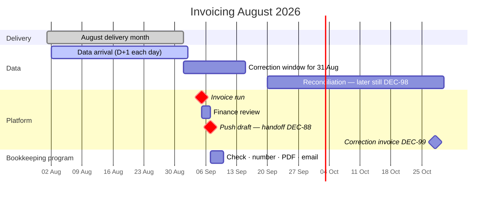
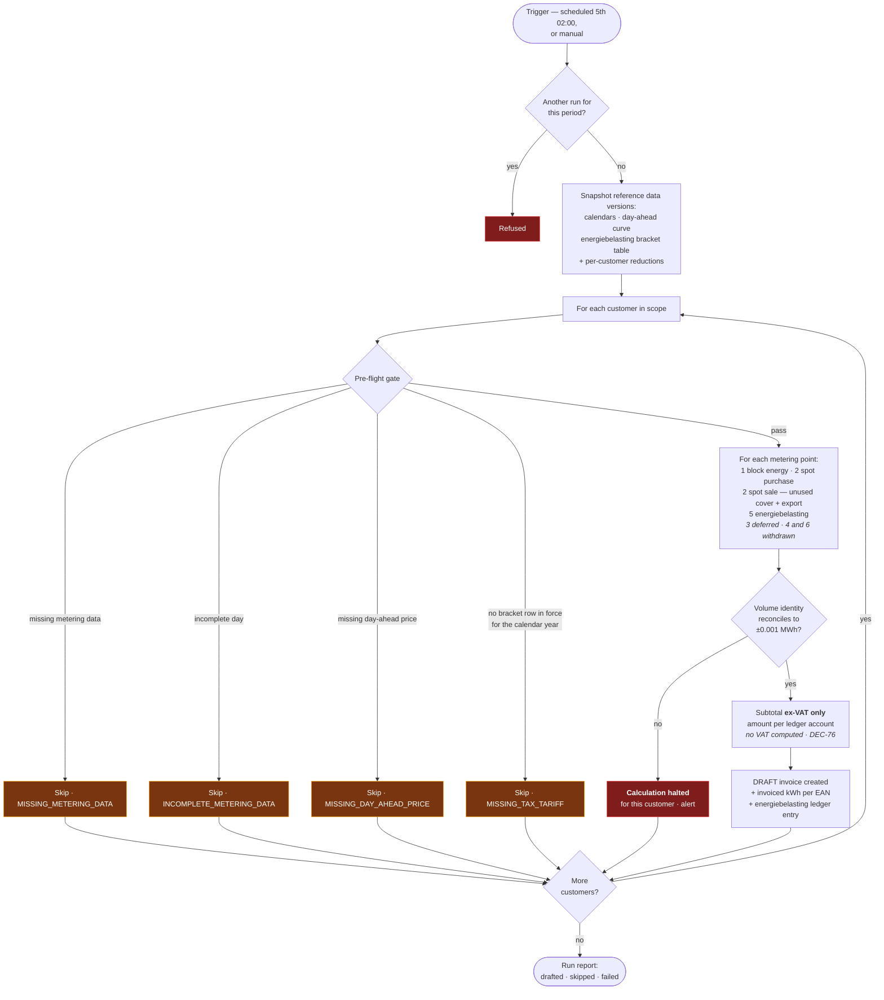
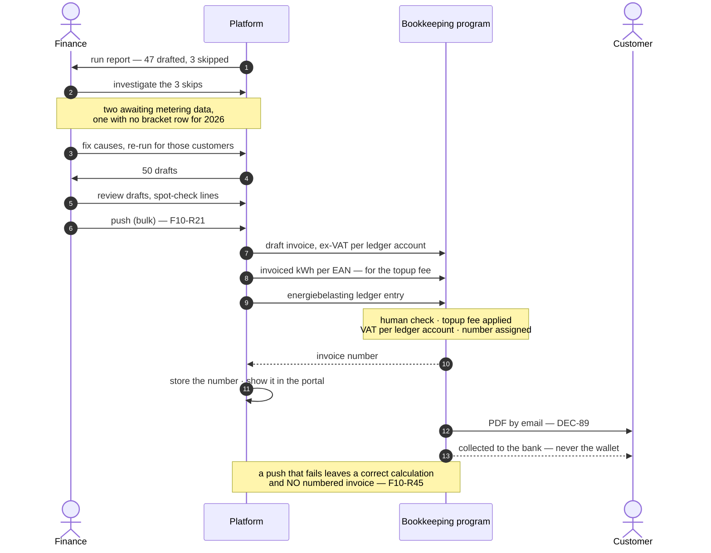

# Process — Monthly Invoicing

The month-close run. Feature spec: [F10](../10-features/F10-invoicing-and-settlement.md) ·
Arithmetic: [Invoice calculation](../50-calculations/03-invoice-calculation.md) ·
Bracket table: [F09 — Tariffs & Energiebelasting](../10-features/F09-surcharges.md) ·
Annual bracket close: [Annual true-up](05-annual-true-up.md).

> ⚠ **Rewritten 2026-08-19.** The run keeps its shape and loses its ending. Six decisions touch this
> process, and it is worth reading them as one movement rather than six edits: **the platform stops
> being the thing that issues an invoice and becomes the thing that calculates one.**
>
> | Decision | What it does to this process |
> | --- | --- |
> | **[DEC-73]** | Invoice **line 4 (surcharge) is removed**, reversing **[DEC-35]**. The platform pushes **volume**; the bookkeeping program multiplies it by the topup fee **[F10-R51]** |
> | **[DEC-87]** | Invoice **line 6 (feed-in) is removed**, reversing the second half of **[DEC-44]**. Exported volume returns to **line 2's sale leg at the raw day-ahead price [DEC-23]**. The volume identity in §3 collapses back to its pre-[DEC-44] shape |
> | **[DEC-74]** | Invoice **line 5 (energiebelasting) is implemented**, reversing **[DEC-24]** — a versioned bracket table, a per-customer reduction, a ledger push. The `MISSING_TAX_TARIFF` pre-flight check is **reinstated as a hard skip** |
> | **[DEC-76]** | The platform computes **no VAT at all**. It pushes ex-VAT amounts against ledger accounts and the bookkeeping program applies each account's rate |
> | **[DEC-77]** | **§6 is removed.** Delivery invoices are never settled from the wallet, reversing **[AS-12]**. **[OQ-19] closes** |
> | **[DEC-88]**, **[DEC-89]** | The run ends by **pushing a draft**. Numbering, the PDF and the email happen in the bookkeeping program after a human check, reversing **[DEC-45]** and **[DEC-46]** |
> | **[DEC-99]**, **[DEC-98]**, **[DEC-100]** | The calendar in §1 is **no longer a gate that closes**. A correction invoice is raised for the delta **whenever** the correction lands, with **no materiality threshold**. **[OQ-56]** and **[OQ-76]** close |
>
> Net effect on the line inventory: **three** implemented categories, not four — 1, 2 and 5. Line 3
> stays deferred **[DEC-25]**; lines 4 and 6 are withdrawn. No line is renumbered.

---

## 1. Calendar



~~The correction window for the last days of August is still open on the 5th of September. Running
anyway, disclosing provisional dates, and correcting through the
[annual true-up](05-annual-true-up.md) is the deliberate trade-off **[OQ-56]** — with the caveat that
**[DEC-24]** defers the true-up to its residual data-correction role, so corrections after
finalisation are flagged and held rather than settled ([Annual true-up](05-annual-true-up.md) §1.2).~~

⚠ **Reversed 2026-08-19 by [DEC-99] and [DEC-98]. [OQ-56] closes.** The correction window for the last
days of August is still open on the 5th of September — that part was never the problem. What has
changed is what happens afterwards. **Corrections arrive at any time, months later included**, PVNed
**does** supply reconciliation data after the 10-working-day window **[DEC-98]** — reversing
**[DEC-57]** — and each correction that moves an already-invoiced volume produces a **correction
invoice for the delta whenever it lands** **[DEC-99]**, **[F10-R49]**.

**The calendar therefore stops being a gate that closes and becomes a first pass.**

| | Before | After **[DEC-99]** |
| --- | --- | --- |
| A correction on 14 Sep for 31 Aug | Inside the window; the run had not happened, so it is simply included | Unchanged |
| A correction on 20 Nov for 31 Aug | Flagged `AFFECTED_BY_CORRECTION` **[F02-R20]** and **held** — the [annual true-up](05-annual-true-up.md) was the destination, and **[DEC-24]** had deferred it, so in practice nothing settled | A **correction invoice for the delta**, calculated on the corrected volumes at the **original month's prices** and pushed as a draft **[F10-R49]** |
| A correction worth €0,40 | Below the €25 materiality default, waived | Invoiced. **[DEC-100]** removes the threshold rather than setting it — **[OQ-76] closes** |
| Latency to settlement | Up to 13 months | Days |

Cost, stated because it is real: correction invoices become routine rather than exceptional, and every
one of them is a document that the bookkeeping program numbers after a manual check **[DEC-88]**. A
€0,40 delta costs the same handling as a €4 000 one. That is the price of **[DEC-100]**, and it is
recorded on risk **[R-20]** rather than argued away here. The milestone on the gantt above is drawn in
late October for exactly this reason: it belongs to no fixed date.

**The dates themselves are unchanged.** The run still fires on the 5th at 02:00 and the review still
takes about two days. What used to be a "finalise" milestone on the 7th is now a **handoff** — see
§4.

## 2. The run



Two properties make this run safe to re-run at will: **reference data is snapshotted at the start**,
so a mid-run change cannot produce two customers billed on different rules; and **a skip is per
customer**, so one customer's missing data never stops the other forty-nine. Both matter more now than
they did: the snapshot has to pin a **bracket-table version** **[DEC-74]**, **[F09-R19]**, and the run
is one of several passes over the same month rather than the only one **[DEC-99]**.

~~**The gate lost two conditions and gained one.** `MISSING_IMBALANCE_DATA` is not evaluated because
**[DEC-25]** takes imbalance out of scope, and `MISSING_TAX_TARIFF` is not evaluated because
**[DEC-24]** takes energiebelasting out of scope. **`MISSING_FEED_IN_TARIFF` is new with [DEC-44]**.
Four skip codes and two warnings remain — §5. Both retired conditions are retained there rather than
deleted, because both are expected back.~~

⚠ **Rewritten 2026-08-19.** The gate lost two conditions and got one back. `MISSING_SURCHARGE` is
**gone** — there is no surcharge to resolve **[DEC-73]** — and `MISSING_FEED_IN_TARIFF` is **gone
before it was ever built** — there is no feed-in tariff to fail to resolve **[DEC-87]**.
`MISSING_TAX_TARIFF` is **reinstated as a hard skip**, exactly as this file promised it would be,
because **[DEC-74]** puts energiebelasting back in scope and a calendar year with **no bracket row in
force cannot be calculated at all** **[F09-R21]**. `MISSING_IMBALANCE_DATA` is still retained and
still not evaluated **[DEC-25]**. **Four skip codes and one warning** remain — §5.

The one condition that quietly got *wider*: a day-ahead price is now required for **every interval,
including every interval in which the metering point exported**, because export is settled from that
same curve **[DEC-87]**, **[F10-R05]**. Before, an exporting interval was priced from a per-customer
feed-in tariff and a missing curve point there did not matter.

### 2.1 Calculation order

~~**Four** of the six line categories are calculated, in this order.~~ ⚠ **Amended 2026-08-19 —
three** of the six are calculated: **1, 2 and 5**. **The numbering is the invoice's own and is not
renumbered by the deferrals** — nor now by the withdrawals. Lines 3, 4 and 6 are absent, not moved, so
a line number means the same thing before and after **[F10-R05]**.
~~**[DEC-44]**'s feed-in category takes the next free number, **6**, rather than occupying a reserved
one~~ — line 6 existed for one round and is withdrawn by **[DEC-87]**; its number is retired, not
reused ([Invoice calculation](../50-calculations/03-invoice-calculation.md) §1).

| # | Category | Notes |
| --- | --- | --- |
| 1 | Block energy | One line per block per metering point. Price in **€/MWh** |
| 2 | Spot settlement — day-ahead | **Two lines, never one.** A purchase line for uncovered volume, and a **sale line credited at the raw day-ahead price [DEC-23]**, **never netted against the purchase line** — the two occur at different times and therefore at different prices. ⚠ **Amended 2026-08-19 by [DEC-87]:** the sale line carries **unused block cover *and* physical export together**, at one price. Price in **€/MWh** |
| 3 | Imbalance | **Not implemented [DEC-25].** PVNed `A12` documents are stored but not charged ([PVNed timeseries](../30-integrations/01-pvned-timeseries.md) §7.2) |
| ~~4~~ | ~~Surcharge~~ ~~Rate in **€/kWh [DEC-35]** — applied to the kWh volume with **no `/1000`**~~ | ⚠ **Removed 2026-08-19 by [DEC-73]**, reversing **[DEC-35]**. The platform holds no rate and computes no amount; it pushes the **invoiced kWh per EAN** and the bookkeeping program multiplies by the topup fee **[F10-R51]**. **[OQ-36] closes with it** |
| **5** | Energiebelasting | ⚠ **Implemented 2026-08-19 by [DEC-74]**, reversing **[DEC-24]**. Per EAN per **calendar year** on net usage **[DEC-22]**, from a **versioned bracket table** with an optional per-customer reduction or exemption **[F09]**, **[F10-R43]**. Rate in **€/kWh**, charged as the delta of the year-to-date cumulative tax ([Invoice calculation](../50-calculations/03-invoice-calculation.md) §7.2). Pushed as its **own ledger entry** as well as an invoice line |
| ~~6~~ | ~~Feed-in~~ ~~**New [DEC-44].** Physically exported volume `Σ max(−U, 0)`, credited at the per-customer feed-in tariff~~ | ⚠ **Removed 2026-08-19 by [DEC-87]** before it was built, reversing the second half of **[DEC-44]**. Export is credited at the **raw day-ahead price** on line 2's sale leg, exactly like surplus **[DEC-23]**. **[OQ-86] closes** |
| — | Totals | ~~Subtotal, then **VAT added at invoice level [DEC-26]**, at **21% on every category [DEC-64]**~~ ⚠ **Amended 2026-08-19 by [DEC-76]:** an **ex-VAT subtotal and nothing else**, each amount carrying the **ledger account** it is pushed against. The platform computes no VAT — §2.2 |

Under **[DEC-22]** the surplus is no longer only an over-hedging artefact: net usage is
consumption − production and **may be negative in an interval**, so an exporting metering point
produces surplus volume through the same path. ~~**[DEC-44] then splits that surplus at the point of
pricing.** Unused block cover stays on line 2 at day-ahead; the physically exported part moves to
line 6 at the feed-in tariff. This is a change to work already specified — the sale line's description
changes from *"surplus and export volume"* to *"unused block cover"*, because that is now all it
contains.~~

⚠ **Reversed 2026-08-19 by [DEC-87].** That split never happens. Surplus and export leave through the
**same door at the same price**, and the sale line's description goes back to *"surplus and export
volume"*. The two are still shown as **separate volumes inside the one line** **[F10-R41]** — a
customer needs to see how much they physically exported — but they are one term in the money and one
term in the identity (§3).

> ~~⚠ **[DEC-44] does not say what applies when a customer exports and no feed-in tariff resolves.**
> Zero and day-ahead-as-fallback are both defensible and differ in money. Until it is decided, the
> gate refuses rather than defaults — see §5 and [F09](../10-features/F09-surcharges.md) §11.1.~~
>
> ⚠ **Closed 2026-08-19 by [DEC-87]**, and not on its own terms: with no feed-in tariff there is
> nothing that can fail to resolve. The answer turns out to be the day-ahead price for **every**
> exporting interval, not only the unresolved ones. **[OQ-86]** closes and the €662,53 fallback
> question disappears with it.

**What the line inventory is worth in money.** On the standard worked example — EAN …0011, August
2026, [Invoice calculation §11](../50-calculations/03-invoice-calculation.md) — the sale volume is
`48,38 MWh` of unused cover plus `18,60 MWh` of export. Collapsing them back to one line at the
month's €35,62/MWh average sale price:

```
sale leg    (48.38 + 18.60) × 35.62  =  66.98 × 35.62  =  2 385.8276  → 2 385.83   credit
was, under DEC-44:  1 723.30 (cover, day-ahead) + 530.10 (export, €0.0285/kWh)  =  2 253.40
difference                                                                       =    132.43
```

So **[DEC-87]** hands €132,43 back to this customer — the exact amount **[DEC-44]** had taken — and
**[DEC-73]** removes the €1 545,39 surcharge line from the platform's arithmetic entirely (it is
still charged, by the bookkeeping program, from the pushed volume). The EAN subtotal moves
`31 537,93 − 1 545,39 − 132,43 = €29 860,11` **ex-VAT, before line 5** — and that subtotal is the
last figure the platform owns. Everything after it — the topup fee **[DEC-73]**, the VAT
**[DEC-76]**, the number **[DEC-88]** — is applied somewhere else.

### 2.2 VAT — ~~computed here~~ **not computed here at all**

~~**Every price, wallet balance and reservation feeding this run is VAT-exclusive; VAT is added at
invoice level [DEC-26].** The rate is settled: **[DEC-64] fixes it at 21% on every line category, with
no exemptions and no reverse-charge cases**, closing **[OQ-82]**. The totals step is therefore a
single multiplication over the subtotal, not a sum over rate groups — and the sale and feed-in credit
lines carry 21% on their negative amounts like any other category.~~

⚠ **Rewritten 2026-08-19 by [DEC-76].** The first clause survives and the rest does not. Every price,
wallet balance and reservation feeding this run is still **VAT-exclusive [DEC-26]** — but **the
platform performs no VAT calculation, holds no VAT amount and stores no VAT-inclusive total** for a
delivery invoice. The totals step is a subtotal and nothing more. What it gains instead is a **ledger
account per amount**; the bookkeeping program applies **that account's** rate **[F10-R47]**,
**[DEC-107]**.

| Status | Bites at | Consequence |
| --- | --- | --- |
| ~~**Rate per line category — closed. 21%, all categories, no exemptions [DEC-64]**~~ | ~~The totals step in §2~~ | ⚠ **Superseded as a platform behaviour 2026-08-19 by [DEC-76].** The rate is no longer applied here, so "which rate per category" is no longer this run's question — it is a property of the chart of accounts. **[DEC-64]** survives only as the **reference rate [DEC-78]** uses to gross up a *trade* reservation in [F05](../10-features/F05-energy-block-trading.md) |
| ~~Whether the wallet `INVOICE_DEBIT` settles the VAT-**exclusive** subtotal or the VAT-**inclusive** total — **[OQ-83], still open**~~ | ~~Settlement, §4 and §6~~ | ⚠ **Moot 2026-08-19 by [DEC-77]** — there is no `INVOICE_DEBIT` and no wallet settlement of an invoice, so this half of **[OQ-83]** has no subject. Its surviving half — how a *trade* reservation is sized — is answered **VAT-inclusive** by **[DEC-78]**, in [F05](../10-features/F05-energy-block-trading.md) and [F06](../10-features/F06-wallet-and-ledger.md), not here |
| **Energiebelasting is itself part of the VAT base in the Netherlands** | The ledger account line 5 is pushed against **[DEC-74]**, **[DEC-107]** | The ordering subtlety that was dormant while **[DEC-24]** held is live again — but it is now the **bookkeeping program's** ordering problem, because that is where the rate is applied. The platform's obligation is narrower and harder to get wrong: push the energiebelasting amount **ex-VAT, on its own account**, never folded into an energy line |

⚠ **What this costs.** A pushed draft can no longer be checked against a VAT-inclusive total computed
independently on this side, because there is no second computation to disagree. The reconciliation
that remains is volume and ex-VAT value per ledger account — which is the right level, but it does
mean a mis-mapped account produces a **correctly calculated invoice at the wrong VAT rate**, and
nothing in this run can detect it. The chart of accounts needs a named owner from day one
**[DEC-107]**.

## 3. The volume identity

Asserted per metering point before a draft is created, and printed on the invoice so the customer can
perform the same check.

~~**Two decisions have changed its shape.**~~ **[DEC-22]** made the measured side **net usage =
consumption − production** per interval rather than gross consumption, and net usage may be negative
where production exceeds consumption. ~~**[DEC-44]** then **split the sale term in two** — unused block
cover and physically exported volume are now separate terms, because they leave the invoice at
different prices on different lines.~~ ⚠ **Reversed 2026-08-19 by [DEC-87]:** the two terms **collapse
back into one**, because export and unused cover leave the invoice at the same price on the same line.
The identity returns to the pre-**[DEC-44]** shape it had for one round. The line categories it
reconciles against are the three in §2.1, so **[DEC-25]** (line 3 deferred), **[DEC-73]** (line 4
withdrawn) and **[DEC-87]** (line 6 withdrawn) bound what it has to account for as well.

~~**The authoritative statement of the identity lives in
[Invoice calculation](../50-calculations/03-invoice-calculation.md) §11.1**, together with its
pointwise proof for all three sign cases, and is deliberately **not restated here** — an identity
written down twice is an identity that will eventually disagree with itself, and it is the last thing
in this system that should. **[DEC-44]** is the case in point: had the formula been copied into this
document, the two copies would now differ by a term.~~

⚠ **Amended 2026-08-19 by [DEC-87].** The reasoning above stands and its warning was earned — which is
why the rule is narrowed rather than dropped. **[Invoice calculation](../50-calculations/03-invoice-calculation.md)
§11.1 remains the authoritative statement**, and any disagreement between it and the three lines below
is resolved in its favour, without discussion. What is restated here is the **shape** — because that
shape is precisely what this round changed, and a reversal that cannot be read where the process is
described is a reversal nobody will notice:

```
Σ blockMWh  +  purchaseMWh  −  saleMWh   =   netUsageMWh
                                         =   grossConsumption − production

where  saleMWh = unusedCover + exported           one line, one price  [DEC-87]

left  :  (297.60 + 50.40)  +  62.40  −  66.98   =   343.42 MWh
right :   385.42  −  42.00                      =   343.42 MWh      ✓
```

Step by step, so it is checkable: `348.00 + 62.40 = 410.40`; `410.40 − 66.98 = 343.42`. The intermediate
**import** volume `410.40 − 48.38 = 362.02 MWh` is still worth printing, but it is no longer a step in
the identity — it is a split *inside* the sale term.

**Proof, pointwise, for all three sign cases.** Per interval, with `B ≥ 0`,
`uncovered = max( max(U,0) − B, 0 )` and `sale = max( B − max(U,0), 0 ) + max(−U, 0)` — the `B < 0`
case is the caveat below, and the one-line form covers it:

| Case | `uncovered` | `sale` | `B + uncovered − sale` |
| --- | --- | --- | --- |
| `U ≥ 0`, `B ≤ U` | `U − B` | `0` | `B + (U−B) − 0 = U` ✓ |
| `U ≥ 0`, `B > U` | `0` | `B − U` | `B + 0 − (B−U) = U` ✓ |
| `U < 0` | `0` | `B − U` — all of the cover is unused **and** the site exported `−U` | `B + 0 − (B−U) = U` ✓ |

It holds interval by interval, so it holds for any sum of intervals — over a metering point, over a
month, over a year. Written in one line, with `uncovered − unusedCover = max(U,0) − B` identically
([Position & coverage](../50-calculations/02-position-and-coverage.md) §4):

```
B + uncovered − sale  =  B + ( max(U,0) − B ) − max(−U, 0)
                      =  max(U,0) − max(−U,0)
                      =  U                                for every sign of U
```

This is the same algebra as the four-term version; **[DEC-87]** removes a term from the invoice, not a
step from the proof.

> ⚠ **The clamp on `uncovered` stopped being optional on the same day.** With the unclamped
> `max(U − B, 0)` the identity fails when `U < 0` and `B < 0` together — a **short** position in an
> exporting interval, where the sale term counts volume the sold block has already committed. Worked
> counter-example, unclamped: `B = −100`, `U = −250` gives `−100 + 0 − 250 = −350 ≠ −250`, an error of
> exactly `|B|`. Clamped: `uncovered = max(0 − (−100), 0) = 100`, `sale = 0 + 250`, so
> `−100 + 100 − 250 = −250 = U` ✓.
> **[DEC-34]** used to make `B < 0` unreachable by forbidding short selling. ⚠ **[DEC-72] reverses
> [DEC-34]** — a customer may sell a block they do not hold — so **a negative per-interval `B` is now
> reachable in production**, and the clamped form is load-bearing rather than merely prudent. The
> exposure that creates is **[OQ-94]**, not this identity's problem; the arithmetic is.

What this process guarantees is otherwise unchanged:

| Property | Behaviour |
| --- | --- |
| Tolerance | 0.001 MWh |
| Scope | Per metering point, before a draft is created — and therefore **before anything is pushed [DEC-88]** |
| On failure | **Calculation halted for this customer**, alert raised — never a plausible-looking wrong invoice |
| On the invoice | Printed, so the customer can reconcile it independently — alongside gross consumption, production, net usage and **exported volume**, which is kept as a printed figure even though **[DEC-87]** removed its own identity term **[F10-R41]** |

If it fails, something is wrong in coverage, in the calendar, or in the interval data. This one
assertion is the cheapest available detector of a whole class of bugs, which is why it is a hard
failure and not a warning. ~~**[DEC-44]** gives it one more thing to catch: a sale volume divided
wrongly between the day-ahead leg and the feed-in leg totals correctly but reconciles wrongly, and
this is where that shows up.~~ ⚠ **Reversed 2026-08-19 by [DEC-87]** — that failure mode no longer
exists, because there is no division to get wrong. A misallocation between unused cover and export is
now a **presentation** error inside one correctly priced line **[F10-R41]**, which this assertion
cannot catch and does not need to: it costs nobody money.

⚠ **It gains a different one from [DEC-88].** The identity is now the **last** check the platform
performs before a document leaves its control and is numbered elsewhere. Nothing downstream of the
push recomputes it.

## 4. Review and ~~finalisation~~ **handoff**

⚠ **Retitled and redrawn 2026-08-19 by [DEC-88], [DEC-89] and [DEC-77].** There is no platform-side
finalisation any more. The platform's last act on an invoice is to **push a draft**; everything the
word "finalisation" used to mean — the number, the PDF, the email, the settlement — happens
elsewhere. **[F10-R16]**, **[F10-R18]** and **[F10-R19]** are retired accordingly.



~~The two branches are independent **[F10-R19]**. An Odoo outage delays accounting; it does not delay
settlement, and it does not delay the customer seeing their invoice.~~

⚠ **Reversed 2026-08-19.** There are no two branches. **[DEC-77]** removes the settlement arm, so the
push is the **only** outbound step — nothing to be independent of, and no partial state to reconcile
when it fails. And the failure is worse than it was, which is the honest cost of **[DEC-88]**:

| | Before | After **[DEC-88]**, **[DEC-89]** |
| --- | --- | --- |
| The invoice number | Minted by the platform at finalisation, gapless per legal entity per year **[DEC-45]** | Assigned by the bookkeeping program and **returned**; the platform never mints one **[F10-R44]** |
| The PDF and the email | Rendered and sent by the platform **[DEC-46]**, **[DEC-48]** | The bookkeeping program's **[DEC-89]**. **[DEC-48]** (SendGrid) narrows to the platform's own notifications — offers, wallet events, alerts |
| An outage in that program | Delayed accounting only | **No numbered invoice exists at all.** Not a delayed one, not a provisional one — the platform holds a correct calculation that no customer can be billed from **[F10-R45]** |
| Branding of the customer-facing document | Platform-controlled | Outside platform control; the portal view and the emailed PDF can drift in layout and wording without the platform being able to detect it **[F10-R46]** |

The customer still sees the invoice in the portal, with the returned number and the calculated lines
**[F10-R34]** — the platform stops being the *sender*, not the *record*. And the invoice is
**collected to the bank**: no wallet balance is read, reserved or debited anywhere in this diagram
**[DEC-77]**, §6.

⚠ **[OQ-92] is open and lands exactly here.** If the hedge and the day-ahead delivery turn out to be
**two documents** rather than one, this sequence pushes **two drafts per customer per month** and the
bulk-push confirmation in **[F10-R21]** has to say so. It is owned by
[F10 §12](../10-features/F10-invoicing-and-settlement.md); this process is where the answer is spent.

## 5. Skip reasons and their fixes

~~Four skip codes and two warnings are evaluated. Two further codes are **retained but not evaluated**,
so the vocabulary survives the deferrals rather than being re-invented later.~~
⚠ **Restated 2026-08-19.** **Four skip codes and one warning** are evaluated; one further code is
retained and not evaluated; **two are retired**. No code is ever repurposed — a retired reason comes
back only if the thing it guarded comes back **[F10 §3.1]**.

| Reason | Meaning | Fix | Typical delay |
| --- | --- | --- | --- |
| `MISSING_METERING_DATA` | A delivery date has no data for an active metering point, **in either direction [DEC-22]** | Chase the BRP **[DEC-69]**; replay a quarantined message | Hours to days |
| `INCOMPLETE_METERING_DATA` | A day is `PARTIAL` | Await the completing document | Days |
| `MISSING_DAY_AHEAD_PRICE` | Gap in the curve — **now including gaps in exporting intervals [DEC-87]**, which used to be priced from a feed-in tariff instead | Re-fetch — the curve arrives at 18:00 Europe/Amsterdam **[DEC-36]**, so a same-day gap may simply be early — or manual entry with a flag **[F08-R10]**. History is available for backfill **[DEC-75]** | Minutes |
| `MISSING_TAX_TARIFF` | ⚠ **Reinstated 2026-08-19 by [DEC-74], as this table said it would be.** **No energiebelasting bracket row in force for the calendar year**, or a per-customer reduction that does not resolve. **Hard skip** | Load the bracket table version for the year, or enter the reduction **[F09-R19]**, **[F09-R21]** | Minutes to hours — it is reference data, but it is *fiscal* reference data and wants a source |
| `MISSING_IMBALANCE_DATA` | No imbalance report for the month — **still not evaluated [DEC-25]**, confirmed 2026-08-19 (PeakPower takes the full imbalance risk) | Reinstated with invoice line 3, if imbalance ever comes into scope | — |
| ~~`MISSING_SURCHARGE`~~ | ~~No rate resolves — **warning only**~~ ⚠ **Retired 2026-08-19 by [DEC-73]** — the platform holds no surcharge rate, so nothing can fail to resolve | ~~Configure, or accept zero~~ The topup fee is reference data in the bookkeeping program now | — |
| ~~`MISSING_FEED_IN_TARIFF`~~ | ~~The metering point **exported** in the month and no feed-in tariff resolves — **new [DEC-44]**~~ ⚠ **Retired 2026-08-19 by [DEC-87]**, before it was ever built | ~~Configure the tariff~~ Export is priced from the day-ahead curve the gate already requires | — |
| ~~`MISSING_FEED_IN_TARIFF`~~ *(no export)* | ~~The same condition on a metering point that did not export — **warning only**~~ ⚠ **Retired 2026-08-19 by [DEC-87]** | — | — |
| `OPEN_TRADE_IN_PERIOD` | A trade for the period is still non-terminal — **warning only** | Resolve the trade | Hours |

~~**Why `MISSING_FEED_IN_TARIFF` is a skip and `MISSING_SURCHARGE` is a warning.** They look symmetric
and are not. A missing surcharge bills nothing and costs the customer nothing, so proceeding is safe.
A missing feed-in tariff would credit exported energy at nothing — a real amount of the customer's
electricity taken and not paid for — and **[DEC-44]** does not say that zero is correct. Skipping is
recoverable in minutes; a wrong credit on a finalised invoice is a credit note.~~

⚠ **Rewritten 2026-08-19.** Both sides of that asymmetry are gone. **Why `MISSING_TAX_TARIFF` is a
hard skip** is a stronger argument than the feed-in check ever had, and it is worth stating in its own
right: a missing feed-in tariff was a **valuation** question the platform was not entitled to answer
on its own. A missing bracket row is not a valuation question at all — **energiebelasting is a legal
charge**, and an invoice issued without it is not conservative, it is **wrong**, and it is wrong in the
customer's favour in a way that has to be corrected later with the Belastingdienst's money. Nothing is
taxed at zero by omission **[F09-R21]**: "no bracket table configured" is never read as "exempt", which
requires an explicit `EXEMPT` reduction row with a stated source **[F09-R20]**.

The recovery is also asymmetric in the platform's favour. A skip costs a re-run of one customer, which
is minutes. Under **[DEC-99]** even a *late* discovery is recoverable — a correction invoice for the
delta, whenever it lands — but a correction that exists only because the run invoiced around a legal
charge is an avoidable one, and **[DEC-100]** guarantees it cannot be netted away.

## 6. ~~Wallet settlement outcomes~~ — **REMOVED 2026-08-19 by [DEC-77]**

⚠ **The wallet never settles a delivery invoice.** **[DEC-77]** reverses **[AS-12]** and separates the
two money paths so completely that they no longer meet anywhere in this process. **[OQ-19] closes** —
"full debit into negative, or partial settlement with a receivable" has no subject once the wallet is
never asked to cover an invoice.

**Where the money goes instead:**

| Path | What moves | Where it lives | Rule |
| --- | --- | --- | --- |
| **Trading** | Reservation on request, debit on execution | Entirely inside the **wallet** | A customer can only trade within their balance, which is what makes **[AS-11]** (no negative balance) hold without a credit concept **[DEC-41]**. The reserved and debited amount is **VAT-inclusive [DEC-78]**, grossed up at the **[DEC-64]** reference rate, even though prices are quoted and stored ex-VAT **[DEC-26]** |
| **Delivery — this run** | Day-ahead purchase and sale, export, energiebelasting | Pushed to the **bookkeeping program** as a draft **[DEC-88]**, collected **to the bank** | It never touches the wallet: **no debit, no reservation, no balance check**, and **no route by which an invoice can drive a balance negative**. Receivables, dunning, payment matching and chargebacks are that program's **[DEC-105]**, **[DEC-85]** |

Consequences, listed because this deletes behaviour that was specified here in detail:

- The `INVOICE_DEBIT` wallet ledger entry type is **removed** **[DEC-77]**, [F06](../10-features/F06-wallet-and-ledger.md).
- The **`WALLET_NEGATIVE` path disappears from invoicing**. A wallet can no longer go negative through
  any path at all, which restores **[AS-11]** to an absolute rather than a rule with one exception.
- **Trading is never blocked by an unpaid invoice.** ⚠ Recorded as a cost, not glossed: an unpaid
  delivery invoice now has **no effect inside the platform**. Credit control lives in the bookkeeping
  program and the only lever the platform still has is a customer-level suspension by an employee.
- Wallet **withdrawals** exist and are paid out manually **[DEC-83]**, and bank-transfer **deposits**
  are matched by the platform on a reference it issues **[DEC-106]** — neither raises an invoice, so
  neither appears in this process.

<details>
<summary>⚠ <b>Removed 2026-08-19 — the previous section, kept for the record</b></summary>


~~This is the **[OQ-19]** behaviour: full debit into negative rather than partial settlement. The debt
is real either way; carrying it in the wallet keeps one number authoritative instead of splitting it
between the wallet and a receivable.~~

~~**Which amount is debited is still not settled.** **[DEC-26]** makes wallet balances VAT-exclusive and
adds VAT at invoice level, and **[DEC-64]** fixes the rate at 21%, but neither says whether
`INVOICE_DEBIT` settles the VAT-exclusive subtotal or the VAT-inclusive total — **[OQ-83]**, see §2.2.
The figure in the diagram is the invoice total; if the debit is in fact the subtotal, both the
comparison and the reservation maths change. What **[DEC-64]** did change is that the gap is now
exactly quantifiable: 21% of the subtotal, on every invoice. Resolve before wallet settlement is
built.~~

⚠ **The diagram is left exactly as it was, and it is now wrong in three ways** — there is no
finalisation **[DEC-88]**, no debit **[DEC-77]** and no VAT-inclusive total for the platform to
compare against **[DEC-76]**. It is retained because the €34 397,48 figure and the negative-balance
branch are referenced in the risk register and in [F06](../10-features/F06-wallet-and-ledger.md)'s
history, and because deleting the one diagram that shows what was given up would make the reversal
harder to audit, not easier.

</details>

**For orientation, the same worked example under the new arithmetic.** The EAN …0011 August 2026
invoice ([Invoice calculation §11](../50-calculations/03-invoice-calculation.md)) is now:

```
21 546.24  line 1  base block
 4 845.96  line 1  peak block
 5 853.74  line 2  day-ahead purchase
−2 385.83  line 2  day-ahead sale — unused cover 48.38 MWh + export 18.60 MWh   [DEC-87]
        +  line 5  energiebelasting, from the bracket table                     [DEC-74]
──────────
29 860.11  subtotal ex-VAT, before line 5                                       [DEC-76]
```

No VAT is added here, nothing is debited, and no number is assigned. The document that reaches the
customer is the bookkeeping program's, and the amount it collects is a bank payment.

## 7. Corrections

⚠ **Rewritten 2026-08-19 by [DEC-99], [DEC-98] and [DEC-100].** The old table had one route for
everything found before finalisation and one holding pen for everything found after. Both halves
change: there is no finalisation to be before or after **[DEC-88]**, and nothing is held **[DEC-99]**.
**The governing rule is now one sentence: a correction invoice is issued for the delta whenever the
delta appears, months later if need be** — see §1 and **[F10-R49]**.

| Situation | Route |
| --- | --- |
| Error found in a **draft**, before it is pushed | Recalculate **[F10-R14]**. Nothing has left the platform, so nothing needs a document |
| Error found after the draft is **pushed** | ~~Credit note + new invoice~~ **Correction invoice for the delta [DEC-99]**, or a full credit note **[F10-R20]** where the whole document is wrong. Both are **new drafts, pushed and numbered by the bookkeeping program [DEC-88]** — the platform can no longer issue either on its own, and a pushed invoice is immutable here from the moment it is pushed **[F10-R17]** |
| **Metering correction** after the month closed — days or **months** later | ~~Flagged `AFFECTED_BY_CORRECTION`, settled in the [annual true-up](05-annual-true-up.md) — **deferred to that residual role by [DEC-24]**, so the flag is set and held until the run is built~~ ⚠ **Reversed by [DEC-99].** The flag **[F02-R20]** stops being a claim on a January run and becomes a **trigger** **[F02-R46]**: a correction invoice for the delta, calculated on the corrected volumes at the **original month's prices** — retrievable because day-ahead history is available **[DEC-75]** — raised as soon as the correction lands **[F10-R49]** |
| A correction that arrives **after the 10-working-day window** | ⚠ **Newly possible: [DEC-98] reverses [DEC-57].** PVNed does supply reconciliation data after the window, sometimes as a manual process; manual entry **[DEC-60]**, **[F02-R47]** covers that case. This is what makes the row above more than a theoretical path |
| A correction worth **€0,40** | Invoiced. **[DEC-100]** removes the €25 materiality default rather than configuring it: **no netting, no batching, no waiving below a value [F10-R50]**. ⚠ **[DEC-100]**'s source comment is phrased about deposits and withdrawals and may be misplaced on the true-up row; it is recorded as read and flagged for confirmation |
| A correction that moves the **calendar-year** volume across a bracket boundary | Two amounts, settled in two places: the **energy delta immediately**, by the row above, and the **tax consequence at the annual close**, because a bracket is a property of the whole year and no monthly document can settle it ([Annual true-up](05-annual-true-up.md) §1.1) **[DEC-74]** |
| ~~Wrong surcharge applied~~ | ⚠ **Not reachable 2026-08-19 by [DEC-73]** — the platform applies no surcharge. A wrong topup fee is corrected in the bookkeeping program, against the volume the platform pushed **[F10-R51]**. If the **volume** was wrong, that is a metering correction and takes the row above |
| ~~Wrong feed-in tariff applied **[DEC-44]**~~ | ⚠ **Not reachable 2026-08-19 by [DEC-87]** — there is no feed-in tariff. A mispriced exporting interval is a **day-ahead price** error and is corrected like any other price defect on line 2 |
| ~~Surcharge or feed-in rate stored in the wrong **unit**~~ | ⚠ **Inherited by line 5.** The surcharge and feed-in unit traps are gone with their lines, but the failure mode is identical for a **bracket rate**: €0,10/kWh typed as €100/MWh is a **1000× error**, so check the whole population before correcting one customer. Entry validates against a plausibility band, warning rather than blocking **[F09]** |
| Wrong **bracket table version** or reduction loaded | ~~Credit note + new invoice~~ **Correction invoice for every affected customer.** ⚠ **Reachable again [DEC-74]**: editing a bracket table that has been used is **blocked** — a new **version** is created and the affected months are recomputed **[F09-R19]**, **[F09-R26]**, **[F12-R20]** — so the original invoice always shows what was actually charged. Correcting it is a new document, never an edit |

**What this costs, stated once.** The old design produced at most one correction event per customer
per year and waived anything under €25. The new one produces **as many documents as there are
corrections**, each numbered after a manual check in the bookkeeping program **[DEC-88]**, and waives
nothing **[DEC-100]**. The compensating gain is that a customer's invoice is now *eventually correct*
by construction rather than by an annual run that **[DEC-24]** had deferred indefinitely. Correction
volume is bounded only by correction frequency — risk **[R-20]**.

## 8. Monitoring

| Check | Alert |
| --- | --- |
| Run did not start on schedule | **P1** |
| Run failed | **P1** |
| Run duration > 60 min | P2 |
| Skipped customers > 10% | P2 |
| Volume identity failure | **P1** — indicates a calculation defect, and it is the **last** check before the push **[DEC-88]** |
| ~~Any customer skipped `MISSING_FEED_IN_TARIFF`~~ | ~~P2 — reference data missing, not a defect, but it blocks that customer's invoice until an agreed rate is entered **[DEC-44]**~~ ⚠ **Retired 2026-08-19 by [DEC-87]** |
| Any customer skipped `MISSING_TAX_TARIFF` | ⚠ **New 2026-08-19 [DEC-74].** P2 — reference data missing, not a defect, but it blocks that customer's invoice entirely, and the missing data is **fiscal**, so the fix needs a source rather than a value someone is comfortable with **[F09-R21]** |
| Drafts ~~unreviewed~~ **unpushed** after 3 days | P2 ⚠ *(amended 2026-08-19 — review ends in a push, not a finalisation **[DEC-88]**)* |
| ~~Odoo push failing > 3 attempts — P2~~ | ⚠ **Raised to P1 2026-08-19 by [DEC-88].** A failed push no longer means "delayed accounting" — it means **no numbered invoice exists for that customer at all**, and nothing in the platform can substitute for the number **[F10-R45]**. The alert has to reflect that the customer cannot be billed, not that a ledger is behind |
| Push accepted but **no number returned** within 3 days | ⚠ **New 2026-08-19 [DEC-88].** P2 per customer — the draft is sitting in a manual check queue outside the platform, and the platform's only visibility into it is the absence of a returned number **[F10-R44]** |
| Correction invoices raised per month, trending | ⚠ **New 2026-08-19 [DEC-99], [DEC-100].** P3 / dashboard only — not an alert but a **volume signal**. With no materiality threshold, a rising count is the first evidence that a metering source is degrading, and it is the number that tells Finance how much manual checking **[DEC-88]** is actually costing |
| ~~Wallet negative after settlement — P2 per customer~~ | ⚠ **Retired 2026-08-19 by [DEC-77]** — no invoice settles from the wallet, so no invoice can drive a balance negative. Wallet monitoring narrows to the trading path, where the pre-trade balance check **[DEC-41]** is the only reader of the balance and **[DEC-90]** removes threshold alerting altogether |

## 9. Open questions — post-2026-08-19

⚠ **New section.** This process previously carried its open questions inline, next to the behaviour
they blocked. After 2026-08-19 all but one of them are closed, and the one that remains does not
belong to any single section — so it is registered here, where the run can be read against it.

| Ref | P | Question | What it decides *here* | Owner |
| --- | :--: | --- | --- | --- |
| **[OQ-92]** | 🟠 | Are the hedge and the day-ahead delivery **one invoice document or two**? | Under **[DEC-88]** the bookkeeping program numbers whatever it is sent, so the answer decides **how many drafts §4 pushes per customer per month** — and therefore how many numbers come back, how many PDFs the customer receives **[DEC-89]**, and what the bulk-push confirmation says **[F10-R21]**. **[DEC-77]** already separated the *money* path; this is the *document* question it left behind, from **[DEC-78]**'s source: *"maybe we should handle hedges and day-ahead delivery separately"* | [F10 §12](../10-features/F10-invoicing-and-settlement.md) |
| **[OQ-96]** | 🟠 | Does the **vermindering** (the fixed annual reduction on energiebelasting) apply, and to which connections? | It is a fixed annual credit per connection, so it changes **line 5 on every affected invoice** and the annual bracket close behind it. **[DEC-74]** brings brackets and per-customer reductions into scope and is silent on this | [F09](../10-features/F09-surcharges.md) |

Two more from this round touch the run without blocking it: **[OQ-94]** (collateral for a short
position, now that **[DEC-72]** permits short selling) is what makes the clamped `uncovered` in §3
load-bearing, and **[OQ-69]** (Odoo version and API) is **re-prioritised to 🔴 P1** — **[DEC-88]** and
**[DEC-89]** mean **the platform's invoice cannot be issued at all** without that integration.

**Closed by this round, and where the answer now lives:**

| Ref | Was | Closed by |
| --- | --- | --- |
| ~~[OQ-19]~~ | Full wallet debit into negative, or partial settlement with a receivable? | **[DEC-77]** — the wallet never settles an invoice, so the question has no subject. §6 |
| ~~[OQ-56]~~ | Run on the 5th with the correction window still open, or wait? | **[DEC-99]** — run on the 5th; correct with a delta invoice whenever the correction lands. §1, §7 |
| ~~[OQ-76]~~ | What materiality threshold applies to a correction? | **[DEC-100]** — none. The €25 default is removed rather than configured. §7 |
| ~~[OQ-86]~~ | What happens when a customer exports and no feed-in tariff resolves? | **[DEC-87]** — there is no feed-in tariff. Export is credited raw at day-ahead. §2.1, §5 |
| ~~[OQ-36]~~ | What is the surcharge base? | **[DEC-73]** — the surcharge left the platform with its base. §2.1 |
| ~~[OQ-77]~~ | How are brackets split when an EAN transfers mid-year? | **[DEC-74]** — **50% of each bracket** per period, not pro-rata by days. [F09](../10-features/F09-surcharges.md), [Annual true-up §4.2](05-annual-true-up.md) |
| ~~[OQ-83]~~ *(this file's half)* | Does `INVOICE_DEBIT` settle the ex-VAT subtotal or the inclusive total? | **[DEC-77]** removes the entry; **[DEC-78]** answers the surviving *trade-reservation* half **VAT-inclusive**, in [F05](../10-features/F05-energy-block-trading.md). §2.2 |
| ~~[OQ-82]~~ | VAT rate per line category? | **[DEC-64]** answered it; **[DEC-76]** then moved the whole computation out of the platform. §2.2 |
