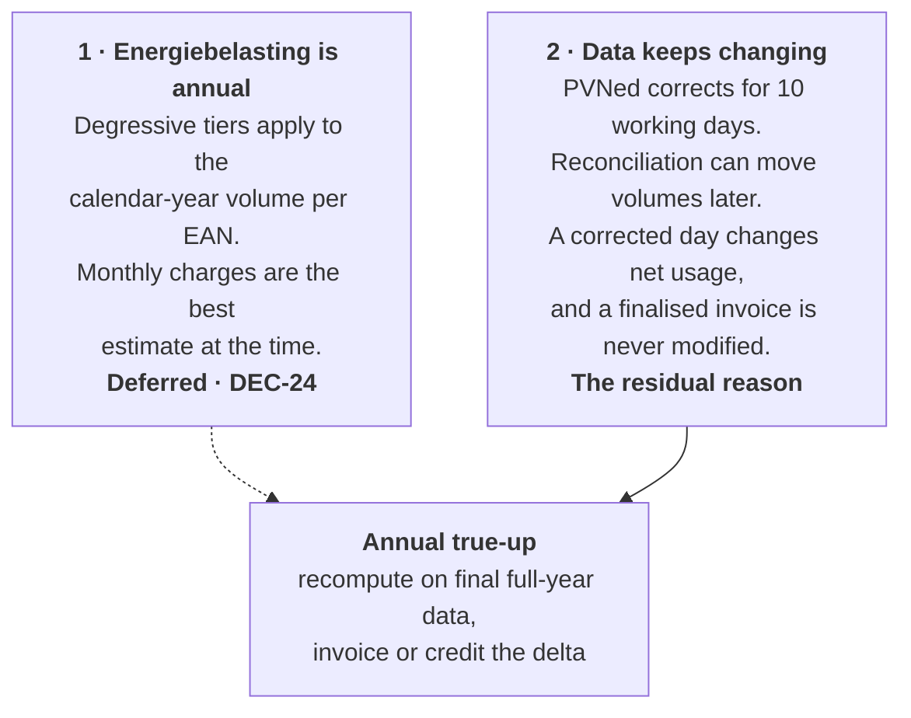
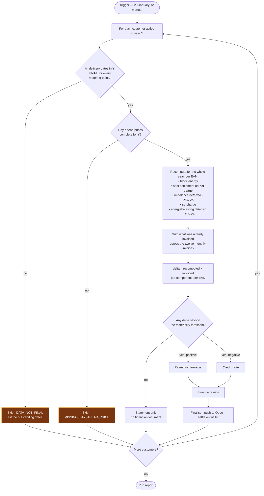
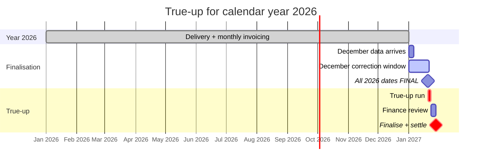
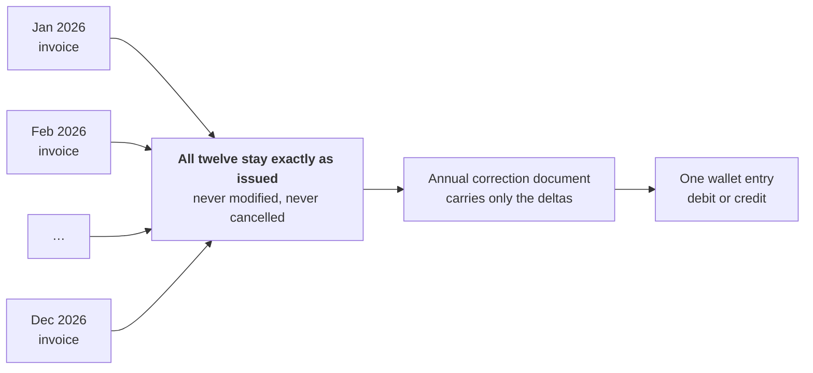

# Process — Annual True-Up

Each January, settle the preceding calendar year against final data.

> **Deferred [DEC-24].** Energiebelasting is out of scope for now, and the annual degressive tiers it
> creates were this run's principal reason to exist — so the run is deferred alongside it. It is
> **not cancelled**: it retains a **residual role**, correcting late metering data (§1.2), and that
> role is the documented destination of the `AFFECTED_BY_CORRECTION` flag set by
> [metering data flow](02-metering-data-flow.md). Nothing described here is implemented in the
> current scope; everything described here is what will be built when it is.
>
> ⚠ **Energiebelasting is a legal obligation, not a feature.** [OQ-14] is closed by deferral only.
> [DEC-24] — and this run with it — must be reopened before a single invoice is issued to a real
> customer.

Feature spec: [F10](../10-features/F10-invoicing-and-settlement.md) §Annual true-up ·
Arithmetic: [Invoice calculation](../50-calculations/03-invoice-calculation.md) §9.

---

## 1. Why it exists

Two independent reasons, either of which would require a true-up on its own. **[DEC-24]** removes the
first for now, which is why the run is deferred rather than deleted — the second one does not go
away.

### 1.1 What the deferral removes, and what it does not

The compounding effect that made this urgent is a **tax** effect and is dormant with **[DEC-24]**: a
late correction to a single day in March used to shift the annual volume, which could shift a tier
boundary crossing, which changed the tax attribution of *every* subsequent month. What survives is
smaller and still real — a corrected day changes net usage for its own month, and therefore that
month's spot settlement and surcharge, on an invoice that will never be modified **[F10-R32]**.

### 1.2 The residual role

[Metering data flow](02-metering-data-flow.md) flags a finalised invoice `AFFECTED_BY_CORRECTION`
when a delivery date inside it changes. The invoice is never modified **[F02-R20]** — the flag is a
claim on a later settlement, and **this run is that settlement**.

| While the run is deferred | When the run is built |
| --- | --- |
| The flag is still set on every affected invoice | The flag is the run's input — flagged invoices identify which customers and months to recompute |
| Every interval version is retained, so the recomputation stays possible **[DEC-07]** | The delta is invoiced or credited under §2 |
| Flagged invoices accumulate and stay flagged. **No settlement path is live** | The correction document resolves the flag; the invoice itself is still never modified **[F10-R32]** |

That the flag has nowhere to go *yet* is a consequence of the deferral, not an oversight — and it is
the reason the deferral has to be temporary.

## 2. The run

**The finality gate is the point of the whole run.** Producing a true-up on data that can still
change would require a true-up of the true-up. A customer failing the gate is skipped with a list of
the outstanding dates and re-run later — 20 January is a default, not a deadline.

The flow is kept whole because it is what will be built. **[DEC-24]** and **[DEC-25]** remove two of
the five recomputed components, not the run's shape; **[DEC-22]** changes the volume basis of the
remainder to net usage.

## 3. Timing

The calendar applies from the first year the run exists. **[DEC-24]** defers it, so no January date
is currently committed.

## 4. What is recomputed

| Component | Recomputed? | Why |
| --- | --- | --- |
| **Energiebelasting** | **Not while [DEC-24] holds** — always, once it returns | The tiers are an annual construct, and were the primary purpose of the run |
| Block energy | If any input changed | Blocks rarely change, but a corrected calendar or a late failed-trade reversal would |
| Spot settlement | If interval data or prices changed | The most common source of a delta — and under **[DEC-22]** it moves with **net usage**, so a corrected *production* series moves it too |
| Imbalance | **Not while [DEC-25] holds** | Never charged, so there is nothing to true up |
| Surcharge | If volumes changed | Volumetric, so it moves with the volume basis |
| VAT | Always, on the recomputed base | Added at document level on a VAT-exclusive base **[DEC-26]** |

## 5. Presentation

The correction document carries **only the deltas**, with a supporting statement showing the working.
A summary section per metering point:

| Component | Invoiced during 2026 | Recomputed | Delta |
| --- | --: | --: | --: |
| Block energy | €248 312.44 | €248 312.44 | €0.00 |
| Day-ahead purchases | €91 204.18 | €92 887.05 | **+€1 682.87** |
| Day-ahead sales | −€18 442.90 | −€18 901.33 | **−€458.43** |
| Imbalance | — | — | **Never charged [DEC-25]** |
| Surcharge | €19 483.60 | €19 561.85 | **+€78.25** |
| Energiebelasting | — | — | **Never charged [DEC-24]** |
| **Subtotal delta** | | | **+€1 302.69** |

Amounts are VAT-exclusive **[DEC-26]**; VAT is added to the correction document as a whole. The
day-ahead sale line carries surplus volume credited at the day-ahead price **[DEC-23]** and is never
netted against the purchase line — which is why both appear here rather than one net figure.

Alongside it, a per-month comparison of the volume that changed, so a customer can see *which* month
moved and by how much. "Your annual bill changed by €1 303" without that breakdown is an invitation
to a long phone call.

## 6. Materiality threshold

A delta below a configurable threshold (default **€25**) produces a statement, not a financial
document **[F10-R33]**. Issuing a €0.40 credit note costs more in processing on both sides than the
amount involved.

The threshold is per customer per year, applied to the absolute total delta, and the statement
records the amount waived so it is visible rather than silently dropped. **[OQ-76]** confirms the
threshold and whether waived amounts should accumulate.

## 7. Interaction with monthly invoices

This keeps the accounting trail linear: twelve invoices plus one correction, rather than twelve
invoices replaced by twelve new ones **[F10-R32]**.

## 8. Edge cases

The tier-dependent cases below are **dormant while [DEC-24] holds** and are kept because they return
with it.

| Case | Behaviour |
| --- | --- |
| Customer joined mid-year | True-up covers only their active period; tiers apply to their actual volume, which may put them in a higher tier band — **tier part dormant [DEC-24]** |
| Customer left mid-year | True-up produced on closure rather than in January; final settlement, then the wallet is refunded or the debt pursued **[OQ-30]** |
| EAN transferred between customers mid-year | Each customer's tier calculation uses only their own period's volume. **Whether that is the correct fiscal treatment is [OQ-77]** — the tax is levied per connection per year, which may mean the two periods should be considered together. **Dormant [DEC-24]; [OQ-77] stays open** |
| An EAN with zero net usage all year | Appears with zero deltas; no document. Zero is a value — an EAN with *missing* data fails the finality gate instead **[DEC-22]** |
| An EAN that exported more than it consumed over the year | Net usage is negative; the recomputation carries the sign through to a sale line rather than clamping it **[DEC-22]**, **[DEC-23]** |
| Tax tariff for the year was revised retroactively | Recompute uses the current tariff version; the delta captures the difference. The statement names the tariff version used — **dormant [DEC-24]** |
| Customer disputes the correction | Full working is available: per-month deltas, per-component, with links to the underlying interval versions |
| Data still not final in March | Customer remains skipped; a standing alert lists them until resolved |

## 9. Monitoring

**Dormant while the run is deferred [DEC-24]** — there is no run to fail to start. Restored with it.

| Check | Alert |
| --- | --- |
| True-up run did not start by 31 January | **P1** |
| Customers skipped for non-final data | P2, with the list |
| Delta above a large threshold (default €10 000) | P2 — review before finalising |
| Delta with the opposite sign to expectation | P2 |
| Any customer without a true-up by 28 February | **P1** |
