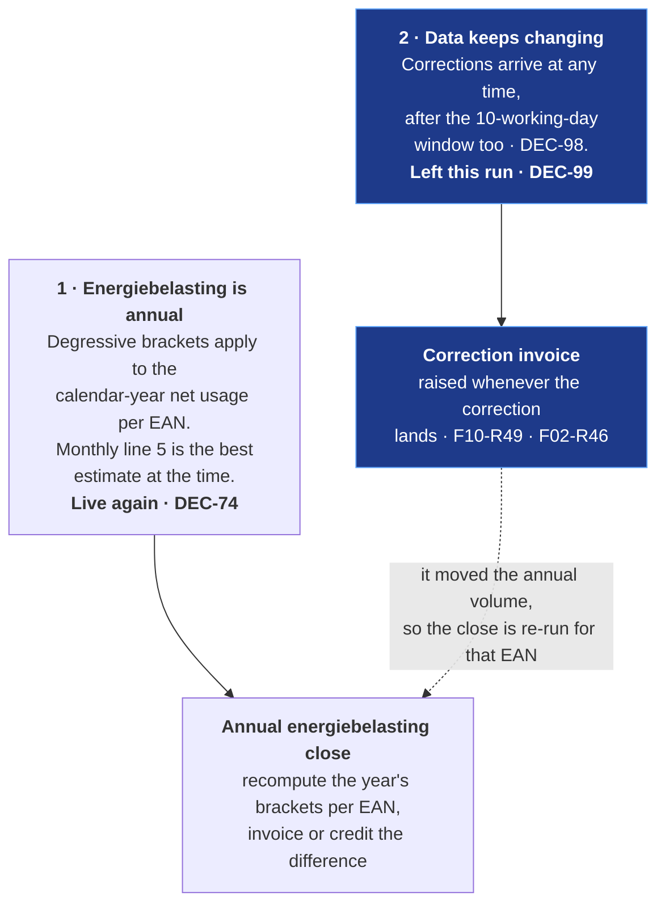
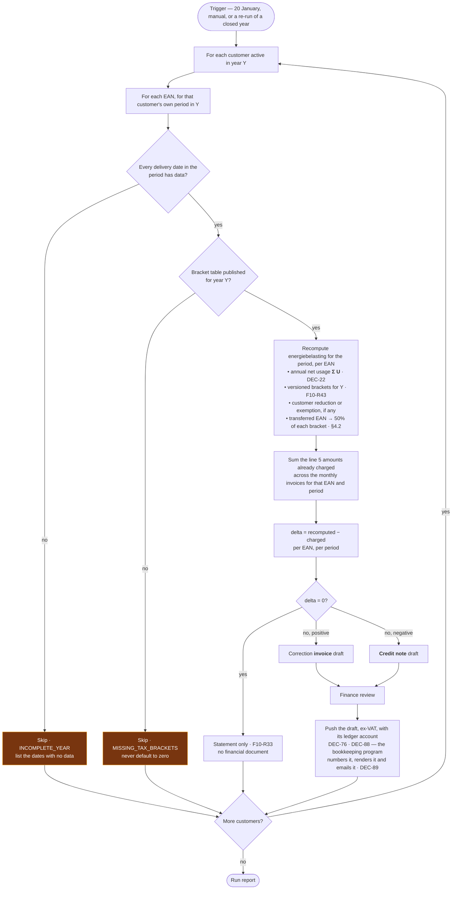
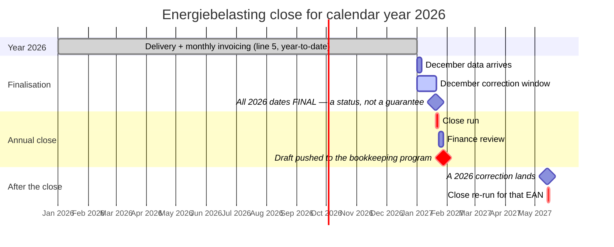
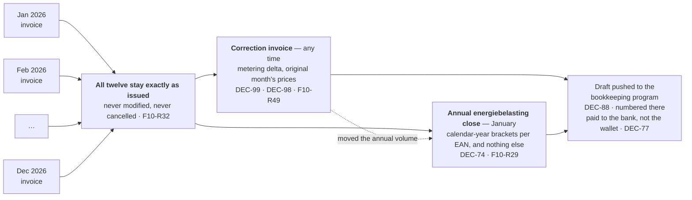

# Process — Annual True-Up

~~Each January, settle the preceding calendar year against final data.~~
⚠ **Amended 2026-08-19 by [DEC-74] and [DEC-99].** Each January, **close the calendar-year
energiebelasting brackets per EAN** for the preceding year. That is the whole job. Correcting late
metering data — the other half of what this run used to do — left it and became **continuous**
**[DEC-99]**. The name is kept because every cross-reference in the set points at it; what it does is
narrower than the name suggests, and §7 draws the line.

> ~~**Deferred [DEC-24].** Energiebelasting is out of scope for now, and the annual degressive tiers it
> creates were this run's principal reason to exist — so the run is deferred alongside it. It is
> **not cancelled**: it retains a **residual role**, correcting late metering data (§1.2), and that
> role is the documented destination of the `AFFECTED_BY_CORRECTION` flag set by
> [metering data flow](02-metering-data-flow.md). Nothing described here is implemented in the
> current scope; everything described here is what will be built when it is.~~
>
> ~~⚠ **Energiebelasting is a legal obligation, not a feature.** [OQ-14] is closed by deferral only.
> [DEC-24] — and this run with it — must be reopened before a single invoice is issued to a real
> customer.~~

> ⚠ **Reversed 2026-08-19 by [DEC-74].** Energiebelasting is **back in scope**, so the run has its
> original reason again and is built rather than deferred: a versioned, editable **bracket table**
> (tier boundaries and €/kWh rates per year), an optional **per-customer reduction or exemption**, and
> a calculation **per EAN per calendar year on net usage [DEC-22]**, pushed as a ledger entry to the
> bookkeeping program **[F10-R43]**, **[F10-R44]**. The warning above was right and is now moot: the
> obligation is met rather than parked.
>
> ⚠ **And narrowed the same day by [DEC-99].** The residual role described below — settling late
> metering corrections in January — is **removed**, because a correction is now invoiced as a delta
> **whenever it lands** **[F10-R49]**, **[F02-R46]**. The run gains its principal reason and loses its
> residual one on the same date. What remains is one calculation that genuinely cannot be done any
> other way, because a bracket is defined per EAN per calendar year.

Feature spec: [F10](../10-features/F10-invoicing-and-settlement.md) §Annual true-up ·
Bracket table: [F09](../10-features/F09-surcharges.md) ·
Arithmetic: [Invoice calculation](../50-calculations/03-invoice-calculation.md) §9 ·
Continuous path: [Monthly invoicing](04-monthly-invoicing.md), [Metering data flow](02-metering-data-flow.md).

---

## 1. Why it exists

~~Two independent reasons, either of which would require a true-up on its own. **[DEC-24]** removes the
first for now, which is why the run is deferred rather than deleted — the second one does not go
away.~~

⚠ **Amended 2026-08-19.** The two reasons are still the two reasons, but each has moved to the
opposite state. Reason 1 is live again **[DEC-74]** and is now the *only* thing this run does.
Reason 2 no longer waits for January **[DEC-99]** and is handled continuously by a correction
invoice. The run is therefore smaller than it was originally specified, and something that never
existed — an always-on correction path — carries the rest.



The dotted edge is the only coupling left between the two paths, and it runs one way: a correction
changes the volume the brackets were applied to, so a close that has already run is re-run for that
EAN and year. A close never triggers a correction invoice for energy.

### 1.1 ~~What the deferral removes, and what it does not~~ ⚠ **Reversed 2026-08-19 by [DEC-74]** — what the reinstatement brings back

~~The compounding effect that made this urgent is a **tax** effect and is dormant with **[DEC-24]**: a
late correction to a single day in March used to shift the annual volume, which could shift a tier
boundary crossing, which changed the tax attribution of *every* subsequent month. What survives is
smaller and still real — a corrected day changes net usage for its own month, and therefore that
month's spot settlement and surcharge, on an invoice that will never be modified **[F10-R32]**.~~

The compounding effect is **live again**, exactly as described above, and it is the reason the annual
close exists at all. A late correction to a single day in March shifts the annual volume, which can
shift a bracket crossing, which changes the tax attribution of *every* subsequent month — because
line 5 is charged as the delta of the year-to-date cumulative tax
([Invoice calculation](../50-calculations/03-invoice-calculation.md) §7.2) and every month after the
crossing was computed from a starting point that has now moved.

That is precisely what cannot be settled month by month, and it is why the continuous correction path
**[DEC-99]** does not absorb it: the correction invoice knows one month's volume and one month's
prices, and a bracket boundary is a property of the whole year. The two amounts a correction produces
are therefore settled in two places — the **energy delta immediately**, the **tax consequence at the
close**.

### 1.2 ~~The residual role~~ ⚠ **Reversed 2026-08-19 by [DEC-99]** — where the flag goes now

~~[Metering data flow](02-metering-data-flow.md) flags a finalised invoice `AFFECTED_BY_CORRECTION`
when a delivery date inside it changes. The invoice is never modified **[F02-R20]** — the flag is a
claim on a later settlement, and **this run is that settlement**.~~

| ~~While the run is deferred~~ | ~~When the run is built~~ |
| --- | --- |
| ~~The flag is still set on every affected invoice~~ | ~~The flag is the run's input — flagged invoices identify which customers and months to recompute~~ |
| ~~Every interval version is retained, so the recomputation stays possible **[DEC-07]**~~ | ~~The delta is invoiced or credited under §2~~ |
| ~~Flagged invoices accumulate and stay flagged. **No settlement path is live**~~ | ~~The correction document resolves the flag; the invoice itself is still never modified **[F10-R32]**~~ |

~~That the flag has nowhere to go *yet* is a consequence of the deferral, not an oversight — and it is
the reason the deferral has to be temporary.~~

The flag still exists and still means the same thing. Its **destination moved**: it is no longer a
claim on a January run, it is the trigger for a correction invoice raised immediately **[F02-R20]**
as amended, **[F02-R46]**, **[F10-R49]**. Nothing accumulates.

| | Old destination — this run | New destination **[DEC-99]** |
| --- | --- | --- |
| Trigger | The January run reads flagged invoices | The version that changes a finalised delivery date |
| Latency | Up to 13 months | Days |
| Priced at | The recomputation's own view of the year | The **original month's** prices **[F10-R49]**, retrievable because day-ahead history is available **[DEC-75]** |
| Volume waived below a floor | €25 default **[DEC-100]** removes it | Nothing is waived, netted or batched **[F10-R50]** |
| What this run still owes the flag | — | Only the **tax** consequence, at the close (§1.1) |

Cost, recorded rather than glossed: the old design had one settlement event per customer per year;
the new one has as many documents as there are corrections, each numbered and manually checked in the
bookkeeping program **[DEC-88]**. The interval-version retention **[DEC-07]** that made the annual
recomputation possible is what makes the continuous one possible too, so nothing is thrown away.

## 2. The run

~~The finality gate is the point of the whole run.~~ ⚠ **Amended 2026-08-19 by [DEC-98]** — see below
the diagram.



**There is no longer a `FINAL`-everywhere gate**, and its removal is the largest change to the shape
of this run. ~~Producing a true-up on data that can still change would require a true-up of the
true-up. A customer failing the gate is skipped with a list of the outstanding dates and re-run later
— 20 January is a default, not a deadline.~~ ⚠ **Amended 2026-08-19 by [DEC-98]**, which reverses
**[DEC-57]**: reconciliation data *does* arrive after the 10-working-day window, sometimes as a manual
process. `FINAL` therefore means "nothing newer arrived inside the window" — a status, not a
guarantee **[F02-R23]** — so a gate demanding it would be waiting for a promise no one makes, and
could postpone the close indefinitely. **[F10-R28]** is retired for this reason.

What replaces it is weaker and honest:

| Precondition | Blocks the close? | Why |
| --- | :--: | --- |
| A delivery date in the period has **no data at all** (`NO_DATA` / `PARTIAL`) | **Yes** — `INCOMPLETE_YEAR` | Absent is not zero **[F02-R25]**. Closing brackets on a year with a hole understates the annual volume and therefore the tax, in the customer's favour and wrongly |
| A delivery date is `PROVISIONAL` rather than `FINAL` | **No** | The close runs on the best data there is. A later version reopens it — the run is **repeatable for a closed year**, which is what makes proceeding safe |
| No bracket row published for year Y | **Yes** — `MISSING_TAX_BRACKETS` | The rates are set annually by the Belastingdienst and loaded as reference data. The engine must not default to zero or to the previous year's rates **[F10-R43]** |
| Day-ahead prices incomplete for Y | ~~Yes — `MISSING_DAY_AHEAD_PRICE`~~ **No** | ⚠ **Removed 2026-08-19 by [DEC-99]** together with the spot recomputation that needed them. Energiebelasting is volume × rate; it reads no price. The condition still matters on the *continuous* path, where a correction is priced at the original month's prices **[F10-R49]**, **[DEC-75]** |

20 January remains a default, not a deadline. A customer skipped for `INCOMPLETE_YEAR` is re-run when
the data arrives, and the standing alert in §9 keeps them visible until it does.

~~The flow is kept whole because it is what will be built. **[DEC-24]** and **[DEC-25]** remove two of
the five recomputed components, not the run's shape; **[DEC-22]** changes the volume basis of the
remainder to net usage.~~ ⚠ **Amended 2026-08-19.** The flow is no longer kept whole: **[DEC-74]**
restores the one component that mattered and **[DEC-99]**, **[DEC-73]** and **[DEC-76]** remove the
rest of them from this run entirely — see §4. **[DEC-25]** still removes imbalance, and **[DEC-22]**
still sets the volume basis to net usage, which is now also the tax basis.

## 3. Timing

~~The calendar applies from the first year the run exists. **[DEC-24]** defers it, so no January date
is currently committed.~~ ⚠ **Amended 2026-08-19 by [DEC-74]** — the run exists, so the calendar
applies from the first full calendar year of delivery.



Two changes from the original calendar. The `FINAL` milestone is an **indicator**, not a gate
**[DEC-98]** — the run starts on 20 January whether or not every date reached it. And the run does not
end at a settlement: it ends at a **push** **[DEC-88]**, after which numbering, the document and the
email are the bookkeeping program's **[DEC-89]**, and the money arrives **at the bank**, never from
the wallet **[DEC-77]**. The last section of the chart is new and is the point of **[DEC-98]**: a
close is not a one-shot event.

## 4. What is recomputed

| Component | Recomputed? | Why |
| --- | --- | --- |
| **Energiebelasting** | ~~**Not while [DEC-24] holds** — always, once it returns~~ ⚠ **Always — [DEC-74] reversed [DEC-24]** | The brackets are an annual construct per EAN **[DEC-22]**, and they are now the **only** reason the run exists. Which bracket a December kWh falls into depends on every kWh before it in the year, so no monthly run can settle it |
| Block energy | ~~If any input changed~~ ⚠ **Not here — [DEC-99]** | A changed input is a correction, and a correction is invoiced when it lands **[F10-R49]**. It is a delta on one month at that month's prices, which needs no annual view |
| Spot settlement | ~~If interval data or prices changed~~ ⚠ **Not here — [DEC-99]** | Same reason, and it was the most common source of a delta — which is exactly why waiting up to 13 months for it was the weak part of the old design |
| Imbalance | **Not while [DEC-25] holds** | Never charged, so there is nothing to true up. Unchanged |
| Surcharge | ~~If volumes changed~~ ⚠ **Gone from the platform — [DEC-73]** | The platform holds no surcharge rate and computes no surcharge amount. It pushes the **volume**; the bookkeeping program multiplies it by the topup fee **[F10-R51]** |
| VAT | ~~Always, on the recomputed base~~ ⚠ **Never — [DEC-76]** | The platform computes **no VAT at all**. It pushes an ex-VAT amount against a ledger account and that account's rate is applied downstream **[F10-R47]** |

One component in, five out. The run that this document originally described recomputed the invoice;
the run that is built recomputes a **tax**.

### 4.1 The arithmetic

Per EAN, per customer period, for year `Y`:

```
annualVolume       = Σ net usage over the period, latest version of every day   [DEC-22]
recomputedTax      = cumulativeTax( annualVolume )                              [F10-R43]
taxAlreadyCharged  = Σ line 5 across the monthly invoices for that EAN and period
taxCorrection      = recomputedTax − taxAlreadyCharged
```

`cumulativeTax` and the bracket table are defined once, in
[Invoice calculation](../50-calculations/03-invoice-calculation.md) §7, and are not restated here.
A per-customer **reduction or exemption** **[DEC-74]** is applied inside `cumulativeTax`, so it
applies identically to the monthly estimate and to the close — a reduction that applied only at the
close would produce twelve wrong invoices and one large credit note.

⚠ Whether the ***vermindering*** — the fixed annual reduction per connection — applies is **not
decided**. It is a fixed credit, so it lands entirely in this calculation and changes the close for
every affected connection. Carried on **[OQ-96]**; nothing here should be built to assume either
answer.

### 4.2 An EAN that transfers between customers mid-year — **[OQ-77] closed**

⚠ ***Closed 2026-08-19 by [DEC-74].*** When an EAN transfers between customers during the year,
**each period gets 50% of each bracket** — a straight half-and-half split of the annual boundaries.
It is **not** a pro-rata by days: a transfer on 15 January and a transfer on 1 July produce the same
halved brackets. This is an annual-run rule and lives here.

| Bracket | Annual band | Width | Half-width, per period | Cumulative boundary, per period |
| --- | --- | --: | --: | --: |
| 1 | 0 – 10 000 kWh | 10 000 | 5 000 | 5 000 |
| 2 | 10 000 – 50 000 kWh | 40 000 | 20 000 | 25 000 |
| 3 | 50 000 kWh – 10 000 000 kWh | 9 950 000 | 4 975 000 | 5 000 000 |
| 4 | above 10 000 000 kWh | unbounded | unbounded | above 5 000 000 |

Boundary check: `5 000 + 20 000 = 25 000`, and `25 000 + 4 975 000 = 5 000 000`, which is exactly half
of the 10 000 000 kWh ceiling of bracket 3. The halved table is the annual table with every width
halved, so it stays a valid degressive schedule.

**Worked example A — transfer on 1 May 2026.** EAN `871685920000123456`, annual net usage
120 000 kWh: customer A takes 30 000 kWh (1 Jan – 30 Apr), customer B takes 90 000 kWh
(1 May – 31 Dec).

| Period | Net usage | In bracket 1 | In bracket 2 | In bracket 3 | Volume check |
| --- | --: | --: | --: | --: | --- |
| A | 30 000 | 5 000 | 20 000 | 5 000 | `5 000 + 20 000 + 5 000 = 30 000` ✓ |
| B | 90 000 | 5 000 | 20 000 | 65 000 | `5 000 + 20 000 + 65 000 = 90 000` ✓ |
| **Both** | **120 000** | **10 000** | **40 000** | **70 000** | `10 000 + 40 000 + 70 000 = 120 000` ✓ |
| One holder all year, for comparison | 120 000 | 10 000 | 40 000 | 70 000 | `120 000 − 50 000 = 70 000` in bracket 3 ✓ |

Tax for A `= 5 000 × rate₁ + 20 000 × rate₂ + 5 000 × rate₃`; for B
`= 5 000 × rate₁ + 20 000 × rate₂ + 65 000 × rate₃`. Their sum is
`10 000 × rate₁ + 40 000 × rate₂ + 70 000 × rate₃`, **identical** to the undivided year. When both
periods clear the halved bracket-2 ceiling of 25 000 kWh, the rule costs nothing.

**Worked example B — transfer on 15 January 2026**, the case where it is not neutral. Same EAN, same
120 000 kWh for the year: A takes 4 000 kWh, B takes 116 000 kWh.

| Period | Net usage | In bracket 1 | In bracket 2 | In bracket 3 | Volume check |
| --- | --: | --: | --: | --: | --- |
| A | 4 000 | 4 000 | 0 | 0 | 4 000 < the halved 5 000 ceiling ✓ |
| B | 116 000 | 5 000 | 20 000 | 91 000 | `5 000 + 20 000 + 91 000 = 116 000` ✓ |
| **Both** | **120 000** | **9 000** | **20 000** | **91 000** | `9 000 + 20 000 + 91 000 = 120 000` ✓ |
| One holder all year | 120 000 | 10 000 | 40 000 | 70 000 | ✓ |
| **Difference** | **0** | **−1 000** | **−20 000** | **+21 000** | `−1 000 − 20 000 + 21 000 = 0` ✓ |

```
Δtax = −1 000 × rate₁ − 20 000 × rate₂ + 21 000 × rate₃
     = −[ 1 000 × (rate₁ − rate₃) + 20 000 × (rate₂ − rate₃) ]
```

Because `rate₁ > rate₂ > rate₃`, `Δtax` is **negative**: the split **under-charges** relative to
treating the connection as one holder for the year, by a quantity that grows with the spread between
the brackets. The rule is chosen for its simplicity — it needs no transfer date and no day count, and
both customers can compute their own bill — and this is what that simplicity costs. It is recorded,
not hidden.

⚠ **Not settled by [DEC-74], flagged for the next session:** whether the same half-and-half split
applies when the *other* period is not on the platform at all — a customer joining mid-year on an EAN
that was with a different supplier before. The decision speaks about a transfer *between customers*,
and the platform can only see one side. Confirm alongside **[OQ-96]**.

## 5. Presentation

~~The correction document carries **only the deltas**, with a supporting statement showing the working.
A summary section per metering point:~~

| ~~Component~~ | ~~Invoiced during 2026~~ | ~~Recomputed~~ | ~~Delta~~ |
| --- | --: | --: | --: |
| ~~Block energy~~ | ~~€248 312.44~~ | ~~€248 312.44~~ | ~~€0.00~~ |
| ~~Day-ahead purchases~~ | ~~€91 204.18~~ | ~~€92 887.05~~ | ~~**+€1 682.87**~~ |
| ~~Day-ahead sales~~ | ~~−€18 442.90~~ | ~~−€18 901.33~~ | ~~**−€458.43**~~ |
| ~~Imbalance~~ | ~~—~~ | ~~—~~ | ~~**Never charged [DEC-25]**~~ |
| ~~Surcharge~~ | ~~€19 483.60~~ | ~~€19 561.85~~ | ~~**+€78.25**~~ |
| ~~Energiebelasting~~ | ~~—~~ | ~~—~~ | ~~**Never charged [DEC-24]**~~ |
| ~~**Subtotal delta**~~ | | | ~~**+€1 302.69**~~ |

~~Amounts are VAT-exclusive **[DEC-26]**; VAT is added to the correction document as a whole.~~

⚠ **Replaced 2026-08-19.** Every line above except energiebelasting has left this document: block and
day-ahead deltas are continuous corrections **[DEC-99]**, the surcharge left the platform
**[DEC-73]**, and no VAT is computed here **[DEC-76]** — the amount is pushed ex-VAT against a ledger
account and the bookkeeping program applies that account's rate **[F10-R47]**. What remains is one
component, and the statement is a **bracket** statement.

Per metering point, for the closed year:

| Bracket | Annual band | Volume in band | Rate | Amount |
| --- | --- | --: | --: | --: |
| 1 | 0 – 10 000 kWh | 10 000 kWh | `rate₁` | `10 000 × rate₁` |
| 2 | 10 000 – 50 000 kWh | 40 000 kWh | `rate₂` | `40 000 × rate₂` |
| 3 | 50 000 kWh – 10 GWh | 4 071 040 kWh | `rate₃` | `4 071 040 × rate₃` |
| 4 | above 10 GWh | 0 kWh | `rate₄` | €0.00 |
| **Annual net usage** | | **4 121 040 kWh** | | **= recomputedTax** |

Volume check: `10 000 + 40 000 + 4 071 040 = 4 121 040` ✓, and `4 121 040 − 50 000 = 4 071 040` is the
part of the year above the bracket-3 floor ✓. Bracket 4 is empty because 4 121 040 < 10 000 000.

The delta, in the same statement:

```
taxAlreadyCharged = cumulativeTax(4 118 640)      the twelve monthly line 5 amounts, which summed
                                                  to the year-to-date volume known at the time
recomputedTax     = cumulativeTax(4 121 040)      the year as it stands now, after a +2 400 kWh
                                                  March correction settled for energy under DEC-99
taxCorrection     = (4 121 040 − 50 000) × rate₃ − (4 118 640 − 50 000) × rate₃
                  = (4 071 040 − 4 068 640) × rate₃
                  = 2 400 × rate₃
```

Both volumes sit inside bracket 3, so the whole difference is charged at `rate₃` and no boundary is
crossed — which is the ordinary case. The interesting case is the one where a boundary *is* crossed,
and the statement then shows both bracket tables side by side, because that is the number a customer
will query.

~~The day-ahead sale line carries surplus volume credited at the day-ahead price **[DEC-23]** and is
never netted against the purchase line — which is why both appear here rather than one net figure.~~
⚠ **Moved 2026-08-19** — day-ahead lines are not part of this document any more **[DEC-99]**; the rule
itself still holds, on the monthly invoice and on every correction invoice **[F10-R31]**.

~~Alongside it, a per-month comparison of the volume that changed, so a customer can see *which* month
moved and by how much.~~ ⚠ **Amended** — a per-month comparison of the **volume** is still shown,
because that is what moved the brackets, but the amount that moved with it was already invoiced
separately when the correction landed. The statement therefore has to name the correction invoices it
depends on, or the customer reconstructs the same figure twice. "Your annual bill changed by €1 303"
without that breakdown is an invitation to a long phone call.

## 6. ~~Materiality threshold~~ — **REMOVED 2026-08-19 by [DEC-100]**

~~A delta below a configurable threshold (default **€25**) produces a statement, not a financial
document **[F10-R33]**. Issuing a €0.40 credit note costs more in processing on both sides than the
amount involved.~~

~~The threshold is per customer per year, applied to the absolute total delta, and the statement
records the amount waived so it is visible rather than silently dropped. **[OQ-76]** confirms the
threshold and whether waived amounts should accumulate.~~

⚠ **There is no materiality threshold.** **[DEC-100]** removes it: every difference is handled
individually, nothing is netted, batched or waived below a value, and the €25 default is **deleted
rather than configured** **[F10-R50]**. **[OQ-76] closes** — there is no threshold to confirm and no
waived amount to accumulate.

| | Before | After **[DEC-100]** |
| --- | --- | --- |
| A €0,40 difference | Statement, amount waived and recorded | A numbered document, with a manual check behind it **[DEC-88]** |
| A €0,00 difference | Statement | **Still a statement** — **[F10-R33]** is untouched. Zero is zero, not "small"; **[DEC-100]** is about *waiving*, and a zero delta has nothing to waive |
| Waived-amount ledger | Required, so nothing vanished silently | **Not built** — nothing is waived |

⚠ Cost, stated plainly because the original rationale was correct and is now overridden: a €0,40
credit note does cost more to process on both sides than the amount involved, and the platform will
now produce one. ⚠ **Interpretation flagged** — **[DEC-100]**'s source comment sits on this row but is
phrased about deposits and withdrawals, so it may be misplaced in the source. Read together with
**[DEC-99]** it gives one consistent rule and is recorded as read. Confirm at the next session.

## 7. Interaction with monthly invoices

~~This keeps the accounting trail linear: twelve invoices plus one correction, rather than twelve
invoices replaced by twelve new ones **[F10-R32]**.~~ ⚠ **Amended 2026-08-19** — the trail is still
linear and monthly invoices are still never modified, but there are now **two** kinds of document
after the twelve, produced by two different mechanisms, and the boundary between them is the point of
this section.



The boundary, stated once:

| | Correction invoice **[DEC-99]** | Annual close **[DEC-74]** |
| --- | --- | --- |
| Trigger | A metering version changes a delivery date already invoiced **[F02-R46]** | The calendar. 20 January for the preceding year, plus a re-run whenever a correction moves a closed year |
| Frequency | Whenever one lands, with no cut-off — months later is the named case | Once a year per customer, plus re-runs |
| Covers | Block energy and day-ahead settlement on the corrected volumes | **Energiebelasting only** |
| Priced at | The **original month's** prices **[DEC-75]** | Volume × bracket rate. It reads no price at all |
| Needs an annual view | No | **Yes** — that is the only reason it is annual |
| Waives small amounts | No **[DEC-100]** | No **[DEC-100]** |
| Settled from the wallet | No **[DEC-77]** | No **[DEC-77]** |

~~One wallet entry, debit or credit.~~ ⚠ **Reversed 2026-08-19 by [DEC-77]**, which reverses
**[AS-12]**: the wallet funds **trading only**. Neither document touches it. Both are pushed as
**drafts** to the bookkeeping program **[DEC-88]**, which numbers them, renders them **[DEC-89]** and
collects payment to the bank. The platform records no payment state for either **[F10-R48]**.

The accounting trail is therefore twelve invoices, plus *n* corrections, plus one close per year —
still linear, and still with no invoice ever rewritten in place **[F10-R32]**.

## 8. Edge cases

~~The tier-dependent cases below are **dormant while [DEC-24] holds** and are kept because they return
with it.~~ ⚠ **Reversed 2026-08-19 by [DEC-74]** — nothing below is dormant. The bracket-dependent
cases are live, and the metering-correction cases have moved to the continuous path.

| Case | Behaviour |
| --- | --- |
| Customer joined mid-year | ~~True-up covers only their active period; tiers apply to their actual volume, which may put them in a higher tier band — **tier part dormant [DEC-24]**~~ ⚠ **Live [DEC-74]**, and refined: where the EAN was **transferred from another customer on the platform**, §4.2's 50%-per-bracket split governs. Where it was not — a genuinely new connection, or one that arrived from another supplier — the close sees one period and applies the **full** annual brackets to it, which is favourable to the customer. Flagged for confirmation with **[OQ-96]** |
| Customer left mid-year | Close produced on closure rather than in January, for their own period. ~~final settlement, then the wallet is refunded or the debt pursued **[OQ-30]**~~ ⚠ **Amended 2026-08-19** — the amount is pushed to the bookkeeping program like any other **[DEC-88]** and is **not** settled from the wallet **[DEC-77]**. A remaining wallet balance is returned through a **withdrawal request** **[DEC-83]**, which is a separate movement with no invoice **[DEC-83]**; blocks still run to the end of their delivery period **[DEC-82]** |
| EAN transferred between customers mid-year | ~~Each customer's tier calculation uses only their own period's volume. **Whether that is the correct fiscal treatment is [OQ-77]** — the tax is levied per connection per year, which may mean the two periods should be considered together. **Dormant [DEC-24]; [OQ-77] stays open**~~ ⚠ **Closed 2026-08-19 by [DEC-74]** — **each period gets 50% of each bracket**, a straight half-and-half split of the annual boundaries, not a pro-rata by days. Worked in §4.2, with the under-charge it produces when one period is short |
| An EAN with zero net usage all year | Appears with a zero delta; statement, no document **[F10-R33]**. Zero is a value — an EAN with *missing* data is skipped `INCOMPLETE_YEAR` instead **[DEC-22]**, **[F02-R25]** |
| An EAN that exported more than it consumed over the year | Net usage is negative; the recomputation carries the sign through **[DEC-22]**, **[DEC-23]**. ⚠ Whether the tax basis nets per interval or is floored at zero is **not settled** — see [Invoice calculation](../50-calculations/03-invoice-calculation.md) §7.3. **[DEC-74]** brings the calculation into scope without answering it, and a negative-usage EAN is exactly where the two readings diverge by the whole export volume |
| Tax bracket table for the year was revised retroactively | Recompute uses the current version of the table; the delta captures the difference. The statement names the version used ~~— **dormant [DEC-24]**~~ ⚠ **live [DEC-74]**, and it is why the table is versioned rather than edited in place **[F10-R43]** |
| A correction lands after the close has run | The close is **re-run for that EAN and year** and the difference is a further correction invoice **[F10-R49]**. It is not a one-shot event **[DEC-98]** — see §3 |
| Customer disputes the correction | Full working is available: the bracket table version, the volume per bracket, the monthly line 5 amounts it is compared against, the correction invoices that moved the volume, and links to the underlying interval versions **[DEC-07]** |
| ~~Data still not final in March~~ Data still **missing** in March | ⚠ **Amended by [DEC-98]** — `PROVISIONAL` no longer blocks anything, so the case is now a day with **no data**. The EAN remains skipped and a standing alert lists it until resolved |
| The bookkeeping push fails | The close is correct and the customer has no document, because the platform never mints a number **[DEC-88]**. Retried with backoff and alerted **[F10-R45]**; recorded here as the failure mode this run inherits from a decision made elsewhere |

## 9. Monitoring

~~**Dormant while the run is deferred [DEC-24]** — there is no run to fail to start. Restored with
it.~~ ⚠ **Restored 2026-08-19 by [DEC-74]** — there is a run, and it settles a legal obligation, so
these are P1s rather than hygiene.

| Check | Alert |
| --- | --- |
| Close run did not start by 31 January | **P1** |
| Customers skipped `INCOMPLETE_YEAR` | P2, with the list of dates |
| EANs skipped `MISSING_TAX_BRACKETS` | **P1** — reference data missing for a year that has already been invoiced monthly |
| Delta above a large threshold (default €10 000) | P2 — review before pushing. ⚠ This is a **review trigger, not a materiality floor**: nothing is waived below it **[DEC-100]** |
| Delta with the opposite sign to expectation | P2 |
| Any customer without a close by 28 February | **P1** |
| A draft rejected or unacknowledged by the bookkeeping program | **P1** — the amount is calculated and uninvoiceable **[DEC-88]**, **[F10-R45]** |
| A closed year re-opened by a correction, with no re-run within 5 working days | P2 — the re-run is the mechanism **[DEC-98]** relies on, so a silent failure of it looks exactly like nothing happening |
