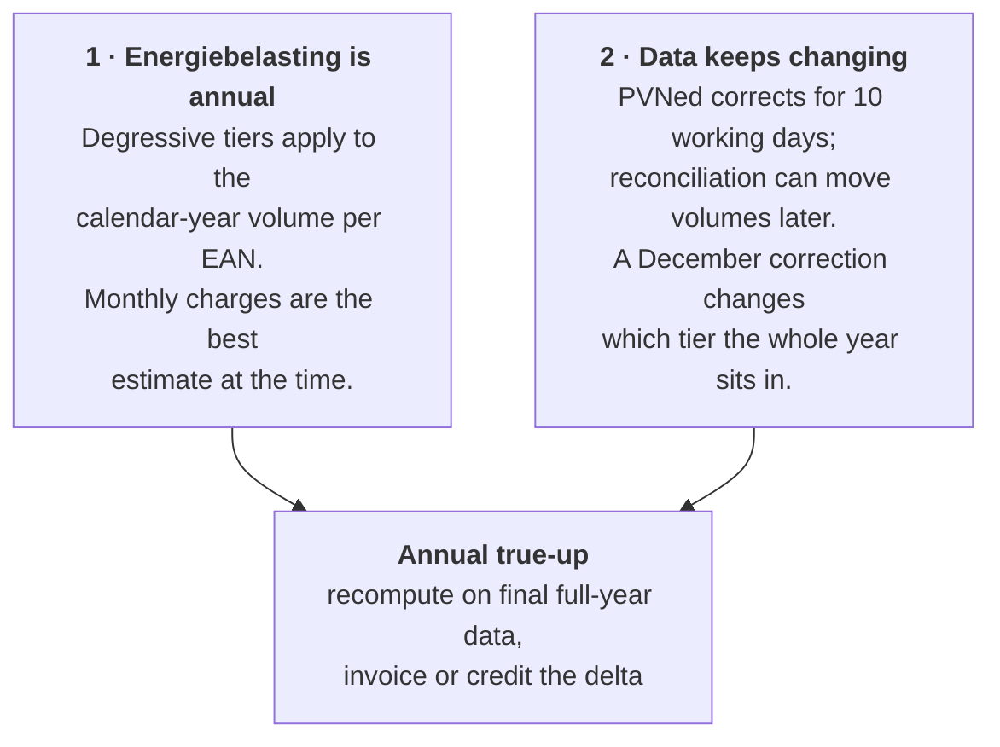
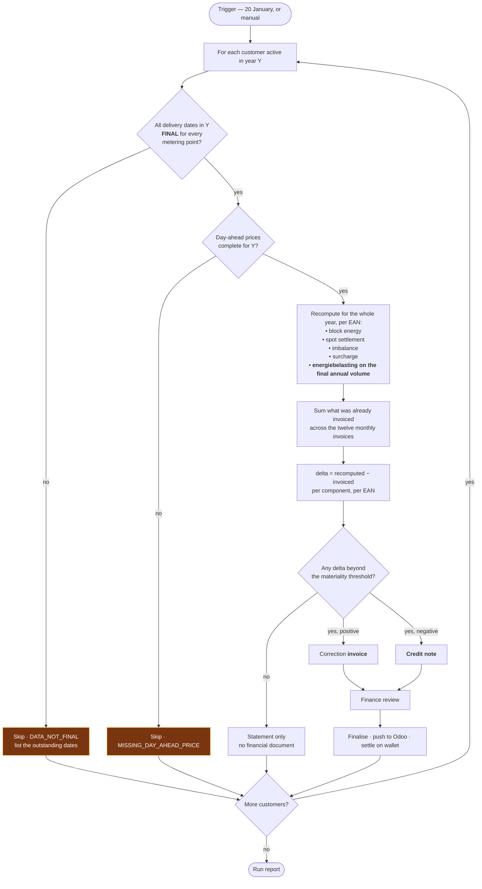
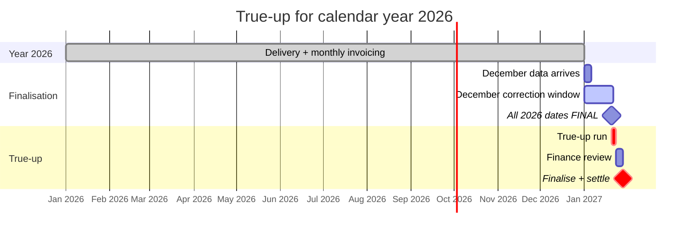
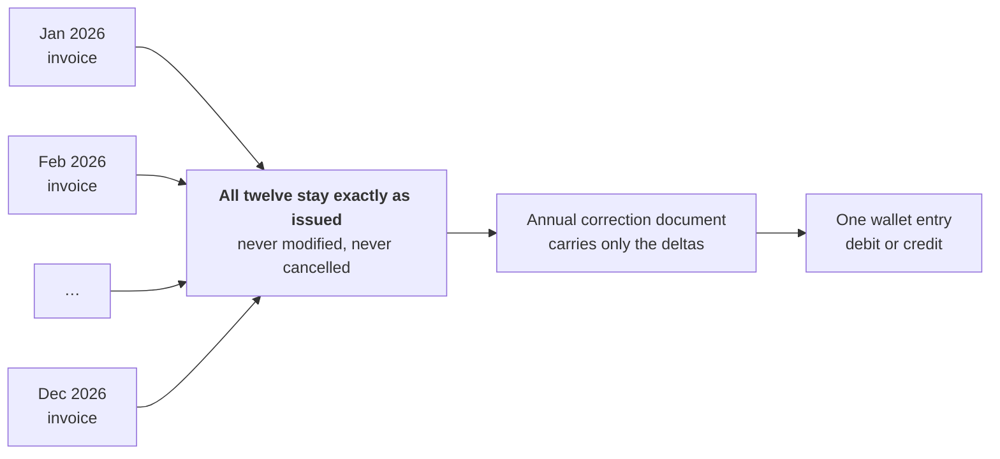

# Process — Annual True-Up

Each January, settle the preceding calendar year against final data.

Feature spec: [F10](../10-features/F10-invoicing-and-settlement.md) §Annual true-up ·
Arithmetic: [Invoice calculation](../50-calculations/03-invoice-calculation.md) §9.

---

## 1. Why it exists

Two independent reasons, both of which would require a true-up on their own.

The second reason is the compounding one: a late correction to a single day in March does not just
change March — it shifts the annual volume, which can shift the tier boundary crossing, which changes
the tax attribution of *every* subsequent month.

## 2. The run

**The finality gate is the point of the whole run.** Producing a true-up on data that can still
change would require a true-up of the true-up. A customer failing the gate is skipped with a list of
the outstanding dates and re-run later — 20 January is a default, not a deadline.

## 3. Timing

## 4. What is recomputed

| Component | Recomputed? | Why |
| --- | --- | --- |
| **Energiebelasting** | **Always** | The tiers are an annual construct — this is the primary purpose |
| Block energy | If any input changed | Blocks rarely change, but a corrected calendar or a late failed-trade reversal would |
| Spot settlement | If interval data or prices changed | The most common source of a delta |
| Imbalance | If imbalance data or the allocation basis changed | |
| Surcharge | If volumes changed | Volumetric, so it moves with consumption |
| VAT | Always, on the recomputed base | |

## 5. Presentation

The correction document carries **only the deltas**, with a supporting statement showing the working.
A summary section per metering point:

| Component | Invoiced during 2026 | Recomputed | Delta |
| --- | --: | --: | --: |
| Block energy | €248 312.44 | €248 312.44 | €0.00 |
| Day-ahead purchases | €91 204.18 | €92 887.05 | **+€1 682.87** |
| Day-ahead sales | −€18 442.90 | −€18 901.33 | **−€458.43** |
| Imbalance | €4 918.22 | €5 002.71 | **+€84.49** |
| Surcharge | €19 483.60 | €19 561.85 | **+€78.25** |
| Energiebelasting | €—  | €— | **[OQ-14]** |
| **Subtotal delta** | | | **+€1 387.18** |

Alongside it, a per-month comparison of the volume that changed, so a customer can see *which* month
moved and by how much. "Your annual bill changed by €1 387" without that breakdown is an invitation
to a long phone call.

## 6. Materiality threshold

A delta below a configurable threshold (default **€25**) produces a statement, not a financial
document **[F10-R33]**. Issuing a €0.40 credit note costs more in processing on both sides than the
amount involved.

The threshold is per customer per year, applied to the absolute total delta, and the statement
records the amount waived so it is visible rather than silently dropped. **[OQ-76]** confirms the
threshold and whether waived amounts should accumulate.

## 7. Interaction with monthly invoices

This keeps the accounting trail linear: twelve invoices plus one correction, rather than twelve
invoices replaced by twelve new ones **[F10-R32]**.

## 8. Edge cases

| Case | Behaviour |
| --- | --- |
| Customer joined mid-year | True-up covers only their active period; tiers apply to their actual volume, which may put them in a higher tier band |
| Customer left mid-year | True-up produced on closure rather than in January; final settlement, then the wallet is refunded or the debt pursued **[OQ-30]** |
| EAN transferred between customers mid-year | Each customer's tier calculation uses only their own period's volume. **Whether that is the correct fiscal treatment is [OQ-77]** — the tax is levied per connection per year, which may mean the two periods should be considered together |
| An EAN with zero consumption all year | Appears with zero deltas; no document |
| Tax tariff for the year was revised retroactively | Recompute uses the current tariff version; the delta captures the difference. The statement names the tariff version used |
| Customer disputes the correction | Full working is available: per-month deltas, per-component, with links to the underlying interval versions |
| Data still not final in March | Customer remains skipped; a standing alert lists them until resolved |

## 9. Monitoring

| Check | Alert |
| --- | --- |
| True-up run did not start by 31 January | **P1** |
| Customers skipped for non-final data | P2, with the list |
| Delta above a large threshold (default €10 000) | P2 — review before finalising |
| Delta with the opposite sign to expectation | P2 |
| Any customer without a true-up by 28 February | **P1** |
