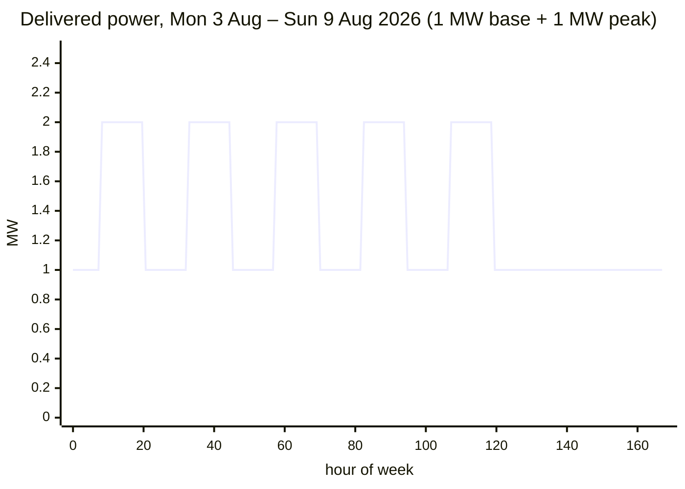
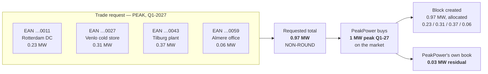

# Energy Block Mathematics

How a purchased block turns into a volume, an amount of money, and a per-interval power profile.
Everything downstream — coverage, invoicing, the chart overlay — depends on getting this right.

---

## 1. The unit of account

The atomic unit throughout the platform is the **15-minute interval**, aligned to
`Europe/Amsterdam` local time.

```
1    MW held for one 15-minute interval  =  0.25   MWh  =  250.0 kWh
0.01 MW held for one 15-minute interval  =  0.0025 MWh  =    2.5 kWh
```

A block is described by three things:

| Property | Example |
| --- | --- |
| **Shape** — `BASE` or `PEAK` | `PEAK` |
| **Delivery period** — a whole month, quarter or calendar year | `Q1-2027` |
| **Power** — constant, **signed** MW for every interval the shape covers | `1.37 MW` — or `-0.46 MW` for a short **[DEC-72]**, §3.6 |

Everything else — total MWh, the money, the chart overlay — is derived.

### 1.1 Granularity — [DEC-70]

Volume is expressed in MW with a **minimum of 0,01 MW and an increment of 0,01 MW**, per
metering-point line and for the request total. Both are reference data with these as the shipped
defaults — **[F05-R08]**.

⚠ **Reverses [DEC-32]** (minimum 0,1 MW, increment 0,1 MW). The step is **ten times finer**, and that
single change propagates through every section below. What it costs, stated once here:

| Consequence | Under ~~[DEC-32]~~ 0,1 MW | Under **[DEC-70]** 0,01 MW |
| --- | --- | --- |
| Smallest tradable base block, August 2026 | `0.1 × 744 h` = 74,4 MWh | `0.01 × 744 h` = **7,44 MWh** |
| Requested totals landing on a whole MW | 1 in 10 reachable totals per clip | **1 in 100** — §5.3 stops being a path worth flagging and becomes the normal one |
| Residual PeakPower carries to the next whole clip | 0…0,9 MW | 0…0,99 MW — no worse in the worst case, but **present on nearly every trade** |
| Per-EAN allocation grid | multiples of 0,1 MW | **multiples of 0,01 MW** |
| Distinct allocations inside one 1 MW clip | ≤ 10 | **≤ 100** |
| Per-EAN rounding residual §5.2 | rarer, larger relative to each line | **routine** — more lines, each smaller, so the largest-remainder correction fires more often |

**The non-whole-MW tail is back.** Under **[DEC-32]** a customer could round their own request to a
tenth and quite often onto a whole clip; at 0,01 MW that stops being practical, so the residual is
the rule rather than the exception and it sits on PeakPower's book. Nothing in the maths gets harder
— every formula below is unchanged. What gets harder is every piece of copy, validation, input mask
and test fixture that hard-codes `0,1`.

## 2. The shape function

For a block `b` and an interval `i`, define the indicator:

```
active(b, i) = 1  if  i ∈ deliveryPeriod(b)  and  inShape(b.shape, i)
             = 0  otherwise

inShape(BASE, i) = 1                        // every interval, 24/7
inShape(PEAK, i) = 1  if  isPeakInterval(i)
                 = 0  otherwise
```

### 2.1 `isPeakInterval`

An interval is a peak interval when **all** of the following hold, evaluated in `Europe/Amsterdam`:

1. Its local start time is at or after `08:00` and strictly before `20:00`.
2. Its local day-of-week is Monday–Friday.
3. Its local date is **not** in the `excluded_dates[]` of the active peak calendar.

**[DEC-19] settles condition 3: public holidays are *not* excluded.** A holiday falling on a
Monday–Friday is a peak day. `excluded_dates[]` is empty for the NL electricity peak calendar, so
condition 3 currently rejects nothing. Closes **[OQ-02]**.

> **Why this mattered.** Exchange-traded Dutch power peak-load products are conventionally defined as
> Monday–Friday 08:00–20:00 **including public holidays**, while the brief stated peak blocks apply
> "only on working days". Billing the customer on a holiday-excluding profile while PeakPower buys a
> holiday-including product would have left PeakPower carrying the difference — roughly 8–9 days a
> year of peak volume, about 3.5% of annual peak volume. **[DEC-19]** takes the exchange convention,
> so the platform's peak volume agrees with the market PeakPower hedges in, and risk R-03 is retired.
>
> **[DEC-14] still stands.** The peak calendar remains reference data — a weekday rule plus an
> exclusion list, per commodity and per year. The list is *empty*, not absent: the answer can still
> change without a code change, and the same calendar must be used for pricing, for invoicing and for
> the chart overlay.

**Confirmed 2026-08-19.** The source restates the rule verbatim — *"Peak is Mo-Fr 08:00 - 20:00"*,
holidays not needed. **[DEC-19]** and **[DEC-14]** are therefore **unchanged** by the 2026-08-19
round, and no decision number is minted for a confirmation. What the confirmation buys is that the
window `08:00`–`20:00`, the weekday set `[MON…FRI]` and the empty `excluded_dates[]` are now agreed
text rather than an inference from exchange convention — the 3,5% of annual peak volume the
holiday question was worth is settled, not assumed.

### 2.2 Peak calendar as reference data

```
peak_calendar
  ├─ code                 e.g. "NL-POWER-PEAK-EXCHANGE" | "NL-POWER-PEAK-WORKDAYS"
  ├─ commodity            ELECTRICITY | GAS
  ├─ window_start         08:00
  ├─ window_end           20:00
  ├─ weekdays             [MON, TUE, WED, THU, FRI]
  └─ excluded_dates[]     per year — empty for the exchange convention
```

**[DEC-19]** makes `NL-POWER-PEAK-EXCHANGE` the active electricity calendar: window `08:00`–`20:00`,
weekdays `[MON…FRI]`, `excluded_dates[] = []` for every year. `NL-POWER-PEAK-WORKDAYS` remains a
valid row shape and is unused — it is what a holiday-excluding contract would need. Keeping the
exclusion list as an empty column rather than deleting the mechanism is what keeps **[DEC-14]** real.

⚠ **Gas is out of scope — [DEC-68]**, which withdraws **[DEC-30]**. The `commodity` column stays,
because **[DEC-15]**'s discriminator stays: it is nearly free to carry now, expensive to retrofit
later, and gas is out *for now* rather than permanently. What goes away is every gas **row** and every
gas-specific rule — there is no gas peak calendar, no gas window, no m³ volume and no calorific
correction anywhere in this document (**[OQ-87]** closed as not applicable, and it reopens with gas).
Every formula below is electricity, in MW and MWh.

Each block records **which calendar version it was priced under**, so a later calendar change never
retroactively alters a settled trade.

## 3. Volume

### 3.1 General form

```
totalMWh(b) = power_MW(b) × Σ_i active(b, i) × 0.25
```

Counting intervals — rather than multiplying days by hours — is what makes DST correct for free.

`power_MW(b)` is a **signed** multiple of 0,01 MW **[DEC-70]**: positive for a BUY, negative for a
short SELL **[DEC-72]**. The interval sum is always unsigned. See §3.6.

### 3.2 Base volume

Base volume equals `power × (hours in the delivery period)`, where "hours" is the **actual** count on
the Amsterdam calendar, not `days × 24`.

| Period | Naïve `days × 24` | Actual | Why |
| --- | --- | --- | --- |
| March 2026 (31 days) | 744 h | **743 h** | Clocks go forward on Sun 29 Mar; 02:00 → 03:00, one hour lost |
| October 2026 (31 days) | 744 h | **745 h** | Clocks go back on Sun 25 Oct; 02:00–03:00 occurs twice |
| Every other month | = | = | No transition |
| Calendar year 2026 | 8 760 h | **8 760 h** | The two transitions cancel |

At 15-minute resolution the same days have **92** and **100** intervals respectively instead of 96.

> Blocks are still *traded* on the market convention for hours; the platform's own volume figure is
> the interval-derived one. Where the two differ (only March and October months, and only by one
> hour), the interval-derived figure is authoritative for coverage and invoicing.

### 3.3 Peak volume

```
peakMWh(b) = power_MW(b) × peakDays(period) × 12
```

`peakDays(period)` is the count of Monday–Friday days in the period, **holidays included [DEC-19]**,
computed from the active calendar — never from a stored count.

Peak volume is not affected by DST: both transitions occur on a Sunday during the night, outside the
08:00–20:00 window. Every peak day contributes exactly 48 intervals.

### 3.4 Worked example

**Customer buys 1 MW base + 1 MW peak for August 2026.**

August 2026 has 31 days, starts on a Saturday, and contains 21 Monday–Friday days
(5 Saturdays, 5 Sundays). No DST transition.

| | Calculation | Result |
| --- | --- | --- |
| Base volume | `1 MW × 31 × 96 intervals × 0.25` | **744 MWh** |
| Peak volume | `1 MW × 21 days × 48 intervals × 0.25` | **252 MWh** |
| Total | | **996 MWh** |

Delivered power profile:

| Interval falls in | Base | Peak | **Total power** |
| --- | --- | --- | --- |
| Mon–Fri 08:00–20:00 | 1 MW | 1 MW | **2 MW** |
| Mon–Fri outside 08:00–20:00 | 1 MW | — | **1 MW** |
| Saturday, Sunday | 1 MW | — | **1 MW** |



**The same month at [DEC-70] granularity: 1,37 MW base + 0,46 MW peak for August 2026.**

| | Calculation | Result |
| --- | --- | --- |
| Base volume | `1.37 MW × 31 days × 96 intervals × 0.25` | **1 019,28 MWh** |
| Peak volume | `0.46 MW × 21 days × 48 intervals × 0.25` | **115,92 MWh** |
| Total | | **1 135,20 MWh** |

The arithmetic is unchanged — only the volumes stop being round. `BASE` and `PEAK` are separate
products, so each is its own block and the clip rounding of §5.3 applies to each: the trader buys
2 MW base and carries **0,63 MW**, and buys 1 MW peak and carries **0,54 MW**, on PeakPower's own
book. Under ~~[DEC-32]~~ the customer could only have asked for 1,4 and 0,5; under **[DEC-70]** the
request matches the site's actual load, and the residual moves to the trader. That transfer is the
whole substance of the decision.

Delivered power profile for that pair:

| Interval falls in | Base | Peak | **Total power** |
| --- | --- | --- | --- |
| Mon–Fri 08:00–20:00 | 1.37 MW | 0.46 MW | **1.83 MW** |
| Mon–Fri outside 08:00–20:00 | 1.37 MW | — | **1.37 MW** |
| Saturday, Sunday | 1.37 MW | — | **1.37 MW** |

### 3.5 Reference: peak days per month

Peak-day counts under the **Mon–Fri, holidays included** convention — which **[DEC-19]** makes the
platform's convention, so these are the counts the platform computes. [OQ-02] is closed; no holiday
subtraction applies.

| 2026 | Mon–Fri days | Peak MWh per MW | | 2027 | Mon–Fri days | Peak MWh per MW |
| --- | --: | --: | --- | --- | --: | --: |
| Jan | 22 | 264 | | Jan | 21 | 252 |
| Feb | 20 | 240 | | Feb | 20 | 240 |
| Mar | 22 | 264 | | Mar | 23 | 276 |
| Apr | 22 | 264 | | Apr | 22 | 264 |
| May | 21 | 252 | | May | 21 | 252 |
| Jun | 22 | 264 | | Jun | 22 | 264 |
| Jul | 23 | 276 | | Jul | 22 | 264 |
| Aug | 21 | 252 | | Aug | 22 | 264 |
| Sep | 22 | 264 | | Sep | 22 | 264 |
| Oct | 22 | 264 | | Oct | 21 | 252 |
| Nov | 21 | 252 | | Nov | 22 | 264 |
| Dec | 23 | 276 | | Dec | 23 | 276 |
| **Year** | **261** | **3 132** | | **Year** | **261** | **3 132** |

> This table is documentation, not an implementation. The platform **must** compute peak days from
> the active calendar at runtime — a hard-coded table silently rots.

Recomputed 2026-08-19 against the Amsterdam calendar: both years are unchanged — 261 Mon–Fri days,
3 132 MWh per MW per year. **[DEC-70]** does not touch this table; it scales it. A 0,01 MW peak block
for December 2026 is `0.01 × 276` = **2,76 MWh**.

### 3.6 Sign — a short position is negative volume [DEC-72]

⚠ **[DEC-72] reverses [DEC-34]**: a customer may sell a block they do not hold. The motivating case
in the source is a customer with solar production selling **expected surplus** — volume they can
forecast but cannot yet prove. Nothing in §3 assumed a non-negative volume, but nothing stated it
either, so it is stated now:

```
power_MW(b)  >  0   for a BUY  block   (the customer takes delivery)
power_MW(b)  <  0   for a SELL block   (the customer owes delivery)
power_MW(b)  ≠  0   always
|power_MW(b)| is a whole multiple of 0.01                        [DEC-70]
```

`totalMWh(b)` carries the sign of `power_MW(b)`; `Σ_i active(b, i) × 0.25` is an unsigned interval
count and never changes. Every formula in §3, §4 and §5 is sign-transparent as written. What is *not*
sign-transparent is the code that consumes them:

| Place | What must not assume a positive volume |
| --- | --- |
| Coverage — [Position and coverage](02-position-and-coverage.md) | A short block **reduces** covered volume for the period. It cannot be clamped at zero, and a customer can be covered *below* zero |
| Money §4 | A negative `totalMWh` on a SELL produces a wallet **credit**, not a debit |
| Allocation §5.2 | `allocation_MW > 0` becomes "same sign as the block, never zero" |
| Rounding §4.1 | Half-**away-from-zero** already handles negatives correctly; half-up would bias every short by a cent in PeakPower's favour |

⚠ What **[DEC-34]** removed and this brings back: a short is a **promise to deliver**, not a spend.
The prepaid wallet **[AS-11]** does not bound it, and the pre-trade balance check **[DEC-41]** does
not either, because that check sizes a *debit* and a short creates none — it credits. No collateral
or exposure rule is decided: **[OQ-94]**. Until that is answered the maths here is complete and the
sell path is not safe to open beyond confirmed holdings.

## 4. Money

```
tradeValue   = totalMWh × price_EUR_per_MWh                              // ex-VAT: quoted, offered, stored
walletAmount = round(totalMWh × price_EUR_per_MWh × (1 + vatRate), 2)    // reserved, then debited
```

- `price` is the offer price from PeakPower, in €/MWh, VAT exclusive **[AS-09]**, **[DEC-26]**.
- ~~`tradeValue` is the amount reserved on acceptance and settled on confirmation **[AS-10]**.~~
  ⚠ **Amended 2026-08-19 by [DEC-78]** — the amount **reserved** on acceptance and **debited** on
  confirmation is `walletAmount`: the trade value grossed up by the **[DEC-64]** rate of **21%**.
- For a **SELL** trade `walletAmount` is **credited** to the wallet on confirmation instead of
  debited — and it is the gross figure on that side too, because the wallet holds VAT-inclusive cash
  in both directions **[DEC-78]**. Under **[DEC-72]** a SELL no longer requires a holding, so this is
  now also the path a short takes; see §3.6 and **[OQ-94]**.
- Reservation and debit are the **same stored number**, never two calculations **[F05-R70]**. A VAT
  rate change between acceptance and confirmation therefore cannot open a gap.

**Why the quote is ex-VAT and the hold is gross.** ⚠ **[DEC-76]** confirms and extends **[DEC-26]**:
every price, balance and pushed amount in the platform is VAT-exclusive, and the platform computes
**no VAT at all** for accounting purposes — it pushes ex-VAT amounts against a ledger account and the
bookkeeping program applies that account's rate. **[DEC-64]** (21%, every line, no exemptions) is
superseded as a *platform behaviour* and kept as the *reference rate*, because **[DEC-78]** needs a
rate to gross up with. The gross-up is a **sizing rule for a wallet hold**, not a tax calculation: it
produces no VAT line, no VAT ledger entry and no VAT anywhere in this document.

The exposure this closes is arithmetic, not theoretical. An ex-VAT reservation under-covers its own
debit by exactly the VAT rate, and **[DEC-41]** deliberately takes the pre-trade check at **100% of
the estimate with no buffer** — there is nothing to absorb the shortfall:

| One block: 1,37 MW **base**, August 2026, at €82,5000/MWh | Amount |
| --- | --: |
| `totalMWh` (§3.4) | 1 019,28 MWh |
| `tradeValue` — ex-VAT, what the customer is quoted **[DEC-26]** | € 84 090,60 |
| VAT at 21% **[DEC-64]** — never a line, only a factor | € 17 659,03 |
| `walletAmount` — reserved at acceptance, debited at confirmation **[DEC-78]** | **€ 101 749,63** |
| Shortfall if the reservation had been sized ex-VAT | € 17 659,03 — **21%** of the trade |

⚠ **Compute the gross-up once, at full precision.** `walletAmount` is a single rounding of
`totalMWh × price × 1.21`, **not** 1,21 × the rounded `tradeValue`. The two differ by a cent whenever
the ex-VAT product has a third decimal — the §5.2 worked split below is such a case
(€ 85 744,38 against € 85 744,39). Rounding twice makes the reservation and the debit disagree, which
is precisely what **[F05-R70]** forbids.

This resolves the exposure **[OQ-83]** raised, in the direction it feared. ⚠ It does **not** make the
wallet an invoice-settlement account: **[DEC-77]** reverses **[AS-12]**, so the wallet funds trading
only. Monthly day-ahead, export and energiebelasting amounts are pushed to the bookkeeping program as
a draft invoice **[DEC-88]** and paid to the bank — see
[Invoice calculation](03-invoice-calculation.md) §8.

### 4.1 Rounding

| Stage | Precision |
| --- | --- |
| `power_MW`, `allocation_MW` | **Signed**, and always a whole multiple of `0.01` **[DEC-70]** — two decimals of *meaning*. ~~6 decimals — enough for a 0.001 MW allocation split across many EANs.~~ ⚠ **Amended 2026-08-19 by [DEC-70]**: stored at 6 decimals as headroom, but a third non-zero decimal is **invalid input**, not a rounding case. There is no sub-increment allocation to split |
| `totalMWh` | 6 decimals, computed, never rounded intermediately. Carries the sign of `power_MW` §3.6 |
| `price` | 4 decimals (€/MWh), ex-VAT **[DEC-26]** |
| `tradeValue` | computed at full precision; **rounded half-away-from-zero to 2 decimals** for display and as the target of the per-EAN split §5.2. ⚠ **Amended 2026-08-19 by [DEC-78]** — it is no longer itself a wallet movement |
| `walletAmount` | **one** rounding, half-away-from-zero to 2 decimals, of `totalMWh × price × (1 + vatRate)` **[DEC-78]**, **[F05-R70]**. Never `1.21 × round(tradeValue)` — see §4 |
| Per-EAN split | see §5.2 |

Half-**away-from-zero** rather than half-up matters now that `totalMWh` can be negative **[DEC-72]**:
half-up rounds −0,005 to −0,00 and would shave a cent off every short in PeakPower's favour.

## 5. Bundling across metering points

A trade request names **one or more metering points with a volume each**. The market trade is a single
block; the platform tracks a per-metering-point allocation of it.

### 5.1 Why bundling exists

Wholesale blocks trade in whole MW ("clips"). A customer with four sites states what each one needs;
PeakPower buys the whole clip and carries the difference.

⚠ **Rewritten 2026-08-19 for [DEC-70].** Under ~~[DEC-32]~~ the four sites could only be described in
tenths — `0.2 + 0.3 + 0.4 + 0.1` — which summed to a clean 1 MW and made bundling look tidy. At
0,01 MW the customer states the volume the site actually needs, the total lands off the clip, and the
residual becomes PeakPower's position rather than a rounding the customer was forced to accept.



The block is recorded at **0,97 MW** — the volume sold to the customer — not at the 1 MW bought on the
market. The 0,03 MW never appears in the customer's position, coverage or invoice.

### 5.2 Allocation invariants

```
Σ allocation_MW(b, m)  over all m  ==  power_MW(b)           exact, no drift
allocation_MW(b, m)    ≠  0                                   for every listed m
sign(allocation_MW(b, m)) == sign(power_MW(b))                for every listed m
allocation_MW(b, m) mod 0.01 == 0                             [DEC-70]
```

⚠ **Amended 2026-08-19.** ~~`allocation_MW(b, m) > 0`~~ was written when a block could only be a
purchase. **[DEC-72]** permits short selling, so an allocation on a SELL block is negative; the
invariant that survives is **non-zero and same-signed as the block**. A block with mixed signs is
rejected: it would be two trades, and netting them inside one block would hide a short. **[DEC-70]**
adds the third invariant — every allocation sits on the 0,01 MW grid, so there is no sub-increment
remainder to distribute in *volume*. All remainder handling is in *money*.

Per-metering-point volume and value:

```
mwh(b, m)   = allocation_MW(b, m) × Σ_i active(b,i) × 0.25
value(b, m) = mwh(b, m) × price
```

The per-EAN values are rounded to 2 decimals with a **largest-remainder** correction so that
`Σ value(b, m)` equals the rounded `tradeValue` exactly. The correction is applied to the allocation
with the **largest absolute value** — absolute, because on a short block every allocation is negative
and "largest" would otherwise pick the smallest position.

**Worked split — the §5.1 request at €95,1234/MWh.** Q1-2027 peak is 21 + 20 + 23 = **64** Mon–Fri
days (§3.5), so 64 × 12 = **768 MWh per MW**, and 0,97 MW × 768 = **744,96 MWh**.

| EAN | Allocation | MWh | Exact value | Rounded | Corrected |
| --- | --: | --: | --: | --: | --: |
| …0011 Rotterdam DC | 0,23 MW | 176,64 | € 16 802,597376 | € 16 802,60 | € 16 802,60 |
| …0027 Venlo cold store | 0,31 MW | 238,08 | € 22 646,979072 | € 22 646,98 | € 22 646,98 |
| …0043 Tilburg plant | 0,37 MW | 284,16 | € 27 030,265344 | € 27 030,27 | **€ 27 030,26** |
| …0059 Almere office | 0,06 MW | 46,08 | € 4 383,286272 | € 4 383,29 | € 4 383,29 |
| **Total** | **0,97 MW** | **744,96** | **€ 70 863,128064** | € 70 863,14 ✗ | **€ 70 863,13** ✓ |

Rounding each line independently overshoots `tradeValue` by € 0,01. The correction takes that cent
off the largest allocation — Tilburg — so the lines sum to the rounded total exactly. At 0,01 MW
granularity a request carries more lines, each smaller, so this correction fires far more often than
it did under ~~[DEC-32]~~; it is routine machinery, not an edge case.

The wallet hold for this trade is `round(744.96 × 95.1234 × 1.21, 2)` = **€ 85 744,38** **[DEC-78]**.
Note that `1.21 × € 70 863,13` gives € 85 744,39 — one cent more. The full-precision route is the
authoritative one (§4.1); the per-EAN split is ex-VAT and is **not** the base for the gross-up.

### 5.3 Non-round totals

A requested total that is not a whole MW is **allowed**. The rounding problem moves to PeakPower's
side: the trader buys a whole clip and carries the residual on PeakPower's own book. The platform:

- accepts the request as entered;
- flags it on the trade desk as `NON-ROUND` with the residual to the next whole MW;
- records the block at the volume actually sold to the customer, not the volume bought on the market.

~~Minimum request size is reference data, defaulting to `0.1 MW` — see **[OQ-08]**.~~
⚠ **Amended 2026-08-19 by [DEC-70]**, which **closes [OQ-08]** and reverses **[DEC-32]**: minimum
request size and increment are both **0,01 MW**, still held as reference data with those as the
shipped defaults **[F05-R08]**.

⚠ **This section stops being worth flagging.** On the tenth-MW grid 9 of every 10 reachable totals
inside a clip were already non-round; on the hundredth-MW grid it is **99 of every 100**, and a
customer can no longer conveniently round their own request up to a clip without over-buying by up to
0,99 MW. So:

| | Under ~~[DEC-32]~~ | Under **[DEC-70]** |
| --- | --- | --- |
| Frequency of the `NON-ROUND` flag | common (9 in 10) | **near-universal (99 in 100)** |
| Trade-desk treatment | an exception to look at | a **column**, not an alert — a flag on almost every row draws no attention |
| Customer-facing copy | a warning | quiet information next to the total, stated once **[F05-R07]** |
| PeakPower's aggregate residual | a few tenths, few trades | many small residuals — the trader's netting across customers matters more than any single one |

The residual itself is no larger in the worst case (just under 1 MW either way). What changed is how
often it exists, and therefore that the trade desk must be built to net residuals routinely rather
than to handle them as events.

## 6. Multi-period products

A quarter or calendar-year block is stored as **one block** with a delivery period spanning the whole
range, not as three or twelve monthly blocks.

```
Q1-2027 base, 1 MW
  intervals = Jan (31×96) + Feb (28×96) + Mar (31×96 − 4)     [spring forward 28 Mar 2027]
            = 2976 + 2688 + 2972
            = 8636 intervals
  volume    = 8636 × 0.25 = 2159 MWh
```

Invoicing then attributes the portion of the block falling inside each invoice month — see
[Invoice calculation](03-invoice-calculation.md) §3.

### 6.1 A block outlives the contract — [DEC-82]

**A block runs to the end of its delivery period whatever happens to the contract.** Offboarding does
not unwind it, transfer it or mark it to market. **Closes [OQ-29]**.

The mechanism is already in the model, which is why the decision costs nothing to implement: once the
contract ends there is no metering data for the EAN, so covered volume is **zero**, so the **entire**
remaining block volume is surplus and settles at the day-ahead price under **[DEC-23]**. No new state,
no unwind path, no early-termination price.

Worked, on the Q1-2027 base block above — 1 MW, 2 159 MWh — with the contract ending 31 January 2027:

| Segment | Intervals | Block MWh | Metering data | Settlement |
| --- | --: | --: | --- | --- |
| 1–31 Jan 2027 | 2 976 | 744,00 | present | Covered volume against usage; the remainder surplus at day-ahead **[DEC-23]** |
| 1 Feb – 31 Mar 2027 | 5 660 | 1 415,00 | **none** | **100% surplus**, entirely at day-ahead **[DEC-23]** |
| **Total** | **8 636** | **2 159,00** | | |

⚠ **What it costs the customer, stated plainly.** The block was paid for at the block price when the
trade confirmed **[DEC-78]**; after the contract ends they receive the day-ahead value for volume
they can no longer consume. The difference between the two is theirs, in either direction. That is
the point of the decision — the position is a financial commitment, not a service that ends with the
contract — but it means offboarding must show the customer the open blocks and their delivery
periods, not just a closing balance.

⚠ **Mirrored for a short block** §3.6, recorded as a consequence rather than a separate decision: with
no metering data there is no production to deliver, so the whole negative volume settles at day-ahead
too. A contract that ends leaves an unhedged short running to the end of its period, which is
precisely the exposure **[OQ-94]** has to size.

## 7. Implementation notes

1. **One calendar service.** A single component owns interval ↔ timestamp conversion, `Pos`
   mapping, peak evaluation and DST-aware interval counting. Nothing else does date arithmetic.
2. **Precompute the interval spine.** A `calendar_interval` table with one row per 15-minute interval
   per year (`~35 040 rows/year`), carrying local date, `Pos`, `is_peak` per calendar, and DST flags.
   Coverage and invoicing then become joins instead of per-row date logic.
3. **Never trust `days × 24`.** Nor `24 × 4` intervals per day. Both are wrong twice a year.
4. **Property-based tests** for: total intervals per year, the two DST days, peak counts per month,
   allocation summing exactly, and per-EAN rounding summing to the total. Added 2026-08-19: every
   allocation lands on the **0,01 MW grid** and shares the block's sign **[DEC-70]**, **[DEC-72]**;
   the per-EAN correction picks the largest allocation **by absolute value**; and `walletAmount` is
   **one** rounding of the full-precision gross product, never `1.21 ×` a rounded subtotal
   **[DEC-78]**. Generate negative volumes and third-decimal inputs deliberately — both are new
   failure modes this round created.
5. **One money number reaches the wallet.** `tradeValue` is for quoting and for the per-EAN split;
   `walletAmount` is the only figure the wallet ever sees, on both the reserve and the debit side
   **[F05-R70]**. Keep them distinct in the type system, not by convention — they differ by 21% and
   both are `decimal`.

## 8. Open questions raised here

| Ref | Question | Status |
| --- | --- | --- |
| ~~[OQ-02]~~ | ~~Do peak blocks exclude public holidays, and who owns the holiday list?~~ | ✅ **Closed by [DEC-19]** — they are not excluded; a weekday holiday is a peak day, and `excluded_dates[]` is empty. **Re-confirmed 2026-08-19** verbatim: *"Peak is Mo-Fr 08:00 - 20:00"*, holidays not needed. No new decision number; **[DEC-14]** and **[DEC-19]** are unchanged (§2.1) |
| ~~[OQ-08]~~ | ~~What is the minimum and the increment for a requested volume?~~ | ✅ **Closed by [DEC-70]** — minimum **0,01 MW**, increment **0,01 MW**, both reference data with those shipped defaults **[F05-R08]**. ⚠ Reverses **[DEC-32]**; consequences in §1.1, §3.4, §5.1, §5.2, §5.3 |
| ~~[OQ-10]~~ | ~~Can a customer sell a block they do not hold (short), and if so, who authorises it?~~ | ✅ **Closed by [DEC-72]** — yes, short selling is permitted, motivated by a customer selling expected solar surplus. No authorisation flag and no holdings check **[F05-R69]**; volume is simply signed §3.6. ⚠ Reverses **[DEC-34]**, and hands the residual on as **[OQ-94]** |
| **[OQ-94]** | What collateral or exposure limit applies to a short position? | 🟠 **Open — raised by [DEC-72]**. The maths here is complete and sign-transparent; the risk is not bounded by anything in this document. The prepaid wallet **[AS-11]** and the pre-trade check **[DEC-41]** size a *debit*, and a short creates a **credit** and a delivery obligation §3.6. **[DEC-82]** makes it worse in one specific case: a short outlives the contract that would otherwise have produced the volume §6.1. Needed before the sell path opens beyond confirmed holdings |

Nothing else in this document is open. Three of this file's questions closed on 2026-08-19; the one
new question it inherits is **[OQ-94]**, and it is the only thing here that can still change a number.
For completeness, decisions from that round that landed on this file without opening anything:
**[DEC-68]** (gas out, discriminator stays, §2.2), **[DEC-78]** (gross reservation, §4),
**[DEC-82]** (blocks outlive the contract, §6.1).
