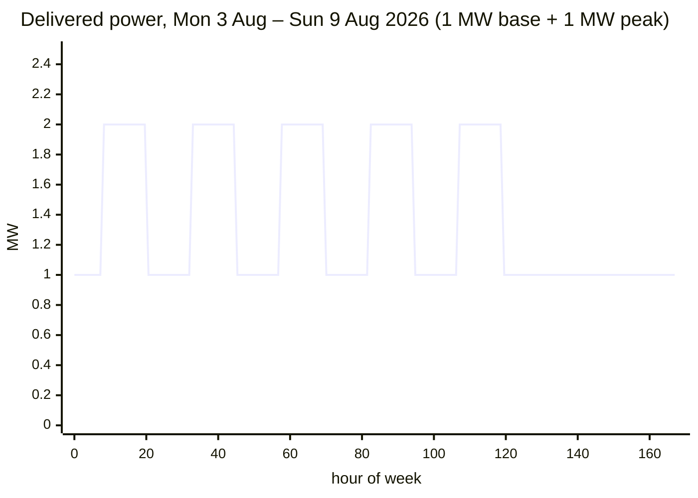
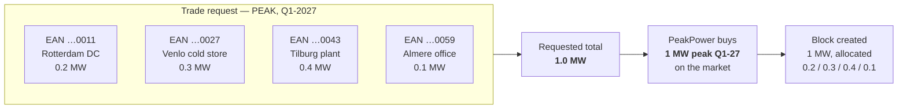

# Energy Block Mathematics

How a purchased block turns into a volume, an amount of money, and a per-interval power profile.
Everything downstream — coverage, invoicing, the chart overlay — depends on getting this right.

---

## 1. The unit of account

The atomic unit throughout the platform is the **15-minute interval**, aligned to
`Europe/Amsterdam` local time.

```
1 MW held for one 15-minute interval  =  0.25 MWh  =  250 kWh
```

A block is described by three things:

| Property | Example |
| --- | --- |
| **Shape** — `BASE` or `PEAK` | `PEAK` |
| **Delivery period** — a whole month, quarter or calendar year | `Q1-2027` |
| **Power** — constant MW for every interval the shape covers | `1.5 MW` |

Everything else — total MWh, the money, the chart overlay — is derived.

## 2. The shape function

For a block `b` and an interval `i`, define the indicator:

```
active(b, i) = 1  if  i ∈ deliveryPeriod(b)  and  inShape(b.shape, i)
             = 0  otherwise

inShape(BASE, i) = 1                        // every interval, 24/7
inShape(PEAK, i) = 1  if  isPeakInterval(i)
                 = 0  otherwise
```

### 2.1 `isPeakInterval`

An interval is a peak interval when **all** of the following hold, evaluated in `Europe/Amsterdam`:

1. Its local start time is at or after `08:00` and strictly before `20:00`.
2. Its local day-of-week is Monday–Friday.
3. Its local date is **not** excluded by the active peak calendar.

Condition 3 is the unresolved part. See **[OQ-02]**.

> **Why this matters more than it looks.** Exchange-traded Dutch power peak-load products are
> conventionally defined as Monday–Friday 08:00–20:00 **including public holidays**. The brief
> states peak blocks apply "only on working days". If the platform bills the customer on a
> holiday-excluding profile while PeakPower buys a holiday-including product, PeakPower carries the
> difference — roughly 8–9 days a year of peak volume, which is about 3.5% of annual peak volume.
> That is a real P&L exposure, not a rounding detail.
>
> **[DEC-14]** makes this a data-driven choice: the peak calendar is reference data, so the answer
> can change per year and per commodity without a code change. But the answer must be made
> explicitly, and the same calendar must be used for pricing, for invoicing and for the chart
> overlay.

### 2.2 Peak calendar as reference data

```
peak_calendar
  ├─ code                 e.g. "NL-POWER-PEAK-EXCHANGE" | "NL-POWER-PEAK-WORKDAYS"
  ├─ commodity            ELECTRICITY | GAS
  ├─ window_start         08:00
  ├─ window_end           20:00
  ├─ weekdays             [MON, TUE, WED, THU, FRI]
  └─ excluded_dates[]     per year — empty for the exchange convention
```

Each block records **which calendar version it was priced under**, so a later calendar change never
retroactively alters a settled trade.

## 3. Volume

### 3.1 General form

```
totalMWh(b) = power_MW(b) × Σ_i active(b, i) × 0.25
```

Counting intervals — rather than multiplying days by hours — is what makes DST correct for free.

### 3.2 Base volume

Base volume equals `power × (hours in the delivery period)`, where "hours" is the **actual** count on
the Amsterdam calendar, not `days × 24`.

| Period | Naïve `days × 24` | Actual | Why |
| --- | --- | --- | --- |
| March 2026 (31 days) | 744 h | **743 h** | Clocks go forward on Sun 29 Mar; 02:00 → 03:00, one hour lost |
| October 2026 (31 days) | 744 h | **745 h** | Clocks go back on Sun 25 Oct; 02:00–03:00 occurs twice |
| Every other month | = | = | No transition |
| Calendar year 2026 | 8 760 h | **8 760 h** | The two transitions cancel |

At 15-minute resolution the same days have **92** and **100** intervals respectively instead of 96.

> Blocks are still *traded* on the market convention for hours; the platform's own volume figure is
> the interval-derived one. Where the two differ (only March and October months, and only by one
> hour), the interval-derived figure is authoritative for coverage and invoicing.

### 3.3 Peak volume

```
peakMWh(b) = power_MW(b) × peakDays(period) × 12
```

Peak volume is not affected by DST: both transitions occur on a Sunday during the night, outside the
08:00–20:00 window. Every peak day contributes exactly 48 intervals.

### 3.4 Worked example

**Customer buys 1 MW base + 1 MW peak for August 2026.**

August 2026 has 31 days, starts on a Saturday, and contains 21 Monday–Friday days
(5 Saturdays, 5 Sundays). No DST transition.

| | Calculation | Result |
| --- | --- | --- |
| Base volume | `1 MW × 31 × 96 intervals × 0.25` | **744 MWh** |
| Peak volume | `1 MW × 21 days × 48 intervals × 0.25` | **252 MWh** |
| Total | | **996 MWh** |

Delivered power profile:

| Interval falls in | Base | Peak | **Total power** |
| --- | --- | --- | --- |
| Mon–Fri 08:00–20:00 | 1 MW | 1 MW | **2 MW** |
| Mon–Fri outside 08:00–20:00 | 1 MW | — | **1 MW** |
| Saturday, Sunday | 1 MW | — | **1 MW** |



### 3.5 Reference: peak days per month

Peak-day counts under the **Mon–Fri, holidays included** convention. If [OQ-02] resolves to exclude
holidays, subtract the holidays falling on a weekday.

| 2026 | Mon–Fri days | Peak MWh per MW | | 2027 | Mon–Fri days | Peak MWh per MW |
| --- | --: | --: | --- | --- | --: | --: |
| Jan | 22 | 264 | | Jan | 21 | 252 |
| Feb | 20 | 240 | | Feb | 20 | 240 |
| Mar | 22 | 264 | | Mar | 23 | 276 |
| Apr | 22 | 264 | | Apr | 22 | 264 |
| May | 21 | 252 | | May | 21 | 252 |
| Jun | 22 | 264 | | Jun | 22 | 264 |
| Jul | 23 | 276 | | Jul | 22 | 264 |
| Aug | 21 | 252 | | Aug | 22 | 264 |
| Sep | 22 | 264 | | Sep | 22 | 264 |
| Oct | 22 | 264 | | Oct | 21 | 252 |
| Nov | 21 | 252 | | Nov | 22 | 264 |
| Dec | 23 | 276 | | Dec | 23 | 276 |
| **Year** | **261** | **3 132** | | **Year** | **261** | **3 132** |

> This table is documentation, not an implementation. The platform **must** compute peak days from
> the active calendar at runtime — a hard-coded table silently rots.

## 4. Money

```
tradeValue = totalMWh × price_EUR_per_MWh
```

- `price` is the offer price from PeakPower, in €/MWh, VAT exclusive **[AS-09]**.
- `tradeValue` is the amount reserved on acceptance and settled on confirmation **[AS-10]**.
- For a **SELL** trade the value is credited to the wallet on confirmation instead of debited.

### 4.1 Rounding

| Stage | Precision |
| --- | --- |
| `power_MW` | 6 decimals — enough for a 0.001 MW allocation split across many EANs |
| `totalMWh` | 6 decimals, computed, never rounded intermediately |
| `price` | 4 decimals (€/MWh) |
| `tradeValue` | computed at full precision, **rounded half-away-from-zero to 2 decimals** once, at the point it becomes a wallet movement |
| Per-EAN split | see §5.2 |

## 5. Bundling across metering points

A trade request names **one or more metering points with a volume each**. The market trade is a single
block; the platform tracks a per-metering-point allocation of it.

### 5.1 Why bundling exists

Wholesale blocks trade in whole MW ("clips"). A customer needing 0.2 + 0.3 + 0.4 + 0.1 MW across four
sites is buying one clean 1 MW clip. The customer specifies the split; PeakPower buys the round
number.



### 5.2 Allocation invariants

```
Σ allocation_MW(b, m)  over all m  ==  power_MW(b)          exact, no drift
allocation_MW(b, m)    >  0                                  for every listed m
```

Per-metering-point volume and value:

```
mwh(b, m)   = allocation_MW(b, m) × Σ_i active(b,i) × 0.25
value(b, m) = mwh(b, m) × price
```

The per-EAN values are rounded to 2 decimals with a **largest-remainder** correction so that
`Σ value(b, m)` equals the rounded `tradeValue` exactly. The correction is applied to the largest
allocation.

### 5.3 Non-round totals

A requested total that is not a whole MW is **allowed**. The rounding problem moves to PeakPower's
side: the trader buys a whole clip and carries the residual on PeakPower's own book. The platform:

- accepts the request as entered;
- flags it on the trade desk as `NON-ROUND` with the residual to the next whole MW;
- records the block at the volume actually sold to the customer, not the volume bought on the market.

Minimum request size is reference data, defaulting to `0.1 MW` — see **[OQ-08]**.

## 6. Multi-period products

A quarter or calendar-year block is stored as **one block** with a delivery period spanning the whole
range, not as three or twelve monthly blocks.

```
Q1-2027 base, 1 MW
  intervals = Jan (31×96) + Feb (28×96) + Mar (31×96 − 4)     [spring forward 28 Mar 2027]
            = 2976 + 2688 + 2972
            = 8636 intervals
  volume    = 8636 × 0.25 = 2159 MWh
```

Invoicing then attributes the portion of the block falling inside each invoice month — see
[Invoice calculation](03-invoice-calculation.md) §3.

## 7. Implementation notes

1. **One calendar service.** A single component owns interval ↔ timestamp conversion, `Pos`
   mapping, peak evaluation and DST-aware interval counting. Nothing else does date arithmetic.
2. **Precompute the interval spine.** A `calendar_interval` table with one row per 15-minute interval
   per year (`~35 040 rows/year`), carrying local date, `Pos`, `is_peak` per calendar, and DST flags.
   Coverage and invoicing then become joins instead of per-row date logic.
3. **Never trust `days × 24`.** Nor `24 × 4` intervals per day. Both are wrong twice a year.
4. **Property-based tests** for: total intervals per year, the two DST days, peak counts per month,
   allocation summing exactly, and per-EAN rounding summing to the total.

## 8. Open questions raised here

| Ref | Question |
| --- | --- |
| [OQ-02] | Do peak blocks exclude public holidays, and who owns the holiday list? |
| [OQ-08] | What is the minimum and the increment for a requested volume? |
| [OQ-10] | Can a customer sell a block they do not hold (short), and if so, who authorises it? |
