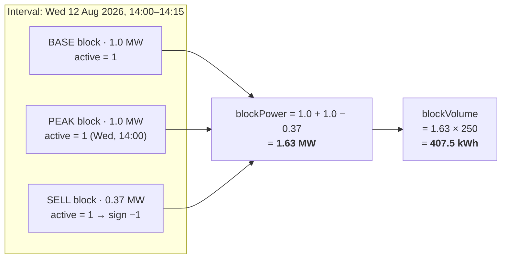

# Position & Coverage

How measured consumption, measured production, purchased blocks and market prices combine into a
per-interval position. This is the model behind the chart overlay, the "am I covered?" question, and
the energy lines on the invoice.

> ⚠ **Updated 2026-08-19.** Four decisions of that round land in this document:
>
> | Decision | What it does here |
> | --- | --- |
> | **[DEC-87]** | Reverses the second half of **[DEC-44]**. Export is credited at the **raw day-ahead price**, not a feed-in tariff. §1's identity and §5's pricing return to a single sale term; §5.3 and invoice line 6 are withdrawn; §6's arithmetic is redone. **[OQ-86]** closes |
> | **[DEC-72]** | Reverses **[DEC-34]**. Short selling is permitted, so `blockVolume < 0` is reachable: the §4 clamp becomes load-bearing, §5's two legs can fire in the same interval, and §8's gates stop implying "no data, no position". The exposure is unbounded — **[OQ-94]** |
> | **[DEC-70]** | Reverses **[DEC-32]**. Allocation granularity is **0,01 MW**, so the interval volume quantum is **2,5 kWh** — §3.2 |
> | **[DEC-99]** | With **[DEC-98]**: corrections arrive at any time, so `FINAL` is not terminal and no delivery date closes permanently — §8 |
>
> Also applied: **[DEC-73]** (the surcharge leaves the platform, taking the last €/kWh rate off this
> page with it), **[DEC-75]** (day-ahead history is backfillable, closing **[OQ-16]**), **[DEC-112]**
> (the production expectation is the customer's declaration) and **[DEC-82]** (a block outlives the
> contract). **[DEC-22]** and **[DEC-23]** are **unchanged** and now carry the export case too.

---

## 1. The core identity

For every 15-minute interval `i` and metering point `m`:

```
netUsage(i,m)     =  consumption(i,m)  −  production(i,m)          [DEC-22]
netPosition(i,m)  =  netUsage(i,m)     −  blockVolume(i,m)
```

**[DEC-22] makes net usage the platform's volume basis**, superseding **[AS-06]**: production nets
against consumption instead of being displayed only. Coverage, the net position, the spot settlement
and the invoice are all measured against net usage. Closes [OQ-11].

| Sign of `netUsage` | Meaning |
| --- | --- |
| `> 0` | **Net import** — the site drew more from the grid than it generated |
| `= 0` | Generation exactly matched consumption |
| `< 0` | **Net export** — generation exceeded consumption. ~~Settled at the **feed-in tariff** on its own invoice line **[DEC-44]**, not at day-ahead~~ ⚠ **Reversed 2026-08-19 by [DEC-87]** — credited at the **raw day-ahead price** of the interval, on the same sale leg as unused cover **[DEC-23]** |

| Sign of `netPosition` | Meaning | Settlement |
| --- | --- | --- |
| `> 0` | **Short** — net usage exceeded the hedge | Buy the shortfall at the day-ahead price |
| `= 0` | Perfectly covered | Nothing settles at spot |
| `< 0` | **Long** — hedged more than the net usage | Sell the surplus at the raw day-ahead price **[DEC-23]**. ~~Any **physical export** inside that surplus leaves the day-ahead leg and settles at the feed-in tariff **[DEC-44]**~~ ⚠ **Reversed 2026-08-19 by [DEC-87]** — export does not leave the day-ahead leg |

~~**[DEC-44] splits the sale side and partially reopens [DEC-23].** Over-covered volume is no longer one
settlement. Unused block cover still settles at the raw day-ahead price of the interval; physically
exported volume — net usage below zero — is separated out and settled at a per-customer **feed-in
tariff** as invoice line 6. The split is derived in §4 and priced in §5.~~
⚠ **Reversed 2026-08-19 by [DEC-87]** — the second half of **[DEC-44]** only.

**[DEC-87] puts the sale side back together.** Exported volume is credited at the **raw day-ahead
price** for the interval, exactly as unused cover is under **[DEC-23]**. There is no feed-in tariff,
no per-customer feed-in rate and no invoice line 6; the sale leg of line 2 carries unused cover *and*
export at one price. What it costs is a commercial instrument PeakPower never got to use — export is
priced entirely by the market, and there is no lever on it. What it buys is one price source instead
of two, no tariff to resolve, and no month that can be skipped because a rate is missing: **[OQ-86]**
closes with the tariff and `MISSING_FEED_IN_TARIFF` is removed. Unused cover and export are still
*counted* separately — see §4 — because they are different physical events and the customer needs to
see how much actually left the meter **[F10-R41]**. They are no longer *priced* separately.

The first half of **[DEC-44]** is untouched and still closes **[OQ-35]**: day-ahead settlement uses the
**raw** price, with no spread, on the purchase leg and the sale leg alike.

⚠ **[DEC-72] makes the block position itself able to go negative.** Short selling is permitted, so
`blockVolume(i,m)` may be below zero on a metering point holding no offsetting buy — not as an
accident of allocation but as a deliberate sale of volume the customer does not hold. Every formula
below already carries `sign(SELL) = −1`, so no new term is needed; what changes is that the `B < 0`
quadrant is now **reachable in production** rather than unreachable by validation, and the clamps and
caveats written in §4 as free insurance are now load-bearing. Nothing in the platform bounds the
exposure that creates — see **[OQ-94]**.

Everything else in this document is bookkeeping around those two lines.

## 2. Inputs

| Input | Source | Resolution | Notes |
| --- | --- | --- | --- |
| `consumption(i,m)` | PVNed allocation data, `Direction = A02` | 15 min, kWh | Gross, non-negative **[AS-05]**. The current version for that delivery date **[DEC-07]** |
| `production(i,m)` | PVNed allocation data, `Direction = A01` | 15 min, kWh | Gross, non-negative **[AS-05]**. **Nets against consumption [DEC-22]** — supersedes [AS-06], closes [OQ-11] |
| `netUsage(i,m)` | Derived from the two series above | 15 min, kWh | `consumption − production`. **May be negative.** See §2.1 |
| `blockVolume(i,m)` | Confirmed blocks | Derived | See §3 |
| `dayAheadPrice(i)` | Montel | Per market time unit | **Raw price, no spread [DEC-44]**, closing [OQ-35]. See §5. Arrives 18:00 Europe/Amsterdam **[DEC-36]**; history is available for backfill **[DEC-75]**. ⚠ **Since [DEC-87] it prices the export leg too**, so an exporting interval with no price is now as blocking as an importing one — §5.2 |
| ~~`feedInRate(customer, i)`~~ | ~~`billing.feed_in_tariff` reference data~~ | ~~Per validity period~~ | ~~**€/kWh, signed [DEC-44]** — same shape and resolution rules as the surcharge. See §5.3~~ ⚠ **Removed 2026-08-19 by [DEC-87]** — no feed-in tariff, so no rate to look up and no table to keep. The surcharge it was modelled on left the platform with **[DEC-73]** |
| `imbalance` | PVNed imbalance report | 15 min, portfolio level | **Deferred by [DEC-25]** — `A12` documents are stored, not turned into charges. See [Invoice calculation](03-invoice-calculation.md) §5 |

### 2.1 Net usage is derived, never stored as a source series

Consumption and production remain two separate, non-negative series per metering point **[AS-05]**.
`netUsage` is computed from them per interval; neither series is overwritten with a signed value, and
both stay available for the chart and for the invoice's own volume check.

**Zero is a value; missing is not — and it propagates.** If either the consumption or the production
interval is missing, `netUsage` for that interval is **missing**, not the other series' value. A
derived figure is never more complete than its least complete input. See §8.

One distinction the implementation must make explicitly: a metering point with no production
registration has no `A01` series at all, which is *not* a missing interval — production is
structurally zero there. Whether production is expected must be a recorded property of the metering
point, not inferred from the absence of a document. Inferring it makes a genuine ingestion gap look
like a zero, which is precisely what §8 exists to prevent.

**[DEC-112] names the owner of that property.** The customer declares at onboarding whether a
connection produces; SJV and profile fractions are available to sanity-check the declaration, not to
generate it. The property still defaults to `UNKNOWN`, and `UNKNOWN` is still treated as `EXPECTED`
for completeness alerting **[F02-R32]** — the safe direction, because it raises a false alarm rather
than hiding a gap.

## 3. Block volume per interval

```
blockPower(i,m)  =  Σ over confirmed blocks b:
                       sign(b) × allocation_MW(b, m) × active(b, i)

blockVolume(i,m) =  blockPower(i,m) × 250          // kWh, since 1 MW × 15 min = 250 kWh

where sign(BUY) = +1 and sign(SELL) = −1
```

`active(b, i)` is the shape function from [Energy block maths](01-energy-block-maths.md) §2.

Only blocks in state `CONFIRMED` contribute. Requests, offers and accepted-but-unconfirmed trades are
shown on the chart as a **provisional** overlay but are excluded from every settlement calculation.

**The sum may be negative [DEC-72].** Short selling is permitted, so a metering point can carry a
`SELL` allocation with no offsetting `BUY` for the same intervals. `blockPower(i,m) < 0` is a normal
state, not a data error, and §4 says what the coverage metrics do with it.

### 3.1 Stacking

Blocks stack additively. A customer holding 1 MW base + 1 MW peak on the same metering point has
2 MW of cover during peak intervals:



The 0,37 MW sell line is drawn deliberately: it is legal under **[DEC-70]** and would not have been
under **[DEC-32]**, and it makes both the block power and the interval volume non-whole, which is now
the ordinary case rather than the awkward one.

### 3.2 Granularity — 0,01 MW **[DEC-70]**

`allocation_MW(b, m)` is a whole multiple of **0,01 MW**. ⚠ **[DEC-32]**'s 0,1 MW minimum and
increment are **reversed 2026-08-19 by [DEC-70]** — ten times finer. Nothing in the formula above
changes, because it never assumed a whole MW; what changes is the smallest volume the engine has to
represent exactly.

| At 0,01 MW granularity | Consequence for this calculation |
| --- | --- |
| `blockPower(i,m)` is a multiple of 0,01 MW | `blockVolume(i,m)` is a multiple of **2,5 kWh** — `0,01 MW × 250 kWh/MW = 2,5 kWh` — where **[DEC-32]** made it a multiple of 25 kWh |
| Per-EAN allocations rarely sum to a whole MW | The non-whole-MW tail is back, at a tenth of the size **[DEC-32]** gave it. The split across metering points is the largest-remainder rule in [Energy block maths](01-energy-block-maths.md) §5.2, applied at **2 decimals of MW** |
| A 0,37 MW allocation is legal | It was not under **[DEC-32]**. Per interval it is `0.37 × 250 = 92,5 kWh` — a half-kWh figure in every one of the day's 96 intervals |

**Do not round the per-interval volume to whole kWh.** Half of all legal allocations produce a
volume ending in 0,5 kWh, so whole-kWh rounding is wrong by 0,5 kWh in those intervals — up to
`0,5 × 96 × 30 = 1 440 kWh` over a 30-day month if the allocation lands on a half throughout. Keep
interval volumes in kWh with at least one decimal, or in MWh with four; the money rounding stays where
[Energy block maths](01-energy-block-maths.md) §4.1 puts it, at the end.

## 4. Coverage metrics

Derived from `netUsage` and `netPosition` for presentation. Writing `U = netUsage(i,m)` and
`B = blockVolume(i,m)`, and noting that **[DEC-22]** allows `U < 0`:

```
covered(i,m)      = min( max(U, 0), max(B, 0) )
uncovered(i,m)    = max( max(U, 0) − B, 0 )          → day-ahead purchase   line 2
unusedCover(i,m)  = max( B − max(U, 0), 0 )          → day-ahead sale       line 2   [DEC-44]
exported(i,m)     = max( −U, 0 )                     → day-ahead sale       line 2   [DEC-87]
saleVolume(i,m)   = unusedCover(i,m) + exported(i,m) → day-ahead sale       line 2   [DEC-87]
overCovered(i,m)  = max( −netPosition(i,m), 0 )  =  max( B − U, 0 )
```

`uncovered` and `unusedCover` are the positive and the negative part of one quantity,
`max(U,0) − B`, so at most one of them is non-zero in any interval. ~~`overCovered` is retained as the
sum of `unusedCover` and `exported` — it is no longer a settlement quantity in its own right.~~
⚠ **Amended 2026-08-19 by [DEC-87] and [DEC-72].** The quantity that settles on the sale leg is
`saleVolume`, and `overCovered` equals it **only while `B ≥ 0`**; where the block position is net
short **[DEC-72]** the two differ by `|B|`, because the customer must buy back the volume they sold
while the meter's own export is credited in full. `overCovered` is kept as a *reporting* figure — the
"how long am I?" number — and is never used to price a line.

> **On `uncovered`.** It was written `max( U − B, 0 )`, the positive part of the net position, and the
> two forms agree everywhere except one quadrant. The clamped form above is the one to implement; the
> reason is in the warning below.

**What changed under [DEC-22], and what did not.** Only `covered` needed a new clamp then. `uncovered`
and `overCovered` were the positive and the negative part of the net position, which is why they kept
behaving correctly once net usage could go negative: an exporting interval has nothing to buy
(`uncovered = 0`), and its export was added to the surplus (`overCovered = B + |U|`). `covered`
without the outer clamp would return the negative net usage itself, which is meaningless: covered
volume is volume that never reaches the spot market, and an exporting interval has none.

~~**What [DEC-44] changed.** `overCovered` is no longer a settlement quantity — it is the *sum* of two
quantities that now settle at different prices:~~ ⚠ **Amended 2026-08-19 by [DEC-87]** — the two
quantities settle at the **same** price again. The decomposition itself survives:

```
saleVolume(i,m)   =  unusedCover(i,m)  +  exported(i,m)          always      [DEC-87]
overCovered(i,m)  =  unusedCover(i,m)  +  exported(i,m)          when B ≥ 0  [DEC-44]
```

`unusedCover` is block cover the site did not use, sold back at the raw day-ahead price **[DEC-23]**.
`exported` is electricity that physically left the meter, ~~credited at the feed-in tariff
**[DEC-44]**~~ credited at the **same raw day-ahead price [DEC-87]**. No definition was withdrawn:
`overCovered` and `exported` are unchanged, `unusedCover` is new, and `uncovered` keeps the clamp.

**Why keep the split when both halves price alike.** Three reasons, none of them pricing. It is the
only place the customer sees how much energy physically left the meter **[F10-R41]**; it is what makes
the sale leg explainable rather than an unexplained aggregate of two different physical events
**[F10-R35]**; and it cannot be recovered after the fact from a stored total, because the split
depends on the sign of `U` interval by interval — §9, note 2.

**Verification of the identity, case by case.** Taking `B ≥ 0`, which the three cases below assume:

| Case | `overCovered = max(B−U,0)` | `unusedCover = max(B−max(U,0),0)` | `exported = max(−U,0)` | `unusedCover + exported` | |
| --- | --- | --- | --- | --- | :--: |
| `U ≥ 0`, `B ≤ U` | `0` | `max(B−U,0) = 0` | `0` | `0` | ✓ |
| `U ≥ 0`, `B > U` | `B − U` | `max(B−U,0) = B−U` | `0` | `B − U` | ✓ |
| `U < 0` | `B − U = B + \|U\|` | `max(B−0,0) = B` | `\|U\|` | `B + \|U\|` | ✓ |

~~The `U < 0` line is the whole point of **[DEC-44]**: the surplus that **[DEC-23]** treated as one
`B + |U|` block sold at day-ahead is now `B` at day-ahead and `|U|` at the feed-in tariff.~~
⚠ **Reversed 2026-08-19 by [DEC-87]** — the `U < 0` line is back to what **[DEC-23]** always said: the
whole `B + |U|` is sold at the day-ahead price. The decomposition into `B` and `|U|` stays computed,
because the two are different physical events and the invoice prints both **[F10-R41]**; it no longer
decides a price. ⚠ The three rows still assume `B ≥ 0`; **[DEC-72]** makes the fourth case real, and
it is worked below.

> ⚠ **The identity fails in one quadrant: `U < 0` together with `B < 0`.** A net **sell** block
> position in an exporting interval breaks it, because `exported` then counts export volume that the
> sold block has already committed. Take `B = −100`, `U = −250`: `overCovered = 150`,
> `unusedCover = 0`, `exported = 250`, and `0 + 250 ≠ 150`. The volume identity in
> [Invoice calculation](03-invoice-calculation.md) §11.1 fails with it, by the same 100 kWh.
>
> **The fix is one clamp**, and it changes nothing anywhere else:
>
> ```
> uncovered(i,m) = max( max(U, 0) − B, 0 )        instead of  max( U − B, 0 )
> ```
>
> The two agree whenever `U ≥ 0`, and whenever `B ≥ 0` they are both zero for `U < 0`. They differ
> only in the `U < 0 ∧ B < 0` quadrant, and with the clamp in place the volume identity holds for
> every sign of `U` and `B` — see the proof in [Invoice calculation](03-invoice-calculation.md) §11.1.
>
> ~~Under **[DEC-34]** short selling is not permitted and sell requests validate against confirmed
> holdings, so per-interval `B < 0` should be unreachable. The row is nonetheless still documented
> below, and the clamp costs nothing.~~ ⚠ **Reversed 2026-08-19 by [DEC-72]** — short selling **is**
> permitted and the sell path no longer validates against holdings **[F05-R69]**, so `B < 0` is an
> ordinary production state and this quadrant is reachable by a customer, deliberately, on the first
> day the sell path opens. The clamp stops being free insurance and becomes the thing that keeps the
> invoice's volume identity true for a real invoice. **Implement the clamped form**; there is no
> longer a trading rule standing behind it even in theory.
>
> With the clamp and the **[DEC-87]** sale leg, the same counter-example balances:
> `B = −100`, `U = −250` gives `uncovered = 100`, `unusedCover = 0`, `exported = 250`,
> `saleVolume = 250`, and `B + uncovered − saleVolume = −100 + 100 − 250 = −250 = U` ✓. The customer
> buys back the 100 kWh they sold and is credited for the 250 kWh that left the meter, both at the
> same raw day-ahead price — two legs, one price, no netting **[DEC-23]**.
>
> ⚠ What the clamp does **not** do is bound the risk. A short position can be entered with an empty
> wallet, because a short is a promise to deliver rather than a spend **[AS-11]**, **[DEC-41]**. That
> is **[OQ-94]**, and it is open.

Behaviour by case:

| `netUsage` | `blockVolume` | `covered` | `uncovered` | `overCovered` | `unusedCover` | `exported` | Reading |
| --- | --- | --: | --: | --: | --: | --: | --- |
| `U > 0` | `B ≥ U` | `U` | `0` | `B − U` | `B − U` | `0` | Hedged, with cover to spare; the spare is sold at day-ahead |
| `U > 0` | `0 ≤ B < U` | `B` | `U − B` | `0` | `0` | `0` | Partly hedged; the rest is bought at spot |
| `U = 0` | `B ≥ 0` | `0` | `0` | `B` | `B` | `0` | Nothing used; the whole block is sold back at day-ahead |
| `U < 0` | `B ≥ 0` | `0` | `0` | `B + \|U\|` | `B` | `\|U\|` | **Export.** Cover sold at day-ahead **[DEC-23]**; ~~the exported volume credited at the feed-in tariff **[DEC-44]**~~ ⚠ **[DEC-87]** — the exported volume credited at the **same** day-ahead price, on the same sale leg |
| any | `B < 0` | `0` | `max( max(U,0) − B, 0 )` | `max(B − U, 0)` | `0` | `max(−U, 0)` | Net **sell** position: no cover exists to be "covered", and the sold volume must be bought back at day-ahead on the purchase leg. ⚠ **Reachable since [DEC-72]** — see the caveat above. `overCovered` here is `max(B − U, 0)`, which is *not* the sale volume |

Invariants, with `uncovered` in the clamped form defined above:

```
covered, uncovered, overCovered, unusedCover, exported, saleVolume  ≥  0    always
uncovered(i,m) × unusedCover(i,m)  =  0                              at most one of the two is non-zero
uncovered(i,m) − unusedCover(i,m)  =  max( U, 0 ) − B                always            [DEC-44]
uncovered(i,m) − saleVolume(i,m)   =  netPosition(i,m)  =  U − B     always            [DEC-87]
uncovered(i,m) − overCovered(i,m)  =  netPosition(i,m)               when blockVolume ≥ 0
overCovered(i,m) = unusedCover(i,m) + exported(i,m)                  when blockVolume ≥ 0   [DEC-44]
covered(i,m) + uncovered(i,m)      =  max( netUsage(i,m), 0 )        when blockVolume ≥ 0
covered(i,m) + unusedCover(i,m)    =  blockVolume(i,m)               when blockVolume ≥ 0   [DEC-44]
```

**The fourth line is new with [DEC-87] and is the strongest of the set**: with export back on the
day-ahead leg, the *signed* day-ahead volume is the net position again, for **every** sign of `U` and
`B` — including the `B < 0` quadrant **[DEC-72]** makes reachable, where three of the other lines only
hold conditionally. It is the line the invoice's volume identity now rests on; see
[Invoice calculation](03-invoice-calculation.md) §11.1 and **[F10-R08]**, which states the same thing
as `Σ block + Σ purchases − Σ sale volume = net usage`. The line above it is **[DEC-44]**'s form and
is kept, because it is the statement that `uncovered` and `unusedCover` are the two parts of one
quantity — which is what makes "at most one of them is non-zero" true while `B ≥ 0`, and what stops
being true when it is not.

`covered + unusedCover = blockVolume` is worth asserting on its own: every kWh of block cover is
either used by the site or sold back, and nothing else can happen to it. The `blockVolume ≥ 0` lines
hold only for a long-or-flat block position; with `B < 0` the customer must also buy back what was
sold, so `uncovered` exceeds the net import volume by `|B|` — an engine that asserts those four lines
unconditionally will start failing the day a short is confirmed **[DEC-72]**, and the guard belongs on
the assertion, not on the trade.

```
coverageRatio(i,m) = covered(i,m) / max( netUsage(i,m), 0 )    // undefined when netUsage ≤ 0
```

Aggregated over a period `P` (day, month, quarter):

```
coverageRatio(P,m) = Σ_i∈P covered(i,m)  /  Σ_i∈P max( netUsage(i,m), 0 )
```

> **The denominator is net *import* volume, not net usage.** Summing signed net usage would let
> exporting intervals shrink the denominator and push the ratio above 100%, which is not a coverage
> ratio. The question the KPI answers is "what share of the volume I had to buy was hedged?", and an
> exporting interval contributes nothing to buy. A range with no import intervals at all has **no**
> coverage ratio: render it `—`, never `0%`.

> **Aggregate first, then divide.** Averaging per-interval ratios gives a different — and wrong —
> answer, because it weights a 5 kWh interval the same as a 500 kWh one.

> ⚠ **The coverage ratio cannot express a short [DEC-72].** `covered` is clamped into
> `[0, max(U,0)]`, so the ratio is bounded to `0…100%` by construction. It reads 100% for a perfectly
> hedged interval *and* for one hedged three times over, and it reads 0% both for an unhedged interval
> *and* for one in which the customer has sold volume they do not hold. Those are different positions
> and the KPI gives them the same number. The signed companion is the hedge ratio:
>
> ```
> hedgeRatio(i,m) = blockVolume(i,m) / max( netUsage(i,m), 0 )
> hedgeRatio(P,m) = Σ_i∈P blockVolume(i,m)  /  Σ_i∈P max( netUsage(i,m), 0 )
>                                     // > 100% over-hedged · < 0 net short [DEC-72] · — when no import
> ```
>
> It shares the coverage ratio's denominator and its `—` rule for a range with no import intervals, and
> it is the only one of the two that moves when a customer sells short. Show both, or show the hedge
> ratio alone; showing coverage alone hides precisely the case **[DEC-72]** introduced.

### 4.1 What the customer sees

| Metric | Where |
| --- | --- |
| Coverage ratio for the visible range | Chart header KPI — denominator is net import volume |
| Uncovered MWh for the visible range | Chart header KPI |
| Cost of uncovered volume at day-ahead | Chart header KPI, marked *indicative* until the month is final |
| Unused-cover MWh and its day-ahead credit for the visible range | Chart header KPI, same *indicative* treatment **[DEC-23]** |
| ~~Exported MWh and its feed-in credit for the visible range~~ **Exported MWh and its day-ahead credit for the visible range** | ⚠ **Amended 2026-08-19 by [DEC-87].** ~~Chart header KPI, same *indicative* treatment **[DEC-44]**. Shown separately from the unused-cover credit, because the two carry different prices~~ Chart header KPI, same *indicative* treatment. Still shown **separately** from the unused-cover credit — not because the prices differ, they no longer do, but because the volumes describe different physical events **[F10-R41]** |
| Hedge ratio for the visible range, signed | Chart header KPI. The only KPI that shows a **short** position **[DEC-72]**; `—` when the range has no import intervals |
| Net usage alongside the two gross series, consumption and production | Chart body — three series **[DEC-22]** |
| Per-interval stacked area: covered / uncovered | Chart body |
| Block step-line overlay | Chart body |

See the [consumption chart mockup](../60-mockups/README.md).

## 5. Pricing the open position

~~**[DEC-44] splits this into two legs.** The volume that reaches the day-ahead market is the net
position with the physical export taken out of it:~~ ⚠ **Reversed 2026-08-19 by [DEC-87]** — there is
one leg again, and it is measured against signed net usage:

```
dayAheadVolume(i,m) = U − B  =  netPosition(i,m)                             [DEC-87]
                    = uncovered(i,m) − saleVolume(i,m)      for every sign of U and B

// reversed 2026-08-19, kept for the record — [DEC-44]:
// dayAheadVolume(i,m) = max( U, 0 ) − B  =  netPosition(i,m) + exported(i,m)
```

The export carve-out is gone: everything the meter sends out and everything the block did not cover
reaches the same market at the same price, so the day-ahead volume is the net position again — the
plain `U − B` of §1, with no clamp and no exception. The identity to `uncovered − saleVolume` is what
makes the two-leg presentation and the one-line position the same arithmetic; it is proved case by
case in §4.

```
dayAheadSettlement(i,m) = dayAheadVolume(i,m) / 1000 × dayAheadPrice(i)      // kWh → MWh

// removed 2026-08-19 by [DEC-87] — there is no feed-in rate:
// feedInCredit(i,m)    = − exported(i,m) × feedInRate(customer, i)
```

A positive result is a cost to the customer; a negative result is a credit. ~~Note the two different
shapes: `dayAheadPrice` is €/MWh and carries the `/1000`, while `feedInRate` is **€/kWh** and does not
— the same unit split **[DEC-35]** introduces for the surcharge, and for the same reason. Mixing them
up is a factor-1000 error in a credit line, so the unit belongs in the column name.~~
⚠ **Amended 2026-08-19 by [DEC-87] and [DEC-73].** The two-unit hazard on this page is gone with the
two rates that caused it: the feed-in tariff is withdrawn **[DEC-87]** and the surcharge left the
platform for the bookkeeping program **[DEC-73]**. **Every price in this document is now €/MWh and
every volume kWh**, so the `/1000` appears in every settlement formula without exception. The only
€/kWh rate left anywhere on the invoice is the energiebelasting bracket rate **[DEC-74]**, which is
computed per calendar year on net usage and never touches the position maths — see
[Invoice calculation](03-invoice-calculation.md) §7.

⚠ Two signs are not guaranteed: a **negative day-ahead price** is a real market outcome, and it turns
the purchase leg into a credit and the sale leg into a cost. That is correct behaviour, not a defect,
and neither leg may be sign-clamped to "fix" it.

**[DEC-23] fixes the price on the day-ahead credit side and closed [OQ-13]; ~~[DEC-44] narrows what it
applies to~~ ⚠ [DEC-87] gives it back the whole of it.** Unused block cover *and* physical export are
credited at the raw day-ahead price of the interval concerned. **[DEC-44]'s first half still closes
[OQ-35]: the raw price, with no spread, on the buy leg and the sell leg alike.**

~~Three quantities~~ **Two quantities** are accumulated separately and neither is ever netted against
the other:

```
purchase(m,P) = Σ_{i ∈ P}    uncovered(i,m)  / 1000 × dayAheadPrice(i)      // a cost
sale(m,P)     = − Σ_{i ∈ P}  saleVolume(i,m) / 1000 × dayAheadPrice(i)      // a credit
line2(m,P)    = purchase(m,P) + sale(m,P)

// removed 2026-08-19 by [DEC-87]:
// feedIn(m,P) = − Σ_{i ∈ P}  exported(i,m) × feedInRate(customer, i)
```

⚠ **Note what the accumulators are summed over, because [DEC-72] changed it.** They are no longer a
partition of the intervals by the sign of `dayAheadVolume`: each leg sums **its own volume in every
interval**. While `B ≥ 0` this makes no difference — `uncovered` and `saleVolume` are never both
non-zero — but with a net **short** block position in an **exporting** interval both are positive at
once: the customer buys back the volume they sold *and* is credited for the volume that left the
meter, in the same 15 minutes, at the same price. Summing by the sign of the net position would
collapse those two into one figure and lose the gross volumes the invoice has to print.

**Two accumulators, three volumes.** The volumes reported are still `uncovered`, `unusedCover` and
`exported`, and none of the three is ever netted against another **[F08]**; only the *pricing*
collapses to two legs, because two of the three now carry the same price. They appear on the invoice
as a purchase line and a **separate sale line** — ~~lines 2 and 6~~ **both on line 2** **[DEC-87]**,
never one net figure. Whether the sale leg prints as one line or two is the invoice's business:
**[F10-R05]** puts unused cover and export on the same leg, **[F10-R07]** and **[F10-R35]** keep them
distinguishable inside it. See [Invoice calculation](03-invoice-calculation.md) §4. Uncovered volume
and sale volume occur at different times and therefore at different prices; netting them prices both
at an average that existed in no interval **[DEC-23]**.

### 5.1 Price granularity

Day-ahead prices are published per **market time unit**. Since the European day-ahead market moved to
15-minute MTUs, the platform should expect 15-minute prices — but must not assume it.

**The rule:** store the day-ahead price at whatever resolution the source delivers, together with its
validity interval, and resolve `dayAheadPrice(i)` by looking up the price whose validity interval
contains `i`. An hourly price then simply applies to four consecutive intervals with no special case.

**[OQ-16] is now partly answered. [DEC-36] fixes the arrival time — the NL day-ahead curve lands at
18:00 Europe/Amsterdam**, replacing the four-attempt schedule with a single fetch plus retry. That is
a jobs concern rather than a calculation one; see
[Background jobs](../20-architecture/06-background-jobs.md). ~~What **[DEC-36]** does *not* answer is
the resolution Montel delivers, nor how far back history can be fetched — and the second of those
limits how far back a position can be settled.~~ ⚠ **Closed 2026-08-19 by [DEC-75]** — the Montel
**day-ahead history is available for backfill**, so there is no cliff and a position can be settled
retrospectively to whatever depth the licence allows. **[OQ-16]** goes from ⏸ partial to ✅. The
resolution Montel delivers is still unstated and deliberately does not need to be: the rule above
absorbs it either way — store what arrives, with its validity interval, and resolve by lookup.

**That backfill answer is load-bearing since [DEC-99].** A metering correction can arrive months after
the month was settled, and the delta must be re-priced against the day-ahead prices **of the original
delivery intervals**, never against today's curve. Without retrievable history the recalculation could
not be performed at all; with it, the only cost is a fetch. See §8.

### 5.2 Missing prices

A missing day-ahead price blocks invoicing for the affected day. The invoice run halts that customer
with a clear `MISSING_DAY_AHEAD_PRICE` reason rather than substituting a value. Silent substitution
of a market price is the kind of thing that is discovered a year later.

⚠ **[DEC-87] widens what this gate has to cover, and removes the other gate entirely.** Exporting
intervals used to be priced from the feed-in tariff, so a missing day-ahead price could not block
them; now **every interval of the month needs a price, exporting or importing** **[F10-R05]**. In
exchange, the condition that could halt a run for a *missing feed-in tariff* is gone with the tariff:
`MISSING_FEED_IN_TARIFF` is retired rather than repurposed **[F10-R39]**, and **[OQ-86]** closes with
it. One blocking condition instead of two, and it sits on a market price feed rather than on
per-customer reference data somebody has to remember to fill in.

### 5.3 ~~The feed-in tariff~~ — withdrawn **[DEC-87]**

⚠ **Reversed 2026-08-19 by [DEC-87].** There is no feed-in tariff. The table and the reasoning below
are kept for the record — they describe an object that was specified and never built, and the shape
they borrowed from the surcharge went with **[DEC-73]**. Nothing in this subsection is implemented:
export is priced from the day-ahead curve like everything else on line 2, and the two rows of
reference data this would have required (`billing.feed_in_tariff` and its resolution order) do not
exist. Read §5 and §6 for the behaviour that replaces it.

~~**[DEC-44]** introduces a second per-unit reference rate alongside the surcharge, with deliberately
the same shape, so there is one mechanism to build, test and reason about:~~

| Property | Feed-in tariff | Same as the surcharge? |
| --- | --- | :--: |
| Scope resolution | Customer-specific → global default → **zero** | yes |
| Validity | Half-open `[from, to)` periods; no overlap per scope, enforced by a database exclusion constraint | yes |
| Sign | Signed. The normal case is a positive rate producing a credit | yes |
| Unit | **€/kWh** | yes **[DEC-35]** |
| Application | Per interval, at the rate valid for that interval — a mid-month change produces two lines, never a blend | yes |
| Snapshot | The applied rate is stored on the invoice line | yes |
| History | Never edited retroactively into a period already invoiced | yes |

**Why €/kWh.** **[DEC-35]** puts the surcharge in €/kWh, and the feed-in tariff is the same kind of
object: a per-unit rate on metered volume, set commercially per customer, quoted to the customer in
the same conversation. Two per-unit rates on one invoice in two different units is a defect waiting to
be written. The same precision consequence follows — see
[Invoice calculation](03-invoice-calculation.md) §7A — and the same boundary holds: block prices and
day-ahead prices remain **€/MWh**.

> ⚠ **CLOSED 2026-08-19 by [DEC-87]** — the question below disappears with the tariff. There is no
> resolution order that can fail, no interim warning-or-skip rule, and no fallback to decide: export
> is credited at the raw day-ahead price of the interval **[DEC-23]**, which is the very fallback this
> note called defensible. **[OQ-86]** closes on it, and the interim behaviour described in
> [Monthly invoicing](../40-processes/04-monthly-invoicing.md) §5 is withdrawn with **[F10-R39]**.
> The original note follows, kept readable and no longer in force.
>
> ⚠ ~~**Unanswered by [DEC-44]: what applies when a site exports and no feed-in tariff resolves.**~~
> The table above copies the surcharge's resolution order for symmetry, but the two cases are not
> alike. A missing surcharge bills nothing and costs the customer nothing; a missing feed-in tariff
> means exported energy is taken and **not paid for**. Zero and day-ahead-as-fallback (**[DEC-23]**'s
> price) are both defensible, and they differ in money for every exporting site. **This needs a
> decision of its own and must be registered as an open question against [DEC-44]** — do not let the
> surcharge's default settle it by inheritance. Until it is answered, the invoice run treats a
> non-resolving feed-in tariff as a **warning** where the month has no export and as a **hard skip**
> where it does, so no invoice can be issued that silently values export at zero. See
> [Monthly invoicing](../40-processes/04-monthly-invoicing.md) §5.

## 6. Worked example

**Setup.** One metering point with rooftop PV. 1 MW base + 1 MW peak for August 2026 — both whole-MW
allocations here, though **[DEC-70]** permits any multiple of 0,01 MW. Five sample intervals. All
volumes in kWh. ~~Feed-in tariff €0.0285/kWh **[DEC-44]** — that is €28.50/MWh, quotable against the
day-ahead column.~~ ⚠ **Reversed 2026-08-19 by [DEC-87]** — there is no feed-in tariff; the €28.50/MWh
figure survives below only to show what the reversal is worth.

| Interval (local) | Peak? | Consumption | Production | Net usage | blockPower | blockVolume | netPosition | DA price |
| --- | :--: | --: | --: | --: | --: | --: | --: | --: |
| Wed 12 Aug 03:00–03:15 | no | 180 | 0 | **180** | 1.00 MW | 250 | **−70** | €41.20/MWh |
| Wed 12 Aug 10:30–10:45 | yes | 620 | 145 | **475** | 2.00 MW | 500 | **−25** | €96.50/MWh |
| Wed 12 Aug 13:00–13:15 | yes | 610 | 790 | **−180** | 2.00 MW | 500 | **−680** | €38.60/MWh |
| Wed 12 Aug 19:45–20:00 | yes | 545 | 60 | **485** | 2.00 MW | 500 | **−15** | €88.10/MWh |
| Wed 12 Aug 20:00–20:15 | no | 505 | 20 | **485** | 1.00 MW | 250 | **+235** | €83.40/MWh |

Settlement per **[DEC-87]**. The sale leg carries unused cover **and** export, so
`dayAheadVolume = U − B = netPosition` in **every** interval, exporting or not:

| Interval (local) | `uncovered` | `unusedCover` | `exported` | `saleVolume` | `dayAheadVolume` | Day-ahead settlement |
| --- | --: | --: | --: | --: | --: | --: |
| 03:00–03:15 | 0 | 70 | 0 | 70 | **−70** | **−€2.88** |
| 10:30–10:45 | 0 | 25 | 0 | 25 | **−25** | **−€2.41** |
| 13:00–13:15 | 0 | 500 | **180** | **680** | **−680** | **−€26.25** |
| 19:45–20:00 | 0 | 15 | 0 | 15 | **−15** | **−€1.32** |
| 20:00–20:15 | 235 | 0 | 0 | 0 | **+235** | **+€19.60** |

`dayAheadVolume = uncovered − saleVolume` in each row, which is the §4 invariant that now holds for
every sign. Arithmetic for the settlement column, `dayAheadVolume / 1000 × DA`, rounded
half-away-from-zero to 2 decimals: `−70 × 41.20 / 1000 = −2.884 → −2.88`;
`−25 × 96.50 / 1000 = −2.4125 → −2.41`; `−680 × 38.60 / 1000 = −26.248 → −26.25`;
`−15 × 88.10 / 1000 = −1.3215 → −1.32`; `+235 × 83.40 / 1000 = +19.599 → +19.60`. The five sample
intervals sum to **−€13,26**, all of it on line 2. ~~For the feed-in column, `exported × rate` with
**no divisor** because the rate is €/kWh **[DEC-35]**, **[DEC-44]**: `180 × 0.0285 = 5.13`.~~ ⚠ There
is no feed-in column and no €/kWh rate on this page any more — **[DEC-87]**, **[DEC-73]**.

Three things this table is here to show:

- **13:00–13:15 has negative net usage, and [DEC-87] settles all of it at one price.** Production
  exceeds consumption by 180 kWh, so the site is exporting. `covered` is zero and the surplus is
  `500 + 180 = 680 kWh`, and since **[DEC-87]** it settles as **one figure** again: unused block cover
  and physical export both at €38.60/MWh **[DEC-23]**. Check the decomposition against §4:
  `unusedCover + exported = 500 + 180 = 680 = saleVolume`, and here also `= overCovered`, because
  `B ≥ 0` in this interval ✓.
- **What the reversal is worth, on this one interval.** Under **[DEC-44]** it credited
  `19.30 + 5.13 = €24.43`: the 180 kWh of export was paid at the €28.50/MWh feed-in tariff instead of
  the €38.60/MWh market price of the interval. Under **[DEC-87]** it credits
  `680 × 38.60 / 1000 = €26.25` — **€1,82 more**. The direction is not fixed. Midday export and
  solar-depressed midday prices arrive together, so a feed-in tariff *below* day-ahead was the normal
  case for a site like this one, and the customer gains on the reversal more often than not; a
  negative day-ahead hour reverses that, and the customer then carries it. What **[DEC-87]** removes
  is not a margin but a **lever**: the price of export is whatever the market says, in both
  directions, and PeakPower has nothing left to set.
- **The step at 20:00.** Net usage is identical in the last two intervals, 485 kWh both times. The
  peak block stops, cover halves, and the position flips from long to short on the cover alone. This
  is exactly the picture the chart overlay has to make obvious.

**Day total for 12 Aug 2026** (illustrative):

```
gross consumption            = 41 250 kWh
production                   = 12 500 kWh
net usage    Σ U             = 28 750 kWh          = 41 250 − 12 500
  of which import  Σ max(U,0)  = 30 850 kWh
  of which export  Σ max(−U,0) =  2 100 kWh          30 850 − 2 100 = 28 750  ✓

block volume                 =  1 MW × 96 × 250 = 24 000 kWh  (base)
                             +  1 MW × 48 × 250 = 12 000 kWh  (peak)
                             = 36 000 kWh

covered      Σ min(max(U,0), max(B,0))  = 27 100 kWh
uncovered    Σ max(max(U,0) − B, 0)     =  3 750 kWh      = 30 850 − 27 100      (clamped form, §4)
saleVolume   Σ (unusedCover + exported) = 11 000 kWh      = 36 000 + 2 100 − 27 100   [DEC-87]
             = surplus Σ max(B − U, 0), because B ≥ 0 in every interval of this day
coverage ratio                          = 27 100 / 30 850 = 87,8 %
hedge ratio                             = 36 000 / 30 850 = 116,7 %              over-hedged, §4

invariant check:  uncovered − saleVolume = 3 750 − 11 000 = −7 250 = Σ U − Σ B = 28 750 − 36 000  ✓

the sale volume is still split for presentation, no longer for pricing [DEC-87]:
  unusedCover  Σ max(B − max(U,0), 0)   =  8 900 kWh      → line 2 sale leg, day-ahead
  exported     Σ max(−U, 0)             =  2 100 kWh      → line 2 sale leg, day-ahead  [F10-R41]
                                          11 000 = 8 900 + 2 100 = saleVolume  ✓
  cross-check  covered + unusedCover    = 27 100 + 8 900 = 36 000 = block volume  ✓

volume identity [DEC-87], three terms:
  Σ B + uncovered − saleVolume
    = 36 000 + 3 750 − 11 000  =  28 750  =  Σ U  ✓

  the superseded [DEC-44] four-term form, for comparison only:
    Σ B + uncovered − unusedCover − exported
      = 36 000 + 3 750 − 8 900 − 2 100  =  28 750  =  Σ U  ✓
    same number — the fourth term collapses into the third because both sale volumes
    now carry the same raw day-ahead price  [F10-R08]
```

Note that **uncovered volume and sale volume both occur on the same day**, and that netting them to a
single 7 250 kWh net-long figure would hide the fact that the site is short in the evening and long
around midday — priced at completely different day-ahead levels, and midday is the cheap end of the
curve. The chart and the invoice keep the legs separate **[DEC-23]**, and keep unused cover and export
distinguishable inside the sale leg **[DEC-87]**, **[F10-R41]**.

The `covered + unusedCover` cross-check is the invariant from §4 and is the cheapest available test of
the decomposition: every kWh of block cover is either consumed by the site or sold back, so it must
equal block volume exactly. ~~If it does not, the day-ahead sale leg and the feed-in leg have been
divided wrongly~~ ⚠ **Amended 2026-08-19 by [DEC-87]** — misdividing the sale volume between unused
cover and export no longer misprices anything, because both halves carry the same price. The check is
still worth running and still worth failing on: if `covered + unusedCover ≠ blockVolume` then one of
the two is wrong, and an error in `unusedCover` moves `saleVolume` with it — which *is* money. What a
correct total with a wrong split costs is the customer's explanation of their own invoice
**[F10-R41]**.

Note also what **[DEC-22]** did to this site: on gross consumption it was 5 250 kWh short for the
day; on net usage it is 7 250 kWh long. Netting production does not shade the position, it can
reverse it.

## 7. Blocks that start or end mid-invoice-period

A quarter or calendar-year block spans several invoice months. Attribution is automatic because
everything is computed per interval: a month's invoice sums only the intervals inside that month.

```
blockVolumeInMonth(b, m, M) = allocation_MW(b,m) × |{ i ∈ M : active(b,i) }| × 0.25
```

No pro-rating by day count, no partial-month special case. At **[DEC-70]**'s 0,01 MW granularity the
smallest non-zero monthly figure is `0.01 × 1 × 0.25 = 0.0025 MWh`, so the column that holds it needs
**four decimals of MWh** — the same precision §3.2 asks of the per-interval volume, for the same
reason.

A block also outlives the contract: **[DEC-82]** runs it to the end of its delivery period whatever
happens to the customer's contract, and once the contract ends there is no metering data, so the
whole of `blockVolumeInMonth` becomes surplus and is sold at the day-ahead price **[DEC-23]**. The
formula above needs no change for that case — `active(b,i)` does not consult the contract — but §8's
data states do: those months are legitimately `NO_DATA` on the usage side and fully settled on the
block side.

## 8. Data quality gates

Coverage and settlement figures are only as good as the interval data. Each derived figure carries a
**data state**:

| State | Meaning | UI treatment |
| --- | --- | --- |
| `NO_DATA` | No PVNed document received for this delivery date yet | Gap in the chart, not a zero |
| `PARTIAL` | Fewer intervals received than the day requires (96 / 92 / 100) | Chart shows the gap; totals flagged |
| `PROVISIONAL` | Complete, but inside the 10-working-day correction window | Chart normal; totals labelled *provisional* |
| `FINAL` | ~~Correction window closed~~ ⚠ **Amended 2026-08-19 by [DEC-98], [DEC-99]** — the 10-working-day window has closed and **no correction has arrived yet**. It is not a terminal state | Clean — but never labelled "closed" to the customer |

**Zero is a value; missing is not.** A missing interval must never be rendered or summed as `0`.
This single rule prevents the most common class of energy-platform bug.

Under **[DEC-22]** the rule has to survive one derivation step. `netUsage` carries the **worse** of the
two source series' states, ordered `NO_DATA < PARTIAL < PROVISIONAL < FINAL`: `NO_DATA` if either side
is `NO_DATA`, `PARTIAL` if either is `PARTIAL`, `PROVISIONAL` if either is `PROVISIONAL`, and `FINAL`
only when both are `FINAL`. A complete consumption day paired with a half-delivered production day is
a `PARTIAL` net day — not a day on which the site happened to generate less. The same rule propagates
to `netPosition`, to every coverage metric and to the invoice.

**No delivery date is ever final for good [DEC-99].** PVNed does supply reconciliation data after the
correction window **[DEC-98]**, and corrections arrive months later, so `FINAL` is a statement about
what has arrived rather than a promise about what will. A day that has already been invoiced can go
back to `PROVISIONAL` when a new version lands **[DEC-07]**; every figure derived from it — the daily
rollup, the month aggregate, the coverage KPIs and the issued invoice — is recomputed, and the
difference is invoiced as a **correction whenever it appears**, with no materiality threshold and no
netting **[DEC-100]**. The recomputation uses the day-ahead prices of the **original delivery
intervals**, which is why **[DEC-75]**'s backfillable history is a prerequisite and not a convenience
(§5.1). Two consequences bind this document: nothing may be archived, compacted or made immutable on
the strength of `FINAL`, and the state machine has **no terminal state** — any code path keyed on "the
month is closed" is wrong. See §9 note 3 and
[Monthly invoicing](../40-processes/04-monthly-invoicing.md).

**A short position exists whatever the data state says [DEC-72].** These states describe the metering
series; they say nothing about the block position, and since short selling is permitted the two can
now point in opposite directions. A metering point can be net short for a day on which no allocation
data has arrived at all: the buy-back volume is `|B|` and is known exactly from the confirmed trade,
while the usage that would have offset it is `NO_DATA`. Two rules follow. `NO_DATA` must never be
rendered or reported as *no position* — the gap is in the usage series, not in the obligation. And the
gates must not be read as a licence to defer: a short does not become smaller by being unmeasured, and
the exposure it carries is unbounded by anything in the platform **[OQ-94]**. The same asymmetry
appears without any short at all under **[DEC-82]**, where a block outlives the contract that has
stopped producing data — §7.

## 9. Implementation notes

1. **Compute coverage as a query, not a loop.** With a precomputed `calendar_interval` spine, the
   whole thing is one join between interval readings, block allocations and prices. Pulling millions
   of rows into application memory to iterate them is the wrong shape.
2. **Materialise daily aggregates.** A `daily_position` rollup per metering point per day
   (gross consumption, production, net usage, import volume `Σ max(U,0)`, export volume
   `Σ max(−U,0)`, block volume, covered, uncovered, **unused cover**, **sale volume**, surplus,
   day-ahead cost, day-ahead credit, ~~**feed-in credit**~~ ⚠ **removed [DEC-87]**, data state) makes
   month views and invoice runs fast. Rebuild it whenever a new interval-data version lands for that
   date — for **either** direction, since both feed net usage **[DEC-22]**. Store the import and
   export sums, not only the signed net: they cannot be recovered from a signed daily total. The same
   applies to unused cover and export ~~**[DEC-44]**~~ **[DEC-87]** — a stored `saleVolume` alone
   cannot be split back into its two parts after the fact, because the split depends on the sign of
   `U` interval by interval. ⚠ That reason is now a **presentation** reason rather than a pricing one
   **[F10-R41]**, and it is exactly as binding: the split cannot be reconstructed later at any price.
   Block volume must be stored **signed**, since **[DEC-72]** allows it to be negative.
3. **Invalidate on correction, at any age.** A late PVNed correction for 12 August must invalidate the
   daily rollup, the month aggregate, and flag any invoice already issued for that month. ⚠ **Extended
   2026-08-19 by [DEC-98] and [DEC-99]:** there is no age at which this stops applying — reconciliation
   data arrives after the correction window and corrections arrive months later, so the invalidation
   path is a permanent facility, not a month-end one, and it must produce a **correction invoice for
   the delta** with no materiality threshold **[DEC-100]**. Sizing follows: this path runs against
   arbitrarily old dates, so the rollup and its price lookups must stay queryable for the full
   retention period **[DEC-95]**, not just for the open month.
4. **One implementation.** The chart, the invoice and the employee view must call the same coverage
   function. If they diverge, someone will eventually reconcile them by hand at month-close.

## 10. Open questions raised here

| Ref | Question | Status |
| --- | --- | --- |
| [OQ-11] | Does production offset consumption for coverage and invoicing, or is it purely informational? | **Closed by [DEC-22]** — it offsets. Net usage is the volume basis; [AS-06] is superseded |
| [OQ-13] | Is surplus (over-covered) volume credited at day-ahead, at the block price, or not at all? | **Closed by [DEC-23]**, ~~then **narrowed by [DEC-44]** — day-ahead now applies to *unused block cover* only. Physical export leaves the day-ahead leg for the feed-in tariff~~ ⚠ **narrowing reversed 2026-08-19 by [DEC-87]** — day-ahead applies to the **whole** surplus again, unused cover and physical export alike. [DEC-23]'s answer stands unqualified |
| [OQ-16] | What resolution and coverage does the Montel day-ahead curve provide for NL? | ~~**Partly answered by [DEC-36]** — the curve arrives at 18:00 Europe/Amsterdam. Resolution and backfill depth are still open~~ ✅ **Closed 2026-08-19 by [DEC-75]** — history is available for backfill, so there is no cliff and a position can be settled retrospectively to whatever depth the licence allows. Arrival time was already fixed by **[DEC-36]**. Resolution is absorbed by the store-what-arrives rule in §5.1 and needs no answer |
| [OQ-35] | Is the raw day-ahead price used for settlement, or a price plus a spread? | **Closed by [DEC-44]** — the **raw** price, no spread, on both the buy and the sell leg. ⚠ **Unaffected by [DEC-87]**, which reverses only [DEC-44]'s second half; export now settles on that same raw price |
| ~~*(unnumbered)*~~ | ~~When a customer exports but no feed-in tariff resolves, is the export valued at zero or at the day-ahead price?~~ | ✅ **Closed 2026-08-19 by [DEC-87]** as **[OQ-86]** — it was numbered and answered in the same round. There is no feed-in tariff to fail to resolve; export is valued at the **day-ahead price**, which was one of the two candidate answers. The interim warning-or-skip behaviour in §5.3 and **[F10-R39]** is withdrawn |
| [OQ-94] | What collateral or exposure limit applies to a short position? | **Open.** Not raised here — it comes from **[DEC-72]** — but recorded because §4's `B < 0` quadrant, §5's simultaneous purchase and sale legs and §8's data-state asymmetry all describe a position this document can now compute and the platform cannot bound. The maths is complete; the risk control is missing. Tracked in [Open questions](../80-open-questions.md) |
