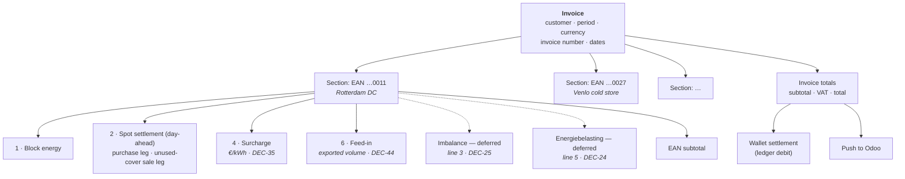
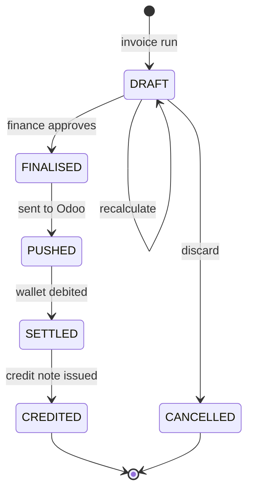

# Invoice Calculation

The complete line-item model for a monthly invoice, and the January annual true-up.

> **Readiness.** The inputs that used to block this document are now answered. Energiebelasting
> ([OQ-14], **[DEC-24]**) and imbalance ([OQ-15], **[DEC-25]**) are out of scope by deferral: their
> sections are kept in full and marked deferred, not deleted. VAT is settled — **[DEC-26]** makes
> everything VAT-exclusive with VAT added at invoice level, and **[DEC-64]** fixes the rate at **21%
> on every line category, with no exemptions and no reverse charge**, closing [OQ-82]. **[OQ-83]
> remains open** — whether the wallet `INVOICE_DEBIT` settles the ex-VAT subtotal or the inclusive
> total — and must be closed before wallet settlement is built. **[DEC-44]** closes [OQ-35]: day-ahead
> settlement uses the **raw** price, with no spread.
>
> Three things changed underneath the formulas here.
>
> - **[DEC-22]** makes **net usage** (consumption − production) the volume basis. Where this document
>   previously said consumption, read net usage.
> - **[DEC-35]** moves the surcharge to **€/kWh**. This is a unit change, not a label change: the
>   formula loses its `/1000` divisor and the rate column needs widened precision — §6.
> - **[DEC-44]** separates physically exported volume out of the day-ahead sale leg and settles it at
>   a **feed-in tariff** as **line 6** — a new line category, new reference data, and a changed volume
>   identity. §7A and §11.1.
>
> The invoice now has **four** implemented line categories, not three; two more are specified in full
> and deferred.

---

## 1. Shape of an invoice



One invoice per customer per month. One section per metering point active in that month. **Four**
line categories are produced, each of which may expand into several lines (one per block, one per
leg, one per rate period); two further categories are fully specified below but not implemented.

| Line | Line category | Status |
| :--: | --- | --- |
| **1** | Block energy | Implemented — §3 |
| **2** | Spot settlement (day-ahead), purchase and unused-cover sale legs | Implemented — §4 |
| 3 | Imbalance | **Deferred [DEC-25]** — §5 kept in full |
| **4** | Surcharge, **€/kWh [DEC-35]** | Implemented — §6 |
| 5 | Energiebelasting | **Deferred [DEC-24]** — §7 kept in full |
| **6** | Feed-in on exported volume **[DEC-44]** | Implemented — §7A |

> **Line numbers do not move.** Lines 3 and 5 are **absent, not renumbered**; the surcharge stays
> line 4; and **[DEC-44]**'s new feed-in category takes the next free number, **6**, rather than
> claiming a reserved one — matching [F10-R05] and
> [Monthly invoicing §2.1](../40-processes/04-monthly-invoicing.md). Both deferrals are expected to
> reverse: energiebelasting is a legal obligation that must return before a real customer is invoiced
> **[DEC-24]**. Renumbering now would mean renumbering back, and a customer watching line 3 become
> line 4 and then line 3 again is a support call for no gain.
>
> **Section numbering in this document is likewise unchanged**, so existing `§5`, `§8`, `§9` and `§11`
> cross-references from other documents still resolve. Line 6 is therefore specified in **§7A**,
> between §7 and §8. The letter is deliberate and follows the same rule as the line numbers: a new
> category is cheaper to letter than a whole document is to renumber.

Each section header carries the metered figures for that EAN — gross consumption, production and net
usage **[DEC-22]** — because the volume identity in §11 is stated against them and has to be
checkable on the document itself.

## 2. Notation

| Symbol | Meaning |
| --- | --- |
| `M` | The invoice month, as a set of 15-minute intervals in `Europe/Amsterdam` |
| `m` | A metering point (EAN) |
| `i` | A 15-minute interval |
| `C(i,m)` | Gross consumption in kWh, non-negative **[AS-05]** |
| `P(i,m)` | Gross production in kWh, non-negative **[AS-05]** |
| `U(i,m)` | **Net usage** `= C − P`, may be negative **[DEC-22]** |
| `B(i,m)` | Block volume in kWh (§3 of [Position & coverage](02-position-and-coverage.md)) |
| `N(i,m)` | Net position `= U − B` |
| `DA(i)` | Day-ahead price, **€/MWh** — raw, no spread **[DEC-44]** |
| `p(b)` | Agreed block price, **€/MWh** |
| `s(customer, i)` | Surcharge rate, **€/kWh**, signed **[DEC-35]** |
| `f(customer, i)` | Feed-in tariff, **€/kWh**, signed **[DEC-44]** |
| `uncovered(i,m)` | `= max( max(U,0) − B, 0 )` — day-ahead purchase volume |
| `unusedCover(i,m)` | `= max( B − max(U,0), 0 )` — day-ahead sale volume **[DEC-44]** |
| `exported(i,m)` | `= max( −U, 0 )` — feed-in volume **[DEC-44]** |

**Units are not uniform, and the split is deliberate.** Market prices — block prices and day-ahead —
are **€/MWh**, and every volume divides by 1000 where one of them is applied. The two per-unit
**customer rates** — surcharge **[DEC-35]** and feed-in **[DEC-44]** — are **€/kWh**, applied directly
to the kWh volume with **no divisor**. Any formula that has both a `/1000` and a €/kWh rate in it is
wrong by a factor of a thousand.

**[DEC-22] replaces `C` with `U` as the volume basis** in every formula below. `C` survives only as an
input to `U` and as a figure printed on the invoice. Where an earlier version of this document wrote
`C` in a charging formula, read `U`; the net position `N` was `C − B` and is now `U − B`.

---

## 3. Line 1 — Block energy

The customer pays for what was purchased, for the portion of each block falling inside the month.

```
blockMWh(b, m, M) = allocation_MW(b,m) × |{ i ∈ M : active(b,i) }| × 0.25

line1(b, m) = sign(b) × blockMWh(b, m, M) × p(b)
```

One line per block per metering point, so the invoice reads:

| Description | Volume | Unit price | Amount |
| --- | --: | --: | --: |
| Base block Aug-26 (trade #1042) | 148.80 MWh | €72.4000 | €10 773.12 |
| Peak block Q3-26 (trade #1051) — August portion | 50.40 MWh | €96.1500 | €4 845.96 |
| Sell base Aug-26 (trade #1067) | −29.76 MWh | €78.2000 | −€2 327.23 |

Referencing the trade number is what makes G4 ("invoices are reconstructable") real — every line
links back to a trade, and from there to its full audit history.

## 4. Line 2 — Spot settlement

Everything not covered by a block, and not physically exported, settles at day-ahead on the net-usage
position **[DEC-22]**, **[DEC-44]**.

```
dayAheadVolume(i,m) = max( U, 0 ) − B        = uncovered(i,m) − unusedCover(i,m)
                                             = N(i,m) + exported(i,m)

purchase(m) = Σ_{i ∈ M}  uncovered(i,m)   / 1000 × DA(i)
sale(m)     = − Σ_{i ∈ M} unusedCover(i,m) / 1000 × DA(i)     // negative — a credit
line2(m)    = purchase(m) + sale(m)
```

**[DEC-44] takes the export out of this line.** The volume that reaches the day-ahead market is the
net position with the physical export removed — equivalently, the position measured against net
**import** volume `max(U,0)` rather than signed net usage. In any interval where the site does not
export, `exported = 0` and `dayAheadVolume = N`, so the formula is unchanged for the great majority of
intervals. Exported volume settles at the feed-in tariff on **line 6** — §7A.

Presented as two lines and **never** as one net figure — **[DEC-23]** requires it, and netting hides
information:

| Description | Volume | Avg. price | Amount |
| --- | --: | --: | --: |
| Day-ahead purchase (uncovered volume) | 214.35 MWh | €88.4210 | €18 953.04 |
| Day-ahead sale (unused block cover) | −41.08 MWh | €47.1130 | −€1 935.40 |

The average price shown is **volume-weighted**, computed as `amount / volume`, never as a mean of
interval prices.

**Over-coverage rule — [DEC-23] closed [OQ-13]; [DEC-44] narrows its scope.** Unused block cover is
credited at the day-ahead price of the interval concerned, symmetric with the treatment of uncovered
volume, which keeps the position maths in one shape rather than two. The alternatives — crediting at
the block price, or not crediting at all — are recorded with their reasoning in **[DEC-23]**. Three
consequences bind the engine:

- The credit is a **separate sale line and is never netted against the purchase line**. Uncovered and
  surplus volumes occur at different times and therefore at different prices; a single net figure
  prices both at an average that existed in no interval.
- **[DEC-23]** states one rule for the platform and does not provide for a per-contract variant. The
  engine implements the single rule; changing it is a change of decision, not a configuration.
- **The sale line now carries unused cover only.** Before **[DEC-44]** its volume had two sources —
  unused block cover, and physical export where net usage was itself negative **[DEC-22]** — and both
  settled at the same day-ahead price. **[DEC-44]** separates them: cover stays here at day-ahead,
  export moves to line 6 at the feed-in tariff. The description text changes with it, from *"surplus
  and export volume"* to *"unused block cover"*, because it is now literally true.

**The price is raw. [DEC-44] closes [OQ-35]** on this too: day-ahead settlement uses the raw market
price with no configured spread, on the purchase leg and the sale leg alike.

## 5. Imbalance — deferred by [DEC-25] *(invoice line 3)*

> **Not implemented.** **[DEC-25]** takes imbalance out of scope: no imbalance line is produced, and
> PVNed `A12` documents are **stored but not turned into charges**. This closes [OQ-15] by deferral
> and moots **[AS-18]** and the allocation-key question with it — no allocation method has to be
> stated in the customer contract for now.
>
> The section below is kept, not deleted. The series mapping, the cost formula and the three
> candidate allocation keys are all still correct and will be needed if imbalance is ever invoiced.
> Storing `A12` rather than discarding it is what keeps that option open, at the cost of a table.

PVNed supplies imbalance volume and price per 15-minute settlement period, with separate
positive-direction and negative-direction prices.

From the sample report the relevant series are:

| `BusinessType` | `RecourceName` | Content |
| --- | --- | --- |
| `A20` | `Imbalance` | Imbalance volume per direction, with a settlement price |
| `B24` | `Imbalance price negative` | Price for the negative-imbalance direction |
| `B25` | `Imbalance price positive` | Price for the positive-imbalance direction |
| `A14` | `Prognosis` | Forecast position |
| `A02` | `Realisation` | Realised position |

```
imbalanceCost(i) = imbalanceVolume(i) / 1000 × imbalancePrice(i, direction)
```

### 5.1 The allocation problem

*Recorded for the day this is reopened; **[DEC-25]** makes none of it live.*

The imbalance report arrives at **portfolio (BRP) level**, not per EAN **[AS-18]** — the sample
carries `RecourceName: "Imbalance"` with no `ResourceObject` EAN. Yet the invoice is required to show
data per EAN.

Three candidate allocation keys:

| Key | Formula | Character |
| --- | --- | --- |
| **A. Pro-rata on consumption** | `share(m,i) = C(i,m) / Σ_m C(i,m)` | Simple, defensible, but charges a perfectly-forecast site for a badly-forecast one |
| **B. Pro-rata on forecast error** | `share(m,i) = \|C(i,m) − F(i,m)\| / Σ_m \|C − F\|` | Causal — the site that caused the imbalance pays for it — but requires a per-EAN forecast the platform does not have today |
| **C. Not allocated** | Imbalance is absorbed in PeakPower's margin and carried in the surcharge | Simplest invoice; hides a real and volatile cost |

**Recommendation, if reinstated:** ship with **A**, implemented behind an allocation-policy interface,
and revisit once per-EAN forecasts exist. Whichever is chosen must be stated in the customer contract
— this is the invoice line customers query most.

**[OQ-15]** is closed by deferral **[DEC-25]**. If imbalance is ever charged, it must resolve this,
and must also confirm whether PVNed can supply imbalance per EAN. Note that **[DEC-22]** would change
key **A**: pro-rata on consumption becomes pro-rata on net usage, which needs a rule for exporting
intervals before it can be used as a share.

## 6. Line 4 — Surcharge (the "topup")

A **per-kWh** adder, configured per customer and validity period. **[DEC-35]** settles the nature
question and closes [OQ-12]: it is a per-unit fee, not a fixed periodic fee and not a scheduled wallet
deposit — and it is quoted and stored in **€/kWh**.

```
line4(m) = Σ_{i ∈ M} U(i,m) × s(customer, i)        // €/kWh — no divisor. On net usage, not gross C
```

> **[DEC-35] removes the `/1000`.** The formula was
> `line4(m) = Σ U(i,m) / 1000 × surcharge(customer, i)` with the rate in €/MWh: convert kWh to MWh,
> then apply a €/MWh rate. With the rate in €/kWh and `U` already in kWh, the conversion is not
> merely unnecessary, it is wrong — leaving it in understates the surcharge by a factor of 1000.
> Nothing else in this document loses its divisor: block prices and day-ahead prices are still €/MWh.

| Field | Notes |
| --- | --- |
| `customer_id` | Surcharges are per customer **[OQ-12]**, closed by **[DEC-35]** |
| `valid_from` / `valid_to` | Half-open interval; no overlaps allowed for the same scope |
| `rate_eur_per_kwh` | Signed — a negative surcharge is a discount. **€/kWh [DEC-35]**, renamed from `rate_eur_per_mwh`. See §6.1 for the required precision |
| `basis` | `NET_USAGE` (default) or `ALL_VOLUME`. The default was `CONSUMPTION`, gross — **[DEC-22]** changes what it means |

### 6.1 Precision — the unit change forces a wider column

**[DEC-35] is a unit change, not a label change, and the rate column cannot survive it unaltered.**
The column is `numeric(12,4)`, sized for €/MWh. Read as €/kWh, four decimals give a smallest
representable step of **€0.0001/kWh = €0.10/MWh** — a thousand times coarser than every other price in
the system, and far too coarse for the line that carries PeakPower's whole margin. A rate agreed at
€4.55/MWh could not be stored at all; it would round to €0.0046/kWh = €4.60/MWh, an error of
€0.05/MWh on every kWh the customer takes.

To preserve the granularity the system had before the unit changed, the rate needs **seven decimal
places**:

| Unit | Decimals | Smallest step | Same step in €/MWh |
| --- | --: | --- | --- |
| €/MWh (before **[DEC-35]**) | 4 | €0.0001/MWh | €0.0001/MWh |
| €/kWh at 4 decimals | 4 | €0.0001/kWh | €0.10/MWh — **1000× coarser** |
| €/kWh at **7 decimals** | **7** | **€0.0000001/kWh** | **€0.0001/MWh** — equivalent ✓ |

**The required type is `numeric(12,7)`** — signed, five integer digits, seven fractional. Twelve total
digits is more than a per-kWh rate can plausibly need and is kept only so the column width does not
change; the seven fractional digits are the load-bearing part. The same type applies to the feed-in
tariff **[DEC-44]**, §7A.

> ⚠ **The schema must match this, and the schema is not this document's to change.** The column is
> defined in [Database design](../20-architecture/04-database-design.md) §3.6 as
> `billing.surcharge.rate numeric(12,4)`, and that file is owned elsewhere. It **must** be migrated to
> `numeric(12,7)` and the field renamed to reflect €/kWh before any surcharge is stored under
> **[DEC-35]**. A rate written into a `(12,4)` column as €/kWh is silently rounded on insert — there
> is no error to catch, only a wrong invoice a month later. Any existing €/MWh rates must be divided
> by 1000 in the same migration, not reinterpreted in place.

> **[DEC-22] changes the default basis, and therefore the amount.** The platform's volume basis is net
> usage, so a surcharge on the default basis is charged on `Σ U`, not on gross consumption. For any
> site with production this is a smaller number than before — a real change in the invoiced amount,
> and a line to check against the customer contract wording. [DEC-22] states the volume basis without
> carve-outs and does not name the surcharge specifically; if a contract intends the surcharge on
> gross volume, that is a decision still to be taken, not a setting to be assumed.

> **Terminology.** The brief calls this a "topup". This set calls it a **surcharge** everywhere,
> because "top-up" also means adding money to the wallet, and the two appear on the same screens.
> **[OQ-12] is closed by [DEC-35]**: a "topup per customer per period" is a per-unit price adder, not
> a fixed monthly fee and not a scheduled wallet deposit. The line stays volumetric; the tariff
> screens can be built. What changed with the answer is the unit — **€/kWh**, §6.1.

### 6.2 Presentation

The rate is printed in €/kWh, at four decimals for a normal rate and to as many as seven where the
agreed rate needs them; the volume stays in kWh so the multiplication on the page is the
multiplication the engine performed:

| Description | Volume | Rate | Amount |
| --- | --: | --: | --: |
| Surcharge 1–14 Aug 2026 | 120 000 kWh | €0.0050/kWh | €600.00 |
| Surcharge from 15 Aug 2026 | 180 000 kWh | €0.0045/kWh | €810.00 |

*(A different metering point from the §11 example — the rates are the ones in [F09](../10-features/F09-surcharges.md) §5, restated in €/kWh.)*
`120 000 × 0.0050 = 600.00`; `180 000 × 0.0045 = 810.00`. Two lines, because the rate changed
mid-month — **never one blended rate**, which would hide the change and make the invoice unverifiable
**[F09-R07]**. All the rules the surcharge already had survive the unit change unaltered: a negative
rate is a discount, the applied rate is snapshotted on the line, and a configured zero is distinct
from nothing configured — both bill nothing, only one is a deliberate statement **[F09]**.

> **Do not print €/MWh alongside.** Showing €0.0045/kWh and €4.50/MWh on the same line invites the
> reader to check the arithmetic against the wrong one. One unit per rate, and it is the unit the
> rate was agreed in **[DEC-35]**.

## 7. Energiebelasting — deferred by [DEC-24] *(invoice line 5)*

> **Not implemented.** **[DEC-24]** takes energiebelasting out of scope for now, so no EB line is
> produced. Everything below stays valid and is kept in full: the tariff table shape, the four tiers,
> the year-to-date delta method and the tier presentation. `IEnergyTaxCalculator` and the
> `billing.energy_tax_tariff` table **stay in the model, unpopulated**, so the calculation drops in
> rather than being retrofitted through the invoice engine later.
>
> ⚠ **This must be reopened before a single invoice is issued to a real customer.** Energiebelasting
> is a legal obligation, not a feature. [OQ-14] is closed *by deferral only*.
>
> **Knock-on:** the January annual true-up loses its principal reason to exist — tier crossings were
> the point — and is deferred alongside EB, keeping only its residual role of correcting late
> metering data. See §9.

Dutch energy tax. **Per EAN, per calendar year, degressive tiers** — the rate per kWh falls as the
annual volume rises **[AS-14]**.

### 7.1 Tariff table (reference data)

```
energy_tax_tariff
  ├─ commodity        ELECTRICITY | GAS
  ├─ year             2026
  ├─ tier_index       1, 2, 3, 4
  ├─ lower_bound_kwh  inclusive
  ├─ upper_bound_kwh  exclusive, NULL for the top tier
  └─ rate_eur_per_kwh
```

| Tier | Annual volume band | Rate |
| --- | --- | --- |
| 1 | 0 – 10 000 kWh | `rate₁` |
| 2 | 10 000 – 50 000 kWh | `rate₂` |
| 3 | 50 000 – 10 000 000 kWh | `rate₃` |
| 4 | above 10 000 000 kWh | `rate₄` |

with `rate₁ > rate₂ > rate₃ > rate₄`.

> **The rates are deliberately not written here.** They are set annually by the Belastingdienst, the
> band boundaries have changed historically, and a rate copied into a specification is a rate that
> will be wrong within a year. They are loaded as reference data and version-controlled per year.
> **[OQ-14]** covers sourcing them, plus the questions of the *vermindering* (tax credit — normally
> not applicable to non-residential grootverbruik connections) and whether any customer holds an
> exemption or a reduced rate.

### 7.2 The cumulative method

Applying tiers to a single month in isolation is wrong: a site consuming 400 MWh a month would be
charged tier-3 rates on its first 10 MWh every month, when in reality it passes the tier-1 and
tier-2 bands once, in January.

The correct approach charges the **delta of the year-to-date cumulative tax**:

```
cumulativeTax(V) = Σ over tiers t:  clamp(V − lowerᵗ, 0, upperᵗ − lowerᵗ) × rateᵗ

ytdBefore(m) = Σ net usage for m, from 1 January to the end of the previous month     [DEC-22]
ytdAfter(m)  = ytdBefore(m) + Σ_{i ∈ M} U(i,m)

line5(m) = cumulativeTax(ytdAfter(m)) − cumulativeTax(ytdBefore(m))
```

The symbol `line5` is kept for continuity with existing references; while **[DEC-24]** holds, the
line carries no number on the invoice because it is not produced.

This handles a mid-month tier crossing automatically, and produces a monthly charge that always sums
to the correct annual figure — provided the underlying volumes never change. Which they do, hence §9.

The invoice presents the tier breakdown, because customers check it:

| Description | Volume | Rate | Amount |
| --- | --: | --: | --: |
| Energiebelasting tier 3 (50 MWh – 10 GWh) | 343 420 kWh | `rate₃` | … |

The volume is the month's **net usage** in kWh **[DEC-22]** — the same 343.42 MWh as the §11 example,
not the 385.42 MWh of gross consumption.

### 7.3 Basis

Energiebelasting is levied on volume **taken from the grid**. **[DEC-22]** makes the platform's own
volume basis net usage, which brings it into agreement with **[AS-14]** — "levied on net consumed
volume" — instead of contradicting it. The tax basis and the invoiced basis are now the same series.
[AS-06], under which the basis was gross consumption, is superseded; [OQ-11] is closed.

One thing **[DEC-22]** does *not* settle: whether the fiscal netting is **per interval or per year** —
that is, whether an interval of net export reduces the taxable annual volume or is floored at zero.
The platform's own basis `Σ U` and an import-only basis `Σ max(U, 0)` differ for any site that
exports, and the difference is the whole export volume. This is a tax question rather than a platform
question, and must be confirmed when **[OQ-14]** is reopened **[DEC-24]**. Nothing here should be
implemented until it is.

---

## 7A. Line 6 — Feed-in *(new — [DEC-44])*

*Numbered 7A rather than 8 so that the `§8`, `§9` and `§11` cross-references in other documents keep
resolving — the same reasoning that keeps the invoice line numbers still. See §1.*

Physically exported volume — net usage below zero — is settled at a per-customer **feed-in tariff**,
not at the day-ahead price. **[DEC-44]** partially reopens **[DEC-23]**: the sale leg splits, unused
block cover stays at day-ahead on line 2, and export moves here.

```
line6(m) = − Σ_{i ∈ M}  exported(i,m) × f(customer, i)      // €/kWh — no divisor
                                                            // exported = max(−U, 0), never negative
```

The result is negative: a credit to the customer. The volume is printed negative on the invoice, in
the same convention as the day-ahead sale line, so that the section subtotal is a plain sum of its
lines.

| Description | Volume | Rate | Amount |
| --- | --: | --: | --: |
| Feed-in — exported volume | −18 600 kWh | €0.0285/kWh | −€530.10 |

`18 600 × 0.0285 = 530.10`. As with the surcharge, there is **no `/1000`**: the rate is €/kWh and the
volume is kWh **[DEC-35]**, **[DEC-44]**.

### 7A.1 Reference data

The feed-in tariff is a new per-customer, per-period table alongside the surcharge, with deliberately
the same shape and the same rules — one mechanism, built once:

```
billing.feed_in_tariff
  ├─ scope             GLOBAL_DEFAULT | CUSTOMER | METERING_POINT
  ├─ scope_id
  ├─ commodity         ELECTRICITY | GAS          [DEC-15]
  ├─ rate              numeric(12,7)   signed, €/kWh
  ├─ validity          daterange, half-open [from, to)
  ├─ note
  └─ created_by / created_at
```

| Rule | Behaviour | Same as surcharge? |
| --- | --- | :--: |
| Overlap | Two rows with the same scope and commodity may not overlap. Enforced by a **database exclusion constraint**, not by application code | yes |
| Resolution | Customer-specific → global default → **zero**, evaluated **per interval**, not per invoice | yes |
| Sign | Signed. A positive rate is a credit to the customer; a negative rate would be a charge for exporting | yes |
| Mid-period change | Produces **two lines with their own volumes and rates, never a blend** | yes |
| Snapshot | The applied rate is stored on the invoice line, so re-reading an old invoice never depends on current reference data | yes |
| History | A change is a new row; rates are never updated in place, and never edited retroactively into a period already invoiced | yes |
| Zero | A configured zero is **distinct from nothing configured** — see the warning below, where the two are *not* interchangeable | ⚠ differs |

**Unit: €/kWh, and the same `numeric(12,7)`.** The argument is **[DEC-35]**'s. The feed-in tariff is
the same kind of object as the surcharge — a per-unit rate on metered volume, agreed commercially per
customer, quoted in the same conversation — so it takes the same unit, and with it the same precision
requirement: at four decimals a €/kWh rate resolves only to €0.10/MWh, which is not good enough for a
settlement rate. §6.1 has the arithmetic. Market prices remain €/MWh; customer rates are €/kWh.

> ⚠ **The schema must match, and this document does not own it.**
> [Database design](../20-architecture/04-database-design.md) §3.6 needs a new
> `billing.feed_in_tariff` table with `rate numeric(12,7)` and the same `daterange` exclusion
> constraint as `billing.surcharge`, plus a `feed_in_tariff_audit` companion. That file is owned
> elsewhere; the requirement is stated here so it is not lost between the two.

### 7A.2 The gap [DEC-44] leaves open

> ⚠ **What applies when a customer exports and no feed-in tariff resolves is not decided.**
> **[DEC-44]** specifies the line and the tariff, but not the fallback. Two answers are defensible and
> they differ in money on every exporting site:
>
> | Candidate | Argument | Effect on the §11 example |
> | --- | --- | --- |
> | **Zero** | Symmetry with the surcharge's resolution order, which ends in zero | Exported energy is taken and not paid for: the −€530.10 credit becomes **€0.00** |
> | **Day-ahead** | The pre-**[DEC-44]** behaviour under **[DEC-23]**, and arguably the neutral price | `18.60 MWh × €35.62/MWh = €662.532` → a credit of **−€662.53** |
>
> The two are **€662.53 apart** on one EAN for one month — larger than the credit actually invoiced.
> For scale, the whole of **[DEC-44]**'s effect on that invoice is €132.43, so the *unanswered* part of
> the decision moves five times more money than the answered part. This **needs a decision of its own** and must be
> registered as an open question against **[DEC-44]**; it is not something the engine should default
> by whoever writes the resolution code first, and it is not settled by the surcharge's zero.
>
> **Interim behaviour, so that nothing is decided by accident:** a non-resolving feed-in tariff is a
> **warning** for a month with no export, and a **hard skip** — reason `MISSING_FEED_IN_TARIFF` — for
> a month with export. No invoice can then be issued that silently values exported energy at zero.
> See [Monthly invoicing](../40-processes/04-monthly-invoicing.md) §5 and
> [F10-R39](../10-features/F10-invoicing-and-settlement.md).

---

## 8. Totals, VAT and settlement

```
eanSubtotal(m)   = line1 + line2 + line4 + line6           // lines 3 and 5 rejoin here when reinstated
invoiceSubtotal  = Σ_m eanSubtotal(m)                      // VAT-exclusive [DEC-26]
vat              = invoiceSubtotal × 21%                   // every line category [DEC-64]
invoiceTotal     = invoiceSubtotal + vat
```

**VAT — [DEC-26] settled the structure, [DEC-64] settles the rate.** All prices, wallet balances and
reservations are **VAT-exclusive**; VAT is added at invoice level. This confirms **[AS-10]**: the
amount reserved at trade acceptance is the trade value ex-VAT.

**[DEC-64] closes [OQ-82]: 21% on every line category, no exemptions, no reverse-charge cases.** There
is therefore **one** rate group, not several, and the `vat` line above is a single multiplication over
the whole subtotal rather than a sum over groups. The feed-in credit **[DEC-44]** is a line category
like any other and carries 21% on its negative amount — "every line category" is stated without
carve-outs, and a credit line is not an exception to a rate.

| Resolved | Answer | Note |
| --- | --- | --- |
| Rate per line category | **21%, all categories [DEC-64]** | ⚠ Recorded as stated. A foreign entity or any customer otherwise outside the standard rate reopens it **before their first invoice** — the decision says so explicitly. The ordering subtlety, that energiebelasting is itself part of the VAT base in the Netherlands, is dormant while EB is deferred **[DEC-24]** and returns with it |
| Exemptions, reverse charge | **None [DEC-64]** | The rate-group machinery is not needed today. Keep the *shape* — VAT per group summing to the total — so a second group is data, not a refactor |

> ⚠ **[OQ-83] remains open, and it is the last money-affecting gap in this document.** Whether the
> wallet `INVOICE_DEBIT` settles the VAT-**exclusive** subtotal or the VAT-**inclusive** total is not
> answered by **[DEC-26]** and is explicitly left open by **[DEC-64]**. If it is the inclusive total,
> a reservation sized ex-VAT under-covers the eventual debit by the VAT rate — precisely the exposure
> **[AS-10]** was flagged for, and sharpened by **[DEC-41]**, which takes the pre-submission wallet
> check at 100% of the estimate with no buffer. **Resolve before wallet settlement is built.** §8.1.

### 8.1 Wallet settlement

On finalisation the invoice amount is debited from the wallet as a single ledger entry of type
`INVOICE_DEBIT`, linked to the invoice **[AS-12]**.

> **Which amount — [OQ-83], still open.** **[DEC-26]** fixes wallet balances as VAT-exclusive and
> **[DEC-64]** fixes the rate at 21%, but neither says whether this debit carries the VAT-exclusive
> subtotal or the VAT-inclusive total. The two differ by the whole VAT amount — €6 622.97 on the
> worked example in §11 — and the ex-VAT reservations taken at trade acceptance were never sized for
> the difference. **[DEC-64]** makes the gap exactly quantifiable, which is the one thing that
> changed: it is 21% of the subtotal, on every invoice. The debit basis must be decided, not defaulted
> by whoever writes the code first.

If the available balance is insufficient:

1. The invoice is still finalised and pushed to Odoo — the debt is real.
2. The wallet is allowed to go negative **only** through this path (never through a customer action,
   **[AS-11]**).
3. The customer is notified immediately, and a `WALLET_NEGATIVE` alert is raised on the employee
   dashboard.
4. Trading is blocked until the balance is restored. See [F06](../10-features/F06-wallet-and-ledger.md).

**[OQ-19]** asks whether partial settlement is preferred instead — debiting what is available and
carrying the remainder as a receivable in Odoo.

---

## 9. The January annual true-up — deferred by [DEC-24]

> **Deferred, with a residual role.** **[DEC-24]** removes energiebelasting from scope, and with it
> reason 2 below — tier crossings were the principal reason the true-up existed. The run is deferred
> alongside EB and returns with it, **retaining only its residual role of correcting late metering
> data** (reason 1). The arithmetic below is unchanged and is kept for the day EB returns.

### 9.1 Why it exists

Two things make the twelve monthly invoices for a year not add up to the correct annual figure:

1. **Late metering corrections.** PVNed may correct a delivery date for up to 10 working days, and
   reconciliation can move volumes later still. A December correction changes the annual volume, and
   therefore which energiebelasting tier the *whole year* sits in. — *The residual role, and the only
   one that still applies under [DEC-24].*
2. **Degressive tiers are an annual construct.** They can only be settled definitively once the
   calendar year's volume is final. — *Dormant while [DEC-24] holds.*

### 9.2 The calculation

Run in January for the preceding year `Y`, per customer, per EAN:

```
finalAnnualVolume(m)   = Σ net usage over year Y, using the final data version for every day  [DEC-22]
recomputedTax(m)       = cumulativeTax( finalAnnualVolume(m) )                     [deferred, DEC-24]
taxAlreadyInvoiced(m)  = Σ of line5 across all twelve invoices for year Y          [deferred, DEC-24]
taxCorrection(m)       = recomputedTax(m) − taxAlreadyInvoiced(m)                  [deferred, DEC-24]
```

The same recomputation is applied to every other volume-driven component whose underlying data
changed, so the true-up covers corrections in general, not only tax:

```
energyCorrection(m)    = recomputedLines{1,2,4,6}(m) − alreadyInvoicedLines{1,2,4,6}(m)
```

`Lines{1,2,4,6}` are the implemented categories — block energy, spot settlement, surcharge and
feed-in **[DEC-44]**. Line 3 rejoins the expression if **[DEC-25]** is reversed and line 5 if
**[DEC-24]** is; the line numbers themselves do not move in the meantime. Line 6 is
volume-driven in exactly the way this recomputation exists for: a late metering correction that
changes production changes the exported volume, and therefore the feed-in credit, without touching
anything the customer did.

The annual document is a **correction invoice** (or credit note if negative) carrying only the deltas,
with a supporting statement showing original vs. recomputed per component. It is not a replacement
for the monthly invoices — those stay as issued, which keeps the accounting trail intact.

### 9.3 Process

See [Annual true-up](../40-processes/05-annual-true-up.md) for the full flow, including the gate that
prevents the run from starting before all of the previous year's delivery dates are `FINAL`.

---

## 10. Recalculation and credit notes

A finalised invoice is **never** modified.



- **DRAFT** invoices can be recalculated freely and as often as needed.
- Once **FINALISED**, a correction is a new credit note plus a new invoice, or a delta correction in
  the annual true-up.
- Every state transition is recorded with actor, timestamp and reason.

## 11. Worked example — one EAN, one month

*Illustrative. The imbalance and energiebelasting rows are shown for shape only — neither is charged
while **[DEC-25]** and **[DEC-24]** hold, and `rate₃` remains a placeholder pending [OQ-14].*

**EAN …0011 "Rotterdam DC", August 2026.** Metered: gross consumption 385.42 MWh, production
42.00 MWh, **net usage 343.42 MWh [DEC-22]**, of which **18.60 MWh physically exported** and
362.02 MWh imported. Holds 0.4 MW base Aug-26 at €72.40 and 0.2 MW peak Q3-26 at €96.15. Surcharge
€0.0045/kWh **[DEC-35]**; feed-in tariff €0.0285/kWh **[DEC-44]**.

| # | Line | Volume | Price | Amount |
| --: | --- | --: | --: | --: |
| 1 | Base block Aug-26 (trade #1042) | 297.60 MWh | €72.4000/MWh | €21 546.24 |
| 1 | Peak block Q3-26, August portion (trade #1051) | 50.40 MWh | €96.1500/MWh | €4 845.96 |
| 2 | Day-ahead purchase (uncovered volume) | 62.40 MWh | €93.8100/MWh | €5 853.74 |
| 2 | Day-ahead sale (unused block cover) | −48.38 MWh | €35.6200/MWh | −€1 723.30 |
| 3 | Imbalance | — | — | *not charged — deferred [DEC-25]* |
| 4 | Surcharge | 343 420 kWh | €0.0045/kWh | €1 545.39 |
| 5 | Energiebelasting tier 3 | 343 420 kWh | `rate₃` | *not charged — deferred [DEC-24]* |
| 6 | Feed-in — exported volume | −18 600 kWh | €0.0285/kWh | −€530.10 |
| | **EAN subtotal, VAT exclusive** | | | **€31 537.93** |

Line arithmetic. Lines 1 and 2 apply **€/MWh** prices to MWh volumes; lines 4 and 6 apply **€/kWh**
rates to kWh volumes, with no divisor **[DEC-35]**, **[DEC-44]**:

```
1  297.60 × 72.40      = 21 546.24
1   50.40 × 96.15      =  4 845.96
2   62.40 × 93.81      =  5 853.744    → 5 853.74
2   48.38 × 35.62      =  1 723.2956   → 1 723.30      credit
4  343 420 × 0.0045    =  1 545.39
6   18 600 × 0.0285    =    530.10                     credit

subtotal = 21 546.24 + 4 845.96 + 5 853.74 − 1 723.30 + 1 545.39 − 530.10
         = 31 537.93
```

Rounding is half-away-from-zero at the line, per **[DEC-12]** — money is carried at
`numeric(18,6)` and rounded to 2 decimals only at line and presentation level.

**Where the sale volume went.** The previous version of this example had a single sale line of
−66.98 MWh at €35.62. **[DEC-44]** splits it: `66.98 = 48.38 unused cover + 18.60 export`. The cover
half keeps the day-ahead price; the export half moves to line 6 at the feed-in tariff. Because
€0.0285/kWh is €28.50/MWh — below this month's €35.62/MWh average sale price — the credit falls from
€2 385.83 to `1 723.30 + 530.10 = €2 253.40`, and the subtotal rises by €132.43. That difference is
the whole commercial content of **[DEC-44]** on this invoice, and it is the same €132.43 quantified in
§7A.2.

**Surcharge, unchanged in money and changed in unit.** `343 420 kWh × €0.0045/kWh = €1 545.39` is
exactly what `343.42 MWh × €4.50/MWh` produced before **[DEC-35]** — €0.0045/kWh *is* €4.50/MWh. The
decision does not move this customer's margin; it moves where the decimal point lives, and it is the
`/1000` in the old formula that must go with it. An engine that keeps the divisor and takes the new
rate bills €1.55 instead of €1 545.39.

**Invoice totals.** One EAN, so the section subtotal is the invoice subtotal:

```
invoiceSubtotal = 31 537.93                                VAT exclusive [DEC-26]
vat             = 31 537.93 × 21% = 6 622.9653 → 6 622.97  21% on every line category [DEC-64]
invoiceTotal    = 31 537.93 + 6 622.97 = 38 160.90
```

**[DEC-64] closes [OQ-82]** — the rate is no longer an assumption. The wallet `INVOICE_DEBIT` is still
one of those two figures and no decision says which — **[OQ-83], open**, §8.1. The gap is €6 622.97 on
this invoice alone.

### 11.1 The volume identity

Under **[DEC-22]** the energy lines reconcile to **net usage**, not to gross consumption. **[DEC-44]
changes its shape**: the single sale term becomes two, because the sale volume now leaves the invoice
by two different doors at two different prices.

```
Σ blockMWh  +  purchaseMWh  −  unusedCoverMWh  −  feedInMWh   =   netUsageMWh
                                                              =   grossConsumption − production

left  :  (297.60 + 50.40)  +  62.40  −  48.38  −  18.60   =   343.42 MWh
right :   385.42  −  42.00                                =   343.42 MWh      ✓
```

Step by step, so the arithmetic is checkable: `348.00 + 62.40 = 410.40`; `410.40 − 48.38 = 362.02`
— which is the month's **import** volume, and a useful intermediate to print in its own right;
`362.02 − 18.60 = 343.42`.

Only categories 1, 2 and 6 take part. The surcharge is a price on volume already counted, not a volume
of its own; imbalance (line 3) and energiebelasting (line 5) never contributed volume either. The
identity survived the loss of two line categories unchanged and now absorbs the gain of one.

**Proof, pointwise, for all three sign cases.** Per interval, with `B ≥ 0`:

| Case | `uncovered` | `unusedCover` | `exported` | `B + uncovered − unusedCover − exported` |
| --- | --- | --- | --- | --- |
| `U ≥ 0`, `B ≤ U` | `U − B` | `0` | `0` | `B + (U−B) − 0 − 0 = U` ✓ |
| `U ≥ 0`, `B > U` | `0` | `B − U` | `0` | `B + 0 − (B−U) − 0 = U` ✓ |
| `U < 0` | `0` | `B` | `−U` | `B + 0 − B − (−U) = U` ✓ |

It holds interval by interval, so it holds for any sum of intervals — over a metering point, over a
month, over a year. There is no aggregation step that could hide a cancellation.

**The one-line form.** With `uncovered` and `unusedCover` written as the positive and negative parts
of the same quantity, `uncovered − unusedCover = max(U,0) − B` identically
([Position & coverage](02-position-and-coverage.md) §4). Substituting:

```
B + uncovered − unusedCover − exported  =  B + ( max(U,0) − B ) − max(−U, 0)
                                        =  max(U,0) − max(−U,0)
                                        =  U                                for every sign of U
```

> ⚠ **This requires the clamped `uncovered = max( max(U,0) − B, 0 )`.** With the unclamped
> `max(U − B, 0)` the identity still holds for every case above, but **fails when `U < 0` and `B < 0`
> together** — a net sell position in an exporting interval, where `exported` counts volume the sold
> block has already committed. Worked counter-example: `B = −100`, `U = −250` gives
> `−100 + 0 − 0 − 250 = −350 ≠ −250`, an error of exactly `|B|`. **[DEC-34]** forbids short selling,
> so per-interval `B < 0` should be unreachable, but the clamp is free and an identity that depends on
> a trading rule to stay true is not an identity. Implement the clamped form. See
> [Position & coverage](02-position-and-coverage.md) §4 for the same caveat stated against the
> coverage metrics.

A second check comes free while the surcharge is on the default basis **[DEC-22]**, and is now
stated in kWh because that is the unit the rate is in **[DEC-35]**:

```
surchargeKWh  =  netUsageKWh          343 420  =  343 420   ✓
```

**Both identities must be asserted by the invoice engine and must appear on the invoice**, alongside
the metered figures they are stated against — gross consumption, production, net usage and, since
**[DEC-44]**, exported volume. They are the single best guard against a coverage, netting or calendar
bug reaching a customer.

Note what changed, twice over. Before **[DEC-22]** this check reconciled to gross consumption
(`297.60 + 50.40 + 84.12 − 46.70 = 385.42 MWh`, the figures of an earlier example). Before
**[DEC-44]** it had one sale term of −66.98 MWh rather than two of −48.38 and −18.60. An engine still
checking either older form will now fail — for every metering point with production in the first case,
and for every metering point that exports in the second. Both failures are correct behaviour, not
regressions, but they are the first things to look at if the check starts firing after these changes
land.

## 12. Open questions raised here

| Ref | Question | Status |
| --- | --- | --- |
| [OQ-12] | Is a "topup" a €/MWh surcharge, a fixed periodic fee, or something else? | **Closed by [DEC-35]** — a per-unit fee, quoted and stored in **€/kWh**. ⚠ The unit change carries a precision consequence and a migration — §6.1 |
| [OQ-13] | How is surplus (over-covered) volume settled? | **Closed by [DEC-23]**, then **narrowed by [DEC-44]** — day-ahead applies to *unused block cover* only; physical export settles at the feed-in tariff on line 6 |
| [OQ-14] | Energiebelasting: tariff source, tax credit applicability, exemptions | **Closed by deferral [DEC-24]** — ⚠ must be reopened before the first invoice to a real customer, and must then also settle the interval-vs-year netting question in §7.3 |
| [OQ-15] | How is portfolio-level imbalance allocated to EANs? Can PVNed supply it per EAN? | **Closed by deferral [DEC-25]** — moot while imbalance is out of scope |
| [OQ-17] | VAT treatment, and whether wallet amounts are VAT-inclusive | **Closed on (a), open on (b).** **[DEC-26]** makes everything VAT-exclusive with VAT at invoice level; **[DEC-64]** fixes the rate at 21% on every line category with no exemptions and no reverse charge. Still open: whether `INVOICE_DEBIT` is the ex-VAT subtotal or the inclusive total — **[OQ-83]**, which blocks wallet settlement |
| [OQ-18] | Are network/transport costs in scope for these invoices? | **Closed by [DEC-37]** — out of scope; the DSO bills grootverbruik customers directly |
| [OQ-19] | Behaviour when the wallet cannot cover an invoice: full debit into negative, or partial? | Open |
| [OQ-35] | Is the raw day-ahead price used for settlement, or a price plus a spread? | **Closed by [DEC-44]** — the **raw** price, no spread, on both legs of line 2 |
| [OQ-82] | VAT rate per line category, exemptions, reverse charge | **Closed by [DEC-64]** — 21%, all categories, no exemptions. ⚠ Reopens for any customer outside the standard rate, before their first invoice |
| [OQ-83] | Does the wallet `INVOICE_DEBIT` settle the ex-VAT subtotal or the VAT-inclusive total? | **Open.** Left open explicitly by **[DEC-64]**. €6 622.97 on the §11 example. Must be answered before wallet settlement is built — §8.1 |
| **[OQ-86]** | When a customer exports but no feed-in tariff resolves, is the export valued at zero or at day-ahead? | **Open.** Not answered by **[DEC-44]**; the two candidates are **€662.53 apart** on the §11 example — five times [DEC-44]'s own net effect of €132.43 on that invoice. Interim behaviour and both candidates are in §7A.2 |
