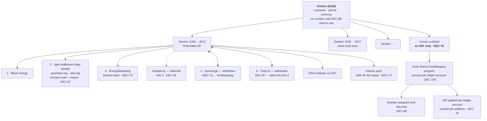
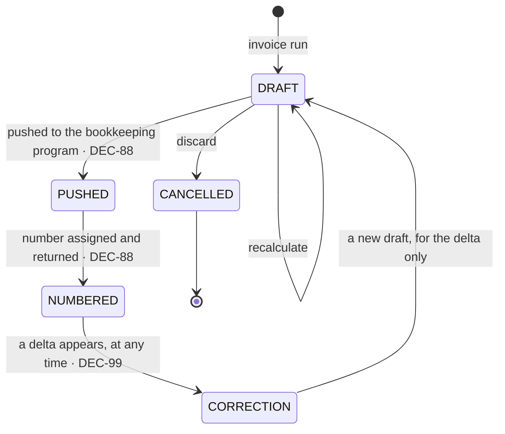

# Invoice Calculation

The complete line-item model for a monthly invoice, and the January annual true-up.

> **Readiness — restated 2026-08-19.** The 2026-08-19 round rewrites what this document computes. The
> platform sheds every *invoicing mechanic* to the bookkeeping program and gains one real *calculation*.
> Four changes, each of which moves money on the worked example in §11:
>
> - **[DEC-73]** removes the surcharge from the platform, reversing **[DEC-35]**. The platform pushes
>   **volume**; the bookkeeping program multiplies it by the topup fee. **Line 4 is withdrawn** — §6.
> - **[DEC-87]** removes the feed-in tariff, reversing the second half of **[DEC-44]**. Physically
>   exported volume returns to **line 2's sale leg at the raw day-ahead price**, exactly like unused
>   block cover under **[DEC-23]**. **Line 6 is withdrawn** and **[OQ-86] closes** — §7A.
> - **[DEC-74]** puts energiebelasting back in scope, reversing **[DEC-24]**. **Line 5 becomes real**:
>   a versioned bracket table, cumulative per EAN per calendar year on net usage **[DEC-22]**, with a
>   per-customer reduction and a 50%-per-bracket rule for mid-year EAN transfers **[OQ-77] closed** —
>   §7.
> - **[DEC-76]**, **[DEC-77]** and **[DEC-88]** empty the totals section. The platform computes **no
>   VAT at all**, never settles an invoice from the wallet, and never mints an invoice number — §8.
>
> The invoice therefore has **three** implemented line categories — 1, 2 and 5. Line 3 stays deferred;
> lines 4 and 6 are withdrawn, and their sections are struck in place rather than deleted so that the
> reasoning stays readable and the line numbers stay still.

<details>
<summary>⚠ <b>Superseded in part 2026-08-19 — the previous readiness note, kept for the record</b></summary>

> **Readiness.** The inputs that used to block this document are now answered. Energiebelasting
> ([OQ-14], **[DEC-24]**) and imbalance ([OQ-15], **[DEC-25]**) are out of scope by deferral: their
> sections are kept in full and marked deferred, not deleted. VAT is settled — **[DEC-26]** makes
> everything VAT-exclusive with VAT added at invoice level, and **[DEC-64]** fixes the rate at **21%
> on every line category, with no exemptions and no reverse charge**, closing [OQ-82]. **[OQ-83]
> remains open** — whether the wallet `INVOICE_DEBIT` settles the ex-VAT subtotal or the inclusive
> total — and must be closed before wallet settlement is built. **[DEC-44]** closes [OQ-35]: day-ahead
> settlement uses the **raw** price, with no spread.
>
> Three things changed underneath the formulas here.
>
> - **[DEC-22]** makes **net usage** (consumption − production) the volume basis. Where this document
>   previously said consumption, read net usage.
> - **[DEC-35]** moves the surcharge to **€/kWh**. This is a unit change, not a label change: the
>   formula loses its `/1000` divisor and the rate column needs widened precision — §6.
> - **[DEC-44]** separates physically exported volume out of the day-ahead sale leg and settles it at
>   a **feed-in tariff** as **line 6** — a new line category, new reference data, and a changed volume
>   identity. §7A and §11.1.
>
> The invoice now has **four** implemented line categories, not three; two more are specified in full
> and deferred.

⚠ What of it still stands: **[DEC-22]** (net usage is the volume basis) and the first half of
**[DEC-44]** (day-ahead settlement is raw, no spread) are untouched. **[DEC-26]** stands and is
extended by **[DEC-76]**. Everything the note says about the surcharge unit, the feed-in tariff,
`INVOICE_DEBIT`, [OQ-83] and the count of implemented categories is superseded above.

</details>

---

## 1. Shape of an invoice



One invoice per customer per month. One section per metering point active in that month. **Three**
line categories are produced, each of which may expand into several lines (one per block, one per
leg, one per tier); one further category is fully specified below but deferred, and two are withdrawn.

| Line | Line category | Status |
| :--: | --- | --- |
| **1** | Block energy | Implemented — §3 |
| **2** | Spot settlement (day-ahead), purchase and sale legs — the sale leg carries unused cover **and** export **[DEC-87]** | Implemented — §4 |
| 3 | Imbalance | **Deferred [DEC-25]** — §5 kept in full |
| ~~4~~ | ~~Surcharge, €/kWh [DEC-35]~~ | ⚠ **Withdrawn 2026-08-19 by [DEC-73]** — the platform pushes volume, the bookkeeping program prices it. §6 struck in place |
| **5** | Energiebelasting **[DEC-74]** | Implemented — §7 |
| ~~6~~ | ~~Feed-in on exported volume [DEC-44]~~ | ⚠ **Withdrawn 2026-08-19 by [DEC-87]** — export returns to line 2's sale leg at day-ahead. §7A struck in place |

> **Line numbers still do not move, and now two of them are permanently empty.** Line 3 is absent by
> deferral **[DEC-25]**; lines 4 and 6 are absent by withdrawal, **[DEC-73]** and **[DEC-87]**. None of
> the remaining lines is renumbered to close the gaps — matching [F10-R05] and
> [Monthly invoicing §2.1](../40-processes/04-monthly-invoicing.md). The reason is now stronger than
> it was: line 4 has already been on a customer invoice specification twice, at two different units,
> and line 5 has changed status twice. A customer watching numbers shuffle is a support call for no
> gain, and the cost of a gap in a numbering sequence is zero.
>
> ⚠ **One deferral reversed, as predicted.** The previous version of this note said "both deferrals are
> expected to reverse: energiebelasting is a legal obligation that must return before a real customer
> is invoiced". **[DEC-74]** does exactly that — line 5 is now implemented. **[DEC-25]** still holds
> for line 3.
>
> **Section numbering in this document is likewise unchanged**, so existing `§5`, `§8`, `§9` and `§11`
> cross-references from other documents still resolve. §7A keeps its letter even though the line it
> specified is withdrawn, for the same reason: a struck section that keeps its anchor still resolves
> the links pointing at it.

Each section header carries the metered figures for that EAN — gross consumption, production and net
usage **[DEC-22]** — because the volume identity in §11 is stated against them and has to be
checkable on the document itself.

## 2. Notation

| Symbol | Meaning |
| --- | --- |
| `M` | The invoice month, as a set of 15-minute intervals in `Europe/Amsterdam` |
| `m` | A metering point (EAN) |
| `i` | A 15-minute interval |
| `C(i,m)` | Gross consumption in kWh, non-negative **[AS-05]** |
| `P(i,m)` | Gross production in kWh, non-negative **[AS-05]** |
| `U(i,m)` | **Net usage** `= C − P`, may be negative **[DEC-22]** |
| `B(i,m)` | Block volume in kWh (§3 of [Position & coverage](02-position-and-coverage.md)) |
| `N(i,m)` | Net position `= U − B` |
| `DA(i)` | Day-ahead price, **€/MWh** — raw, no spread **[DEC-44]** |
| `p(b)` | Agreed block price, **€/MWh** |
| `s(customer, i)` | ~~Surcharge rate, **€/kWh**, signed **[DEC-35]**~~ ⚠ **Withdrawn 2026-08-19 by [DEC-73]** — no surcharge rate exists in the platform any more; §6 |
| `f(customer, i)` | ~~Feed-in tariff, **€/kWh**, signed **[DEC-44]**~~ ⚠ **Withdrawn 2026-08-19 by [DEC-87]** — no feed-in tariff exists at all; §7A |
| `uncovered(i,m)` | `= max( max(U,0) − B, 0 )` — day-ahead **purchase** volume |
| `unusedCover(i,m)` | `= max( B − max(U,0), 0 )` — unused block cover |
| `exported(i,m)` | `= max( −U, 0 )` — physically exported volume |
| `saleVolume(i,m)` | `= unusedCover(i,m) + exported(i,m)` — the whole day-ahead **sale** volume, reunited by **[DEC-87]**. For `B ≥ 0` this is exactly `max( B − U, 0 )`, the shape it had before **[DEC-44]** |
| `bracketₜ` | Energiebelasting bracket `t`: the band `[lowerₜ, upperₜ)` in kWh at rate `rateₜ` in **€/kWh** **[DEC-74]** |
| `cumulativeTax(V, c, y)` | Cumulative energiebelasting on an annual volume of `V` kWh for customer `c` in year `y` — §7.2 |

**Units are not uniform, and after this round exactly one €/kWh rate survives.** Market prices — block
prices and day-ahead — are **€/MWh**, and every volume divides by 1000 where one of them is applied.
The two per-unit **customer rates** that were €/kWh, the surcharge **[DEC-35]** and the feed-in tariff
**[DEC-44]**, are both withdrawn — **[DEC-73]** and **[DEC-87]**. The only €/kWh rate left in this
document is the **energiebelasting bracket rate** **[DEC-74]**, applied directly to a kWh volume with
**no divisor**. Any formula that has both a `/1000` and a €/kWh rate in it is still wrong by a factor
of a thousand; there is simply only one place left to get it wrong.

**[DEC-22] replaces `C` with `U` as the volume basis** in every formula below. `C` survives only as an
input to `U` and as a figure printed on the invoice. Where an earlier version of this document wrote
`C` in a charging formula, read `U`; the net position `N` was `C − B` and is now `U − B`.

---

## 3. Line 1 — Block energy

The customer pays for what was purchased, for the portion of each block falling inside the month.

```
blockMWh(b, m, M) = allocation_MW(b,m) × |{ i ∈ M : active(b,i) }| × 0.25

line1(b, m) = sign(b) × blockMWh(b, m, M) × p(b)
```

One line per block per metering point, so the invoice reads:

| Description | Volume | Unit price | Amount |
| --- | --: | --: | --: |
| Base block Aug-26 (trade #1042) | 148.80 MWh | €72.4000 | €10 773.12 |
| Peak block Q3-26 (trade #1051) — August portion | 50.40 MWh | €96.1500 | €4 845.96 |
| Sell base Aug-26 (trade #1067) | −29.76 MWh | €78.2000 | −€2 327.23 |

Referencing the trade number is what makes G4 ("invoices are reconstructable") real — every line
links back to a trade, and from there to its full audit history.

## 4. Line 2 — Spot settlement

Everything not covered by a block settles at day-ahead on the net-usage position **[DEC-22]** — and
after **[DEC-87]** that again includes physically exported volume, which no longer leaves this line.

```
purchase(m)     = Σ_{i ∈ M}  uncovered(i,m)  / 1000 × DA(i)
sale(m)         = − Σ_{i ∈ M} saleVolume(i,m) / 1000 × DA(i)     // negative — a credit
saleVolume(i,m) = unusedCover(i,m) + exported(i,m)               // reunited by [DEC-87]
line2(m)        = purchase(m) + sale(m)
```

⚠ **Amended 2026-08-19 by [DEC-87].** The paragraph below described **[DEC-44]** taking export out of
this line; that half of **[DEC-44]** is reversed.

> ~~**[DEC-44] takes the export out of this line.** The volume that reaches the day-ahead market is the
> net position with the physical export removed — equivalently, the position measured against net
> **import** volume `max(U,0)` rather than signed net usage. In any interval where the site does not
> export, `exported = 0` and `dayAheadVolume = N`, so the formula is unchanged for the great majority
> of intervals. Exported volume settles at the feed-in tariff on **line 6** — §7A.~~

**What [DEC-87] restores.** Export is settled **raw at the day-ahead price of its own interval**,
exactly as unused block cover is under **[DEC-23]**. No topup and no feed-in fee touches it. The
sale leg therefore has two sources again — unused cover and export — priced identically, so it is one
volume and one weighted price, not two lines. The first half of **[DEC-44]** is untouched and is what
makes this work: the day-ahead price is used raw, with no spread, on both legs.

Purchase and sale are presented as two lines and **never** as one net figure — **[DEC-23]** requires
it, and netting hides information:

| Description | Volume | Avg. price | Amount |
| --- | --: | --: | --: |
| Day-ahead purchase (uncovered volume) | 214.35 MWh | €88.4210 | €18 953.04 |
| Day-ahead sale (unused block cover and export) | −41.08 MWh | €47.1130 | −€1 935.40 |

*(Figures from a different metering point than §11. The description reverts to naming both sources
**[DEC-87]**; the amounts are unchanged because that site did not export.)*

The average price shown is **volume-weighted**, computed as `amount / volume`, never as a mean of
interval prices. When the sale volume has both sources, the weighted average is taken over the
combined volume — the two sources settle at the same price series, so there is nothing to separate.

**Over-coverage rule — [DEC-23] closed [OQ-13]; [DEC-44] narrowed it and [DEC-87] widens it back.**
Unused block cover is credited at the day-ahead price of the interval concerned, symmetric with the
treatment of uncovered volume, which keeps the position maths in one shape rather than two. The
alternatives — crediting at the block price, or not crediting at all — are recorded with their
reasoning in **[DEC-23]**. Three consequences bind the engine:

- The credit is a **separate sale line and is never netted against the purchase line**. Uncovered and
  surplus volumes occur at different times and therefore at different prices; a single net figure
  prices both at an average that existed in no interval.
- **[DEC-23]** states one rule for the platform and does not provide for a per-contract variant. The
  engine implements the single rule; changing it is a change of decision, not a configuration.
- ~~**The sale line now carries unused cover only.**~~ ⚠ **Reversed 2026-08-19 by [DEC-87].** The sale
  line carries **unused block cover and export**, as it did before **[DEC-44]**. Both settle at the
  same day-ahead price, so separating them would produce two lines with one price between them. The
  description text reverts with the volume, from *"unused block cover"* back to *"unused block cover
  and export"*, because that is again what is in it.

**The price is raw. [DEC-44] closes [OQ-35]** on this too: day-ahead settlement uses the raw market
price with no configured spread, on the purchase leg and the sale leg alike. **[DEC-87]** confirms it
for export specifically — *"only raw data. Hedge, volume, day ahead"* — and **[DEC-80]** puts the
platform's only margin instrument where it now lives: the spread on the price it **quotes**, not a
fee on the price it **settles**.

## 5. Imbalance — deferred by [DEC-25] *(invoice line 3)*

> **Not implemented.** **[DEC-25]** takes imbalance out of scope: no imbalance line is produced, and
> PVNed `A12` documents are **stored but not turned into charges**. This closes [OQ-15] by deferral
> and moots **[AS-18]** and the allocation-key question with it — no allocation method has to be
> stated in the customer contract for now.
>
> The section below is kept, not deleted. The series mapping, the cost formula and the three
> candidate allocation keys are all still correct and will be needed if imbalance is ever invoiced.
> Storing `A12` rather than discarding it is what keeps that option open, at the cost of a table.

PVNed supplies imbalance volume and price per 15-minute settlement period, with separate
positive-direction and negative-direction prices.

From the sample report the relevant series are:

| `BusinessType` | `RecourceName` | Content |
| --- | --- | --- |
| `A20` | `Imbalance` | Imbalance volume per direction, with a settlement price |
| `B24` | `Imbalance price negative` | Price for the negative-imbalance direction |
| `B25` | `Imbalance price positive` | Price for the positive-imbalance direction |
| `A14` | `Prognosis` | Forecast position |
| `A02` | `Realisation` | Realised position |

```
imbalanceCost(i) = imbalanceVolume(i) / 1000 × imbalancePrice(i, direction)
```

### 5.1 The allocation problem

*Recorded for the day this is reopened; **[DEC-25]** makes none of it live.*

The imbalance report arrives at **portfolio (BRP) level**, not per EAN **[AS-18]** — the sample
carries `RecourceName: "Imbalance"` with no `ResourceObject` EAN. Yet the invoice is required to show
data per EAN.

Three candidate allocation keys:

| Key | Formula | Character |
| --- | --- | --- |
| **A. Pro-rata on consumption** | `share(m,i) = C(i,m) / Σ_m C(i,m)` | Simple, defensible, but charges a perfectly-forecast site for a badly-forecast one |
| **B. Pro-rata on forecast error** | `share(m,i) = \|C(i,m) − F(i,m)\| / Σ_m \|C − F\|` | Causal — the site that caused the imbalance pays for it — but requires a per-EAN forecast the platform does not have today |
| **C. Not allocated** | Imbalance is absorbed in PeakPower's margin ~~and carried in the surcharge~~ ⚠ **Amended 2026-08-19** — there is no surcharge to carry it in **[DEC-73]**; the margin is the quoted spread **[DEC-80]** | Simplest invoice; hides a real and volatile cost |

**Recommendation, if reinstated:** ship with **A**, implemented behind an allocation-policy interface,
and revisit once per-EAN forecasts exist. Whichever is chosen must be stated in the customer contract
— this is the invoice line customers query most.

**[OQ-15]** is closed by deferral **[DEC-25]**. If imbalance is ever charged, it must resolve this,
and must also confirm whether PVNed can supply imbalance per EAN. Note that **[DEC-22]** would change
key **A**: pro-rata on consumption becomes pro-rata on net usage, which needs a rule for exporting
intervals before it can be used as a share.

## 6. ~~Line 4 — Surcharge (the "topup")~~ — ⚠ **Withdrawn 2026-08-19 by [DEC-73]**

**[DEC-73] reverses [DEC-35] and takes surcharges and topups out of the platform entirely.** There is
no surcharge line on the invoice, no surcharge rate in the platform, and no surcharge tariff table.

**Where the calculation went.** The platform computes and pushes **volume**; the bookkeeping program
multiplies that volume by the topup fee. The split is the whole point of the decision — *"When the
month is over we have the volume. A bookkeeping program will do value (kWh) times topup fee"* — and it
puts the commercial rate in the system that already holds the customer's ledger account and its VAT
rate **[DEC-76]**, **[DEC-107]**.

| What the platform does | What the bookkeeping program does |
| --- | --- |
| Meters and versions the month's volumes **[DEC-07]** | Holds the topup fee per customer and per period |
| Pushes, per EAN per month, **gross consumption, production and net usage in kWh** — the three figures the section header already carries (§1) | Multiplies whichever of those the contract names by the fee |
| Nothing else — no rate, no line, no amount | Produces the surcharge line, applies the ledger account's VAT rate, numbers the invoice **[DEC-88]** |

The platform pushes all three volumes rather than one because it no longer knows which base the
contract uses: **[DEC-35]**'s `basis` field (`NET_USAGE` default, `ALL_VOLUME`) left with the tariff
table, and guessing on the customer's behalf would silently pick a number. On the §11 example those
figures are 385 420 kWh gross, 42 000 kWh produced and **343 420 kWh net** **[DEC-22]**.

**What this cancels.** Three obligations this section created disappear with it:

| Obligation | Status |
| --- | --- |
| `billing.surcharge.rate` migrated from `numeric(12,4)` to `numeric(12,7)` and renamed — §6.1 | ⚠ **Not needed.** The column leaves the platform with the line. The migration in [Database design](../20-architecture/04-database-design.md) §7.1 has nothing left to widen |
| A resolution order (customer → global default → zero), evaluated per interval | ⚠ **Not needed** — no rate to resolve |
| The mid-month rate change producing two lines, never a blend **[F09-R07]** | ⚠ **Moves** to the bookkeeping program along with the fee |

**[OQ-36] closes with the line** — the surcharge base question disappears with the surcharge — and
**[OQ-12]** is superseded: it asked what a topup *is*, and the answer is now that it is not the
platform's object at all. [F09](../10-features/F09-surcharges.md) is the feature that empties.

⚠ **What does *not* change: PeakPower still earns the topup.** The money is unaffected; only the
system that computes it moves. The §11 example's €1 545.39 is still billed, by another program, from
a volume this one supplies. The platform's own margin instrument is the spread it quotes **[DEC-80]**.

<details>
<summary>⚠ <b>Withdrawn 2026-08-19 by [DEC-73] — the full surcharge specification, kept for the record</b></summary>

**Line 4 — Surcharge (the "topup")** — the withdrawn specification, kept in full

A **per-kWh** adder, configured per customer and validity period. **[DEC-35]** settles the nature
question and closes [OQ-12]: it is a per-unit fee, not a fixed periodic fee and not a scheduled wallet
deposit — and it is quoted and stored in **€/kWh**.

```
line4(m) = Σ_{i ∈ M} U(i,m) × s(customer, i)        // €/kWh — no divisor. On net usage, not gross C
```

> **[DEC-35] removes the `/1000`.** The formula was
> `line4(m) = Σ U(i,m) / 1000 × surcharge(customer, i)` with the rate in €/MWh: convert kWh to MWh,
> then apply a €/MWh rate. With the rate in €/kWh and `U` already in kWh, the conversion is not
> merely unnecessary, it is wrong — leaving it in understates the surcharge by a factor of 1000.
> Nothing else in this document loses its divisor: block prices and day-ahead prices are still €/MWh.

| Field | Notes |
| --- | --- |
| `customer_id` | Surcharges are per customer **[OQ-12]**, closed by **[DEC-35]** |
| `valid_from` / `valid_to` | Half-open interval; no overlaps allowed for the same scope |
| `rate_eur_per_kwh` | Signed — a negative surcharge is a discount. **€/kWh [DEC-35]**, renamed from `rate_eur_per_mwh`. See §6.1 for the required precision |
| `basis` | `NET_USAGE` (default) or `ALL_VOLUME`. The default was `CONSUMPTION`, gross — **[DEC-22]** changes what it means |

### 6.1 Precision — the unit change forces a wider column

**[DEC-35] is a unit change, not a label change, and the rate column cannot survive it unaltered.**
The column is `numeric(12,4)`, sized for €/MWh. Read as €/kWh, four decimals give a smallest
representable step of **€0.0001/kWh = €0.10/MWh** — a thousand times coarser than every other price in
the system, and far too coarse for the line that carries PeakPower's whole margin. A rate agreed at
€4.55/MWh could not be stored at all; it would round to €0.0046/kWh = €4.60/MWh, an error of
€0.05/MWh on every kWh the customer takes.

To preserve the granularity the system had before the unit changed, the rate needs **seven decimal
places**:

| Unit | Decimals | Smallest step | Same step in €/MWh |
| --- | --: | --- | --- |
| €/MWh (before **[DEC-35]**) | 4 | €0.0001/MWh | €0.0001/MWh |
| €/kWh at 4 decimals | 4 | €0.0001/kWh | €0.10/MWh — **1000× coarser** |
| €/kWh at **7 decimals** | **7** | **€0.0000001/kWh** | **€0.0001/MWh** — equivalent ✓ |

**The required type is `numeric(12,7)`** — signed, five integer digits, seven fractional. Twelve total
digits is more than a per-kWh rate can plausibly need and is kept only so the column width does not
change; the seven fractional digits are the load-bearing part. The same type applies to the feed-in
tariff **[DEC-44]**, §7A.

> ⚠ **The schema must match this, and the schema is not this document's to change.** The column is
> defined in [Database design](../20-architecture/04-database-design.md) §3.6 as
> `billing.surcharge.rate numeric(12,4)`, and that file is owned elsewhere. It **must** be migrated to
> `numeric(12,7)` and the field renamed to reflect €/kWh before any surcharge is stored under
> **[DEC-35]**. A rate written into a `(12,4)` column as €/kWh is silently rounded on insert — there
> is no error to catch, only a wrong invoice a month later. Any existing €/MWh rates must be divided
> by 1000 in the same migration, not reinterpreted in place.

> **[DEC-22] changes the default basis, and therefore the amount.** The platform's volume basis is net
> usage, so a surcharge on the default basis is charged on `Σ U`, not on gross consumption. For any
> site with production this is a smaller number than before — a real change in the invoiced amount,
> and a line to check against the customer contract wording. [DEC-22] states the volume basis without
> carve-outs and does not name the surcharge specifically; if a contract intends the surcharge on
> gross volume, that is a decision still to be taken, not a setting to be assumed.

> **Terminology.** The brief calls this a "topup". This set calls it a **surcharge** everywhere,
> because "top-up" also means adding money to the wallet, and the two appear on the same screens.
> **[OQ-12] is closed by [DEC-35]**: a "topup per customer per period" is a per-unit price adder, not
> a fixed monthly fee and not a scheduled wallet deposit. The line stays volumetric; the tariff
> screens can be built. What changed with the answer is the unit — **€/kWh**, §6.1.

### 6.2 Presentation

The rate is printed in €/kWh, at four decimals for a normal rate and to as many as seven where the
agreed rate needs them; the volume stays in kWh so the multiplication on the page is the
multiplication the engine performed:

| Description | Volume | Rate | Amount |
| --- | --: | --: | --: |
| Surcharge 1–14 Aug 2026 | 120 000 kWh | €0.0050/kWh | €600.00 |
| Surcharge from 15 Aug 2026 | 180 000 kWh | €0.0045/kWh | €810.00 |

*(A different metering point from the §11 example — the rates are the ones in [F09](../10-features/F09-surcharges.md) §5, restated in €/kWh.)*
`120 000 × 0.0050 = 600.00`; `180 000 × 0.0045 = 810.00`. Two lines, because the rate changed
mid-month — **never one blended rate**, which would hide the change and make the invoice unverifiable
**[F09-R07]**. All the rules the surcharge already had survive the unit change unaltered: a negative
rate is a discount, the applied rate is snapshotted on the line, and a configured zero is distinct
from nothing configured — both bill nothing, only one is a deliberate statement **[F09]**.

> **Do not print €/MWh alongside.** Showing €0.0045/kWh and €4.50/MWh on the same line invites the
> reader to check the arithmetic against the wrong one. One unit per rate, and it is the unit the
> rate was agreed in **[DEC-35]**.

</details>

## 7. Line 5 — Energiebelasting *(implemented — [DEC-74])*

⚠ **Reversed 2026-08-19 by [DEC-74].** Energiebelasting is **back in scope and is calculated**. The
deferral **[DEC-24]** is withdrawn, `IEnergyTaxCalculator` and `billing.energy_tax_tariff` are
implemented rather than left unpopulated, and **line 5 appears on the invoice**. The prediction the
old note made — *"this must be reopened before a single invoice is issued to a real customer"* — is
what happened, one round later.

What **[DEC-74]** adds on top of the shape that was already specified below:

| Element | Source wording | Where it is specified |
| --- | --- | --- |
| A **versioned, editable** bracket table — boundaries and €/kWh rates per year | *"We should make this in brackets with prices. Only we need to be able to change those prices"* | §7.1 |
| A **per-customer reduction or exemption** for the minority off the standard rate | *"In 90% of the cases people pay the same energiebelasting. In some cases the customer gets a 'discount'"* | §7.2 |
| Calculation **per EAN, per calendar year, on net usage [DEC-22]** | Unchanged from the deferred specification | §7.2 |
| **50% of each bracket per period** on a mid-year EAN transfer — **[OQ-77] closed** | *"In this case 50% is applied per bracket"* | §7.3 |
| A **ledger push** of the result to the bookkeeping program | *"push this in a ledger to the bookkeeping program"* | §7.5, **[DEC-107]** |

⚠ **What [DEC-74] does not settle: the *vermindering*.** The fixed annual reduction per connection was
part of **[OQ-14]**'s original question and the answer does not mention it. It is a fixed € credit, not
a rate, so it lands whole on every affected connection. It is carried on **[OQ-96]** and nothing here
assumes either answer — §7.4.

<details>
<summary>⚠ <b>Superseded 2026-08-19 by [DEC-74] — the [DEC-24] deferral, kept for the record</b></summary>

**Energiebelasting — deferred by [DEC-24]** *(invoice line 5)* — the deferral, kept in full

> **Not implemented.** **[DEC-24]** takes energiebelasting out of scope for now, so no EB line is
> produced. Everything below stays valid and is kept in full: the tariff table shape, the four tiers,
> the year-to-date delta method and the tier presentation. `IEnergyTaxCalculator` and the
> `billing.energy_tax_tariff` table **stay in the model, unpopulated**, so the calculation drops in
> rather than being retrofitted through the invoice engine later.
>
> ⚠ **This must be reopened before a single invoice is issued to a real customer.** Energiebelasting
> is a legal obligation, not a feature. [OQ-14] is closed *by deferral only*.
>
> **Knock-on:** the January annual true-up loses its principal reason to exist — tier crossings were
> the point — and is deferred alongside EB, keeping only its residual role of correcting late
> metering data. See §9.

Dutch energy tax. **Per EAN, per calendar year, degressive tiers** — the rate per kWh falls as the
annual volume rises **[AS-14]**.

**7.1 Tariff table (reference data)**

```
energy_tax_tariff
  ├─ commodity        ELECTRICITY | GAS
  ├─ year             2026
  ├─ tier_index       1, 2, 3, 4
  ├─ lower_bound_kwh  inclusive
  ├─ upper_bound_kwh  exclusive, NULL for the top tier
  └─ rate_eur_per_kwh
```

| Tier | Annual volume band | Rate |
| --- | --- | --- |
| 1 | 0 – 10 000 kWh | `rate₁` |
| 2 | 10 000 – 50 000 kWh | `rate₂` |
| 3 | 50 000 – 10 000 000 kWh | `rate₃` |
| 4 | above 10 000 000 kWh | `rate₄` |

with `rate₁ > rate₂ > rate₃ > rate₄`.

> **The rates are deliberately not written here.** They are set annually by the Belastingdienst, the
> band boundaries have changed historically, and a rate copied into a specification is a rate that
> will be wrong within a year. They are loaded as reference data and version-controlled per year.
> **[OQ-14]** covers sourcing them, plus the questions of the *vermindering* (tax credit — normally
> not applicable to non-residential grootverbruik connections) and whether any customer holds an
> exemption or a reduced rate.

**7.2 The cumulative method**

Applying tiers to a single month in isolation is wrong: a site consuming 400 MWh a month would be
charged tier-3 rates on its first 10 MWh every month, when in reality it passes the tier-1 and
tier-2 bands once, in January.

The correct approach charges the **delta of the year-to-date cumulative tax**:

```
cumulativeTax(V) = Σ over tiers t:  clamp(V − lowerᵗ, 0, upperᵗ − lowerᵗ) × rateᵗ

ytdBefore(m) = Σ net usage for m, from 1 January to the end of the previous month     [DEC-22]
ytdAfter(m)  = ytdBefore(m) + Σ_{i ∈ M} U(i,m)

line5(m) = cumulativeTax(ytdAfter(m)) − cumulativeTax(ytdBefore(m))
```

The symbol `line5` is kept for continuity with existing references; while **[DEC-24]** holds, the
line carries no number on the invoice because it is not produced.

This handles a mid-month tier crossing automatically, and produces a monthly charge that always sums
to the correct annual figure — provided the underlying volumes never change. Which they do, hence §9.

The invoice presents the tier breakdown, because customers check it:

| Description | Volume | Rate | Amount |
| --- | --: | --: | --: |
| Energiebelasting tier 3 (50 MWh – 10 GWh) | 343 420 kWh | `rate₃` | … |

The volume is the month's **net usage** in kWh **[DEC-22]** — the same 343.42 MWh as the §11 example,
not the 385.42 MWh of gross consumption.

**7.3 Basis**

Energiebelasting is levied on volume **taken from the grid**. **[DEC-22]** makes the platform's own
volume basis net usage, which brings it into agreement with **[AS-14]** — "levied on net consumed
volume" — instead of contradicting it. The tax basis and the invoiced basis are now the same series.
[AS-06], under which the basis was gross consumption, is superseded; [OQ-11] is closed.

One thing **[DEC-22]** does *not* settle: whether the fiscal netting is **per interval or per year** —
that is, whether an interval of net export reduces the taxable annual volume or is floored at zero.
The platform's own basis `Σ U` and an import-only basis `Σ max(U, 0)` differ for any site that
exports, and the difference is the whole export volume. This is a tax question rather than a platform
question, and must be confirmed when **[OQ-14]** is reopened **[DEC-24]**. Nothing here should be
implemented until it is.

⚠ What of it still stands: the four-bracket shape, the degressive ordering, the cumulative
year-to-date delta method and the tier presentation are all carried forward unchanged into §7.1–§7.5.
What is superseded is the deferral itself, the "unpopulated table" posture, and the sentence saying
line 5 carries no number on the invoice — it now does.

</details>

Dutch energy tax. **Per EAN, per calendar year, degressive brackets** — the rate per kWh falls as the
annual volume rises **[AS-14]**. Electricity only: **[DEC-68]** puts gas out of scope, so no gas
bracket row is loaded even though the `commodity` discriminator stays **[DEC-15]**.

### 7.1 The bracket table — reference data, versioned and editable

```
billing.energy_tax_tariff
  ├─ commodity        ELECTRICITY | GAS      [DEC-15] — only ELECTRICITY is populated [DEC-68]
  ├─ tax_year         2026
  ├─ tier_index       1, 2, 3, 4
  ├─ lower_kwh        inclusive
  ├─ upper_kwh        exclusive, NULL for the top bracket
  ├─ rate_eur_kwh     numeric(14,8)          €/kWh — no divisor is applied to it
  ├─ version          a corrected year is a NEW version, never an update in place  [DEC-74]
  ├─ published_from   the moment this version becomes the one new calculations use
  ├─ source           the Belastingdienst publication the row was transcribed from
  └─ created_by / created_at
```

| Bracket | Annual volume band | Rate |
| --- | --- | --- |
| 1 | 0 – 10 000 kWh | `rate₁` |
| 2 | 10 000 – 50 000 kWh | `rate₂` |
| 3 | 50 000 – 10 000 000 kWh | `rate₃` |
| 4 | above 10 000 000 kWh | `rate₄` |

with `rate₁ > rate₂ > rate₃ > rate₄`.

| Rule | Behaviour | Why |
| --- | --- | --- |
| **Editable** | Rates and boundaries are maintained in the back office, not deployed in code **[DEC-74]** | The Belastingdienst sets them annually; a release per rate change is a release per January |
| **Versioned** | A correction to an already-published year inserts a new `version`; rows are never updated in place | An invoice issued last month must still resolve the rate it was issued at |
| **Snapshotted** | The applied rate is stored on the invoice line, as for every other rate in this document | Re-reading an old invoice never depends on current reference data |
| **Validated on publish** | Bands must be contiguous from 0, non-overlapping, with exactly one open-ended top band, and strictly degressive | A gap between bands silently untaxes a volume; a non-degressive set is a transcription error |
| **Complete or nothing** | A year with no published bracket set is a **hard block** on the run, not a zero | Reason `MISSING_TAX_BRACKETS` — the annual close names the same condition ([Annual true-up](../40-processes/05-annual-true-up.md) §3) |

> **The rates are still deliberately not written into this specification.** They are set annually by
> the Belastingdienst, the band boundaries have changed historically, and a rate copied into a
> document is a rate that will be wrong within a year.
>
> ⚠ **[DEC-107]: the table does not exist yet and must be built**, together with the chart of accounts
> and the tax-code mapping it pushes into. It needs a named owner from day one — under **[DEC-74]** and
> **[DEC-76]** that mapping now also has to carry an energiebelasting ledger account and a VAT rate per
> account, so it grew before it was written. The 2026 set used in §11 and §7.2–§7.3 is labelled
> **illustrative** wherever it appears, and exists only so the worked arithmetic is checkable.

> ⚠ **The schema must match this, and this document does not own it.**
> [Database design](../20-architecture/04-database-design.md) §3.6 still carries
> `billing.energy_tax_tariff` under the comment *"Retained but unpopulated — [DEC-24] defers
> energiebelasting"*. That comment is now wrong: the table is populated and load-bearing. It also needs
> `version` and `published_from`, its `UNIQUE (commodity, tax_year, tier_index)` extended to include
> `version`, and an `energy_tax_tariff_audit` companion — the same treatment every other rate table
> gets. That file is owned elsewhere; the requirement is stated here so it is not lost between the two.

### 7.2 The cumulative method, and the per-customer reduction

Applying brackets to a single month in isolation is wrong: a site consuming 400 MWh a month would be
charged bracket-3 rates on its first 10 MWh every month, when in reality it passes the bracket-1 and
bracket-2 bands once, in January.

The correct approach charges the **delta of the year-to-date cumulative tax**:

```
rate*(t, c, y) = 0                          if customer c is exempt for year y          [DEC-74]
               = reducedRate(t, c, y)       if a reduced rate is configured for bracket t
               = rateₜ(y)                   otherwise — the standard rate, the 90% case

cumulativeTax(V, c, y) = Σ over brackets t:  clamp(V − lowerₜ, 0, upperₜ − lowerₜ) × rate*(t, c, y)

ytdBefore(m, y) = Σ net usage for m, from 1 January of y to the end of the previous month   [DEC-22]
ytdAfter(m, y)  = ytdBefore(m, y) + Σ_{i ∈ M} U(i,m)

line5(m) = cumulativeTax(ytdAfter(m,y), c, y) − cumulativeTax(ytdBefore(m,y), c, y)
```

**The reduction lives inside `cumulativeTax`, not outside it.** A reduction applied only at the annual
close would produce twelve wrong monthly invoices and one large credit note; applied inside, the
monthly estimate and the January close **[DEC-74]** use one function and agree by construction. This
is the same statement made from the other side in
[Annual true-up](../40-processes/05-annual-true-up.md) §4.1.

**A missing reduction row is the standard rate, not zero.** *No row* means the customer pays `rateₜ`;
only an explicit `exempt` flag produces zero. The two are as distinct as a configured zero and nothing
configured were for the surcharge — and here the distinction is fiscal, not commercial: quietly
charging a customer nothing because a row is absent is an under-declaration, not a discount.

**Worked example — a bracket crossed mid-year.** A small connection taking 4 000 kWh a month, on the
illustrative 2026 rates of §11. It crosses the 10 000 kWh boundary in March:

| Month | `ytdBefore` | `ytdAfter` | Volume in bracket 1 | Volume in bracket 2 | Line 5 |
| --- | --: | --: | --: | --: | --: |
| January | 0 | 4 000 | 4 000 | — | 4 000 × 0.10154 = €406.16 |
| February | 4 000 | 8 000 | 4 000 | — | 4 000 × 0.10154 = €406.16 |
| **March** | 8 000 | 12 000 | **2 000** | **2 000** | 2 000 × 0.10154 + 2 000 × 0.06975 = 203.08 + 139.50 = **€342.58** |
| April | 12 000 | 16 000 | — | 4 000 | 4 000 × 0.06975 = €279.00 |

Check against the cumulative function: `cumulativeTax(12 000) = 10 000 × 0.10154 + 2 000 × 0.06975 =
1 015.40 + 139.50 = 1 154.90`; `cumulativeTax(8 000) = 8 000 × 0.10154 = 812.32`; the difference is
`1 154.90 − 812.32 = 342.58` ✓. March's volume splits across two rates without the engine having to
detect the crossing — the subtraction does it.

The naive month-in-isolation calculation would charge March `4 000 × 0.10154 = €406.16`, **€63.58 too
much**, and would then repeat that error every remaining month of the year.

### 7.3 A mid-year EAN transfer — **[OQ-77] closed by [DEC-74]**

When an EAN transfers between customers during the calendar year, **each period gets 50% of each
bracket** — a straight half-and-half split of the annual boundaries. It is **not** a pro-rata by days:
a transfer on 15 January and a transfer on 1 July produce the same halved brackets.

| Bracket | Annual band | Width | Half-width, per period | Cumulative boundary, per period |
| --- | --- | --: | --: | --: |
| 1 | 0 – 10 000 kWh | 10 000 | 5 000 | 5 000 |
| 2 | 10 000 – 50 000 kWh | 40 000 | 20 000 | 25 000 |
| 3 | 50 000 – 10 000 000 kWh | 9 950 000 | 4 975 000 | 5 000 000 |
| 4 | above 10 000 000 kWh | unbounded | unbounded | above 5 000 000 |

Boundary check: `5 000 + 20 000 = 25 000`, and `25 000 + 4 975 000 = 5 000 000`, exactly half of the
10 000 000 kWh ceiling of bracket 3. The halved table is the annual table with every width halved, so
it stays a valid degressive schedule and `cumulativeTax` is unmodified — only its bounds change.

**Worked example — transfer on 1 May 2026**, illustrative 2026 rates. Annual net usage 120 000 kWh:
customer A takes 30 000 kWh (1 Jan – 30 Apr), customer B takes 90 000 kWh (1 May – 31 Dec).

| Period | Net usage | Bracket 1 @ €0.10154 | Bracket 2 @ €0.06975 | Bracket 3 @ €0.03938 | Tax |
| --- | --: | --: | --: | --: | --: |
| A | 30 000 | 5 000 → €507.70 | 20 000 → €1 395.00 | 5 000 → €196.90 | **€2 099.60** |
| B | 90 000 | 5 000 → €507.70 | 20 000 → €1 395.00 | 65 000 → €2 559.70 | **€4 462.40** |
| **Sum** | **120 000** | | | | **€6 562.00** |
| One holder all year, for comparison | 120 000 | 10 000 → €1 015.40 | 40 000 → €2 790.00 | 70 000 → €2 756.60 | **€6 562.00** |

Volume checks: `5 000 + 20 000 + 5 000 = 30 000` ✓, `5 000 + 20 000 + 65 000 = 90 000` ✓,
`10 000 + 40 000 + 70 000 = 120 000` ✓.

⚠ **The two totals matching here is arithmetic, not a property of the rule.** They match because both
periods fill their halved brackets 1 and 2 completely. Where one period is small they do not.
Counter-example on the same year and rates, transfer moved so that A takes 3 000 kWh and B 117 000 kWh:

| Period | Net usage | Bracket 1 | Bracket 2 | Bracket 3 | Tax |
| --- | --: | --: | --: | --: | --: |
| A′ | 3 000 | 3 000 → €304.62 | — | — | **€304.62** |
| B′ | 117 000 | 5 000 → €507.70 | 20 000 → €1 395.00 | 92 000 → €3 622.96 | **€5 525.66** |
| **Sum** | **117 000 + 3 000 = 120 000** | | | | **€5 830.28** |

That is **€731.72 less** than the €6 562.00 a single holder would pay on the same annual volume,
because only 8 000 kWh in total reaches the bracket-1 rate instead of 10 000 and only 20 000 reaches
bracket 2 instead of 40 000, pushing 22 000 kWh down into bracket 3. The split can move the year's
total in either direction. This is accepted as a **rule, not an approximation**: it needs no day
count, it cannot be gamed by choosing a transfer date, and it is what **[DEC-74]** states. The annual
close applies it — see [Annual true-up](../40-processes/05-annual-true-up.md) §4.2, which holds the
same halved table.

### 7.4 Basis — what this specification uses, and what it does not settle

Energiebelasting is levied on volume **taken from the grid**. **[DEC-22]** makes the platform's own
volume basis net usage, which brings it into agreement with **[AS-14]** — *"levied on net consumed
volume"* — instead of contradicting it. [AS-06], under which the basis was gross consumption, is
superseded; [OQ-11] is closed.

⚠ **Whether the fiscal base is net usage or imported volume is a fiscal question this specification
does not settle.** The platform's own basis `Σ U` and an import-only basis `Σ max(U, 0)` differ for any
site that exports, and the difference is the whole export volume. **This document uses net usage, for
consistency with [DEC-22]** and because a calculation that used one basis for tax and another for
everything else would fail the volume identity in §11.1 — but that is a consistency argument, not a
tax opinion.

On the §11 example the two bases are 343 420 kWh and 362 020 kWh, a difference of **18 600 kWh** — at
the illustrative bracket-3 rate, `18 600 × 0.03938 = €732.47` on one EAN for one month. **[DEC-74]**
does not address it. It is carried on **[OQ-96]** alongside the *vermindering*, and both must be
answered by someone competent to give a fiscal answer before a real customer is invoiced.

### 7.5 Presentation and the ledger push

The invoice presents the bracket breakdown, because customers check it — one line per bracket touched
in the month, never one blended rate:

| Description | Volume | Rate | Amount |
| --- | --: | --: | --: |
| Energiebelasting bracket 1 (0 – 10 MWh) | 10 000 kWh | €0.10154/kWh | €1 015.40 |
| Energiebelasting bracket 2 (10 – 50 MWh) | 40 000 kWh | €0.06975/kWh | €2 790.00 |
| Energiebelasting bracket 3 (50 MWh – 10 GWh) | 293 420 kWh | €0.03938/kWh | €11 554.88 |

*(The §11 example, on the illustrative 2026 rates. `10 000 + 40 000 + 293 420 = 343 420 kWh` — the
month's **net usage** in kWh **[DEC-22]**, not the 385 420 kWh of gross consumption.)*

The rate is €/kWh and the volume is kWh, so there is **no `/1000`** — the same trap the withdrawn
per-unit customer rates carried, and now the only place left in this document to fall into it.

**The ledger push.** **[DEC-74]** requires the result to be pushed as a ledger entry to the bookkeeping
program, against the energiebelasting account in the chart of accounts **[DEC-107]**. It is pushed
**ex-VAT like every other amount** **[DEC-76]**; the bookkeeping program applies that account's rate.

⚠ **Ordering, no longer dormant.** In the Netherlands energiebelasting is itself part of the VAT base.
While **[DEC-24]** held, this document recorded that as a dormant subtlety. It is now live — and it is
**not the platform's problem**, because under **[DEC-76]** the platform computes no VAT at all. It is
the bookkeeping program's, and it is a reason the energiebelasting account's rate and ordering must be
got right when **[DEC-107]**'s chart of accounts is built.

---

## 7A. ~~Line 6 — Feed-in~~ — ⚠ **Withdrawn 2026-08-19 by [DEC-87]**

*The section keeps its 7A anchor even though the line it specified is withdrawn — a struck section
that keeps its anchor still resolves the links pointing at it. See §1.*

**[DEC-87] reverses the second half of [DEC-44].** There is **no feed-in tariff**, no
`billing.feed_in_tariff` table, no per-customer feed-in rate and no line 6. Physically exported volume
is credited at the **raw day-ahead price of its own interval**, exactly as unused block cover is under
**[DEC-23]**, and it settles on **line 2's sale leg** — §4. The source is flat: *"exports should not
contain any topup fee or feed in fee. Only 'raw' data. Hedge, volume, day ahead."*

The first half of **[DEC-44]** — day-ahead used raw, with no spread — is **confirmed**, not reversed.
What is withdrawn is the idea that export needs a price of its own.

**[OQ-86] closes, and the number it argued over is now simply the answer.** The open question asked
what happens when a customer exports and no feed-in tariff resolves, and put two candidates €662.53
apart: value the export at **zero**, or value it at **day-ahead**. Under **[DEC-87]** the question
cannot arise — there is no tariff to fail to resolve — and the day-ahead candidate is not a fallback
any more, it is the rule. On the §11 example:

```
18.60 MWh × €35.6200/MWh = €662.532  →  €662.53      credit, line 2 sale leg
```

That €662.53 **is** the export credit, on every exporting invoice, by rule. The larger of the two
fallbacks won, and it won by a decision rather than by whoever wrote the resolution code first —
which is exactly what §7A.2 asked for.

**What goes with the line:**

| Withdrawn | Why it cannot survive |
| --- | --- |
| `billing.feed_in_tariff` and its `feed_in_tariff_audit` companion | There is no rate to store or to audit |
| `numeric(12,7)` precision on the feed-in rate (§6.1's argument, applied in §7A.1) | No column to size. §6.1's argument also lost its other subject to **[DEC-73]** |
| The resolution order customer → global default → zero | Nothing to resolve |
| The **zero-tariff rule** — *a configured zero is distinct from nothing configured* | Both states are gone; there is no configuration |
| `MISSING_FEED_IN_TARIFF` and the **hard month-skip** it caused | A tariff that does not exist cannot fail to resolve, so no month can be skipped for it |

> ⚠ **The schema must match, and this document does not own it.**
> [Database design](../20-architecture/04-database-design.md) §3.6 defines `billing.feed_in_tariff`
> and §7 lists it as a new table. It **must not be built**; if it has been, it is dropped along with
> the `MISSING_FEED_IN_TARIFF` reason code in
> [Monthly invoicing](../40-processes/04-monthly-invoicing.md) §5 and
> [F10-R39](../10-features/F10-invoicing-and-settlement.md). Those files are owned elsewhere; the
> requirement is stated here so it is not lost between them.

**What it costs the customer — nothing; what it costs PeakPower — €132.43 on the §11 example.** The
feed-in tariff of €0.0285/kWh was €28.50/MWh, below that month's €35.62/MWh average sale price, so it
credited €530.10 where day-ahead credits €662.53. **[DEC-87]** hands the difference back. That is
**[DEC-44]**'s entire commercial effect on that invoice, reversed — §11.

<details>
<summary>⚠ <b>Withdrawn 2026-08-19 by [DEC-87] — the full feed-in specification, kept for the record</b></summary>

**Line 6 — Feed-in** *(new — [DEC-44])* — the withdrawn specification, kept in full

*Numbered 7A rather than 8 so that the `§8`, `§9` and `§11` cross-references in other documents keep
resolving — the same reasoning that keeps the invoice line numbers still. See §1.*

Physically exported volume — net usage below zero — is settled at a per-customer **feed-in tariff**,
not at the day-ahead price. **[DEC-44]** partially reopens **[DEC-23]**: the sale leg splits, unused
block cover stays at day-ahead on line 2, and export moves here.

```
line6(m) = − Σ_{i ∈ M}  exported(i,m) × f(customer, i)      // €/kWh — no divisor
                                                            // exported = max(−U, 0), never negative
```

The result is negative: a credit to the customer. The volume is printed negative on the invoice, in
the same convention as the day-ahead sale line, so that the section subtotal is a plain sum of its
lines.

| Description | Volume | Rate | Amount |
| --- | --: | --: | --: |
| Feed-in — exported volume | −18 600 kWh | €0.0285/kWh | −€530.10 |

`18 600 × 0.0285 = 530.10`. As with the surcharge, there is **no `/1000`**: the rate is €/kWh and the
volume is kWh **[DEC-35]**, **[DEC-44]**.

### 7A.1 Reference data

The feed-in tariff is a new per-customer, per-period table alongside the surcharge, with deliberately
the same shape and the same rules — one mechanism, built once:

```
billing.feed_in_tariff
  ├─ scope             GLOBAL_DEFAULT | CUSTOMER | METERING_POINT
  ├─ scope_id
  ├─ commodity         ELECTRICITY | GAS          [DEC-15]
  ├─ rate              numeric(12,7)   signed, €/kWh
  ├─ validity          daterange, half-open [from, to)
  ├─ note
  └─ created_by / created_at
```

| Rule | Behaviour | Same as surcharge? |
| --- | --- | :--: |
| Overlap | Two rows with the same scope and commodity may not overlap. Enforced by a **database exclusion constraint**, not by application code | yes |
| Resolution | Customer-specific → global default → **zero**, evaluated **per interval**, not per invoice | yes |
| Sign | Signed. A positive rate is a credit to the customer; a negative rate would be a charge for exporting | yes |
| Mid-period change | Produces **two lines with their own volumes and rates, never a blend** | yes |
| Snapshot | The applied rate is stored on the invoice line, so re-reading an old invoice never depends on current reference data | yes |
| History | A change is a new row; rates are never updated in place, and never edited retroactively into a period already invoiced | yes |
| Zero | A configured zero is **distinct from nothing configured** — see the warning below, where the two are *not* interchangeable | ⚠ differs |

**Unit: €/kWh, and the same `numeric(12,7)`.** The argument is **[DEC-35]**'s. The feed-in tariff is
the same kind of object as the surcharge — a per-unit rate on metered volume, agreed commercially per
customer, quoted in the same conversation — so it takes the same unit, and with it the same precision
requirement: at four decimals a €/kWh rate resolves only to €0.10/MWh, which is not good enough for a
settlement rate. §6.1 has the arithmetic. Market prices remain €/MWh; customer rates are €/kWh.

> ⚠ **The schema must match, and this document does not own it.**
> [Database design](../20-architecture/04-database-design.md) §3.6 needs a new
> `billing.feed_in_tariff` table with `rate numeric(12,7)` and the same `daterange` exclusion
> constraint as `billing.surcharge`, plus a `feed_in_tariff_audit` companion. That file is owned
> elsewhere; the requirement is stated here so it is not lost between the two.

### 7A.2 The gap [DEC-44] left open

> ⚠ **What applies when a customer exports and no feed-in tariff resolves is not decided.**
> **[DEC-44]** specifies the line and the tariff, but not the fallback. Two answers are defensible and
> they differ in money on every exporting site:
>
> | Candidate | Argument | Effect on the §11 example |
> | --- | --- | --- |
> | **Zero** | Symmetry with the surcharge's resolution order, which ends in zero | Exported energy is taken and not paid for: the −€530.10 credit becomes **€0.00** |
> | **Day-ahead** | The pre-**[DEC-44]** behaviour under **[DEC-23]**, and arguably the neutral price | `18.60 MWh × €35.62/MWh = €662.532` → a credit of **−€662.53** |
>
> The two are **€662.53 apart** on one EAN for one month — larger than the credit actually invoiced.
> For scale, the whole of **[DEC-44]**'s effect on that invoice is €132.43, so the *unanswered* part of
> the decision moves five times more money than the answered part. This **needs a decision of its own** and must be
> registered as an open question against **[DEC-44]**; it is not something the engine should default
> by whoever writes the resolution code first, and it is not settled by the surcharge's zero.
>
> **Interim behaviour, so that nothing is decided by accident:** a non-resolving feed-in tariff is a
> **warning** for a month with no export, and a **hard skip** — reason `MISSING_FEED_IN_TARIFF` — for
> a month with export. No invoice can then be issued that silently values exported energy at zero.
> See [Monthly invoicing](../40-processes/04-monthly-invoicing.md) §5 and
> [F10-R39](../10-features/F10-invoicing-and-settlement.md).

⚠ Note in particular that §7A.2's interim behaviour — a warning for a month with no export and a hard
skip for a month with export — is **withdrawn, not merely satisfied**. Its purpose was to stop an
invoice silently valuing exported energy at zero; **[DEC-87]** removes the possibility rather than
guarding against it.

</details>

---

## 8. Totals, VAT and settlement

⚠ **Rewritten 2026-08-19.** The section keeps its number and its title so existing `§8` references
resolve, but two of the three things the title names have left the platform: there is **no VAT
calculation here** **[DEC-76]** and **no settlement here** **[DEC-77]**. What is left is a total, and
a push.

```
eanSubtotal(m)       = line1 + line2 + line5                  // line 3 rejoins if [DEC-25] reverses
invoiceSubtotal      = Σ_m eanSubtotal(m)                     // VAT-exclusive [DEC-26], [DEC-76]
subtotalByAccount(a) = Σ of every line mapped to ledger account a          [DEC-107]

// no vat term, no invoiceTotal, no wallet debit — [DEC-76], [DEC-77]
```

> ~~`eanSubtotal(m) = line1 + line2 + line4 + line6`~~ · ~~`vat = invoiceSubtotal × 21%`~~ ·
> ~~`invoiceTotal = invoiceSubtotal + vat`~~ ⚠ **Superseded 2026-08-19.** Lines 4 and 6 are withdrawn
> (**[DEC-73]**, **[DEC-87]**), line 5 joins the sum (**[DEC-74]**), and the VAT and total lines are
> not the platform's to compute (**[DEC-76]**).

| The platform produces | The platform does **not** produce |
| --- | --- |
| An ex-VAT amount per line, with the applied rate snapshotted | Any VAT amount, VAT rate or VAT total **[DEC-76]** |
| An ex-VAT subtotal per EAN and per invoice | Any VAT-inclusive total |
| An ex-VAT subtotal **per ledger account** **[DEC-107]** | An invoice number — the bookkeeping program assigns it **[DEC-88]** |
| The month's volumes per EAN, for the topup **[DEC-73]** | A PDF or an email **[DEC-89]** |
| A draft, pushed for a human to check | A wallet debit **[DEC-77]** |

**VAT — [DEC-76] finishes what [DEC-26] started.** Every price, balance and pushed amount in the
platform is VAT-exclusive, and the platform now computes **no VAT at all**: it pushes ex-VAT amounts
against a ledger account and the bookkeeping program applies **that account's** rate. This is why the
rate lives per ledger account rather than per line category — the mapping **[DEC-107]** carries it,
and the platform never needs to know it.

**What survives of [DEC-64]'s 21%.** It is no longer a platform behaviour, but it is kept as the
reference rate for exactly one purpose: **[DEC-78]** grosses a **trade reservation** up by it, so that
a reservation sized ex-VAT does not under-cover its own debit. That is a **wallet figure on the
trading path, not an invoice figure on the delivery path** — the two paths are separated by
**[DEC-77]** and the one multiplication by a VAT rate left inside the platform happens on the side
this document does not describe. See [F06](../10-features/F06-wallet-and-ledger.md) and
[F05](../10-features/F05-energy-block-trading.md).

⚠ **Cost, recorded.** The platform can no longer show a customer the amount they will actually pay.
The portal shows the ex-VAT calculation and, once **[DEC-88]** returns it, the number; the gross figure
exists only on the document the bookkeeping program issues. A customer comparing the portal with the
invoice will see two different totals, and support has to be able to explain why.

| Resolved | Answer | Note |
| --- | --- | --- |
| ~~Rate per line category~~ | ~~**21%, all categories [DEC-64]**~~ | ⚠ **Superseded as a platform behaviour 2026-08-19 by [DEC-76]** — there are no rate groups in the platform because there is no VAT in the platform. The *shape* survives where it matters: an amount per ledger account, which is a finer grouping than per line category and is what the bookkeeping program actually needs |
| ~~Exemptions, reverse charge~~ | ~~**None [DEC-64]**~~ | ⚠ **Superseded by [DEC-76]** — an exemption or a reverse charge is now a property of a ledger account in the bookkeeping program, and needs no platform change at all. This is the whole benefit of the move |
| Energiebelasting inside the VAT base | **Not the platform's problem [DEC-76]** | It was flagged here as dormant while **[DEC-24]** held. **[DEC-74]** wakes it up and **[DEC-76]** hands it over in the same round — §7.5 |

### 8.1 ~~Wallet settlement~~ — ⚠ **Withdrawn 2026-08-19 by [DEC-77]**

**The wallet funds trading only. Delivery invoices are not settled from it.** **[DEC-77]** reverses
**[AS-12]**: there is no `INVOICE_DEBIT`, no wallet debit on finalisation, no negative wallet balance
and no `WALLET_NEGATIVE` alert arising from an invoice. The invoice is pushed to the bookkeeping
program and **paid to the bank**.

Two money paths, separated:

| Path | Instrument | Where it settles |
| --- | --- | --- |
| **Trading** | Reservation on request, debit on execution, grossed up by VAT **[DEC-78]** | Entirely inside the wallet. The balance check **[DEC-41]** is what makes **[AS-11]** hold without a credit concept |
| **Delivery** | Monthly day-ahead, export and energiebelasting amounts | Pushed as a draft **[DEC-88]**, paid to the bank. Never touches the wallet |

**Two open questions close with the debit.**

- **[OQ-83]** — whether `INVOICE_DEBIT` settles the ex-VAT subtotal or the VAT-inclusive total —
  **closes**. It was the last money-affecting gap in this document; it disappears because the debit
  does. The €6 622.97 it quantified on the old §11 example is not a smaller number now, it is not a
  number at all.
- **[OQ-19]** — full debit into negative, or partial settlement with a receivable — **closes** for the
  same reason. The wallet is never asked to cover an invoice.

⚠ **What this simplifies, and what it does not.** **[AS-11]** (no negative balance) now holds without
exception, through every path, which removes a whole class of state from
[F06](../10-features/F06-wallet-and-ledger.md). What it does not remove is the receivable: an unpaid
delivery invoice is still a debt, it is simply the bookkeeping program's debt to chase **[DEC-85]**,
matched against the bank feed there rather than against the wallet here **[DEC-109]**.

<details>
<summary>⚠ <b>Superseded 2026-08-19 — the VAT and wallet-settlement specification, kept for the record</b></summary>

**Totals, VAT and settlement** — the superseded specification, kept in full

```
eanSubtotal(m)   = line1 + line2 + line4 + line6           // lines 3 and 5 rejoin here when reinstated
invoiceSubtotal  = Σ_m eanSubtotal(m)                      // VAT-exclusive [DEC-26]
vat              = invoiceSubtotal × 21%                   // every line category [DEC-64]
invoiceTotal     = invoiceSubtotal + vat
```

**VAT — [DEC-26] settled the structure, [DEC-64] settles the rate.** All prices, wallet balances and
reservations are **VAT-exclusive**; VAT is added at invoice level. This confirms **[AS-10]**: the
amount reserved at trade acceptance is the trade value ex-VAT.

**[DEC-64] closes [OQ-82]: 21% on every line category, no exemptions, no reverse-charge cases.** There
is therefore **one** rate group, not several, and the `vat` line above is a single multiplication over
the whole subtotal rather than a sum over groups. The feed-in credit **[DEC-44]** is a line category
like any other and carries 21% on its negative amount — "every line category" is stated without
carve-outs, and a credit line is not an exception to a rate.

| Resolved | Answer | Note |
| --- | --- | --- |
| Rate per line category | **21%, all categories [DEC-64]** | ⚠ Recorded as stated. A foreign entity or any customer otherwise outside the standard rate reopens it **before their first invoice** — the decision says so explicitly. The ordering subtlety, that energiebelasting is itself part of the VAT base in the Netherlands, is dormant while EB is deferred **[DEC-24]** and returns with it |
| Exemptions, reverse charge | **None [DEC-64]** | The rate-group machinery is not needed today. Keep the *shape* — VAT per group summing to the total — so a second group is data, not a refactor |

> ⚠ **[OQ-83] remains open, and it is the last money-affecting gap in this document.** Whether the
> wallet `INVOICE_DEBIT` settles the VAT-**exclusive** subtotal or the VAT-**inclusive** total is not
> answered by **[DEC-26]** and is explicitly left open by **[DEC-64]**. If it is the inclusive total,
> a reservation sized ex-VAT under-covers the eventual debit by the VAT rate — precisely the exposure
> **[AS-10]** was flagged for, and sharpened by **[DEC-41]**, which takes the pre-submission wallet
> check at 100% of the estimate with no buffer. **Resolve before wallet settlement is built.** §8.1.

**8.1 Wallet settlement**

On finalisation the invoice amount is debited from the wallet as a single ledger entry of type
`INVOICE_DEBIT`, linked to the invoice **[AS-12]**.

> **Which amount — [OQ-83], still open.** **[DEC-26]** fixes wallet balances as VAT-exclusive and
> **[DEC-64]** fixes the rate at 21%, but neither says whether this debit carries the VAT-exclusive
> subtotal or the VAT-inclusive total. The two differ by the whole VAT amount — €6 622.97 on the
> worked example in §11 — and the ex-VAT reservations taken at trade acceptance were never sized for
> the difference. **[DEC-64]** makes the gap exactly quantifiable, which is the one thing that
> changed: it is 21% of the subtotal, on every invoice. The debit basis must be decided, not defaulted
> by whoever writes the code first.

If the available balance is insufficient:

1. The invoice is still finalised and pushed to Odoo — the debt is real.
2. The wallet is allowed to go negative **only** through this path (never through a customer action,
   **[AS-11]**).
3. The customer is notified immediately, and a `WALLET_NEGATIVE` alert is raised on the employee
   dashboard.
4. Trading is blocked until the balance is restored. See [F06](../10-features/F06-wallet-and-ledger.md).

**[OQ-19]** asks whether partial settlement is preferred instead — debiting what is available and
carrying the remainder as a receivable in Odoo.
</details>

### 8.2 The push, and the number that comes back

**[DEC-88] reverses [DEC-45]: the bookkeeping program owns invoice numbering.** The platform
calculates and pushes a **draft**; a human checks it there; that program assigns the number and issues
it. The platform stores the returned number for display and reconciliation and **never mints one**.

| Step | Owner | Note |
| --- | --- | --- |
| Calculate lines, subtotal per EAN and per ledger account | Platform | Ex-VAT throughout **[DEC-76]** |
| Push the draft, plus the month's volumes for the topup **[DEC-73]** | Platform | One draft per customer per month — or two, if **[OQ-92]** separates the hedge from the day-ahead delivery |
| Check and approve | Human, in the bookkeeping program | The manual gate **[DEC-88]** deliberately introduces |
| Assign the number, apply VAT per account, render the PDF, email it | Bookkeeping program | **[DEC-88]**, **[DEC-76]**, **[DEC-89]** |
| Store the returned number and show it in the portal | Platform | The invoice data stays visible in the portal **[DEC-89]** |
| Match the incoming payment | Bookkeeping program | **[DEC-105]**, from its own bank feed **[DEC-109]** |

⚠ **Cost, recorded because [DEC-45]'s rationale was exactly this.** The customer-facing invoice number
now depends on an integration and on a manual check. A push failure means the customer has no numbered
invoice at all — the platform cannot fall back to a number of its own, because a number it minted
would collide with the sequence the bookkeeping program owns. This makes **[OQ-69]** (Odoo version and
API) a **P1 blocker**: with **[DEC-74]**, **[DEC-76]**, **[DEC-88]**, **[DEC-89]**, **[DEC-105]**,
**[DEC-108]** and **[DEC-109]** all landing in the same round, the platform's invoice cannot be issued
at all without that integration.

⚠ **The customer record must exist on the other side first.** **[DEC-108]**: customer records do not
exist in the bookkeeping program, so the platform creates them, matching on a **stable identifier**
carried by both systems and **never on name**.

---

## 9. The January annual true-up ~~— deferred by [DEC-24]~~

⚠ **Reinstated 2026-08-19 by [DEC-74], and narrowed by [DEC-99].** The run returns from deferral with
energiebelasting, and at the same moment loses the other half of its job. Both reasons it existed for
changed state in the same round, in opposite directions.

| Reason | Then | Now |
| --- | --- | --- |
| **Late metering corrections** (§9.1 reason 1) | The *only* live reason, as a residual | ⚠ **No longer this run's job [DEC-99]** — a correction produces a correction invoice **whenever it lands**, at any time. §10 |
| **Degressive brackets are an annual construct** (§9.1 reason 2) | Dormant under **[DEC-24]** | ✅ **Live, and now the whole job [DEC-74]** — close the calendar-year energiebelasting brackets per EAN |

**What the annual run still does**, and it is one thing: for each EAN, recompute
`cumulativeTax(finalAnnualVolume, c, Y)` on the year's final volumes and charge the delta against what
the twelve monthly line 5s carried — applying the halved brackets of §7.3 where the EAN changed hands
mid-year. A bracket boundary is a property of the whole calendar year and can only be settled
definitively once that year's volume is final; nothing continuous can do it.

**What is now continuous instead**: every volume-driven recomputation. **[DEC-99]** — *"corrections can
also come months later, so we need to be able to invoice differences"* — means the monthly run is no
longer a gate that closes. **[DEC-98]** is what makes those late corrections real: PVNed **does**
supply reconciliation data after the 10-working-day window, reversing **[DEC-57]**, sometimes as a
manual process **[DEC-60]**.

### 9.1 Why it exists

Two things make the twelve monthly invoices for a year not add up to the correct annual figure:

1. **Late metering corrections.** PVNed may correct a delivery date for up to 10 working days, and
   reconciliation can move volumes later still **[DEC-98]**. A December correction changes the annual
   volume, and therefore which energiebelasting bracket the *whole year* sits in. — ⚠ *No longer
   deferred to January. **[DEC-99]** invoices the difference when it arrives — §10. What stays here is
   only its effect on the annual bracket close, which cannot be settled before the year is final.*
2. **Degressive brackets are an annual construct.** They can only be settled definitively once the
   calendar year's volume is final. — ✅ *Live again **[DEC-74]**, and now the run's only reason.*

⚠ The two reasons are numbered the other way round in
[Annual true-up](../40-processes/05-annual-true-up.md), where the energiebelasting reason is R1. The
substance is the same; only the numbering differs, and neither file renumbers to match the other.

### 9.2 The calculation

Run in January for the preceding year `Y`, per customer, per EAN:

```
finalAnnualVolume(m)   = Σ net usage over year Y, using the final data version for every day  [DEC-22]
recomputedTax(m)       = cumulativeTax( finalAnnualVolume(m), c, Y )               [DEC-74] — live
taxAlreadyInvoiced(m)  = Σ of line5 across all twelve invoices for year Y          [DEC-74] — live
taxCorrection(m)       = recomputedTax(m) − taxAlreadyInvoiced(m)                  [DEC-74] — live
```

The same recomputation is applied to every other volume-driven component whose underlying data
changed — but it is **no longer run annually**:

```
energyCorrection(m)    = recomputedLines{1,2}(m) − alreadyInvoicedLines{1,2}(m)     [DEC-99] — on arrival
```

~~`recomputedLines{1,2,4,6}`~~ ⚠ **Amended 2026-08-19.** Lines 4 and 6 leave the expression because the
lines are withdrawn — **[DEC-73]** and **[DEC-87]**. `Lines{1,2}` are the implemented energy
categories. Line 3 rejoins if **[DEC-25]** is reversed; line 5 is no longer part of this expression at
all, because it has its own annual close above. The line numbers themselves do not move.

⚠ ~~Line 6 is volume-driven in exactly the way this recomputation exists for: a late metering
correction that changes production changes the exported volume, and therefore the feed-in credit.~~
**Still true, and now cheaper.** A correction to production still changes the exported volume — but
export settles at day-ahead on line 2 **[DEC-87]**, so it is recomputed by the same expression as
everything else rather than by a separate tariff lookup.

The annual document is a **correction invoice** (or credit note if negative) carrying only the deltas,
with a supporting statement showing original vs. recomputed per component. It is not a replacement for
the monthly invoices — those stay as issued, which keeps the accounting trail intact. Under
**[DEC-88]** it is pushed as a draft like any other and numbered by the bookkeeping program.

### 9.3 Process

See [Annual true-up](../40-processes/05-annual-true-up.md) for the full flow, including the gate that
prevents the run from starting before all of the previous year's delivery dates are `FINAL`, and the
halved-bracket table for transferred EANs.

## 10. Recalculation and credit notes

A finalised invoice is **never** modified.



⚠ **Two states left the diagram 2026-08-19.** `FINALISED` — the platform no longer approves anything;
the human check happens in the bookkeeping program **[DEC-88]**. `SETTLED` — there is no wallet debit
**[DEC-77]**, and payment is matched on the other side **[DEC-105]**, from its own bank feed
**[DEC-109]**. What was `CREDITED` is now `CORRECTION`, because a credit note is one sign of a delta
and not a state of its own.

- **DRAFT** invoices can be recalculated freely and as often as needed.
- Once **PUSHED**, a correction is a new draft carrying the delta — a correction invoice, or a credit
  note where the delta is negative. The original stays as issued.
- Every state transition is recorded with actor, timestamp and reason **[DEC-17]**.

**[DEC-99]: a correction invoice whenever a delta appears, at any time.** There is no window and no
cut-off. A metering correction that lands months after a finalised month produces a correction invoice
for the difference on arrival — this is the mechanism the January true-up used to carry, and it becomes
continuous rather than annual (§9). **[DEC-98]** is what supplies the late data.

**[DEC-100]: no materiality threshold.** Nothing is netted, batched or waived below a value. Every
difference is handled individually — the €25 default this document could have taken is **removed
rather than set**. ⚠ Recorded as interpreted: **[DEC-100]**'s source comment sits on the materiality
row but is phrased about deposits and withdrawals, so it may be misplaced in the source. Read together
with **[DEC-99]** it gives one consistent answer, and that is what is implemented. It costs a
correction invoice for a €0.03 delta, and it is confirmable at the next session.

<details>
<summary>⚠ <b>Superseded 2026-08-19 — the previous state model, kept for the record</b></summary>

**Recalculation and credit notes** — the superseded state model

A finalised invoice is **never** modified.

```text  <!-- superseded state model, deliberately not rendered -->
stateDiagram-v2
    [*] --> DRAFT: invoice run
    DRAFT --> DRAFT: recalculate
    DRAFT --> CANCELLED: discard
    DRAFT --> FINALISED: finance approves
    FINALISED --> PUSHED: sent to Odoo
    PUSHED --> SETTLED: wallet debited
    SETTLED --> CREDITED: credit note issued
    CREDITED --> [*]
    CANCELLED --> [*]
```

- **DRAFT** invoices can be recalculated freely and as often as needed.
- Once **FINALISED**, a correction is a new credit note plus a new invoice, or a delta correction in
  the annual true-up.
- Every state transition is recorded with actor, timestamp and reason.

</details>

## 11. Worked example — one EAN, one month

*Illustrative. Line 3 is shown for shape only — imbalance is not charged while **[DEC-25]** holds. The
energiebelasting rates are an **illustrative 2026 set**: **[DEC-107]** records that no bracket table
exists yet and that it must be built, so no rate below should be read as a published rate.*

**EAN …0011 "Rotterdam DC", August 2026.** Metered: gross consumption 385.42 MWh, production
42.00 MWh, **net usage 343.42 MWh [DEC-22]**, of which **18.60 MWh physically exported** and
362.02 MWh imported. Holds 0.4 MW base Aug-26 at €72.40 and 0.2 MW peak Q3-26 at €96.15.
~~Surcharge €0.0045/kWh **[DEC-35]**; feed-in tariff €0.0285/kWh **[DEC-44]**.~~ ⚠ Neither rate exists
any more — **[DEC-73]**, **[DEC-87]**. Supply for this EAN started on **1 August 2026**, so
`ytdBefore = 0` and the month sees all three brackets; §7.2 shows what any later month looks like —
one bracket, and a subtraction.

| # | Line | Volume | Price | Amount |
| --: | --- | --: | --: | --: |
| 1 | Base block Aug-26 (trade #1042) | 297.60 MWh | €72.4000/MWh | €21 546.24 |
| 1 | Peak block Q3-26, August portion (trade #1051) | 50.40 MWh | €96.1500/MWh | €4 845.96 |
| 2 | Day-ahead purchase (uncovered volume) | 62.40 MWh | €93.8100/MWh | €5 853.74 |
| 2 | Day-ahead sale (unused block cover **and export**) | −66.98 MWh | €35.6200/MWh | −€2 385.83 |
| 3 | Imbalance | — | — | *not charged — deferred **[DEC-25]*** |
| ~~4~~ | ~~Surcharge~~ | — | — | *withdrawn **[DEC-73]** — 343 420 kWh is pushed instead* |
| 5 | Energiebelasting bracket 1 (0 – 10 MWh) | 10 000 kWh | €0.10154/kWh | €1 015.40 |
| 5 | Energiebelasting bracket 2 (10 – 50 MWh) | 40 000 kWh | €0.06975/kWh | €2 790.00 |
| 5 | Energiebelasting bracket 3 (50 MWh – 10 GWh) | 293 420 kWh | €0.03938/kWh | €11 554.88 |
| ~~6~~ | ~~Feed-in — exported volume~~ | — | — | *withdrawn **[DEC-87]** — back inside line 2* |
| | **EAN subtotal, VAT exclusive** | | | **€45 220.39** |

Line arithmetic. Lines 1 and 2 apply **€/MWh** prices to MWh volumes; line 5 applies **€/kWh** rates to
kWh volumes, with no divisor **[DEC-74]**:

```
1  297.60 × 72.4000     = 21 546.24
1   50.40 × 96.1500     =  4 845.96
2   62.40 × 93.8100     =  5 853.744     → 5 853.74
2   66.98 × 35.6200     =  2 385.8276    → 2 385.83     credit
        of which  48.38 × 35.6200 = 1 723.2956 → 1 723.30   unused block cover
                  18.60 × 35.6200 =   662.532  →   662.53   export       [DEC-87]
                                     1 723.30 +   662.53 = 2 385.83   ✓

energy subtotal = 21 546.24 + 4 845.96 + 5 853.74 − 2 385.83
                = 29 860.11

5   10 000 × 0.10154    =  1 015.40                       bracket 1
5   40 000 × 0.06975    =  2 790.00                       bracket 2
5  293 420 × 0.03938    = 11 554.8796    → 11 554.88      bracket 3
                          10 000 + 40 000 + 293 420 = 343 420 kWh   ✓  = net usage
energiebelasting = 1 015.40 + 2 790.00 + 11 554.88 = 15 360.28

EAN subtotal, VAT exclusive = 29 860.11 + 15 360.28 = 45 220.39
```

Rounding is half-away-from-zero at the line, per **[DEC-12]** — money is carried at `numeric(18,6)` and
rounded to 2 decimals only at line and presentation level. Two places above are worth checking because
rounding could have bitten and did not: the sale leg is **one** line, so it rounds once, at 66.98 MWh
(€2 385.83) — and the decomposition into cover and export rounds to the same total, €1 723.30 +
€662.53. The three energiebelasting brackets are three lines and round three times; their sum,
€15 360.28, equals the unrounded €15 360.2796 rounded once. Neither agreement is guaranteed in general
and neither is relied on.

**The platform stops there.** No VAT line **[DEC-76]**, no invoice total, no wallet debit
**[DEC-77]**, no invoice number **[DEC-88]**. The €45 220.39 subtotal is pushed as a **draft**, split
by ledger account **[DEC-107]** — the energy lines to their account, the €15 360.28 to the
energiebelasting account — together with the month's volumes for the topup **[DEC-73]**. The
bookkeeping program applies each account's VAT rate, assigns the number and issues the document.

**What the 2026-08-19 round did to this invoice**

| Step | Amount |
| --- | --: |
| Subtotal as published before 2026-08-19 | €31 537.93 |
| − surcharge line 4 withdrawn **[DEC-73]** | −€1 545.39 |
| + feed-in credit line 6 withdrawn **[DEC-87]** | +€530.10 |
| − export credited at day-ahead instead, inside line 2 **[DEC-87]** | −€662.53 |
| **= energy subtotal** | **€29 860.11** |
| + energiebelasting now charged, line 5 **[DEC-74]** | +€15 360.28 |
| **= EAN subtotal, VAT exclusive** | **€45 220.39** |

`31 537.93 − 1 545.39 + 530.10 − 662.53 = 29 860.11`; `29 860.11 + 15 360.28 = 45 220.39`. The
customer's platform invoice rises by **€13 682.46**, of which **€15 360.28 is energiebelasting** — a
tax that was always owed and was simply not being calculated — and **−€1 677.82** is money leaving the
platform's invoice for somewhere else: `−1 545.39 + 530.10 − 662.53 = −1 677.82`. The customer is not
€1 677.82 better off; €1 545.39 of it reappears on the same document, priced by the bookkeeping
program **[DEC-73]**.

**Where the sale volume came back.** The previous version of this example split the sale leg:
`66.98 = 48.38 unused cover + 18.60 export`, with the export half priced at the feed-in tariff of
€0.0285/kWh — that is €28.50/MWh, below the month's €35.62/MWh average sale price — so the credit fell
from €2 385.83 to `1 723.30 + 530.10 = €2 253.40` and the subtotal rose by **€132.43**. **[DEC-87]**
reverses exactly that: the export half returns to the day-ahead price, the credit returns to
**€2 385.83**, and the €132.43 goes back to the customer. One line, one price, one volume again.

**And the €662.53 that [OQ-86] argued over is the answer, not a fallback.** [OQ-86] asked what a
customer's export is worth when no feed-in tariff resolves, and put zero against day-ahead —
`18.60 MWh × €35.6200/MWh = €662.532 → €662.53` apart. Under **[DEC-87]** that €662.53 **is** the
export credit, by rule, on every exporting invoice. The question closes because the tariff it depended
on does not exist. §7A.

**Where the surcharge went.** ~~`343 420 kWh × €0.0045/kWh = €1 545.39` is exactly what
`343.42 MWh × €4.50/MWh` produced before **[DEC-35]**~~ — still true, and no longer this platform's
multiplication. **[DEC-73]** removes the €1 545.39 line entirely: the platform pushes the volume,
**343 420 kWh**, and the bookkeeping program multiplies it by the topup fee to reach the same
€1 545.39 on the same document. PeakPower's revenue is unchanged; the calculation moved. The
**[DEC-35]** unit trap — an engine that keeps the old `/1000` and takes the new rate bills €1.55
instead of €1 545.39 — moves with it, and is now the bookkeeping program's trap to avoid.

**Invoice totals.** ~~One EAN, so the section subtotal is the invoice subtotal:~~

```
~~invoiceSubtotal = 31 537.93~~                                ~~VAT exclusive [DEC-26]~~
~~vat             = 31 537.93 × 21% = 6 622.9653 → 6 622.97~~  ~~21% on every line category [DEC-64]~~
~~invoiceTotal    = 31 537.93 + 6 622.97 = 38 160.90~~

invoiceSubtotal = 45 220.39     one EAN, so the section subtotal is the invoice subtotal
                                VAT exclusive [DEC-26], and that is the last figure the platform has
```

⚠ **Superseded 2026-08-19 by [DEC-76].** There is no `vat` line and no `invoiceTotal`, here or
anywhere in the platform. **[DEC-64]**'s 21% survives only as the rate **[DEC-78]** grosses a *trade
reservation* up by — a wallet figure on the trading path, not an invoice figure — §8. The €6 622.97
that **[OQ-83]** turned on is not a smaller number now, it is not a number at all: **[OQ-83] closes**
with the wallet debit **[DEC-77]**.

### 11.1 The volume identity

Under **[DEC-22]** the energy lines reconcile to **net usage**, not to gross consumption. ~~**[DEC-44]
changes its shape**: the single sale term becomes two~~ ⚠ **Reversed 2026-08-19 by [DEC-87].** The
sale volume leaves the invoice by **one** door at **one** price again, so the identity returns to its
pre-**[DEC-44]** shape — three terms, not four:

```
Σ blockMWh  +  purchaseMWh  −  saleMWh   =   netUsageMWh
                                         =   grossConsumption − production

left  :  (297.60 + 50.40)  +  62.40  −  66.98   =   343.42 MWh
right :   385.42  −  42.00                      =   343.42 MWh      ✓
```

Step by step, so the arithmetic is checkable: `297.60 + 50.40 = 348.00`; `348.00 + 62.40 = 410.40`;
`410.40 − 66.98 = 343.42`. The month's **import** volume, 362.02 MWh, is no longer an intermediate of
this sum — it is `410.40 − 48.38` if the sale leg is decomposed, and equally `343.42 + 18.60`. It is
still worth printing in its own right, but the identity no longer produces it for free.

Only categories 1 and 2 take part. Energiebelasting (line 5) is a price on volume already counted, not
a volume of its own, and neither imbalance (line 3) nor the withdrawn lines 4 and 6 ever contributed
volume either. The identity survived the loss of two line categories, the gain of one, and the gain and
loss of another — unchanged in substance each time.

**Proof, pointwise, for all three sign cases.** Per interval, with `saleVolume = unusedCover + exported`:

| Case | `uncovered` | `unusedCover` | `exported` | `saleVolume` | `B + uncovered − saleVolume` |
| --- | --- | --- | --- | --- | --- |
| `U ≥ 0`, `B ≤ U` | `U − B` | `0` | `0` | `0` | `B + (U−B) − 0 = U` ✓ |
| `U ≥ 0`, `B > U` | `0` | `B − U` | `0` | `B − U` | `B + 0 − (B−U) = U` ✓ |
| `U < 0` | `0` | `B` | `−U` | `B − U` | `B + 0 − (B−U) = U` ✓ |

It holds interval by interval, so it holds for any sum of intervals — over a metering point, over a
month, over a year. There is no aggregation step that could hide a cancellation.

**The one-line form.** With `uncovered` and `unusedCover` written as the positive and negative parts of
the same quantity, `uncovered − unusedCover = max(U,0) − B` identically
([Position & coverage](02-position-and-coverage.md) §4). Substituting:

```
B + uncovered − saleVolume  =  B + uncovered − unusedCover − exported
                            =  B + ( max(U,0) − B ) − max(−U, 0)
                            =  max(U,0) − max(−U,0)
                            =  U                                for every sign of U
```

> ⚠ **This requires the clamped `uncovered = max( max(U,0) − B, 0 )`, and [DEC-72] has just made that
> load-bearing.** With the unclamped `max(U − B, 0)` the identity still holds for every case above,
> but **fails when `U < 0` and `B < 0` together** — a net sell position in an exporting interval, where
> `exported` counts volume the sold block has already committed. Worked counter-example: `B = −100`,
> `U = −250` gives `−100 + 0 − (0 + 250) = −350 ≠ −250`, an error of exactly `|B|`.
>
> ~~**[DEC-34]** forbids short selling, so per-interval `B < 0` should be unreachable, but the clamp is
> free and an identity that depends on a trading rule to stay true is not an identity.~~
> ⚠ **Reversed 2026-08-19 by [DEC-72]: short selling is permitted.** A customer may sell a block they
> do not hold — the motivating case is a customer with solar production selling expected surplus,
> which is precisely a site that also exports. `B < 0` in an exporting interval is therefore not a
> theoretical corner any more, it is the intended use case. The clamp stopped being a free precaution
> and became the thing that keeps the invoice arithmetic true. **Implement the clamped form.** See
> [Position & coverage](02-position-and-coverage.md) §4 for the same caveat against the coverage
> metrics.
>
> ⚠ **A presentational consequence, recorded rather than decided.** With a short block in an exporting
> interval the clamped decomposition prints a day-ahead **purchase** of `|B|` and a **sale** of the
> full export: for `B = −100`, `U = −250` it shows a purchase of 100 and a sale of 250 rather than a
> single sale of 150. The net is identical and the identity holds either way; only the gross legs
> differ. Arguably the gross form is the more informative — it shows the short being bought back — but
> it inflates both legs of line 2 on any shorting, exporting site. It belongs with **[OQ-94]**, which
> already has to decide what a short position costs and is collateralised by.

~~A second check comes free while the surcharge is on the default basis **[DEC-22]**:
`surchargeKWh = netUsageKWh`~~ ⚠ **Withdrawn 2026-08-19 by [DEC-73]** — there is no surcharge line to
check. It is replaced by the check that the **pushed** volume is the volume that was invoiced:

```
pushedNetUsageKWh  =  netUsageKWh          343 420  =  343 420   ✓
energiebelastingKWh =  netUsageKWh          343 420  =  343 420   ✓      [DEC-74], §7.4
```

The second line is new and it is not free: it holds only because §7.4 chooses **net usage** as the
energiebelasting base. If **[OQ-96]** answers that the fiscal base is imported volume, this check
becomes `362 020 ≠ 343 420` and must be replaced rather than silenced.

**All of these identities must be asserted by the invoice engine and must appear on the invoice**,
alongside the metered figures they are stated against — gross consumption, production, net usage and
exported volume. They are the single best guard against a coverage, netting or calendar bug reaching a
customer.

Note what changed, three times over. Before **[DEC-22]** this check reconciled to gross consumption
(`297.60 + 50.40 + 84.12 − 46.70 = 385.42 MWh`, the figures of an earlier example). **[DEC-44]** split
the single sale term of −66.98 MWh into two, of −48.38 and −18.60. **[DEC-87]** puts it back to one. An
engine still checking the **[DEC-44]** four-term form will now fail for **every metering point that
exports** — that failure is correct behaviour, not a regression, and it is the first thing to look at
if the check starts firing after this round lands.

## 12. Open questions raised here

| Ref | Question | Status |
| --- | --- | --- |
| [OQ-12] | Is a "topup" a €/MWh surcharge, a fixed periodic fee, or something else? | ~~**Closed by [DEC-35]** — a per-unit fee in **€/kWh**~~ ⚠ **Superseded 2026-08-19 by [DEC-73]** — the topup is not the platform's object at all. The platform pushes volume; the bookkeeping program prices it. §6, and **[OQ-36]** closes with it |
| [OQ-13] | How is surplus (over-covered) volume settled? | **Closed by [DEC-23]** — day-ahead. ~~Narrowed by [DEC-44]~~ ⚠ **The narrowing is reversed 2026-08-19 by [DEC-87]**: day-ahead applies to unused block cover **and** physical export, both on line 2. §4 |
| [OQ-14] | Energiebelasting: tariff source, tax credit applicability, exemptions | ~~**Closed by deferral [DEC-24]**~~ ⚠ **Reopened and answered 2026-08-19 by [DEC-74]** — in scope, with a versioned bracket table and a per-customer reduction or exemption. §7. Two residuals hand on to **[OQ-96]**: the *vermindering*, and whether the base is net usage or imported volume — §7.4 |
| [OQ-15] | How is portfolio-level imbalance allocated to EANs? Can PVNed supply it per EAN? | **Closed by deferral [DEC-25]** — moot while imbalance is out of scope. Unchanged this round |
| [OQ-17] | VAT treatment, and whether wallet amounts are VAT-inclusive | **Closed.** **[DEC-26]** makes everything VAT-exclusive; **[DEC-76]** goes further — the platform computes **no VAT at all** and pushes ex-VAT amounts per ledger account. The residual it handed on, **[OQ-83]**, closes with **[DEC-77]** |
| [OQ-18] | Are network/transport costs in scope for these invoices? | **Closed by [DEC-37]** — out of scope; the DSO bills grootverbruik customers directly. Unchanged this round |
| [OQ-19] | Behaviour when the wallet cannot cover an invoice: full debit into negative, or partial? | ⚠ **Closed 2026-08-19 by [DEC-77]** — the wallet never covers an invoice. Delivery is paid to the bank; the wallet funds trading only. §8.1 |
| [OQ-35] | Is the raw day-ahead price used for settlement, or a price plus a spread? | **Closed by [DEC-44]** — the **raw** price, no spread, on both legs of line 2. **Confirmed 2026-08-19 by [DEC-87]** for export specifically, and by **[DEC-80]**, which puts the margin in the quoted spread instead |
| [OQ-36] | What volume base does the surcharge apply to? | ⚠ **Closed 2026-08-19 by [DEC-73]** — the question disappears with the surcharge. The platform pushes gross consumption, production and net usage; the base is the bookkeeping program's to pick. §6 |
| [OQ-77] | How are energiebelasting brackets split when an EAN transfers mid-year? | ⚠ **Closed 2026-08-19 by [DEC-74]** — **each period gets 50% of each bracket**, a straight half-and-half split of the annual boundaries, **not** a pro-rata by days. §7.3 |
| [OQ-82] | VAT rate per line category, exemptions, reverse charge | ~~**Closed by [DEC-64]** — 21%, all categories~~ ⚠ **Superseded as a platform behaviour 2026-08-19 by [DEC-76]** — there are no rate groups in the platform. The rate lives per ledger account in the bookkeeping program. **[DEC-64]**'s 21% survives only as the rate **[DEC-78]** grosses a trade reservation up by |
| [OQ-83] | Does the wallet `INVOICE_DEBIT` settle the ex-VAT subtotal or the VAT-inclusive total? | ⚠ **Closed 2026-08-19 by [DEC-77]** — **[AS-12]** is reversed, `INVOICE_DEBIT` is removed, and there is no debit to size. The €6 622.97 it quantified is not a number any more. §8.1 |
| [OQ-86] | When a customer exports but no feed-in tariff resolves, is the export valued at zero or at day-ahead? | ⚠ **Closed 2026-08-19 by [DEC-87]** — there is no feed-in tariff to fail to resolve. Export settles raw at day-ahead, so the €662.53 the two candidates were apart **is** the export credit. §7A |
| **[OQ-92]** | Are the hedge and the day-ahead delivery one invoice document or two? | **Open.** **[DEC-77]** separates the *money* path; **[DEC-78]**'s source leaves the *document* open. Under **[DEC-88]** the bookkeeping program numbers whatever it is sent, so the answer decides how many drafts §8.2 pushes per customer per month |
| **[OQ-96]** | Does the *vermindering* apply, and is the energiebelasting base net usage or imported volume? | **Open, 🟠.** **[DEC-74]** is silent on the *vermindering* — a fixed annual credit per connection, so it lands whole on every affected invoice — and does not settle the interval-vs-year netting. §7.4 uses **net usage** for consistency with **[DEC-22]**; the alternative is €732.47 different on the §11 example alone. Both need a fiscal answer before a real customer is invoiced |
