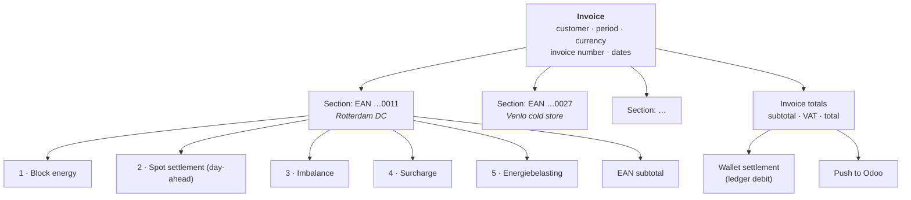
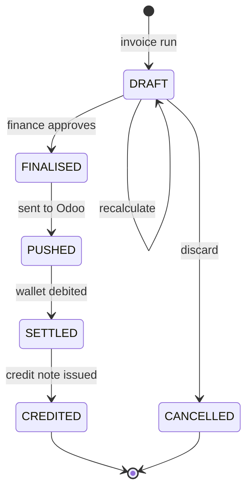

# Invoice Calculation

The complete line-item model for a monthly invoice, and the January annual true-up.

> **Readiness warning.** This is the least settled area of the specification. Three inputs are
> unresolved — the energiebelasting tariff table ([OQ-14]), the imbalance allocation rule
> ([OQ-15]) and the VAT treatment ([OQ-17]) — and each of them changes the arithmetic, not just a
> constant. The structure below is stable; the coefficients are not. Do not start building the
> invoicing engine until those three are closed.

---

## 1. Shape of an invoice



One invoice per customer per month. One section per metering point active in that month. Five line
categories per section, each of which may expand into several lines (one per block, one per tariff
tier).

## 2. Notation

| Symbol | Meaning |
| --- | --- |
| `M` | The invoice month, as a set of 15-minute intervals in `Europe/Amsterdam` |
| `m` | A metering point (EAN) |
| `i` | A 15-minute interval |
| `C(i,m)` | Consumption in kWh |
| `B(i,m)` | Block volume in kWh (§3 of [Position & coverage](02-position-and-coverage.md)) |
| `N(i,m)` | Net position `= C − B` |
| `DA(i)` | Day-ahead price, €/MWh |
| `p(b)` | Agreed block price, €/MWh |

All volumes divide by 1000 where a €/MWh price is applied.

---

## 3. Line 1 — Block energy

The customer pays for what was purchased, for the portion of each block falling inside the month.

```
blockMWh(b, m, M) = allocation_MW(b,m) × |{ i ∈ M : active(b,i) }| × 0.25

line1(b, m) = sign(b) × blockMWh(b, m, M) × p(b)
```

One line per block per metering point, so the invoice reads:

| Description | Volume | Unit price | Amount |
| --- | --: | --: | --: |
| Base block Aug-26 (trade #1042) | 148.80 MWh | €72.4000 | €10 773.12 |
| Peak block Q3-26 (trade #1051) — August portion | 50.40 MWh | €96.1500 | €4 845.96 |
| Sell base Aug-26 (trade #1067) | −29.76 MWh | €78.2000 | −€2 327.23 |

Referencing the trade number is what makes G4 ("invoices are reconstructable") real — every line
links back to a trade, and from there to its full audit history.

## 4. Line 2 — Spot settlement

Everything not covered by a block settles at day-ahead.

```
line2(m) = Σ_{i ∈ M}  N(i,m) / 1000 × DA(i)
```

Presented as two lines rather than one net figure, because netting hides information:

| Description | Volume | Avg. price | Amount |
| --- | --: | --: | --: |
| Day-ahead purchase (uncovered volume) | 214.35 MWh | €88.4210 | €18 953.04 |
| Day-ahead sale (surplus volume) | −41.08 MWh | €47.1130 | −€1 935.40 |

The average price shown is **volume-weighted**, computed as `amount / volume`, never as a mean of
interval prices.

**Over-coverage rule [OQ-13].** The formula above credits surplus at day-ahead. Two alternatives were
raised: credit at the block price (customer is made whole, PeakPower carries the market risk), or do
not credit at all (customer pays for what they bought regardless). The choice changes both the
customer proposition and PeakPower's risk position, so it is a commercial decision, not a technical
one. The engine must implement it as a configurable **surplus settlement policy** per customer
contract.

## 5. Line 3 — Imbalance

PVNed supplies imbalance volume and price per 15-minute settlement period, with separate
positive-direction and negative-direction prices.

From the sample report the relevant series are:

| `BusinessType` | `RecourceName` | Content |
| --- | --- | --- |
| `A20` | `Imbalance` | Imbalance volume per direction, with a settlement price |
| `B24` | `Imbalance price negative` | Price for the negative-imbalance direction |
| `B25` | `Imbalance price positive` | Price for the positive-imbalance direction |
| `A14` | `Prognosis` | Forecast position |
| `A02` | `Realisation` | Realised position |

```
imbalanceCost(i) = imbalanceVolume(i) / 1000 × imbalancePrice(i, direction)
```

### 5.1 The allocation problem

The imbalance report arrives at **portfolio (BRP) level**, not per EAN **[AS-18]** — the sample
carries `RecourceName: "Imbalance"` with no `ResourceObject` EAN. Yet the invoice is required to show
data per EAN.

Three candidate allocation keys:

| Key | Formula | Character |
| --- | --- | --- |
| **A. Pro-rata on consumption** | `share(m,i) = C(i,m) / Σ_m C(i,m)` | Simple, defensible, but charges a perfectly-forecast site for a badly-forecast one |
| **B. Pro-rata on forecast error** | `share(m,i) = \|C(i,m) − F(i,m)\| / Σ_m \|C − F\|` | Causal — the site that caused the imbalance pays for it — but requires a per-EAN forecast the platform does not have today |
| **C. Not allocated** | Imbalance is absorbed in PeakPower's margin and carried in the surcharge | Simplest invoice; hides a real and volatile cost |

**Recommendation:** ship with **A**, implemented behind an allocation-policy interface, and revisit
once per-EAN forecasts exist. Whichever is chosen must be stated in the customer contract — this is
the invoice line customers query most.

**[OQ-15]** must resolve this, and must also confirm whether PVNed can supply imbalance per EAN.

## 6. Line 4 — Surcharge (the "topup")

A per-MWh adder, configured per customer and validity period.

```
line4(m) = Σ_{i ∈ M} C(i,m) / 1000 × surcharge(customer, i)
```

| Field | Notes |
| --- | --- |
| `customer_id` | Surcharges are per customer **[OQ-12]** — see below |
| `valid_from` / `valid_to` | Half-open interval; no overlaps allowed for the same scope |
| `rate_eur_per_mwh` | Signed — a negative surcharge is a discount |
| `basis` | `CONSUMPTION` (default) or `ALL_VOLUME` |

> **Terminology.** The brief calls this a "topup". This set calls it a **surcharge** everywhere,
> because "top-up" also means adding money to the wallet, and the two appear on the same screens.
> **[OQ-12]** confirms that a "topup per customer per period" is indeed a €/MWh price adder and not,
> for example, a fixed monthly fee or a scheduled wallet deposit. If it turns out to be a fixed fee,
> this becomes a flat line rather than a volumetric one — a small change, but worth confirming
> before the tariff screens are built.

## 7. Line 5 — Energiebelasting

Dutch energy tax. **Per EAN, per calendar year, degressive tiers** — the rate per kWh falls as the
annual volume rises **[AS-14]**.

### 7.1 Tariff table (reference data)

```
energy_tax_tariff
  ├─ commodity        ELECTRICITY | GAS
  ├─ year             2026
  ├─ tier_index       1, 2, 3, 4
  ├─ lower_bound_kwh  inclusive
  ├─ upper_bound_kwh  exclusive, NULL for the top tier
  └─ rate_eur_per_kwh
```

| Tier | Annual volume band | Rate |
| --- | --- | --- |
| 1 | 0 – 10 000 kWh | `rate₁` |
| 2 | 10 000 – 50 000 kWh | `rate₂` |
| 3 | 50 000 – 10 000 000 kWh | `rate₃` |
| 4 | above 10 000 000 kWh | `rate₄` |

with `rate₁ > rate₂ > rate₃ > rate₄`.

> **The rates are deliberately not written here.** They are set annually by the Belastingdienst, the
> band boundaries have changed historically, and a rate copied into a specification is a rate that
> will be wrong within a year. They are loaded as reference data and version-controlled per year.
> **[OQ-14]** covers sourcing them, plus the questions of the *vermindering* (tax credit — normally
> not applicable to non-residential grootverbruik connections) and whether any customer holds an
> exemption or a reduced rate.

### 7.2 The cumulative method

Applying tiers to a single month in isolation is wrong: a site consuming 400 MWh a month would be
charged tier-3 rates on its first 10 MWh every month, when in reality it passes the tier-1 and
tier-2 bands once, in January.

The correct approach charges the **delta of the year-to-date cumulative tax**:

```
cumulativeTax(V) = Σ over tiers t:  clamp(V − lowerᵗ, 0, upperᵗ − lowerᵗ) × rateᵗ

ytdBefore(m) = Σ consumption for m, from 1 January to the end of the previous month
ytdAfter(m)  = ytdBefore(m) + Σ_{i ∈ M} C(i,m)

line5(m) = cumulativeTax(ytdAfter(m)) − cumulativeTax(ytdBefore(m))
```

This handles a mid-month tier crossing automatically, and produces a monthly charge that always sums
to the correct annual figure — provided the underlying volumes never change. Which they do, hence §9.

The invoice presents the tier breakdown, because customers check it:

| Description | Volume | Rate | Amount |
| --- | --: | --: | --: |
| Energiebelasting tier 3 (50 MWh – 10 GWh) | 385 420 kWh | `rate₃` | … |

### 7.3 Basis

Energiebelasting is levied on volume **taken from the grid**. With **[AS-06]** in force (production
is informational, not netted), the basis is gross consumption. If [OQ-11] resolves that production
nets against consumption, the tax basis changes too — and the two must move together.

---

## 8. Totals, VAT and settlement

```
eanSubtotal(m)   = line1 + line2 + line3 + line4 + line5
invoiceSubtotal  = Σ_m eanSubtotal(m)
vat              = Σ over VAT rate groups: base × rate                    [OQ-17]
invoiceTotal     = invoiceSubtotal + vat
```

**VAT [OQ-17].** Not mentioned in the brief, but unavoidable on a Dutch invoice. Three things need
confirming: the applicable rate per line category (energiebelasting is itself part of the VAT base in
the Netherlands, which affects ordering); whether any customer qualifies for a reverse-charge or
exemption; and — importantly for the wallet — **whether the amount reserved at trade acceptance is
VAT-inclusive or VAT-exclusive [AS-10]**. If wallet balances are VAT-exclusive but invoices are
VAT-inclusive, every wallet will drift short by 21% of its invoice value.

### 8.1 Wallet settlement

On finalisation the invoice total is debited from the wallet as a single ledger entry of type
`INVOICE_DEBIT`, linked to the invoice **[AS-12]**.

If the available balance is insufficient:

1. The invoice is still finalised and pushed to Odoo — the debt is real.
2. The wallet is allowed to go negative **only** through this path (never through a customer action,
   **[AS-11]**).
3. The customer is notified immediately, and a `WALLET_NEGATIVE` alert is raised on the employee
   dashboard.
4. Trading is blocked until the balance is restored. See [F06](../10-features/F06-wallet-and-ledger.md).

**[OQ-19]** asks whether partial settlement is preferred instead — debiting what is available and
carrying the remainder as a receivable in Odoo.

---

## 9. The January annual true-up

### 9.1 Why it exists

Two things make the twelve monthly invoices for a year not add up to the correct annual figure:

1. **Late metering corrections.** PVNed may correct a delivery date for up to 10 working days, and
   reconciliation can move volumes later still. A December correction changes the annual volume, and
   therefore which energiebelasting tier the *whole year* sits in.
2. **Degressive tiers are an annual construct.** They can only be settled definitively once the
   calendar year's volume is final.

### 9.2 The calculation

Run in January for the preceding year `Y`, per customer, per EAN:

```
finalAnnualVolume(m)   = Σ consumption over year Y, using the final data version for every day
recomputedTax(m)       = cumulativeTax( finalAnnualVolume(m) )
taxAlreadyInvoiced(m)  = Σ of line5 across all twelve invoices for year Y
taxCorrection(m)       = recomputedTax(m) − taxAlreadyInvoiced(m)
```

The same recomputation is applied to every other volume-driven component whose underlying data
changed, so the true-up covers corrections in general, not only tax:

```
energyCorrection(m)    = recomputedLine1..4(m) − alreadyInvoicedLine1..4(m)
```

The annual document is a **correction invoice** (or credit note if negative) carrying only the deltas,
with a supporting statement showing original vs. recomputed per component. It is not a replacement
for the monthly invoices — those stay as issued, which keeps the accounting trail intact.

### 9.3 Process

See [Annual true-up](../40-processes/05-annual-true-up.md) for the full flow, including the gate that
prevents the run from starting before all of the previous year's delivery dates are `FINAL`.

---

## 10. Recalculation and credit notes

A finalised invoice is **never** modified.



- **DRAFT** invoices can be recalculated freely and as often as needed.
- Once **FINALISED**, a correction is a new credit note plus a new invoice, or a delta correction in
  the annual true-up.
- Every state transition is recorded with actor, timestamp and reason.

## 11. Worked example — one EAN, one month

*Illustrative. Rates marked `rate₃` are placeholders pending [OQ-14].*

**EAN …0011 "Rotterdam DC", August 2026.** Consumption 385.42 MWh. Holds 0.4 MW base Aug-26 at
€72.40 and 0.2 MW peak Q3-26 at €96.15.

| # | Line | Volume | Price | Amount |
| --: | --- | --: | --: | --: |
| 1 | Base block Aug-26 (trade #1042) | 297.60 MWh | €72.4000 | €21 546.24 |
| 1 | Peak block Q3-26, August portion (trade #1051) | 50.40 MWh | €96.1500 | €4 845.96 |
| 2 | Day-ahead purchase | 84.12 MWh | €91.2400 | €7 675.11 |
| 2 | Day-ahead sale (surplus) | −46.70 MWh | €38.9100 | −€1 817.10 |
| 3 | Imbalance (pro-rata allocation) | — | — | €412.88 |
| 4 | Surcharge | 385.42 MWh | €4.5000 | €1 734.39 |
| 5 | Energiebelasting tier 3 | 385 420 kWh | `rate₃` | *pending* |
| | **EAN subtotal** | | | **€34 397.48** + tax |

Sanity check on the volumes: `297.60 + 50.40 + 84.12 − 46.70 = 385.42 MWh` — the energy lines
reconcile exactly to measured consumption. **This identity must be asserted by the invoice engine and
must appear on the invoice**; it is the single best guard against a coverage or calendar bug reaching
a customer.

## 12. Open questions raised here

| Ref | Question |
| --- | --- |
| [OQ-12] | Is a "topup" a €/MWh surcharge, a fixed periodic fee, or something else? |
| [OQ-13] | How is surplus (over-covered) volume settled? |
| [OQ-14] | Energiebelasting: tariff source, tax credit applicability, exemptions |
| [OQ-15] | How is portfolio-level imbalance allocated to EANs? Can PVNed supply it per EAN? |
| [OQ-17] | VAT treatment, and whether wallet amounts are VAT-inclusive |
| [OQ-18] | Are network/transport costs in scope for these invoices? |
| [OQ-19] | Behaviour when the wallet cannot cover an invoice: full debit into negative, or partial? |
