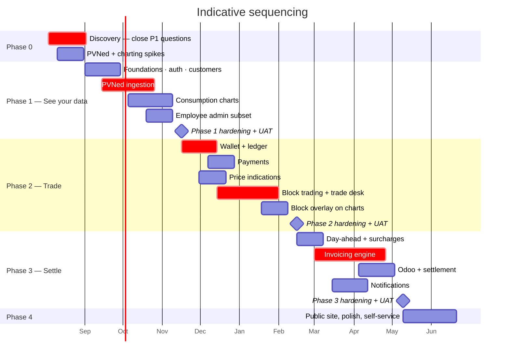
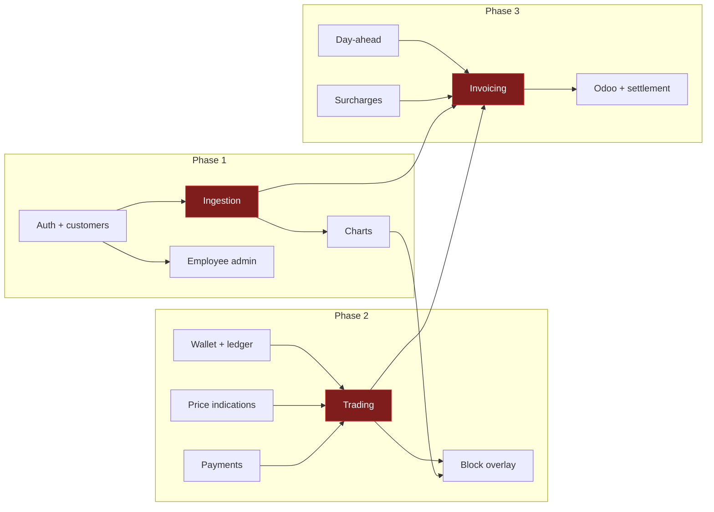

# Roadmap & Phasing

Four phases, sequenced so that the riskiest unknown is proven first and money only starts moving once
the data underneath it is trustworthy.

> **Durations below are relative, not committed.** They assume a team of roughly 2 backend, 2
> frontend, 1 lead/architect with a shared PO and QA, and they assume the open questions for each
> phase are closed before that phase starts. Neither is guaranteed yet. Treat them as sequencing and
> proportion, not as dates.

---

## 1. The shape

## 2. Phase 0 — Discovery & spikes

**Goal:** remove the two things that could invalidate the plan.

| Work | Why |
| --- | --- |
| Close the ten **P1 open questions** ([80-open-questions.md](../80-open-questions.md)) | Six are conversations, not analyses. They are cheap to close and expensive to leave open |
| **PVNed spike** — obtain endpoint details, get one real document, build the `DevStubs` generator | The largest technical unknown. If there is no test environment, the stub generator becomes critical path for all of phase 1 |
| **Charting spike** — build the day chart with block overlay against synthetic data, three candidate libraries | The chart is the product. A library that cannot do a clean step line over a stacked area at 96 points is discovered now, not in month three |
| **Wallet ledger spike** — the reserve/settle/release model against real PostgreSQL, with the concurrency tests from [Solution structure §6.1](../20-architecture/02-solution-structure.md) | The other place a wrong early decision is expensive to unwind |
| Confirm identity provider, cloud target, existing Montel implementation | Unblocks phase 1 setup |

**Exit criteria:** every P1 question answered or explicitly deferred with a recorded owner; three
spikes demonstrated; phase 1 backlog estimated.

## 3. Phase 1 — *See your data*

**Goal:** a customer logs in and sees accurate, well-labelled interval data for every connection.
**No money moves.**

| Feature | Scope |
| --- | --- |
| [F13](../10-features/F13-identity-and-access.md) Identity | Both realms, OIDC, roles, `customer_id` claim, tenancy isolation with its automated test |
| [F01](../10-features/F01-customer-and-metering-points.md) Customers & EANs | Full |
| [F02](../10-features/F02-metering-data-ingestion.md) Ingestion | Full — the heart of this phase |
| [F03](../10-features/F03-consumption-visualisation.md) Charts | Day and month views, KPIs, data states. **No block overlay** |
| [F12](../10-features/F12-employee-back-office.md) Back office | Customer admin, ingestion health, quarantine, message log, replay |
| [F15](../10-features/F15-audit-and-observability.md) Audit | Master-data audit, correlation, health checks, alerting |
| Platform | Aspire, CI/CD, environments, `DevStubs`, migrations, partitioning, calendar service |

**Why first.** Ingestion is the biggest unknown and everything else depends on it. Shipping a
read-only phase gets real PVNed data flowing months before anyone is relying on it for money, which
is exactly when you want to discover its quirks.

**Exit criteria:** real PVNed data arriving in production; a customer can see a correct day and month
chart; DST days handled correctly; data states visible; ingestion alerting proven by a deliberate
outage test.

## 4. Phase 2 — *Trade*

**Goal:** the full request → offer → accept → confirm loop, with real money reserved and settled.

| Feature | Scope |
| --- | --- |
| [F06](../10-features/F06-wallet-and-ledger.md) Wallet & ledger | Full, including reconciliation job |
| [F07](../10-features/F07-wallet-topup-and-payments.md) Top-up | iDEAL + bank transfer instructions + manual registration |
| [F04](../10-features/F04-price-indications.md) Price indications | Full |
| [F05](../10-features/F05-energy-block-trading.md) Trading | Full — both portals |
| [F03](../10-features/F03-consumption-visualisation.md) Charts | Block overlay, coverage KPIs |
| [F11](../10-features/F11-notifications.md) Notifications | Trade and offer notifications only |
| [F12](../10-features/F12-employee-back-office.md) Back office | Trade desk, wallet admin |

**Order within the phase matters.** Wallet before trading, because trading depends on reserve/settle/
release being correct. Price indications can run in parallel — they have no dependency on the wallet.

**Exit criteria:** an end-to-end trade in production with real money; the eight correctness tests from
[Solution structure §6.1](../20-architecture/02-solution-structure.md) passing; ledger reconciliation
clean for 30 consecutive days.

## 5. Phase 3 — *Settle*

**Goal:** monthly invoices, calculated, reviewed, pushed to Odoo and settled from the wallet.

| Feature | Scope |
| --- | --- |
| [F08](../10-features/F08-day-ahead-prices.md) Day-ahead | Full, including backfill for the periods being invoiced |
| [F09](../10-features/F09-surcharges.md) Surcharges | Full |
| [F10](../10-features/F10-invoicing-and-settlement.md) Invoicing | Monthly run, review, finalisation, Odoo push, wallet settlement, credit notes |
| [F11](../10-features/F11-notifications.md) Notifications | Wallet thresholds, invoice events |
| [F12](../10-features/F12-employee-back-office.md) Back office | Invoice run dashboard, reference data admin |

**The annual true-up is scheduled separately**, ahead of the first January after go-live. It is a
distinct piece of work with its own gate and it is not needed to invoice month one.

**Do not start this phase until [OQ-14], [OQ-15] and [OQ-17] are closed.** Each changes the
arithmetic, not a constant.

**Exit criteria:** a full month invoiced in parallel with the existing process and reconciled to the
cent; the volume identity assertion passing for every customer; Odoo push and wallet settlement
proven independent under failure.

## 6. Phase 4 — *Polish*

Public website, self-service onboarding, reporting, remaining *Should* and *Could* items, and
whatever the first three phases taught you was missing.

---

## 7. Relative sizing

Percentages of total build effort, so the shape is visible without pretending to a schedule.

| Phase | Share | Dominated by |
| --- | --: | --- |
| Phase 0 | 6% | Spikes and decisions |
| Phase 1 | 30% | Ingestion (half of the phase), charts |
| Phase 2 | 34% | Trading (half of the phase), wallet |
| Phase 3 | 24% | Invoicing (two-thirds of the phase) |
| Phase 4 | 6% | |

The three critical-path items — **ingestion, trading, invoicing** — are roughly half of the total on
their own. They are also the three with the most open questions. That correlation is not a
coincidence and it is the main thing to manage.

## 8. Parallelisation

Frontend and backend can run together throughout: contracts are defined by the OpenAPI documents, and
clients are generated from them, so the frontend is never blocked on a backend implementation — only
on a contract.

## 9. What would change this plan

| If… | Then |
| --- | --- |
| PVNed has no test environment | `DevStubs` becomes critical path; phase 1 lengthens by 2–3 weeks |
| The Montel licence forbids showing indications to customers | [F04](../10-features/F04-price-indications.md) is redesigned; phase 2 gains a discovery loop |
| Imbalance can be supplied per EAN | Invoicing simplifies materially; phase 3 shortens |
| Four-eyes approval is required ([OQ-09]) | Trading gains a state and an approval UI; phase 2 grows |
| Gas is pulled forward | A phase of its own, not an extension — units, tariffs and calorific correction are all new |
| Production must net against consumption ([OQ-11]) | Coverage, invoicing and tax basis change together; affects phases 2 and 3 |
| Client-money regulation applies ([OQ-31]) | Potentially a licensing prerequisite before go-live. **Answer this early** |

## 10. Recommended team

| Role | Phase 0 | Phase 1 | Phase 2 | Phase 3 | Phase 4 |
| --- | :--: | :--: | :--: | :--: | :--: |
| Lead / architect | 1 | 1 | 1 | 1 | 0.5 |
| Backend (.NET) | 1 | 2 | 2 | 2 | 1 |
| Frontend (Angular) | 1 | 2 | 2 | 1.5 | 1 |
| Product owner | 1 | 0.5 | 0.5 | 0.5 | 0.5 |
| QA | — | 0.5 | 1 | 1 | 0.5 |
| Domain expert (trading) | 0.5 | 0.2 | 0.5 | 0.2 | — |
| Domain expert (finance) | 0.5 | 0.2 | 0.2 | **1** | — |

The finance domain expert in phase 3 is not optional. Invoicing has the most unknowns, the least
tolerance for error, and the answers live in someone's head rather than in a document.
