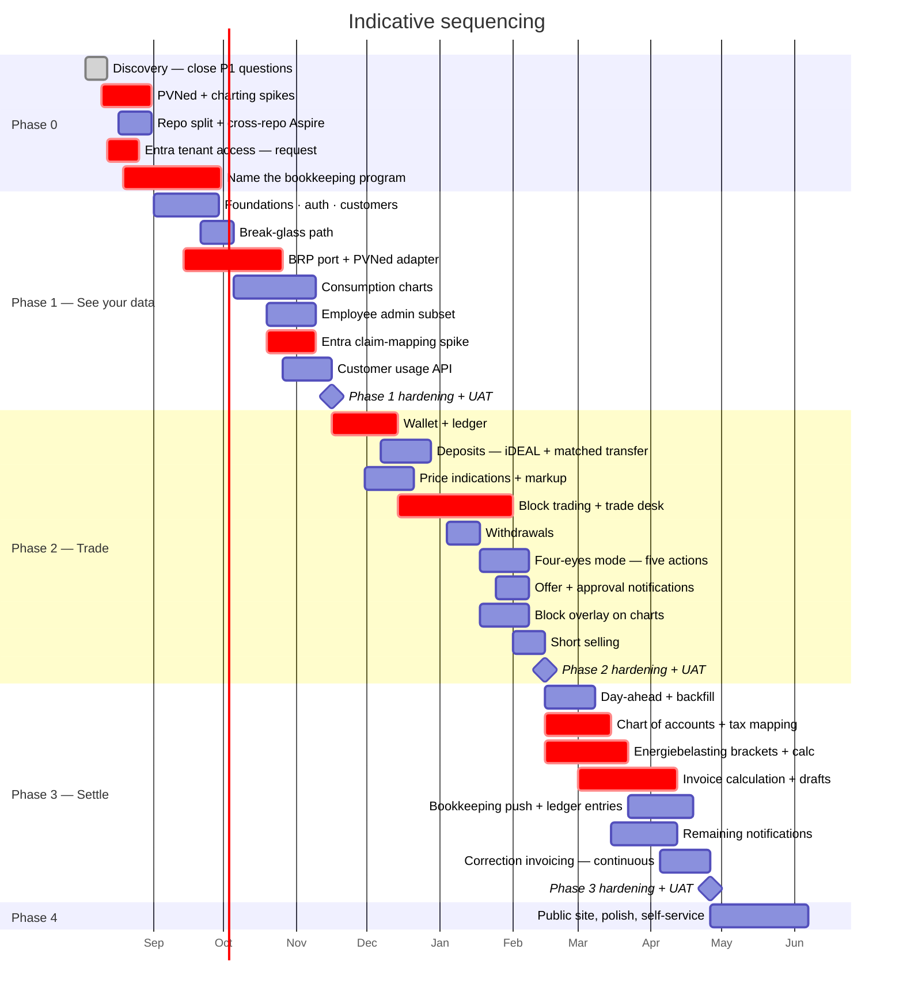
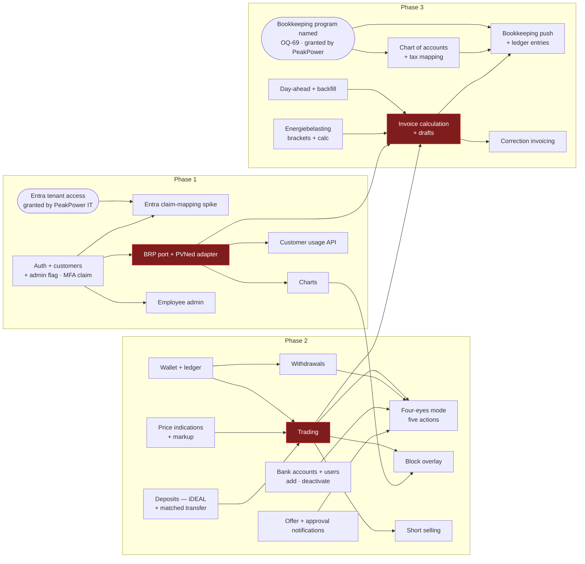

# Roadmap & Phasing

Four phases, sequenced so that the riskiest unknown is proven first and money only starts moving once
the data underneath it is trustworthy.

> **Durations below are relative, not committed.** They assume a team of roughly 2 backend, 2
> frontend, 1 lead/architect with a shared PO and QA, and they assume the open questions for each
> phase are closed before that phase starts. Neither is guaranteed yet. Treat them as sequencing and
> proportion, not as dates.

> **Updated 2026-08-11.** Phase 0's headline goal is met: all eleven P1 open questions are closed as
> **[DEC-19]**…**[DEC-29]**. **Phase 3 shrinks materially** — **[DEC-24]** and **[DEC-25]** remove two
> of the five invoice line categories outright and defer the annual true-up. Phase 0's own risks are
> not all gone: **[DEC-21]** and **[DEC-28]** *defer* R-01 and R-05 rather than answering them.

> **Updated again 2026-08-11, second round.** Thirty-six further questions were decided as
> **[DEC-30]**…**[DEC-65]**, and this time **every phase gained work**. Phase 0's setup changes shape
> under **[DEC-55]** (separate repositories) and **[DEC-54]** (Angular 22). Phase 1 gains the
> break-glass path **[DEC-53]** and the production-expectation property **[DEC-65]**. Phase 2 gains
> **four-eyes approval [DEC-33]**, which adds a state to a machine that had exactly ten transitions.
> Phase 3 gets a line category back — **[DEC-44]** makes feed-in its own category — so the shrink
> recorded above is partly given up.
>
> ⚠ ~~**Phase 0 is not finished after all.** **[OQ-88]** is a new **P1**.~~ — **resolved the same day
> by [DEC-66]**; see the third-round note below. The reopening lasted one round.

> **Updated again 2026-08-11, third round — [DEC-66] and [DEC-67]. Phase 0's P1 is closed again, and
> the blocking count is back to 0.** Entra ID uses PeakPower's **existing corporate Microsoft
> tenancy**. **[DEC-56]** is **clarified, not reversed**: "no existing Azure tenancy" means no Azure
> **subscription, landing zone or naming standard**, so the greenfield work in
> [Deployment](../20-architecture/09-deployment.md) is untouched — Azure subscriptions are simply
> created **under** the corporate Entra tenant. Employee identity stays single, and **[DEC-20]**,
> **[DEC-51]** and **[DEC-53]** all keep the one directory they assume.
>
> ⚠ **This is where the decision's residue lands, and it is a dependency rather than a question.** The
> tenancy exists; **access to it** does not, and access is administered by someone outside the
> delivery team. It cannot be closed by deciding — only by being asked for — so it is a **Phase 0
> dependency with a named owner and a date**, listed in **§2.1**, and it is deliberately **not** in
> [80-open-questions.md](../80-open-questions.md). **[DEC-67]** then puts it on the critical path *by
> choice*: the `customer_id` claim-mapping spike runs against the corporate tenancy rather than a
> throwaway developer tenant, so the spike **inherits** this dependency. The PoC ships unauthenticated
> **[DEC-20]**, so nothing is blocked *today* — which is exactly what makes it easy to forget until it
> is late. **[R-24]** falls from 16 to 9 and is retitled accordingly.

> **Updated 2026-08-19, fourth round — [DEC-68]…[DEC-112]. The plan does not get shorter; work changes
> hands.** Forty-five decisions were taken. The through-line is a swap. The platform **sheds**
> invoicing mechanics — numbering **[DEC-88]**, the PDF and the email **[DEC-89]**, VAT **[DEC-76]**,
> the surcharge and invoice line 4 **[DEC-73]**, the feed-in tariff and line 6 **[DEC-87]**, settlement
> of invoices from the wallet **[DEC-77]**, chargebacks **[DEC-85]** and PSP settlement reconciliation
> **[DEC-105]** — to a **bookkeeping program**. It **gains** energiebelasting **[DEC-74]**, short
> selling **[DEC-72]**, configurable BRPs **[DEC-69]**, platform-matched bank-transfer deposits
> **[DEC-106]**, withdrawals **[DEC-83]**, a customer usage API **[DEC-97]**, four-eyes as a
> per-company mode **[DEC-71]**, the configurable indication markup **[DEC-80]**, mandatory MFA
> verification **[DEC-92]**, day-ahead backfill **[DEC-75]** and continuous correction invoicing
> **[DEC-99]**. Phase 3 loses more scope in one round than any phase has, and still does not shrink:
> energiebelasting is larger than everything that left it.
>
> ⚠ **The blocking count is 1, and it is a phase 0 item that has never been treated as one.**
> **[OQ-69]** — *which* bookkeeping program, in which version, with what API — is re-prioritised to
> 🔴 **P1** and is the only blocking question on the register. Five decisions moved work into that
> program and two more added to it, so **no customer invoice can be issued at all** until it is named:
> not late, not unnumbered — **not at all**. It becomes a **Phase 0 dependency with a named owner and
> a date**, listed in **§2.1** beside the tenant-access item and repeated in **§9**. **[DEC-107]** is
> the second half of the same problem: the chart of accounts and the tax-code mapping **do not exist
> and must be built**, and they now have to carry an energiebelasting ledger account **[DEC-74]** and a
> VAT rate per account **[DEC-76]** — the artefact grew before anyone wrote a line of it. It needs a
> **named owner from day one** (§2.1, §10).
>
> ⚠ **Three decisions change the go-live gates rather than the build.** **[DEC-102]** buys no external
> penetration test, **[DEC-103]** signs no customer SLA, and **[DEC-104]** names **one** operator with
> no rota. None of them adds a task; all three move risk past go-live, where it is someone's to carry
> rather than the plan's to absorb. §10.

---

## 1. The shape

~~Phase 3 is shorter than it was, but by less than it looked. **[DEC-24]** and **[DEC-25]** remove
invoice lines 5 and 3 — energiebelasting and imbalance — and defer the annual true-up with them, and
**[DEC-26]** settles the half of the VAT question that would otherwise have reached into the wallet.
Then **[DEC-44]** puts a line category **back**: feed-in on exported volume becomes line 6, with its
own per-customer reference-data table alongside the surcharge. Three line categories became four.~~

⚠ **Restated 2026-08-19.** Four line categories became **three**, and the three are not the three that
were expected. Line 4 (surcharge) leaves with **[DEC-73]**, line 6 (feed-in) leaves with **[DEC-87]**,
and line 5 (energiebelasting) comes **back** with **[DEC-74]**, reversing **[DEC-24]**. What is built
is lines **1, 2 and 5** — block energy, the day-ahead spot leg (now carrying export as well as unused
block cover), and energiebelasting. Fewer lines is not less work: the two that left were flat
per-customer rates read from a table, and the one that returned is a **degressive bracket calculation
with per-customer reductions, a cumulative year-to-date method and a 50%-per-bracket split on mid-year
EAN transfer [DEC-74]**. Phase 3's line count fell and its difficulty rose.

Nine bars are new or renamed in the fourth round. **Name the bookkeeping program** joins phase 0 as
the only *blocking* item on the chart — it is drawn as work with a date because **[OQ-69]** is now
🔴 P1 and §2.1 holds the owner. **PVNed ingestion** is renamed **BRP port + PVNed adapter**
**[DEC-69]**: the same 42 days, a different shape, with the parser and validation behind an interface
and one adapter built. **Customer usage API** **[DEC-97]** is a new phase-1 bar. **Payments** becomes
**Deposits — iDEAL + matched transfer** **[DEC-106]** and gains a sibling, **Withdrawals**
**[DEC-83]**. **Four-eyes approval** becomes **Four-eyes mode — five actions** **[DEC-71]**, which is
wider than the version it replaces. **Short selling** **[DEC-72]** is its own 14-day bar at the end of
phase 2 because **[OQ-94]** gates it and a gated slice needs a date someone can miss. In phase 3,
**Day-ahead + surcharges + feed-in** becomes **Day-ahead + backfill** **[DEC-75]**, **Energiebelasting
brackets + calc** and **Chart of accounts + tax mapping** **[DEC-107]** are new, **Invoicing engine**
becomes **Invoice calculation + drafts** and **Odoo + settlement** becomes **Bookkeeping push + ledger
entries** **[DEC-88]**, **[DEC-89]**, and **Correction invoicing — continuous** **[DEC-99]** closes the
phase where the annual true-up used to sit.

⚠ **Two phase-3 bars overlap on purpose and one hand-off inside that overlap is the risk.**
Energiebelasting (`p3f`, to 2027-03-22) runs three weeks into the invoice calculation (`p3b`, from
2027-03-01), because line 5 is an input to a document the engine assembles. The mapping bar (`p3e`) is
sequenced to finish 2027-03-15, a week before the push work (`p3c`) starts, for the same reason: you
cannot push a ledger entry to an account that has not been agreed.

Six bars were new in the earlier rounds. **Entra tenant access** and **Repo split + cross-repo
Aspire** sit in phase 0
because both are prerequisites for setup rather than parts of it — **[DEC-55]** decides where the code
lives, and the tenancy bar is no longer a *decision*: **[DEC-66]** settled which directory, so what
the bar carries is the **access request**, with the owner and dates in §2.1. **Break-glass** is its
own slice in phase 1 rather than a corner of the auth work, for the reason **[DEC-53]** gives: a path
that is not rehearsed is not a path. The **Entra claim-mapping spike** is now a bar of its own rather
than an implied line inside the F13 slice, because **[DEC-67]** gives it an external dependency and
work with an external dependency needs a date someone can miss. **Four-eyes approval** and the
**offer and approval notifications** it needs are phase 2, with the caveat in §4.

⚠ **The two Entra bars are one dependency, drawn twice.** `p0d` ends 2026-08-26 and `p1f` starts
2026-10-19; the eight weeks between them are the only slack there is, and they are slack in the wrong
place — nothing pushes on the access request while the PoC runs unauthenticated **[DEC-20]**.

⚠ **`p0e` has no slack at all, and that is the point.** The bookkeeping bar runs 2026-08-19 →
2026-09-30. Nothing on the chart before phase 3 waits for it, so it will feel optional for five
months; then the invoicing slice cannot be specified, the mapping cannot be built **[DEC-107]** and
the first draft cannot be pushed **[DEC-88]**. It is the same failure mode as the tenant-access bar —
an item nobody is blocked by until everybody is — which is why both sit in §2.1 with owners.

⚠ **The bars are still relative.** Six more bars does not mean six more months; it means six more
things that have to be sequenced, and the sequencing is what this chart is for.

## 2. Phase 0 — Discovery & spikes

**Goal:** remove the things that could invalidate the plan. There were two; the second decision round
briefly added a third, and the third round closed it. What that third item left behind is not work of
the same kind — it is a **dependency on someone outside the team**, and it is listed in **§2.1**
rather than here, because a dependency is discharged by asking, not by deciding.

⚠ **The fourth round adds two more items of exactly that kind, and one of them is the blocking one.**
**[OQ-69]** — which bookkeeping program — is 🔴 P1 as of 2026-08-19 and is the only blocking question
on the register. It is **not** work the team can do: someone at PeakPower has to choose a product.
**[DEC-107]** then attaches work to that choice — the chart of accounts and the tax-code mapping have
to be **built**, with an energiebelasting ledger account **[DEC-74]** and a VAT rate per account
**[DEC-76]** — and that work needs an owner from day one, not from the week the first push is written.
Both are in **§2.1**, beside the tenant-access item, for the same reason: a request with no name is a
request nobody makes.

| Work | Why |
| --- | --- |
| ~~Close the **eleven** P1 open questions~~ ✅ **Done — closed 2026-08-11** as **[DEC-19]**…**[DEC-29]** ([80-open-questions.md](../80-open-questions.md)) | Eleven, not ten as this table previously said. They were cheap to close and expensive to leave open. Three were closed by deferral or for the PoC only rather than settled |
| ~~Resolve [OQ-88] — the tenancy contradiction~~ ✅ **Done — closed 2026-08-11** as **[DEC-66]** | Entra ID uses PeakPower's **existing corporate Microsoft tenancy**, and **[DEC-56]** is clarified rather than reversed: no Azure **subscription, landing zone or naming standard**, but the new subscriptions sit **under** the corporate Entra tenant, so employee identity stays single. ⚠ **What is left is not this row.** *Access* to that tenancy is a **dependency with an owner and a date** — §2.1 — and **[DEC-67]** puts it on the critical path by choice. **[R-24]** falls 16 → 9 |
| **PVNed spike** — obtain endpoint details, get one real document, build the `DevStubs` generator | The largest technical unknown. **[DEC-21]** lets the PoC proceed on generated data in the PVNed document format, so the generator *is* now critical path — but the endpoint, authentication, acknowledgement and retry questions are only deferred, and R-01 keeps its score of 20. The generator now has three fewer guesses to make: one document per EAN per day **[DEC-38]**, ~~nothing after the 10-working-day window **[DEC-57]**~~ ⚠ **Reversed 2026-08-19 by [DEC-98]** — reconciliation data *does* arrive after the window, sometimes by hand, so the generator must be able to emit a late correction, and no `A01` series at all for a non-producing connection **[DEC-65]**. ⚠ **Widened 2026-08-19 by [DEC-69]**: the spike now also has to answer *what a second BRP would need to differ in* — credentials, endpoint, document format — because that is what the port has to abstract. Ask PVNed the questions as **a** BRP, not as **the** BRP |
| **Charting spike** — build the day chart with block overlay against synthetic data, ~~candidate libraries **from the free field only**~~ **candidates on fit alone [DEC-79]** | The chart is the product. A library that cannot do a clean step line over a stacked area at 96 points is discovered now, not in month three. ~~**[DEC-39]** answers the licence half of [OQ-22] — open-source and free, or in-house — and explicitly *keeps* this spike, narrowed to the free field and to the cost of building custom.~~ ⚠ **Reversed 2026-08-19 by [DEC-79]** — a commercial licence is acceptable, so the spike **no longer screens on licence** and no longer has to price building the thing in-house. The field is wider and the criterion is single: does it draw this chart well? That is a slightly cheaper spike with a better expected outcome. **[DEC-54]** fixes Angular 22; the component library **[OQ-49]** is unchosen and decides the same layer, so spike them together |
| **Repo split setup** — two repositories **[DEC-55]**, and the three properties that no longer come for free | **New.** The Aspire AppHost must start front-ends it does not contain; OpenAPI-generated clients now cross a repository boundary and need a publishing step; and "one command brings up the whole system" has to be **preserved deliberately**. Cheap to arrange now, awkward once two CI pipelines have opinions. ~~[OQ-52] gains weight with it: "align with existing conventions" now has to name a repository~~ ✅ **Closed 2026-08-19 by [DEC-96]** — there *is* an existing .NET estate and a **Montel service Luka has already built**, so the conventions have an address. The residue is not a question but a reading task: someone has to open that service before the price-board estimate is firm |
| **Wallet ledger spike** — the reserve/settle/release model against real PostgreSQL, with the concurrency tests from [Solution structure §6.1](../20-architecture/02-solution-structure.md) | The other place a wrong early decision is expensive to unwind. **Test money only** while [OQ-31] stays deferred **[DEC-28]**. ~~Extend it with the **[DEC-33]** shape: a reservation that survives acceptance and is released by approval, refusal or expiry~~ ⚠ **Restated 2026-08-19.** The reservation shape survives **[DEC-71]** unchanged — approval, refusal or expiry are still the three exits — but three things around it changed and all three belong in this spike: the reserved amount is **VAT-inclusive** **[DEC-78]**, `volume × price × (1 + 0.21)` at the **[DEC-64]** rate, so the spike must prove the grossed-up figure and not the ex-VAT one; the wallet has **no `INVOICE_DEBIT`** any more **[DEC-77]**, which removes an entry type and a whole class of partial-settlement cases from the model; and a **withdrawal** is a new debit path **[DEC-83]** that leaves the platform through a human, so the spike should carry a request → approval → payout → debit sequence beside the trade one |
| ~~Confirm identity provider~~ ✅ **Microsoft Entra ID in production, on the existing corporate tenancy [DEC-20]**, **[DEC-66]**; the PoC runs unauthenticated **[DEC-20]**. Confirm cloud target ([OQ-50]) and ~~the existing Montel implementation ([OQ-52])~~ ✅ **[DEC-96]** | Unblocks phase 1 setup, and is **no longer conditional** — [OQ-88] closed. **[DEC-20]** does not remove tenancy work from phase 1; it makes the context pipeline more urgent, not less. **[DEC-56]** makes [OQ-50] a greenfield choice rather than an inherited one, now with **[DEC-66]**'s constraint that the subscriptions sit under the corporate Entra tenant — worth settling before the first `deploy/infra` commit. ⚠ **[DEC-92]** adds one item to the tenant conversation: MFA for customer users is **mandatory**, still enforced by Conditional Access **[DEC-66]** rather than in the platform, but the platform now **verifies the authentication-method claim** rather than trusting the tenant silently — which is a claim to ask for at the same time as `customer_id` **[F13-R32]** |
| **Name the bookkeeping program** — **[OQ-69]**, 🔴 **P1** as of 2026-08-19 | **New, and the only blocking item in the plan.** Not a spike and not a decision the team can take: someone at PeakPower has to choose a product, a version, a hosting model and an API. **[DEC-88]** gives it invoice numbering, **[DEC-89]** the PDF and the email, **[DEC-105]** payment settlement reconciliation, **[DEC-108]** customer records and **[DEC-109]** the deposit view, while **[DEC-74]** and **[DEC-76]** add an energiebelasting ledger account and a VAT rate per account. Until it is named, phase 3's largest integration cannot be specified and **no customer invoice can be issued at all**. Owner and dates in **§2.1**; consequence in **§9** |
| **Chart of accounts + tax-code mapping — name the owner** **[DEC-107]** | **New.** **[DEC-59]** established that neither exists; **[DEC-107]** turns that from an observation into an obligation: they must be **built**. The build itself is phase 3 (`p3e`), but the *owner* is a phase 0 item, because the artefact is finance's to author and engineering's to consume, and an unowned mapping is discovered in the week of the first push. It grew before it was written — an energiebelasting account **[DEC-74]** and a VAT rate per account **[DEC-76]** are both new since [DEC-59] |

**Exit criteria:** ✅ every P1 question answered or explicitly deferred with a recorded owner — met on
2026-08-11 for the original eleven, with [OQ-05], [OQ-14] and [OQ-31] recorded as deferred rather than
settled; three spikes demonstrated; phase 1 backlog estimated.
~~✅ **The first criterion is no longer reopened.** [OQ-88], raised by the second decision round, closed
the same day with **[DEC-66]**; the blocking count is back to **0** and phase 0 is not held by it.~~ The
other two criteria were outstanding before and remain so.

⚠ **Reopened 2026-08-19 — the first criterion is not met.** [OQ-88] stayed closed, but **[OQ-69]** was
re-prioritised to 🔴 **P1** on 2026-08-19 and the blocking count is **1**, not 0. Phase 0 cannot claim
"every P1 question answered" while the bookkeeping program is unnamed. The exit rule is the same one
§2.1 uses everywhere else and it is deliberately weak in the same way: phase 0 exits on the choice
being **owned and dated**, not on the product being **bought**. What phase 0 may *not* do is exit with
[OQ-69] unowned, because the first thing that breaks is phase 3's largest integration and the second
is the invoice itself **[DEC-88]**.

⚠ **One criterion is added, and it is deliberately weak.** Every dependency in §2.1 must have a
**named owner and a date** before phase 0 exits. Phase 0 exits on the tenant-access request being
**raised and dated** — *not* on it being **granted**, because granting is not the team's to do and
gating an exit on someone else's calendar produces a phase that never closes. ⚠ The failure mode is
the mirror image: a dependency recorded, never chased, and discovered unmet in week nine of phase 1.
That is what the date is for.

### 2.1 Phase 0 dependencies on external parties

Not work — **requests**. Each is discharged by someone outside the delivery team, so each needs a
**named owner inside it** whose job is to chase, and a **date**. None of them is an open question, and
none appears in [80-open-questions.md](../80-open-questions.md); looking for them there is the mistake
this table exists to prevent.

| Dependency | Who grants it | Owner (chases it) | Raise by | Needed by | Why the date is that date |
| --- | --- | --- | --- | --- | --- |
| **Access to the corporate Entra tenancy** **[DEC-66]** | PeakPower IT — whoever administers the corporate Microsoft tenant | ⚠ **Unnamed — must be named before phase 0 exits** | **2026-08-12** | **2026-08-26**, and hard-stop **2026-10-19** | The tenancy **exists [DEC-66]**; only access is outstanding. 2026-08-26 keeps it ahead of phase 1 starting 2026-09-01; 2026-10-19 is when the claim-mapping spike starts (`p1f`), and **[DEC-67]** runs that spike against **this** tenancy, so the spike cannot start without it. Needed for: app registrations for both portals **[F13-R03]**, the `customer_id` claim mapping **[F13-R32]**, tenant MFA policy **[DEC-51]**, and the directory that will hold the managed identities ([Deployment §1.1](../20-architecture/09-deployment.md)) |
| **The bookkeeping program named — [OQ-69]** 🔴 **P1** | PeakPower — commercial and finance, not the delivery team | ⚠ **Unnamed — must be named before phase 0 exits** | **2026-08-19** | **2026-09-30** (`p0e`), hard-stop **2027-02-15** | **New 2026-08-19, and the only blocking item in the plan.** 2026-09-30 is the last date at which phase 3's integration can be specified without guessing; 2027-02-15 is when phase 3 starts and the mapping build (`p3e`) begins, and neither can begin against an unnamed target. Needed for: draft-invoice push and invoice numbering **[DEC-88]**, the PDF and the customer email **[DEC-89]**, energiebelasting ledger entries **[DEC-74]**, VAT per ledger account **[DEC-76]**, payment settlement reconciliation **[DEC-105]**, customer records created from the platform **[DEC-108]** and the bank-feed view of deposits **[DEC-109]**. ⚠ Unlike every other row here, the thing being asked for is a **decision**, not access — which makes it faster to grant and easier to postpone |
| **Chart of accounts + tax-code mapping, authored** **[DEC-107]** | PeakPower finance, against the program above | ⚠ **Unnamed — must be named before phase 0 exits** | **2026-08-19** | First draft **2026-10-31**; complete before `p3e` ends **2027-03-15** | **New 2026-08-19.** **[DEC-59]** said it does not exist; **[DEC-107]** says it must be built. It is the one row in this table that is **work as well as a request** — hence a named owner from day one and a first draft months before it is needed, because it can only be written once [OQ-69] is answered and it has grown since [DEC-59]: an energiebelasting account **[DEC-74]** and a **VAT rate per account** **[DEC-76]**, since the platform now computes no VAT at all |
| **PVNed endpoint, auth, ack format and a test environment** ([OQ-65], [OQ-05]) | PVNed | ⚠ **Unnamed** | Phase 0 | Before the real integration is validated | **[DEC-21]** buys time with generated data; it does not remove the dependency, and **R-01 (20)** is the highest-scoring risk on the register. A third party's calendar is not controllable, so book it rather than wait for it. ⚠ **Widened 2026-08-19 by [DEC-69]**: PVNed is now the **first BRP, not the only one**, so the same conversation must establish what varies between BRPs — credentials, endpoint, document format — and **[DEC-98]** adds one item to the list: the reconciliation data that arrives *after* the 10-working-day window, in whatever form it arrives |
| **A dedicated sending domain with SPF, DKIM and DMARC** **[DEC-48]** | Whoever owns PeakPower DNS | ⚠ **Unnamed** | Phase 0 | ~~Before the first invoice run (phase 3)~~ ⚠ **Pulled forward 2026-08-19: before the first offer notification (phase 2)** | DMARC is the long pole — start at `p=none`, read the reports, then tighten ([Deployment §5.1](../20-architecture/09-deployment.md)). ~~**[DEC-47]** puts invoices on the same channel as time-critical offer notifications~~ ⚠ **Amended 2026-08-19 by [DEC-89]**: the bookkeeping program sends the invoice email, so SendGrid narrows to the platform's **own** notifications — offers **[DEC-111]**, wallet events, deposit-received confirmations **[DEC-106]**, alerts. That makes the domain needed **earlier**, not later: phase 2's 30-minute offer window is the first thing that fails if mail lands in spam |
| **DPIA and processor agreements** ([OQ-58]) | Legal, with PVNed, ~~CM.com **[DEC-58]**~~ **a PSP still unchosen [DEC-86]**, Entra ID **[DEC-20]**, SendGrid **[DEC-48]** and the cloud provider | ⚠ **Unnamed for the transfer** — **Kikker holds them for the test phase [DEC-101]** | Phase 0 | Before go-live | The counterparties are all named now, which makes the work schedulable rather than open-ended. Longest external lead time of the four. ⚠ **Amended 2026-08-19 by [DEC-101]**: **Kikker** holds the DPIA and the processor agreements **for the test phase**, and ownership transfers to PeakPower later. That is not an open question — it is a **go-live item with a date**, and the date is unset. **[DEC-86]** leaves the PSP unchosen, so one counterparty on this list cannot be papered yet; the port **[F07-R20]** keeps that cheap technically and does nothing for it legally |

⚠ **Every owner column above says "Unnamed".** That is the honest state and not a formatting
placeholder — [OQ-88] closed without anyone being asked for anything, and **[DEC-66]** says so
explicitly. **A dependency with a date and no name is a date nobody misses.**

⚠ **Two rows were added on 2026-08-19 and the table is now the plan's real critical path.** **Four
of the six** rows are needed before phase 2 ends — see the 2026-08-19 round below, which is the count
that governs. (An earlier draft of this note said five; the round that added the two rows also moved
one out of phase 2.) Two of them, [OQ-69] and the mapping **[DEC-107]**, are blocking rather than
merely early. None of the six is engineering work; all six are somebody saying yes. That ratio is
worth reading twice: the plan's largest single exposure is not code.

⚠ **One of the six was resolved by removing it — 2026-09-03, [DEC-119].** The **Entra tenant access**
row is closed, not by access arriving but by the proof of concept ceasing to need it: the platform
now owns identity outright, JWT only, with no Microsoft integration anywhere. What that buys is that
slice 1 was not blocked. What it costs is recorded rather than netted off — **[DEC-92]**'s mandatory
MFA and **[DEC-51]**'s tenant-enforced Conditional Access have nothing enforcing them, and employee
single sign-on does not exist. The row returns the day an identity provider does, and it returns
carrying a **migration** for the credentials the platform has stored in the meantime.

## 2.2 Proof-of-concept slice 1 — what shipped, and what it shipped without

⚠ **Added 2026-09-03.** Slice 1 was built ahead of phase 1 as a working proof of concept across two
repositories: the customer API, the generated client, and the Angular customer portal — onboarding
wizard, sign-in, password reset, connections, naming, EAN-pool claiming and the company profile.
**Every screen exists.** This section records what it does *not* have, because the alternative is
that each item is rediscovered by whoever hits it.

**Scope decisions, deliberate:** **no CI, no package registry, no deployment.** Both repositories are
published privately under the `peakpower-nl` organisation and pushed; nothing is built or run
remotely. The five `tools/verify-*.sh` guards on the platform side are run by hand. The cross-repo
client staleness check is the exception and was moved into the web workspace's own `npm test` for
exactly that reason.

**Open, with no owner, and every one of them raised by an implementer who could not fix it from
where they stood:**

| # | Gap | Why it is not cosmetic |
| --: | --- | --- |
| 1 | **Consent and choice controls are keyboard-unreachable.** Five `(click)` handlers sit on `
`s with no `role`, no `tabindex` and no key handler, across **four required onboarding steps** — 1 (terms), 5 (flow and volume), 7 (signing authority) and **9 (the signature)** | **Blocking, not polish.** A keyboard-only or screen-reader customer **cannot sign the contract**. The other items degrade the experience; this one prevents completion |
| 2 | **No skip link anywhere, and no `<main>` outside the onboarding wizard.** `<h1>` is present on connections (list, detail, claim), company and the wizard, and **absent** from the dashboard, sign-in, forgot-password and reset-password | Raised by three tasks in a row, and none could fix it: the heading element lives in `libs/shared-ui`'s `PpCard`, which renders a `div`, and a customer-portal task may not change a library the employee portal also uses |
| 3 | **`aria-describedby` is absent from the whole workspace.** `pp-form-field` emits an id-less `
` for its validation message | The label/`for` half is wired and tested; the half that reads the error aloud is not, so a validation failure is silent to a screen reader |
| 4 | **There is no shared error-state treatment.** No screen brief in the plan specified one | A 500 on the company page renders **less than empty**: the People section *and its own empty-state `@else`* both vanish, leaving three container comments. The customer sees a page that appears to have silently lost data |
| 5 | **The reset-password flow cannot be completed by a human.** The email says "use this code" and carries **no URL**; the screen reads a `?token=` query parameter and offers no field to paste a code into | Completable by a machine and not by a person. The end-to-end test constructs the URL directly, so nothing red |
| 6 | **No workspace guard for `var(--pp-*)` tokens.** Every task has checked them by hand | A non-existent token renders invisibly rather than failing |

Items 2, 3 and 6 are cross-cutting by nature — cheapest once every screen exists, which is now.
Item 1 is the one that decides whether the flow can be signed off at all.

## 3. Phase 1 — *See your data*

**Goal:** a customer logs in and sees accurate, well-labelled interval data for every connection.
**No money moves.**

| Feature | Scope |
| --- | --- |
| [F13](../10-features/F13-identity-and-access.md) Identity | Both realms, OIDC against Entra ID on the **existing corporate tenancy [DEC-66]**, roles, `customer_id` claim, tenancy isolation with its automated test. **[DEC-20]**: the PoC runs unauthenticated, but the `customer_id` / `account_id` context pipeline, the query filter and row-level security are built and tested from the first commit, fed by a development context provider. **[DEC-29]**: no credential storage, no reset flow, no lockout policy for customers — the provider owns the password. ✅ **No longer gated on [OQ-88]** — which tenant is settled, so the slice can be estimated. ⚠ **It is still gated on tenant *access*** (§2.1) for the parts only the real tenant can supply: the two app registrations **[F13-R03]** and the tenant MFA policy **[DEC-51]**. Everything else is built against a **local Keycloak or Authentik container** over standard OIDC **[DEC-67]**. ⚠ **Amended 2026-08-19 by [DEC-92]**: MFA for customer users is **mandatory**, not tenant-policy-dependent. It is still enforced by Conditional Access **[DEC-66]** rather than implemented here, but the platform **verifies the authentication-method claim on the token** instead of trusting the tenant silently — a small, non-optional piece of work in the token-validation path, and one more claim to agree when the tenant conversation happens (§2.1). Onboarding friction is accepted. ✅ **[DEC-110]** confirms there is **no existing customer identity solution to migrate from**, so no migration, no dual-run and no legacy password import: greenfield, as **[DEC-56]** assumed |
| [F13](../10-features/F13-identity-and-access.md) **Entra claim-mapping spike** **[F13-R32]** | **Its own bar (`p1f`), not a line inside the identity slice.** **[DEC-20]** requires the `customer_id` claim mapping to be spiked before phase 1 ends; **[DEC-67]** requires it to run **against the corporate tenancy, not a throwaway developer tenant** — proving it once against the configuration that will actually run. ⚠ **It therefore inherits the tenant-access dependency in §2.1 outright**: no access, no spike, and *no substitute* — a developer tenant that differs in policy proves the mapping twice and neither time against production. The local container proves discovery, PKCE, token validation and the claim **contract**; it cannot prove the **mapping**. Starts 2026-10-19, must finish before `m1` on 2026-11-16. See **[R-24]** |
| [F13](../10-features/F13-identity-and-access.md) **Break-glass** — *new* **[DEC-53]** | A small, non-optional slice that **[DEC-29]** had removed: named employee accounts with a platform-held password hash, disabled by default, time-boxed on enable, a second factor that does not depend on the provider, every use alerted and audited, and **rehearsed on a schedule**. Plan it as its own piece of work, not as a corner of the auth work — an unrehearsed break-glass path is not a break-glass path. Two values must be set before it is first enabled: the time box and the reachable function set, both registered as [OQ-89] |
| [F01](../10-features/F01-customer-and-metering-points.md) Customers & EANs | Full — and **larger than it was**. **[DEC-65]** adds the **production expectation** on a metering point: `UNKNOWN` / `NEVER` / `EXPECTED`, with provenance, an audited change path and an employee worklist. It is not decoration — PVNed sends no production series at all for a connection that never produces, so without it an ingestion failure on a producing connection is indistinguishable from a connection that never produces, and under **[DEC-22]** that difference is a settlement figure. ~~Ownership at onboarding is [OQ-91]~~ ✅ **Closed 2026-08-19 by [DEC-112]** — the **customer** declares it at onboarding; SJV and profile fractions are a sanity check, not the source. That gives the property an owner and a moment without adding a data feed. ⚠ **Two small additions 2026-08-19**: an **admin flag** on a customer account **[DEC-71]**, which qualifies **[DEC-16]**'s "all accounts identical" and is the smallest role model that makes four-eyes expressible — the flag is phase 1 even though what reads it is phase 2, because retrofitting a role onto live accounts is worse than shipping an unused column; and a **bank account that can be deactivated but never edited** **[DEC-71]** |
| [F02](../10-features/F02-metering-data-ingestion.md) Ingestion | Full — the heart of this phase, and **restructured 2026-08-19 by [DEC-69]**. The metering-data source is a **configurable BRP**: a `brp` table with credentials, endpoint, document format and an ingestion adapter, a metering point assigned to a BRP, and the PVNed webhook, parser and validation path built as **one adapter behind a port** rather than as the pipeline itself. Raw-payload persistence, versioning **[DEC-07]** and quarantine stay BRP-agnostic in the pipeline. Cost: an interface seam and one table now; a second adapter later is then additive rather than a rewrite. **Only the PVNed adapter is built** — this is a seam, not a second integration. The completeness test changes with **[DEC-65]**: "both directions present" is not it. **[DEC-38]** sizes the pipeline at one document per EAN per day, and **[DEC-60]** keeps the manual-entry path, which ~~**[DEC-57]** makes the only remedy after 10 working days~~ ⚠ **[DEC-98] reverses**: reconciliation data *does* arrive after the window, sometimes as a manual process, so manual entry is one remedy among two and the 10-working-day mark stops being the end of the correction story |
| [F03](../10-features/F03-consumption-visualisation.md) Charts | Day and month views, KPIs, data states. **No block overlay**. ~~Library and component library still to be chosen from the free field **[DEC-39]**~~ ⚠ **Reversed 2026-08-19 by [DEC-79]** — commercial is acceptable, so the choice is made on fit and the free-field constraint is gone, **[DEC-54]** |
| **Customer usage API** — *new* **[DEC-97]** | Interval and aggregated **net usage [DEC-22]** per metering point, scoped to the calling company, over the same tenancy filter every other query uses — a second caller inside the rules, not beside them. **No prices of any kind**: no forward curve, no indication, no day-ahead **[DEC-27]**, **[DEC-81]**, and no export of them **[F04-R16]**. It is in phase 1 because the data, the scoping and the filter are all phase 1 and a read surface added after the first one is frozen is hardened twice. ⚠ **Two things it needs that phase 1 does not otherwise build**: an **unattended credential** per company — interactive OIDC does not cover a machine caller — and a **rate and volume limit** per company **[NFR-62]**. ⚠ **[OQ-95] shapes it**: HTTP API, file/FTP, or both. It is 🟡, and neither answer changes the data or the scoping — only where the work lands. If it is unanswered when `p1g` starts, the bar moves to phase 2 rather than being guessed |
| [F12](../10-features/F12-employee-back-office.md) Back office | Customer admin, ingestion health, quarantine, message log, replay |
| [F15](../10-features/F15-audit-and-observability.md) Audit | Master-data audit, correlation, health checks, alerting. ⚠ **[DEC-53]** adds a hard constraint: break-glass alerting must reach someone over a channel that does not depend on the identity provider |
| Platform | Aspire **across two repositories [DEC-55]**, CI/CD, environments, `DevStubs`, migrations, partitioning, calendar service, and the OpenAPI client publishing step the repo split introduces |

**Why first.** Ingestion is the biggest unknown and everything else depends on it. Shipping a
read-only phase gets real PVNed data flowing months before anyone is relying on it for money, which
is exactly when you want to discover its quirks. **[DEC-69]** does not change that and makes the
ordering stronger: the port is worth building while there is exactly one adapter to check it against.

**Exit criteria:** real PVNed data arriving in production **through the BRP adapter, with PVNed
configured as a BRP row rather than hard-wired [DEC-69]**; a customer can see a correct day and month
chart; DST days handled correctly; data states visible; ingestion alerting proven by a deliberate
outage test; **every metering point has a production expectation that is not `UNKNOWN`, or is on a
named worklist [DEC-65]**, **declared by the customer at onboarding [DEC-112]**; **the break-glass
path rehearsed at least once, with the rehearsal recorded [DEC-53]**; **the `customer_id` claim
mapping demonstrated against the corporate Entra tenancy [DEC-67]**, not against the local container —
the container is a development convenience and was never evidence about Entra's claims configuration;
**a customer token without a satisfied MFA claim is rejected [DEC-92]**; and, if `p1g` stayed in this
phase, **one company reading its own usage over the API and failing to read another's [DEC-97]**.

## 4. Phase 2 — *Trade*

**Goal:** the full request → offer → accept → confirm loop, with real money reserved and settled.

| Feature | Scope |
| --- | --- |
| [F06](../10-features/F06-wallet-and-ledger.md) Wallet & ledger | Full, including reconciliation job. **Smaller in one place and larger in another, 2026-08-19.** Gone: the `INVOICE_DEBIT` entry type and every partial-settlement case with it — the wallet funds **trading only** and no delivery invoice ever debits it **[DEC-77]**, reversing **[AS-12]**; and **no balance thresholds and no low-balance alerts** **[DEC-90]**, reversing **[DEC-49]** — the balance is visible, not monitored, and the pre-trade check **[DEC-41]** is the only thing that reads it for a decision. Added: a **withdrawal** debit path **[DEC-83]**. Net: the wallet has fewer ways to move money and one more direction to move it in |
| [F07](../10-features/F07-wallet-topup-and-payments.md) Top-up | ~~iDEAL + bank transfer instructions + manual registration. **[DEC-58]** keeps the payment surface to iDEAL alone; **[DEC-61]** makes the company IBAN a matching key for incoming transfers; **[DEC-43]** removes the refund payout path entirely~~ ⚠ **Rewritten 2026-08-19 — this is the row that grew most in phase 2.** Still **two** methods **[DEC-58]**, but the second one is now built rather than described: **bank transfer is a first-class deposit method [DEC-106]**. The platform issues a **unique payment reference per deposit intent**, consumes an incoming-payment feed, **matches on that reference**, credits the wallet and emails the customer that funds arrived; **[DEC-61]**'s IBAN match becomes the fallback for a customer who omits the reference, and manual registration becomes the exception rather than the norm. The reason it is not optional: **[DEC-86]** chooses no PSP and records that **iDEAL is limited at the bank side**, so iDEAL is the fast route, not the large one, and a trading wallet needs the large one. **No minimum and no maximum deposit [DEC-84]** — the €100 / €250 000 defaults are removed, not configured. ⚠ **[OQ-93] blocks this route**: CAMT.053 import, a PSP webhook or a SEPA-instant push — the platform cannot match a wire on a reference without a feed to match it in |
| [F07](../10-features/F07-wallet-topup-and-payments.md) **Withdrawals** — *new* **[DEC-83]** | Reverses **[DEC-43]**, which removed the payout path outright. The customer raises a withdrawal request in the portal; PeakPower is notified; an employee pays it out **manually** by bank transfer to the company bank account on the customer record **[DEC-61]**; the platform records the request, the approval and the debit. Under **[DEC-71]** it needs a second admin's approval when four-eyes is on. **No invoice is raised for a deposit or a withdrawal** — money in and out of the wallet is not a sale. Small in code, disproportionate in controls: it is the only path that sends money *out* of PeakPower on a customer's say-so |
| [F04](../10-features/F04-price-indications.md) Price indications | Full, and **three things settled 2026-08-19**. The customer sees a **quote plus a configurable percentage, never raw** **[DEC-80]** — reference data with a **default of 2%**, settable, not a constant, and an indication is **never firm unless PeakPower says so**. The board shows the **current** curve only: **no history and no export** **[DEC-81]**, which is a licence restriction rather than a product one. And the work starts from **the Montel service Luka has already built [DEC-96]** rather than from the Montel API — cheaper, with the caveat that nobody has read it yet, so the estimate is provisional until someone does. ⚠ **[OQ-23] stays ⏸**: the six ticker symbols were never supplied, and the two sources disagree on whether the markup sits on the **bid** or the **ask** — the comment says bid and governs, and the wording needs confirming with the symbols |
| [F05](../10-features/F05-energy-block-trading.md) Trading | Full — both portals. **Larger than it was**, and larger again on 2026-08-19. **Volume granularity is 0,01 MW, minimum and increment [DEC-70]**, reversing **[DEC-32]**'s 0,1 MW — ten times finer, so allocations are multiples of 0,01 MW and every per-EAN rounding consequence **[DEC-32]** removed comes back at the finer step. The reservation and its debit are **VAT-inclusive [DEC-78]**, `volume × price × (1 + 0.21)` at the **[DEC-64]** rate, because a reservation sized ex-VAT under-covers its own debit and **[DEC-41]** deliberately has no buffer. An executed block **cannot be changed once the delivery month starts [DEC-78]**, and a block **runs to the end of its delivery period whatever happens to the contract [DEC-82]** — after the contract ends there is no metering data, so the whole block volume is surplus and sells at day-ahead **[DEC-23]** |
| [F05](../10-features/F05-energy-block-trading.md) **Short selling** — *new* **[DEC-72]** | Reverses **[DEC-34]**. A customer may sell a block they do not hold; the motivating case is a customer with solar production selling expected surplus. The sell path stops validating against confirmed holdings for the period, which is a **deletion** in the trade validator and close to free. What is not free is what the deletion exposes: a short is a **promise to deliver**, not a spend, so the prepaid wallet **[AS-11]** does not cover it and the pre-trade balance check **[DEC-41]** does not bound it. ⚠ **[OQ-94] blocks this bar**: no collateral or exposure rule is decided. Its own 14-day bar (`p2h`) at the end of phase 2 for exactly that reason — cheap to build, not safe to open |
| ~~[F05](../10-features/F05-energy-block-trading.md) **Four-eyes approval** — *new* **[DEC-33]**~~ **[F05] + [F01] + [F07] Four-eyes mode** **[DEC-71]** | ~~Real work, not a flag. An `AWAITING_APPROVAL` state on a machine that had exactly ten transitions, a terminal `APPROVAL_REFUSED`, an approver identity that must differ from the acceptor, a reservation that is taken at acceptance and released by three different routes, an expiry path that now touches money for the first time, warnings at three points in the customer flow, and a back-office admin screen for the threshold **[F12-R38]**. ⚠ **It cannot be exercised at all until [OQ-85] gives it a threshold** — the table ships empty and acceptance is refused while no row is in force~~ ⚠ **Replaced 2026-08-19 by [DEC-71]**, which **closes [OQ-85]**: there is **no threshold**, in euros or in megawatts. Four-eyes is a **per-customer-company mode** — a flag on the company — and when it is on, an action by one **admin account** must be approved or declined by a **different admin account of the same company**. The state machine work is unchanged and stays: `AWAITING_APPROVAL`, a terminal `APPROVAL_REFUSED`, an approver distinct from the acceptor, a reservation with three exits, an expiry path that touches money. **Two things change size in opposite directions.** Smaller: the threshold reference table and its back-office admin screen **[F12-R38]** are **not built**, and the "ships empty, refuses everything" failure mode disappears with them. Larger, and by more: the control now covers **five actions across three features** — add a bank account, deactivate a bank account, execute a trade, add a user, withdraw funds — where the threshold version covered one. **Deposits are explicitly out of scope**: a customer can wire money on their own, so gating a deposit gates nothing. It needs the **admin flag** phase 1 ships **[DEC-71]** and the acting-account record **[DEC-17]** to make the approval trail mean anything |
| [F03](../10-features/F03-consumption-visualisation.md) Charts | Block overlay, coverage KPIs |
| [F11](../10-features/F11-notifications.md) Notifications | Trade and offer notifications only — see the ordering warning below. ⚠ **Narrowed 2026-08-19 by [DEC-111]**, reversing **[DEC-63]**: an offer notifies **the account that raised the request**, and — when the company has four-eyes on — **both admins**. Not every active account. Less work and more risk in the same change: a 30-minute offer can now die because one named person is in a meeting, and **[DEC-18]** still lets any account accept, so the narrower notification is a deliberate acceptance of that |
| [F12](../10-features/F12-employee-back-office.md) Back office | Trade desk, wallet admin, ~~four-eyes threshold administration~~ **the four-eyes company flag [DEC-71]** — a checkbox, not a rate table — ~~and the **[DEC-50]** warning when two customers request the same delivery period~~ ⚠ **Withdrawn 2026-08-19 by [DEC-91]**: concurrent requests for the same delivery period need **no warning**; the soft lock on a single request **[DEC-50]** stands. Plus the **withdrawal worklist [DEC-83]** and the deposit-matching exception queue **[DEC-106]** |

**Order within the phase matters.** Wallet before trading, because trading depends on reserve/settle/
release being correct. Price indications can run in parallel — they have no dependency on the wallet.
Four-eyes comes after the trade machine works end to end, because it is a state added to a machine
rather than a machine of its own.

⚠ **Two orderings are added 2026-08-19, and both are about gates rather than dependencies.**
**Withdrawals** come after four-eyes is designed but can be built before it is finished — the payout
is manual **[DEC-83]**, so what four-eyes adds is an approval in front of a request that already
exists. **Short selling** goes last, not because anything depends on it but because **[OQ-94]** has to
answer before it is switched on for a customer; building it earlier means carrying an unshippable
branch, and building it later means retesting the trade machine after `m2`. The 14-day bar at the end
of the phase is the least-bad of those three.

⚠ **An ordering conflict that predates this round and is now unavoidable.**
[F11 Notifications](../10-features/F11-notifications.md) is tagged **phase 3** in the
[feature index](../10-features/README.md), and this table has always listed a phase-2 subset of it.
The second round removes the ambiguity: ~~**[DEC-63]** requires *every active account* to be notified
when an offer arrives~~, and **[DEC-33]** adds an approval that a second person has to be told about
inside the same 30-minute window. Neither is optional, and neither works as a phase-3 follow-up —
a four-eyes trade whose approver is never notified expires unapproved, which is the failure mode
**[DEC-33]**'s design goes to some length to make survivable rather than routine. **This needs
resolving explicitly**, either by moving F11's offer and approval notifications into phase 2 in the
feature index, or by splitting F11 into a phase-2 and a phase-3 half. It is recorded here rather than
decided, because the feature index and this roadmap should not disagree by accident.

⚠ **Sharpened, not resolved, 2026-08-19.** **[DEC-111]** reverses **[DEC-63]**: the offer goes to the
requester, plus both admins when four-eyes is on **[DEC-71]**. The conflict does not go away — it gets
**worse**, because the notification set is now narrow enough that missing it is fatal rather than
merely unhelpful. With every account notified, someone else could accept **[DEC-18]**; with one
requester and one approver notified, an unsent mail is a dead offer. F11's offer and approval
notifications are phase 2 in fact, whatever the index says, and the dedicated sending domain (§2.1)
moves forward to match. ⚠ Two phase-3 items in F11 go away entirely: **wallet threshold alerts
[DEC-90]** and platform-sent **invoice emails [DEC-89]**. What is left of F11 in phase 3 is thinner
than the index implies — that file's owner has three corrections to make, not one.

**Exit criteria:** an end-to-end trade in production with real money; **an end-to-end four-eyes trade,
approved by a second account, and one that is refused and one that expires unapproved, with the
reservation released in full in all three cases**; the eight correctness tests from
[Solution structure §6.1](../20-architecture/02-solution-structure.md) passing; ledger reconciliation
clean for 30 consecutive days. **Added 2026-08-19:** a **bank-transfer deposit matched on the
platform's own reference**, credited without anyone touching it, with the customer emailed
**[DEC-106]**; a **withdrawal** requested, approved by a second admin and paid out, with the debit on
the ledger **[DEC-83]**; **a trade at 0,01 MW [DEC-70]** allocating correctly across EANs; and the
four-eyes trade above run **on a company with the mode on**, plus one on a company with it **off**
that executes with no approval step at all **[DEC-71]**.

⚠ **"Real money" is gated on [OQ-31].** **[DEC-28]** defers the client-money question but makes it a
go-live gate: no real customer funds may be held until it is answered, so this exit criterion is met
with test money and the real-money version of it moves behind the legal opinion. Risk R-05 (15) stays
open. ~~Reservation sizing is gated on [OQ-83] — a reservation taken ex-VAT **[AS-10]** against a
VAT-inclusive debit under-covers by the VAT rate, and **[DEC-41]** confirms there is **no buffer** to
absorb it while **[DEC-64]** fixes the gap at exactly 21%.~~ ✅ **Closed 2026-08-19 by [DEC-78]** — the
reservation and the debit are both **VAT-inclusive**, grossed up at 21%, and **[AS-10]** is amended to
say so. The gate is discharged, not deferred.

⚠ **Two new gates replace it, and neither is a legal opinion.** **[OQ-93]** blocks the bank-transfer
deposit route: without a decided payment feed the platform can issue a reference and not match it, so
`p2b` ships half a method. **[OQ-94]** blocks opening the short-sell path to customers: the code can
be written and must not be enabled, because nothing in the prepaid model bounds a promise to deliver.
Both are 🟠, both are answerable by PeakPower without a third party, and both should be closed before
`m2` rather than at it.

## 5. Phase 3 — *Settle*

~~**Goal:** monthly invoices, calculated, reviewed, pushed to Odoo and settled from the wallet.~~

⚠ **Restated 2026-08-19. Goal:** monthly invoices **calculated** by the platform, **pushed as drafts**
to the bookkeeping program **[DEC-88]**, checked there by a human, **numbered, rendered and emailed by
that program** **[DEC-89]**, and **paid to the bank** — never settled from the wallet **[DEC-77]**.
The platform keeps the calculation, the line detail and the returned invoice number; it mints nothing.

~~**This phase is smaller than it was, but it gave some of that back.** Of the five invoice line
categories, **two are no longer built**: line 3, imbalance, is out of scope **[DEC-25]** — `A12`
documents are stored but not turned into charges — and line 5, energiebelasting, is deferred
**[DEC-24]**. The volume identity assertion simplifies with them, since there is no imbalance term
left to reconcile. Then **[DEC-44]** adds a **sixth** category: physical export leaves the day-ahead
sale leg and settles at a per-customer **feed-in tariff** on line 6. So what is built is lines 1, 2,
4 and 6 — block energy, day-ahead purchase and the *unused block cover* half of the sale, the
surcharge, and feed-in.~~ All of it is measured against **net usage** = consumption − production
**[DEC-22]**; **[DEC-23]** still governs unused cover, and the volume identity is restated a second
time because the sale term now splits in two.

⚠ **Rewritten 2026-08-19. Three lines are built, and the phase is harder, not smaller.** The line
inventory settles as:

| Line | Category | Phase 3 status | Driving decision |
| :--: | --- | --- | --- |
| **1** | Block energy | **Built.** €/MWh, linked to the trade | [DEC-23] |
| **2** | Spot settlement — purchase leg and sale leg | **Built, and the sale leg grew.** It now carries **unused block cover *and* physical export**, both at the **raw** day-ahead price | [DEC-23], **[DEC-87]** |
| ~~3~~ | ~~Imbalance~~ | **Not built, confirmed.** OQ-15 added the reason: *"we take the full imbalance risk"* — a margin exposure, not a billing gap | [DEC-25] |
| ~~4~~ | ~~Surcharge~~ | ⚠ **Removed 2026-08-19.** The platform pushes **volume**; the bookkeeping program multiplies it by the topup fee. The tariff table and its resolution order leave with the line | **[DEC-73]** |
| **5** | **Energiebelasting** | ⚠ **Back in scope 2026-08-19**, reversing [DEC-24]. Versioned bracket table, per-customer reductions, per EAN per calendar year on net usage, pushed as a **ledger entry** rather than a VAT-bearing line | **[DEC-74]** |
| ~~6~~ | ~~Feed-in on export~~ | ⚠ **Removed 2026-08-19.** Export is credited raw at the day-ahead price on line 2's sale leg | **[DEC-87]** |

Numbers 3, 4 and 6 stay **reserved and never reused**. Four categories became three, and the arithmetic
of effort runs the other way: the two that left were **flat per-customer rates read from a table**;
the one that returned is a **degressive bracket calculation**. **Energiebelasting is the single largest
addition of the round** — a versioned, employee-editable bracket table (tier boundaries and €/kWh rates
per year), a per-customer **reduction or exemption** for the minority who do not pay the standard rate,
calculation per EAN per **calendar year** by the cumulative year-to-date delta method so a bracket is
crossed once a year rather than once a month, the **50%-per-bracket** split when an EAN transfers
between customers mid-year **[DEC-74]**, an **annual close**, and a ledger push. `IEnergyTaxCalculator`
and `billing.energy_tax_tariff` are implemented and populated instead of shipped empty.

⚠ **[DEC-76] takes VAT out of the platform entirely.** Every pushed amount is ex-VAT against a ledger
account, and the bookkeeping program applies that account's rate. **[DEC-64]**'s 21% survives only as
the rate **[DEC-78]** uses to gross up a *trade reservation* — it is no longer an invoice behaviour.

⚠ ~~**[DEC-35]** changes the surcharge's **unit** to €/kWh, and **[DEC-44]** gives the feed-in tariff
the same unit while every market price stays €/MWh. That is a migration with a silent failure mode —
see **[R-23]** — and it belongs to this phase.~~ **Restated 2026-08-19: the migration is gone, the
hazard is not.** Both €/kWh rates left with **[DEC-73]** and **[DEC-87]**, but energiebelasting
brackets are **also published and applied in €/kWh** while every market price stays €/MWh — so the
1000× failure mode **[R-23]** describes moves from the surcharge line to line 5 rather than
disappearing. ⚠ **The risk register still has R-23 written against the surcharge; that row needs
restating by its owner**, not deleting.

| Feature | Scope |
| --- | --- |
| [F08](../10-features/F08-day-ahead-prices.md) Day-ahead | Full, including backfill for the periods being invoiced. Applies to the *unused block cover* half of the sale side **[DEC-23]** **and to physical export [DEC-87]**, at the **raw** price with no spread **[DEC-44]** first half. A single scheduled 18:00 Amsterdam fetch plus retry **[DEC-36]**, not four attempts. ~~⚠ Backfill depth is still unknown — [OQ-16] is closed only on the arrival time~~ ✅ **Closed 2026-08-19 by [DEC-75]** — Montel day-ahead **history is available**, so positions can be settled retrospectively to whatever depth the licence allows and **there is no backfill cliff**. That removes a phase-3 unknown outright and makes late correction invoicing **[DEC-99]** possible in practice rather than only in principle |
| ~~[F09](../10-features/F09-surcharges.md) Surcharges **and feed-in tariffs**~~ **[F09](../10-features/F09-surcharges.md) Tariffs & energiebelasting** | ~~Full, and **two rate tables rather than one** **[DEC-44]**. Both in **€/kWh [DEC-35]**, both per customer per period, both resolved per interval so a mid-month change splits into two lines. Surcharge base still open — [OQ-36]~~ ⚠ **Repurposed 2026-08-19.** Both rate tables are gone — the surcharge with **[DEC-73]** (which also **closes [OQ-36]**: no surcharge, no surcharge base) and the feed-in tariff with **[DEC-87]**. What the feature now carries is the **energiebelasting bracket table [DEC-74]**: tier boundaries and €/kWh rates per commodity per calendar year, versioned and employee-editable **without a release**, plus a **per-customer reduction or exemption**, the cumulative year-to-date calculation, the **50%-per-bracket** mid-year transfer rule, and the ledger push. The machinery it needed — versioned reference data, a resolution order, a snapshot of what was applied, an audit of every change — is the machinery the surcharge already had, which is why the feature was repurposed rather than deleted. ⚠ **[OQ-96] blocks finalising the amounts**: whether the *vermindering* — the fixed annual reduction per connection — applies, and to which connections. It is a fixed credit, not a rate, so it moves every affected invoice by the same figure and cannot be discovered from the bracket table |
| [F10](../10-features/F10-invoicing-and-settlement.md) Invoicing | ~~Monthly run, review, finalisation, Odoo push, wallet settlement, credit notes. Lines 1, 2, 4 and 6 — **no imbalance line [DEC-25]**, **no energiebelasting line [DEC-24]**, **plus feed-in [DEC-44]**. Platform-owned numbering **[DEC-45]**, platform-generated PDF **[DEC-46]**, emailed and in the portal **[DEC-47]** over SendGrid **[DEC-48]**, VAT at 21% on every line **[DEC-64]**~~ ⚠ **Rewritten 2026-08-19 — the feature moved from L to XL.** Monthly run, review, **draft push**, correction invoices, credit notes. Lines **1, 2 and 5**. **Gone from the platform:** invoice numbering **[DEC-88]**, PDF generation **[DEC-89]**, the invoice email **[DEC-89]**, VAT calculation **[DEC-76]**, wallet settlement and the `INVOICE_DEBIT` **[DEC-77]**, chargebacks **[DEC-85]**, PSP settlement reconciliation **[DEC-105]**. **Arrived:** energiebelasting on line 5 **[DEC-74]**, export on line 2's sale leg **[DEC-87]**, the draft-push contract with a **returned number stored for display and reconciliation**, customer records **created by the platform** in the bookkeeping program and matched on a **stable identifier, never on name [DEC-108]**, and **continuous correction invoicing [DEC-99]** — a correction that lands months after a finalised month produces a correction invoice for the delta, at any time, with **no materiality threshold [DEC-100]**: every difference is handled individually and the €25 default is removed rather than set. ⚠ **Cost recorded because [DEC-45]'s rationale was exactly this**: the customer-facing invoice number now depends on an integration and a manual check, so a push failure means the customer has **no numbered invoice at all** |
| [F11](../10-features/F11-notifications.md) Notifications | ~~Wallet thresholds, invoice events.~~ ⚠ **Thinner 2026-08-19**: **no wallet threshold alerts [DEC-90]** and **no platform-sent invoice email [DEC-89]**. What is left in this phase is the platform's own operational and invoice-*event* notices — "your invoice is ready to view" is a platform message; the invoice itself arrives from the bookkeeping program. Offer and approval notifications have moved forward — see §4 |
| [F12](../10-features/F12-employee-back-office.md) Back office | Invoice run dashboard, reference data admin — ~~now including the feed-in tariff table~~ ⚠ **restated 2026-08-19**: the surcharge and feed-in tables are gone **[DEC-73]**, **[DEC-87]**; what needs screens is the **energiebelasting bracket table and the per-customer reduction [DEC-74]**, both employee-editable without a release, plus a **push-failure queue** for drafts the bookkeeping program rejected **[DEC-88]** |
| **Chart of accounts + tax-code mapping** — *new* **[DEC-107]** | Not a feature and not optional. **[DEC-59]** established that neither exists; **[DEC-107]** makes building them an obligation. It has to carry an **energiebelasting ledger account [DEC-74]** and a **VAT rate per account [DEC-76]**, because the platform computes no VAT at all and the program derives it from the account the amount is pushed against. Owner named in phase 0 (§2.1), built in `p3e`, finished a week before the push work starts. ⚠ It cannot be authored before **[OQ-69]** answers — a chart of accounts is a *product's* chart of accounts |

~~**The annual true-up is deferred, not scheduled.** Tier crossings were its principal reason to exist,
so **[DEC-24]** defers it alongside energiebelasting. Only its residual role — correcting late
metering data — survives, which makes [OQ-76]'s materiality threshold the whole of that judgement and
[OQ-56]'s monthly run date close to the only correction gate that remains. It returns when
energiebelasting does, and that reopening must include [OQ-77].~~

⚠ **Restated 2026-08-19: the annual true-up does not return as an annual event. It is replaced by a
continuous one.** **[DEC-99]** settles it — corrections arrive at any time **[DEC-98]**, and the
platform **invoices the difference whenever they do**. The monthly run stops being a gate that closes.
**[DEC-100]** removes the materiality threshold with it: nothing is netted, batched or waived, and the
€25 default is deleted rather than configured, so **[OQ-76]** and **[OQ-56]** both close. What *does*
return with energiebelasting is an **annual close** per EAN per calendar year **[DEC-74]** — the
bracket calculation is a year-long cumulative, so the year has to be shut. That is a smaller, more
mechanical piece of work than the true-up it replaces, and **[OQ-77]** closes with it: an EAN that
transfers mid-year gives **each period 50% of each bracket**, a straight half-and-half split of the
annual tier boundaries, not a pro-rata by days.

~~**Do not start this phase until [OQ-83] and [OQ-86] are closed.** The gate is down to two.
**[DEC-44]** settled [OQ-35] — day-ahead is used raw, no spread — and **[DEC-64]** settled [OQ-82] at
21% on every line category, which leaves: whether the wallet debit settles the ex-VAT subtotal or the
inclusive total ([OQ-83]), and what applies when a customer exports and no feed-in tariff resolves
([OQ-86]). The second is new, created by the decision that closed the first, and it is the larger of
the two in money — **€662.53 on a single EAN for a single month** in the worked example, against a
whole-decision effect of €132.43. Until it is answered the invoice run **skips** rather than defaults
**[F10-R39]**, which is the right behaviour and not a substitute for the answer.~~ ✅ **Both closed
2026-08-19.** **[DEC-78]** answers [OQ-83] — reservation and debit are VAT-inclusive — and **[DEC-87]**
dissolves [OQ-86] rather than answering it: with no feed-in tariff there is nothing to fail to
resolve, so the €662,53 exposure and the `MISSING_FEED_IN_TARIFF` skip **[F10-R39]** both disappear.
Risk R-02 holds at 15, and its character changed: fewer unknown rules, more recently changed ones.

⚠ **Do not start this phase until [OQ-69] is closed, and treat [OQ-96] as a gate on issuing rather
than on building.** The gate is down to two and the first one is 🔴 **P1**. **[OQ-69]** — which
bookkeeping program — decides the shape of the largest integration in the phase and the existence of
the invoice itself **[DEC-88]**, **[DEC-89]**; §2.1 dates it at 2026-09-30, five months before the
phase starts, precisely so it is not discovered here. **[OQ-96]** — the *vermindering* — does not stop
the bracket engine being built; it stops an energiebelasting amount being **final**, because a fixed
annual credit per connection moves every affected invoice by the same figure. Build against brackets,
issue nothing to a real customer until it is answered. **[OQ-92]** is third and shapes rather than
blocks: one invoice document or two decides how many drafts are pushed per customer per month, and
retrofitting a document split changes every reference in the integration.

~~⚠ **Energiebelasting must return before a single invoice is issued to a real customer.** It is a legal
obligation, not a feature. Keep `IEnergyTaxCalculator` and `billing.energy_tax_tariff` in the model,
unpopulated, so the calculation drops in rather than being retrofitted through a finished engine.~~
✅ **It returned, 2026-08-19 [DEC-74]** — reversing **[DEC-24]** before a line of the engine was
written, which is the cheapest moment it could have happened. `IEnergyTaxCalculator` and
`billing.energy_tax_tariff` are **implemented and populated**, not held empty.

**Exit criteria:** a full month invoiced in parallel with the existing process and reconciled to the
cent **at line level, not at invoice level** — ~~a 1000× error on the surcharge line~~ a 1000× error
on the **energiebelasting** line, which is the €/kWh line now **[R-23]**, hides inside a
total dominated by lines 1 and 2; the volume identity assertion passing for every customer,
restated against net usage and against the split sale term; at least one exporting
customer in the parallel run, so ~~line 6 is exercised~~ **the export half of line 2's sale leg is
exercised [DEC-87]** rather than assumed; ~~Odoo push and wallet settlement proven independent under
failure; a written decision on when energiebelasting re-enters scope~~ **the draft push proven under
failure — a rejected or lost draft leaves the platform's calculation intact and re-pushable, and the
customer visibly without a number [DEC-88]**; **one EAN that crosses a bracket boundary mid-year and
one that transfers between customers mid-year, both reconciled by hand against the 50%-per-bracket
rule [DEC-74]**; and **one correction invoice raised for a month already finalised [DEC-99]**.

⚠ ~~**Odoo is blocked, not merely pending.** **[DEC-59]** established that no chart of accounts or
tax-code mapping exists and that the mapping table has **no source and no owner**, while [OQ-69],
[OQ-71] and [OQ-72] are all parked. The Odoo integration cannot be specified in detail until that
changes, and it is on this phase's critical path.~~
⚠ **Restated 2026-08-19 — it is worse, and two of the three parked questions closed.** **[DEC-108]**
closes [OQ-71]: customer records do **not** exist in the bookkeeping program, the platform creates
them, and matching is on a **stable identifier, never on name**. **[DEC-109]** closes [OQ-72]: the
platform → bookkeeping integration carries **draft invoices and ledger entries only** — wallet
deposits and withdrawals reach that program through **its own bank feed**, not from here. But
**[OQ-69]** is unanswered and now 🔴 P1, and **[DEC-107]** turned the missing mapping from an
observation into an obligation. The integration is not "Odoo" any more — it is *a bookkeeping program*
— and it carries invoice numbering, the PDF, the email, payment settlement reconciliation, customer
records and an energiebelasting ledger account. It is the critical path of this phase, and its first
prerequisite is a **product name** (§2.1).

## 6. Phase 4 — *Polish*

Public website, self-service onboarding, reporting, remaining *Should* and *Could* items, and
whatever the first three phases taught you was missing.

⚠ **Three decisions on 2026-08-19 make this phase smaller and more definite.**

| Decision | Effect on phase 4 |
| --- | --- |
| **[DEC-93]** No CMS | Public-website content is **files in the repository**. No CMS to select, install, host, secure or back up, and no editor training. The cost is stated rather than hidden: **every copy change goes through a release**, so whoever owns the marketing words has to live inside the deployment cadence. ⚠ The Answer column wanted a CMS "in a later phase"; the comment overrides it, and later phases inherit the file-based choice |
| **[DEC-94]** Brand guidelines exist at **peakpower.nl** | The mockups stop being deliberately unbranded. There is a source for colour, type and tone, so the visual pass is **applying an identity rather than inventing one** — cheaper here, and it means the phase-1 and phase-2 screens should be built against it rather than restyled in phase 4. ⚠ Read that as work moving **earlier**, not disappearing |
| **[DEC-110]** No identity migration | There is **no existing customer-facing identity solution** to migrate from. No dual-run, no password import, no cutover weekend. Greenfield, consistent with **[DEC-56]** |

⚠ **One thing that is *not* phase 4 any more.** The customer usage API **[DEC-97]** could have been
read as reporting polish. It is not: it is a scoped read surface on phase-1 data with its own
credential and rate-limit model, and it sits in phase 1 (§3) for the reason given there.

---

## 7. Relative sizing

Percentages of total build effort, so the shape is visible without pretending to a schedule.

| Phase | Share (2026-08-11) | **Share (2026-08-19)** | Dominated by |
| --- | --: | --: | --- |
| Phase 0 | 6% | **6%** | Spikes and decisions — plus the repo split **[DEC-55]**, the tenant-access request **[DEC-66]** and now the **bookkeeping-program choice [OQ-69]** and the **mapping owner [DEC-107]**: all four are nearly no effort and all lead time (§2.1). The charting spike got slightly cheaper, since **[DEC-79]** removed the licence screen |
| Phase 1 | 31% | **31%** | Ingestion (half of the phase), charts, break-glass **[DEC-53]**, and now the **BRP port [DEC-69]** and the **customer usage API [DEC-97]** |
| Phase 2 | 37% | **39%** | Trading (over half of the phase), the **four-eyes mode across five actions [DEC-71]**, wallet, and a **deposit and withdrawal surface that is now built rather than described [DEC-106]**, **[DEC-83]** |
| Phase 3 | 21% | **20%** | Invoicing (still over half the phase, at **three** line categories rather than four) plus **energiebelasting [DEC-74]**, which very nearly replaces in effort what invoicing lost in scope |
| Phase 4 | 5% | **4%** | Public site with **no CMS [DEC-93]** and an identity to apply rather than invent **[DEC-94]** |

The 2026-08-19 column sums to 100: 6 + 31 + 39 + 20 + 4.

**Phase 3 fell from 24% to 20% earlier on 2026-08-11, then rose to 21%.** Two of the five invoice
line categories went — imbalance **[DEC-25]** and energiebelasting **[DEC-24]** — and the annual
true-up was deferred with the second of them. Then **[DEC-44]** added feed-in as line 6, with a second
per-customer rate table and a re-derived volume identity, and **[DEC-35]** added a unit migration.

**Phase 2 rose from 36% to 37%** on four-eyes alone **[DEC-33]**: a state on the trade machine, a
terminal refusal state, a reservation whose lifecycle now has three exits, an admin screen, and
warnings at three points in the customer flow. **Phase 1 gained work too** — break-glass **[DEC-53]**
and the production expectation **[DEC-65]** — and its share still fell, from 32% to 31%, purely
because the denominator grew faster. **No phase lost work in the second round.** These are shares of
a larger total, and reading a falling share as a shrinking phase is the mistake this note exists to
prevent.

**2026-08-19: phase 2 rose to 39%, phase 3 fell to 20%, phase 4 fell to 4%, and phases 0 and 1 held.**
The movements are small and each has a stated reason.

- **Phase 2, 37% → 39%.** It lost the four-eyes **threshold table** and its admin screen **[DEC-71]**,
  chargebacks **[DEC-85]**, wallet threshold alerts **[DEC-90]**, PSP settlement reconciliation
  **[DEC-105]** and the same-period desk warning **[DEC-91]**. It gained more: four-eyes now covers
  **five actions across three features** instead of one, a **bank-transfer deposit** modelled end to
  end with reference issuance, feed matching and a confirmation email **[DEC-106]**, a **withdrawal**
  path with request, approval, payout and debit **[DEC-83]**, short selling **[DEC-72]**, the
  configurable markup **[DEC-80]**, and **0,01 MW granularity [DEC-70]** with the per-EAN rounding
  work **[DEC-32]** had removed. Trading remains over half the phase.
- **Phase 3, 21% → 20%.** The largest removal list of any phase in any round — the surcharge line and
  its table **[DEC-73]**, the feed-in line and its table **[DEC-87]**, VAT **[DEC-76]**, numbering
  **[DEC-88]**, PDF and email **[DEC-89]**, wallet settlement **[DEC-77]** — against the largest
  single addition of the round, **energiebelasting [DEC-74]**, plus continuous correction invoicing
  **[DEC-99]** and the mapping build **[DEC-107]**. Those very nearly cancel: **F10 moved L → XL while
  F09 moved M → S**. The one-point fall is the denominator moving, not the phase shrinking. ⚠ **Do not
  read "fewer invoice lines" as "less invoicing work"** — that inference is exactly wrong here.
- **Phase 4, 5% → 4%.** **[DEC-93]** removes a CMS from the public site and **[DEC-94]** replaces an
  invented visual identity with an existing one. Both are genuine reductions, and both push a little
  work earlier: the brand should be applied as screens are built, not after.
- **Phase 1 and phase 0 held.** Phase 1 absolutely gained the BRP port **[DEC-69]**, the usage API
  **[DEC-97]**, the MFA claim check **[DEC-92]** and the admin flag **[DEC-71]**, and its share is
  unchanged because phase 2 grew by about as much. Same denominator effect as 2026-08-11, opposite
  direction of feeling.

The three critical-path items — **ingestion, trading, invoicing** — are still roughly half of the
total on their own: about 15,5% + 20% + 11% ≈ **47%**. ~~Invoicing is no longer the one with the most
open questions: **[DEC-22]** through
**[DEC-26]**, then **[DEC-44]** and **[DEC-64]**, left it with [OQ-83] and [OQ-86] where it had
[OQ-14], [OQ-15] and [OQ-17]. Ingestion keeps the title~~ ⚠ **Reversed 2026-08-19: invoicing takes the
title back.** [OQ-83] and [OQ-86] both closed, but invoicing acquired the register's **only 🔴 P1**
([OQ-69]) plus [OQ-96] and [OQ-92], and its integration target is a product nobody has chosen.
Ingestion's R-01 is deferred rather than closed and stays at 20, but a deferred risk with a known
counterparty is a better position than a phase whose largest component has no counterparty at all.
**Identity can now be estimated**:
**[DEC-66]** settled which tenant, so nothing about the F13 slice is unknown in shape. What identity
cannot do is *prove* its fiddliest part on its own schedule — **[DEC-67]** ties the claim-mapping
spike to an access request the team does not control (§2.1), which is a scheduling exposure rather
than an estimating one, and the two are worth not confusing. ⚠ **The same sentence now applies twice
over to invoicing**, which is a worse place for it: **[OQ-69]** is not an estimating gap, it is a
missing counterparty, and no amount of engineering closes it.

## 8. Parallelisation

⚠ **`A0` is no longer the only node nobody on the team can do — `C0` joins it, and `C0` is worse.**
Tenant access has a workaround for everything except the claim-mapping spike; **naming the bookkeeping
program has no workaround at all**, and two nodes hang directly off it: the mapping **[DEC-107]** and
the push **[DEC-88]**. Both feed the phase's exit. Drawn as a dependency for the same reason `A0` is:
it is granted, not built. §2.1 carries the date, 2026-09-30.

⚠ **Four parallelisation facts changed on 2026-08-19.** The **usage API** (`A6`) hangs off ingestion,
not off charts, so it can run beside the chart work rather than behind it. **Withdrawals** (`B8`) hang
off the wallet, not off trading, so they need not wait for the trade machine. **Four-eyes** (`B6`) now
has three inbound edges instead of one — trading, withdrawals, and bank-account and user
administration all contain actions it gates **[DEC-71]** — which makes it the phase's true convergence
point and a bad thing to start late. ⚠ **Deposits (`B4`) deliberately have no edge into it**:
**[DEC-71]** puts them explicitly out of scope, because a customer can wire money or use iDEAL on
their own and gating a deposit gates nothing. **Short selling** (`B9`) has one inbound edge and no outbound ones: it is the most
detachable slice in the plan, which is exactly why it can sit behind **[OQ-94]** without holding
anything up.

⚠ **What follows was written about `A0` and still holds.** It is drawn as a
dependency rather than a task on purpose: tenant access is granted by PeakPower IT **[DEC-66]**, and
**[DEC-67]** makes the claim-mapping spike depend on it with **no parallel path around it** — the local
Keycloak or Authentik container unblocks `A1` and everything downstream of it, but never `A5`. That is
the trade **[DEC-67]** accepts in exchange for proving the mapping once, against the configuration
that will actually run. §2.1 carries the date.

Frontend and backend can run together throughout: contracts are defined by the OpenAPI documents, and
clients are generated from them, so the frontend is never blocked on a backend implementation — only
on a contract. ⚠ **[DEC-55]** puts a repository boundary through the middle of that arrangement. The
generated clients now have to be published from one repository and consumed in another, which is a
step someone has to own; "the frontend is never blocked on a backend implementation" is true only for
as long as that publishing step is fast and automatic.

## 9. What would change this plan

| If… | Then |
| --- | --- |
| PVNed has no test environment | Still live. **[DEC-21]** makes `DevStubs` critical path *by decision* rather than by accident, which absorbs the schedule hit — but the real integration is validated later and R-01 keeps its score of 20. The lengthening moves from phase 1 to wherever the real endpoint is finally tested |
| ~~The Montel licence forbids showing indications to customers~~ | **Answered [DEC-27]** — public display is not permitted, authenticated portal display is. [F04](../10-features/F04-price-indications.md) survives as designed; the public-price element of [F14] is retired. Residual: customer CSV export is treated as not permitted until the licence says otherwise |
| ~~Imbalance can be supplied per EAN~~ | **Moot [DEC-25]** — imbalance is out of scope entirely and invoice line 3 is not built. `A12` documents are stored, so the option is kept if it is ever invoiced |
| ~~Four-eyes approval is required ([OQ-09])~~ | **It is [DEC-33]** — this happened. Trading gained a state, a terminal refusal state, an approver identity distinct from the acceptor, a reservation with three exits, and an admin screen. Phase 2 grew, from 36% to 37%. ~~⚠ It cannot be exercised until [OQ-85] supplies a threshold~~ ⚠ **Restated 2026-08-19 by [DEC-71]**: there is no threshold to supply. It is a **per-company mode** covering **five actions across three features**, the admin screen is not built, and phase 2 grew again — 37% to 39% — with this as one of the three reasons |
| ~~The four-eyes threshold is set very low ([OQ-85])~~ | ~~Every trade needs two people inside a 30-minute reaction window, and single-account companies can never clear it at all. That is a commercial problem wearing a technical hat: the remedy is a longer reaction window **[F05-R58]** or a second account at onboarding, not a code change~~ ⚠ **Moot 2026-08-19 — [DEC-71] closes [OQ-85] with "no threshold".** The *shape* of the problem survives at full strength and is now a **per-company** question: a company that turns the mode on needs **two admin accounts** and both of them inside the 30-minute window, for every trade at any value. The remedy is unchanged — a longer reaction window **[F05-R58]** or a second admin at onboarding — and it is now an onboarding conversation rather than a threshold setting |
| ~~The feed-in fallback turns out to be day-ahead rather than zero ([OQ-86])~~ | ~~No structural change — the engine already refuses to guess **[F10-R39]** — but **€662.53 on one EAN for one month** in the worked example, and it applies to every exporting site retroactively from the first invoiced period~~ ⚠ **Dissolved 2026-08-19 by [DEC-87]** — there is **no feed-in tariff**, so there is nothing to fail to resolve. Export is credited raw at the day-ahead price **[DEC-23]**, `MISSING_FEED_IN_TARIFF` and the skip it caused are removed, and the €662,53 exposure goes with them |
| **[OQ-69] is not answered by 2026-09-30** (§2.1) | ⚠ **The largest single exposure in this plan, and the newest.** Phase 3 cannot be specified: the draft-push contract **[DEC-88]**, the PDF and email hand-off **[DEC-89]**, the customer-record creation **[DEC-108]**, the ledger-entry format **[DEC-74]** and the whole chart of accounts **[DEC-107]** all take their shape from the answer. `p3e` cannot start, `p3c` cannot start, and **no customer invoice can be issued at all**. The realistic cause is the same as the tenancy's: nothing hurts until phase 3, and phase 3 is six months away. Remedy is a named owner and a chased date (§2.1), not a plan change |
| The chosen bookkeeping program has no usable write API | Contained but expensive. The platform still calculates everything; the **push** degrades to an export a human imports, which keeps the numbers right and makes the monthly close a manual step with a person's name on it. ⚠ It also breaks **[DEC-99]**'s promise in practice: continuous correction invoicing is cheap when a draft is an API call and grim when it is a spreadsheet. Ask about the API *when* [OQ-69] is asked, not after |
| **[OQ-93] is unanswered when `p2b` starts** | The bank-transfer deposit ships half-built: the platform can issue a payment reference and cannot match it, so every wire falls to the manual registration path **[F07-R17]** — which is where it was before **[DEC-106]**. Not fatal, but it is the route **[DEC-86]** made load-bearing, because iDEAL is capped at the bank side and a trading wallet needs amounts above that cap |
| **[OQ-94] is unanswered when `p2h` finishes** | The short-sell code ships **disabled**. **[DEC-72]** permits the trade; nothing in the prepaid model bounds it, since a short is a promise to deliver rather than a spend **[AS-11]**, **[DEC-41]**. Leaving it off is the correct outcome and costs only the branch; enabling it without a collateral rule is an unbounded exposure on a platform with no credit concept |
| **[OQ-96] answers that the *vermindering* applies** | No structural change — it is a **fixed annual credit per connection**, so it lands as one more term in the annual close **[DEC-74]** rather than a new table. But it moves **every affected invoice by the same figure**, retroactively from the first invoiced period, and it does not scale with volume, so it is proportionally largest on the smallest connections. Answer it before an energiebelasting amount reaches a customer, not before the engine is built |
| **[OQ-92] answers "two documents"** | Two drafts pushed per customer per month instead of one, therefore two numbers, two PDFs and two emails from the bookkeeping program **[DEC-88]**, **[DEC-89]** — and every reference in the integration changes shape. **[DEC-77]** already separates the money paths, so the data supports either answer; it is the document that has to be decided before the push is written, not after |
| **[OQ-95] answers "file/FTP"** rather than an HTTP API | Same data, same scoping, same tenancy filter **[DEC-97]** — a different delivery mechanism and a different operational surface: a scheduled export, a file store, credentials of a different kind. 🟡 and genuinely cheap either way, which is why `p1g` moves to phase 2 rather than being guessed if the answer is late |
| **A second BRP is required** **[DEC-69]** | Additive rather than structural, which is the whole point of building the port in phase 1: a new `brp` row, credentials, and one adapter behind the existing seam. Raw-payload persistence, versioning **[DEC-07]** and quarantine do not change. ⚠ The estimate holds only if the second BRP's document format is *readable* — a format that does not carry per-EAN interval series breaks more than an adapter |
| ~~[OQ-88] resolves as "create a tenant"~~ | **It did not [DEC-66]** — the corporate tenancy exists and is the one Entra ID uses. No procurement, no second directory, and [DEC-51] and [DEC-53] keep the single tenant they assume |
| **Tenant access is not granted by 2026-10-19** (§2.1) | The claim-mapping spike (`p1f`) cannot start, and **[DEC-67]** forbids the obvious workaround: it does **not** move to a developer tenant, the date moves. Phase 1's exit criterion — the mapping demonstrated against the corporate tenancy — goes with it, so `m1` slips or ships with the fiddliest part of Entra unproven. ⚠ The realistic cause is not refusal, it is that **nobody was ever asked**: the PoC is unauthenticated **[DEC-20]**, so nothing hurts until it is late. Remedy is a named owner and a chased date, not a plan change. **[R-24]** returns to weekly review the day the date is missed |
| The claim mapping needs a token-issuance extension rather than plain claims mapping | Contained — it is the provider adapter **[F13-R32]**, behind the OIDC boundary, and the claim *contract* is already proven against the local container **[DEC-67]**. Costly only in *when* it is discovered: late in phase 1, against a milestone, with less room to absorb it. That timing is the whole of the impact half of **[R-24]** |
| Gas is pulled forward | A phase of its own, not an extension — units, tariffs and ~~**[DEC-30]**'s m³ volumes~~ m³ volumes are all new, and the calorific correction (~~[OQ-87]~~ **closed as not applicable [DEC-68]**, and it **reopens with gas**) has to be settled first because retrofitting a conversion under a stored volume series reprices history. ⚠ **Restated 2026-08-19: gas is out of scope [DEC-68]**, reversing **[DEC-30]** before any of it was built. **[DEC-15]** stands — the `commodity` discriminator stays on metering point, product, tariff and price, because it is nearly free now and expensive to retrofit, and because gas is out *for now* rather than permanently. What this row costs today is a column; what it would cost to pull forward is unchanged |
| ~~Production must net against consumption ([OQ-11])~~ | **It does [DEC-22]** — this happened. Net usage = consumption − production is the volume basis; coverage, position and invoicing all move with it, and net usage may be negative. Supersedes [AS-06]; affects phases 2 and 3 as forecast |
| ~~Client-money regulation applies ([OQ-31])~~ | **Deferred [DEC-28]**, and re-framed: a **go-live gate, not a build gate**. The wallet is built, the PoC holds test money only, and R-05 (15) stays open. Still potentially a licensing prerequisite with its own lead time — **answer it before the first real deposit** |
| ~~Energiebelasting re-enters scope~~ | ~~Expected, not hypothetical — **[DEC-24]** defers a legal obligation. Invoice line 5, the tariff table, [OQ-14] and [OQ-77] all return together, and the annual true-up returns with them as its own gated piece of work~~ ✅ **It did, 2026-08-19 [DEC-74]** — and it arrived before the engine was written, which is the cheapest moment available. Line 5, the **bracket** table (not a flat tariff table), per-customer reductions, the annual close and the **50%-per-bracket** transfer rule **[OQ-77]** all land together. The annual true-up did **not** come back with it: **[DEC-99]** replaced it with continuous correction invoicing. Residual: **[OQ-96]** |
| ~~The wallet debit turns out to be VAT-inclusive ([OQ-83])~~ | ~~The reservation formula changes: an ex-VAT reservation **[AS-10]** under-covers the debit by **exactly 21% [DEC-64]**, with **no buffer [DEC-41]** to absorb it. Cheap to fix in phase 2, expensive once customers have balances~~ ✅ **It is, 2026-08-19 [DEC-78]** — reservation *and* debit are grossed up at 21%, **[AS-10]** is amended, and the fix landed in phase 2 as this row hoped rather than after customers had balances. ⚠ Note the scope: **[DEC-77]** means there is no wallet debit for an *invoice* at all any more — this is a trade reservation and nothing else |
| A customer turns out to be a foreign entity (~~[DEC-64]~~ **[DEC-76]**) | ~~The flat 21% assumption breaks for them, per invoice. **[DEC-64]** records the rate as *stated*, not as advised, and **[DEC-58]** removed the Bancontact case that would have made this visible earlier~~ ⚠ **Halved 2026-08-19 by [DEC-76]**: the platform computes **no VAT at all** and pushes ex-VAT amounts against a ledger account, so the invoice half of this problem belongs to the bookkeeping program and its per-account rates — which is a better place for it. What survives here is the **trade reservation**, which **[DEC-78]** grosses up at a flat 21% **[DEC-64]**: for a foreign entity that figure is wrong, and the error sits in the reserved amount rather than on a document. **[DEC-86]** leaves the PSP unchosen, so nothing about the payment surface exposes the case earlier |
| **The single named operator is unavailable when a P1 alert fires** **[DEC-104]** | ⚠ **Not covered, by decision.** One named operator, no rota. Break-glass **[DEC-53]** is enrolled and rehearsed by the same person, which is the concentration and not the mitigation, and **[OQ-89]** — the time box and the reachable function set — is still open. The remedy is not in this plan: it is a second name. Recorded here so it is a choice rather than an oversight |
| **A security defect is found after go-live** **[DEC-102]** | ⚠ **No external penetration test is budgeted**, so the four tenancy layers, the route-table test **[NFR-31]** and the usage API's own hardening **[DEC-97]** are the whole of the assurance. **[NFR-36]** assumed a pen test and is amended to say it does not get one. The residual risk is accepted rather than mitigated; a defect found in production is found by a customer or by an attacker |
| **Availability falls short of the internal target** **[DEC-103]** | No remedy is owed: there is **no contractual customer SLA**, so the targets are engineering goals. That loosens the cost case for the deployment topology and feeds **[OQ-62]** — single region or a warm secondary — which can now be answered on cost and recovery time rather than on a contractual number |

## 10. Recommended team

| Role | Phase 0 | Phase 1 | Phase 2 | Phase 3 | Phase 4 |
| --- | :--: | :--: | :--: | :--: | :--: |
| Lead / architect | 1 | 1 | 1 | 1 | 0.5 |
| Backend (.NET) | 1 | 2 | 2 | 2 | 1 |
| Frontend (Angular) | 1 | 2 | 2 | 1.5 | 1 |
| Product owner | 1 | 0.5 | 0.5 | 0.5 | 0.5 |
| QA | — | 0.5 | 1 | 1 | 0.5 |
| Domain expert (trading) | 0.5 | 0.2 | 0.5 | 0.2 | — |
| Domain expert (finance) | 0.5 | 0.2 | 0.2 | **1** | — |

The finance domain expert in phase 3 is not optional, and forty-nine decisions do not change that.
Invoicing has fewer unknowns than it had, but it still has the least tolerance for error, the
remaining questions (~~[OQ-83], [OQ-86]~~ **[OQ-69], [OQ-96], [OQ-92]**) are commercial and fiscal
rather than technical, and the
parallel run has to be reconciled to the cent — at line level **[R-23]** — by someone who knows what
the old process did. ~~Deferring energiebelasting also means someone has to hold the reopening, and
**[DEC-59]** leaves the Odoo mapping needing an owner it does not have.~~

⚠ **Restated 2026-08-19 — the finance role gets bigger and starts earlier.** Energiebelasting is
**back [DEC-74]**, so there is no reopening to hold and there *is* a degressive bracket table, a
per-customer reduction, an annual close and a 50%-per-bracket transfer rule for someone to specify and
check. **[DEC-107]** makes the chart of accounts and the tax-code mapping an obligation with a **named
owner from day one** (§2.1) rather than a table with no source, and **[DEC-76]** puts a VAT rate on
every one of its accounts. Read the finance row above as **0,5 in phase 0 for that named person**, not
0,5 of general discovery — and the same person answers **[OQ-96]**.

⚠ **Three decisions change the go-live gates and one of them changes this table.**

| Decision | What it removes | What is left carrying the risk |
| --- | --- | --- |
| **[DEC-102]** No external penetration test | A budgeted line before go-live, and the assurance step **[NFR-36]** assumed | The four tenancy layers, the automated route-table test **[NFR-31]**, and the usage API's hardening **[DEC-97]**. ⚠ Residual risk accepted, not mitigated. **[NFR-36]** is amended to say so rather than quietly dropped |
| **[DEC-103]** No customer SLA | A contractual availability commitment and any remedy attached to it | Internal engineering targets. It loosens the cost case for the deployment topology and feeds **[OQ-62]** — the answer can now be made on cost and recovery time |
| **[DEC-104]** A single named operator — **Thinh** | A rota, a second pager, and the pretence that operations is shared | ⚠ **One person, no rota, for every P1 alert including break-glass [DEC-53]**. This is a single point of failure recorded as a risk, not solved. It also makes **[OQ-89]** — the break-glass time box and function set — harder to scope, because the person who would be locked out is the person who holds the path |

**What that means for the table above.** Nothing in it is an operations line, and after **[DEC-104]**
that is no longer an omission by accident — it is one named person, from go-live, indefinitely. The
honest version of the table has an **operations row with a name in it and a 0,2 that never ends**, and
the plan does not have a second name to put beside it.

⚠ **Two roles are missing from this table and were exposed by the second round; the third round made
one of them more concrete, not less.** **[DEC-56]** needs someone who owns the landing-zone and naming
conventions, and **[DEC-66]** adds a second job to the same person: **request and hold access to the
corporate Entra tenancy**, and be the name in §2.1. That is an IT or platform owner, not a lead with a
side interest — the whole point of **[DEC-66]** is that this cannot be discharged from inside the
delivery team. And **[DEC-53]** needs an operations voice in phase 1: break-glass is enrolled,
enabled, rehearsed and alerted by named people, and [OQ-89] is a question only operations can answer.

⚠ **The fourth round adds a third missing role and fills half of the second.** **[DEC-107]** needs a
**finance owner for the chart of accounts and the tax-code mapping**, named in phase 0 and still there
in phase 3 when it is built — the same person who has to answer **[OQ-69]** with commercial, and
**[OQ-96]** with the Belastingdienst's rules in front of them. **[DEC-104]** fills the operations name
for *after* go-live — Thinh — and fills none of it for phase 1, where the rehearsals happen. The
count of unnamed roles goes from two to three, and the count of §2.1 rows waiting on a name goes from
four to six.

## 11. Open questions that bear on the plan

Post-2026-08-19 state. The register in [80-open-questions.md](../80-open-questions.md) is the source;
this is the delivery view of it — **which phase each one holds up, and what happens if it is late**.
**Sixteen questions are open.** Seven of them touch the sequencing and are tabled below, together with
**[OQ-23]**, which is ⏸ and therefore not counted as open but still shapes a phase-2 bar. The other
nine are technical detail inside a phase; they are listed under the table for completeness rather than
for scheduling. 7 + 9 = 16.

| Ref | P | Question | Holds up | If it is late |
| --- | :--: | --- | --- | --- |
| **[OQ-69]** | 🔴 | Which bookkeeping program, in which version, with what API? | **Phase 0 (`p0e`), then all of phase 3** | ⚠ **The only blocking question in the plan.** No draft push **[DEC-88]**, no PDF or email **[DEC-89]**, no chart of accounts **[DEC-107]**, no customer records **[DEC-108]** — **no invoice at all**. §2.1 dates it 2026-09-30 |
| **[OQ-94]** | 🟠 | What collateral or exposure limit applies to a short position? | Opening the short-sell path (`p2h`) | The code ships **disabled**. Correct outcome, cheap; enabling it without a rule is unbounded **[DEC-72]**, **[AS-11]** |
| **[OQ-93]** | 🟠 | Which incoming-payment feed — CAMT.053, PSP webhook, SEPA-instant push? | The bank-transfer deposit route (`p2b`) | Reference issued, nothing matches it; every wire falls back to manual registration, which is where **[DEC-106]** found it |
| **[OQ-96]** | 🟠 | Does the *vermindering* apply, and to which connections? | **Finalising energiebelasting amounts**, not building the engine | Build against brackets, issue nothing. A fixed annual credit per connection moves every affected invoice by the same figure **[DEC-74]** |
| **[OQ-92]** | 🟠 | One invoice document or two — hedge and day-ahead? | The shape of the draft push (`p3c`) | Decide before the push is written: it sets how many drafts, numbers, PDFs and emails a customer gets per month **[DEC-88]** |
| **[OQ-95]** | 🟡 | Usage over an API, over file/FTP, or both? | The usage API bar (`p1g`) | `p1g` moves to phase 2 rather than being guessed. Neither answer changes the data, the scoping or the auth model **[DEC-97]** |
| **[OQ-89]** | 🟠 | Break-glass time box and reachable function set | Enabling break-glass for the first time, therefore the phase 1 exit **[DEC-53]** | Cannot be rehearsed, so the phase-1 exit criterion fails. ⚠ **[DEC-104]** makes it harder, not easier: one operator, no rota |
| **[OQ-23]** | ⏸ | Montel ticker symbols for the six products; and is the markup on **bid** or **ask**? | Price indications (`p2c`) | Partial: **[DEC-80]** settled the markup as configurable with a 2% default; the symbols were never supplied and the two sources disagree on the side of the market. The comment says **bid** and governs |

**Open, and inside a phase rather than in front of one:** [OQ-20] (PVNed `TimeInterval` vs
`MeasurementPeriode`), [OQ-47] (observability backend), [OQ-50] (Azure confirmed), [OQ-53]
(metering-point count year 1 / year 3), [OQ-54] (read replica), [OQ-57] (Hangfire dashboard
exposure), [OQ-62] (single region vs warm secondary — now cheaper to answer, since **[DEC-103]**
removes the contractual number), [OQ-65] (the nine PVNed documentation inconsistencies), [OQ-73]
(corporate directory, substantively answered by **[DEC-66]** and kept open for the formal
confirmation).

⚠ **Not in the register, and the reason this section exists.** The six rows in **§2.1** are
**dependencies, not questions**: tenant access **[DEC-66]**, the bookkeeping-program *choice*
**[OQ-69]** — which is both — the mapping owner **[DEC-107]**, PVNed access, the sending domain and
the DPIA transfer **[DEC-101]**. Looking for them under an `OQ` number is the mistake §2.1 exists to
prevent, and after this round four of the six are needed before phase 2 ends.
