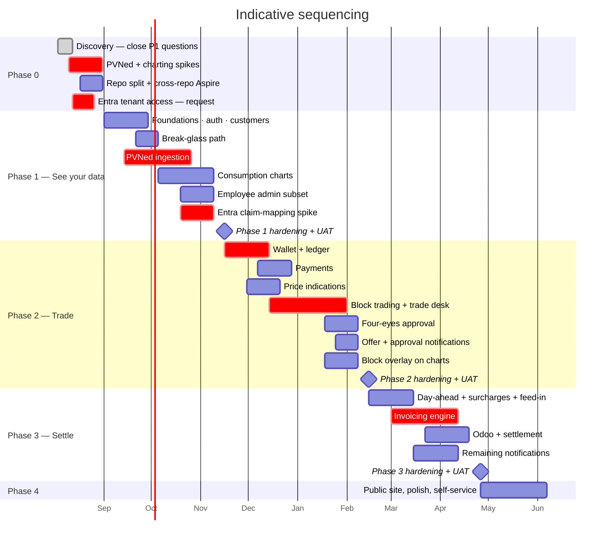
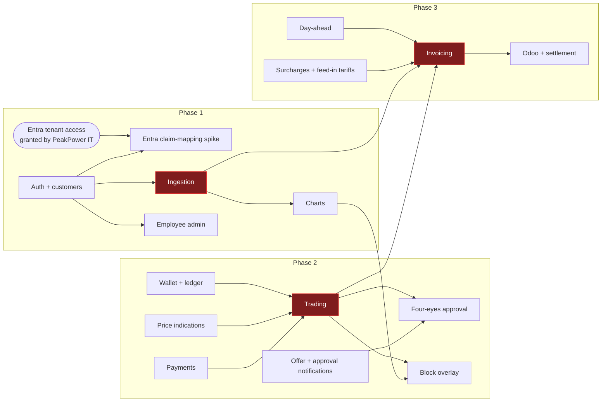

# Roadmap & Phasing

Four phases, sequenced so that the riskiest unknown is proven first and money only starts moving once
the data underneath it is trustworthy.

> **Durations below are relative, not committed.** They assume a team of roughly 2 backend, 2
> frontend, 1 lead/architect with a shared PO and QA, and they assume the open questions for each
> phase are closed before that phase starts. Neither is guaranteed yet. Treat them as sequencing and
> proportion, not as dates.

> **Updated 2026-08-11.** Phase 0's headline goal is met: all eleven P1 open questions are closed as
> **[DEC-19]**…**[DEC-29]**. **Phase 3 shrinks materially** — **[DEC-24]** and **[DEC-25]** remove two
> of the five invoice line categories outright and defer the annual true-up. Phase 0's own risks are
> not all gone: **[DEC-21]** and **[DEC-28]** *defer* R-01 and R-05 rather than answering them.

> **Updated again 2026-08-11, second round.** Thirty-six further questions were decided as
> **[DEC-30]**…**[DEC-65]**, and this time **every phase gained work**. Phase 0's setup changes shape
> under **[DEC-55]** (separate repositories) and **[DEC-54]** (Angular 22). Phase 1 gains the
> break-glass path **[DEC-53]** and the production-expectation property **[DEC-65]**. Phase 2 gains
> **four-eyes approval [DEC-33]**, which adds a state to a machine that had exactly ten transitions.
> Phase 3 gets a line category back — **[DEC-44]** makes feed-in its own category — so the shrink
> recorded above is partly given up.
>
> ⚠ ~~**Phase 0 is not finished after all.** **[OQ-88]** is a new **P1**.~~ — **resolved the same day
> by [DEC-66]**; see the third-round note below. The reopening lasted one round.

> **Updated again 2026-08-11, third round — [DEC-66] and [DEC-67]. Phase 0's P1 is closed again, and
> the blocking count is back to 0.** Entra ID uses PeakPower's **existing corporate Microsoft
> tenancy**. **[DEC-56]** is **clarified, not reversed**: "no existing Azure tenancy" means no Azure
> **subscription, landing zone or naming standard**, so the greenfield work in
> [Deployment](../20-architecture/09-deployment.md) is untouched — Azure subscriptions are simply
> created **under** the corporate Entra tenant. Employee identity stays single, and **[DEC-20]**,
> **[DEC-51]** and **[DEC-53]** all keep the one directory they assume.
>
> ⚠ **This is where the decision's residue lands, and it is a dependency rather than a question.** The
> tenancy exists; **access to it** does not, and access is administered by someone outside the
> delivery team. It cannot be closed by deciding — only by being asked for — so it is a **Phase 0
> dependency with a named owner and a date**, listed in **§2.1**, and it is deliberately **not** in
> [80-open-questions.md](../80-open-questions.md). **[DEC-67]** then puts it on the critical path *by
> choice*: the `customer_id` claim-mapping spike runs against the corporate tenancy rather than a
> throwaway developer tenant, so the spike **inherits** this dependency. The PoC ships unauthenticated
> **[DEC-20]**, so nothing is blocked *today* — which is exactly what makes it easy to forget until it
> is late. **[R-24]** falls from 16 to 9 and is retitled accordingly.

---

## 1. The shape

Phase 3 is shorter than it was, but by less than it looked. **[DEC-24]** and **[DEC-25]** remove
invoice lines 5 and 3 — energiebelasting and imbalance — and defer the annual true-up with them, and
**[DEC-26]** settles the half of the VAT question that would otherwise have reached into the wallet.
Then **[DEC-44]** puts a line category **back**: feed-in on exported volume becomes line 6, with its
own per-customer reference-data table alongside the surcharge. Three line categories became four.

Six bars are new. **Entra tenant access** and **Repo split + cross-repo Aspire** sit in phase 0
because both are prerequisites for setup rather than parts of it — **[DEC-55]** decides where the code
lives, and the tenancy bar is no longer a *decision*: **[DEC-66]** settled which directory, so what
the bar carries is the **access request**, with the owner and dates in §2.1. **Break-glass** is its
own slice in phase 1 rather than a corner of the auth work, for the reason **[DEC-53]** gives: a path
that is not rehearsed is not a path. The **Entra claim-mapping spike** is now a bar of its own rather
than an implied line inside the F13 slice, because **[DEC-67]** gives it an external dependency and
work with an external dependency needs a date someone can miss. **Four-eyes approval** and the
**offer and approval notifications** it needs are phase 2, with the caveat in §4.

⚠ **The two Entra bars are one dependency, drawn twice.** `p0d` ends 2026-08-26 and `p1f` starts
2026-10-19; the eight weeks between them are the only slack there is, and they are slack in the wrong
place — nothing pushes on the access request while the PoC runs unauthenticated **[DEC-20]**.

⚠ **The bars are still relative.** Six more bars does not mean six more months; it means six more
things that have to be sequenced, and the sequencing is what this chart is for.

## 2. Phase 0 — Discovery & spikes

**Goal:** remove the things that could invalidate the plan. There were two; the second decision round
briefly added a third, and the third round closed it. What that third item left behind is not work of
the same kind — it is a **dependency on someone outside the team**, and it is listed in **§2.1**
rather than here, because a dependency is discharged by asking, not by deciding.

| Work | Why |
| --- | --- |
| ~~Close the **eleven** P1 open questions~~ ✅ **Done — closed 2026-08-11** as **[DEC-19]**…**[DEC-29]** ([80-open-questions.md](../80-open-questions.md)) | Eleven, not ten as this table previously said. They were cheap to close and expensive to leave open. Three were closed by deferral or for the PoC only rather than settled |
| ~~Resolve [OQ-88] — the tenancy contradiction~~ ✅ **Done — closed 2026-08-11** as **[DEC-66]** | Entra ID uses PeakPower's **existing corporate Microsoft tenancy**, and **[DEC-56]** is clarified rather than reversed: no Azure **subscription, landing zone or naming standard**, but the new subscriptions sit **under** the corporate Entra tenant, so employee identity stays single. ⚠ **What is left is not this row.** *Access* to that tenancy is a **dependency with an owner and a date** — §2.1 — and **[DEC-67]** puts it on the critical path by choice. **[R-24]** falls 16 → 9 |
| **PVNed spike** — obtain endpoint details, get one real document, build the `DevStubs` generator | The largest technical unknown. **[DEC-21]** lets the PoC proceed on generated data in the PVNed document format, so the generator *is* now critical path — but the endpoint, authentication, acknowledgement and retry questions are only deferred, and R-01 keeps its score of 20. The generator now has three fewer guesses to make: one document per EAN per day **[DEC-38]**, nothing after the 10-working-day window **[DEC-57]**, and no `A01` series at all for a non-producing connection **[DEC-65]** |
| **Charting spike** — build the day chart with block overlay against synthetic data, candidate libraries **from the free field only** | The chart is the product. A library that cannot do a clean step line over a stacked area at 96 points is discovered now, not in month three. **[DEC-39]** answers the licence half of [OQ-22] — open-source and free, or in-house — and explicitly *keeps* this spike, narrowed to the free field and to the cost of building custom. **[DEC-54]** fixes Angular 22; the component library **[OQ-49]** is unchosen and decides the same layer, so spike them together |
| **Repo split setup** — two repositories **[DEC-55]**, and the three properties that no longer come for free | **New.** The Aspire AppHost must start front-ends it does not contain; OpenAPI-generated clients now cross a repository boundary and need a publishing step; and "one command brings up the whole system" has to be **preserved deliberately**. Cheap to arrange now, awkward once two CI pipelines have opinions. [OQ-52] gains weight with it: "align with existing conventions" now has to name a repository |
| **Wallet ledger spike** — the reserve/settle/release model against real PostgreSQL, with the concurrency tests from [Solution structure §6.1](../20-architecture/02-solution-structure.md) | The other place a wrong early decision is expensive to unwind. **Test money only** while [OQ-31] stays deferred **[DEC-28]**. Extend it with the **[DEC-33]** shape: a reservation that survives acceptance and is released by approval, refusal or expiry |
| ~~Confirm identity provider~~ ✅ **Microsoft Entra ID in production, on the existing corporate tenancy [DEC-20]**, **[DEC-66]**; the PoC runs unauthenticated **[DEC-20]**. Confirm cloud target ([OQ-50]) and the existing Montel implementation ([OQ-52]) | Unblocks phase 1 setup, and is **no longer conditional** — [OQ-88] closed. **[DEC-20]** does not remove tenancy work from phase 1; it makes the context pipeline more urgent, not less. **[DEC-56]** makes [OQ-50] a greenfield choice rather than an inherited one, now with **[DEC-66]**'s constraint that the subscriptions sit under the corporate Entra tenant — worth settling before the first `deploy/infra` commit |

**Exit criteria:** ✅ every P1 question answered or explicitly deferred with a recorded owner — met on
2026-08-11 for the original eleven, with [OQ-05], [OQ-14] and [OQ-31] recorded as deferred rather than
settled; three spikes demonstrated; phase 1 backlog estimated.
✅ **The first criterion is no longer reopened.** [OQ-88], raised by the second decision round, closed
the same day with **[DEC-66]**; the blocking count is back to **0** and phase 0 is not held by it. The
other two criteria were outstanding before and remain so.

⚠ **One criterion is added, and it is deliberately weak.** Every dependency in §2.1 must have a
**named owner and a date** before phase 0 exits. Phase 0 exits on the tenant-access request being
**raised and dated** — *not* on it being **granted**, because granting is not the team's to do and
gating an exit on someone else's calendar produces a phase that never closes. ⚠ The failure mode is
the mirror image: a dependency recorded, never chased, and discovered unmet in week nine of phase 1.
That is what the date is for.

### 2.1 Phase 0 dependencies on external parties

Not work — **requests**. Each is discharged by someone outside the delivery team, so each needs a
**named owner inside it** whose job is to chase, and a **date**. None of them is an open question, and
none appears in [80-open-questions.md](../80-open-questions.md); looking for them there is the mistake
this table exists to prevent.

| Dependency | Who grants it | Owner (chases it) | Raise by | Needed by | Why the date is that date |
| --- | --- | --- | --- | --- | --- |
| **Access to the corporate Entra tenancy** **[DEC-66]** | PeakPower IT — whoever administers the corporate Microsoft tenant | ⚠ **Unnamed — must be named before phase 0 exits** | **2026-08-12** | **2026-08-26**, and hard-stop **2026-10-19** | The tenancy **exists [DEC-66]**; only access is outstanding. 2026-08-26 keeps it ahead of phase 1 starting 2026-09-01; 2026-10-19 is when the claim-mapping spike starts (`p1f`), and **[DEC-67]** runs that spike against **this** tenancy, so the spike cannot start without it. Needed for: app registrations for both portals **[F13-R03]**, the `customer_id` claim mapping **[F13-R32]**, tenant MFA policy **[DEC-51]**, and the directory that will hold the managed identities ([Deployment §1.1](../20-architecture/09-deployment.md)) |
| **PVNed endpoint, auth, ack format and a test environment** ([OQ-65], [OQ-05]) | PVNed | ⚠ **Unnamed** | Phase 0 | Before the real integration is validated | **[DEC-21]** buys time with generated data; it does not remove the dependency, and **R-01 (20)** is the highest-scoring risk on the register. A third party's calendar is not controllable, so book it rather than wait for it |
| **A dedicated sending domain with SPF, DKIM and DMARC** **[DEC-48]** | Whoever owns PeakPower DNS | ⚠ **Unnamed** | Phase 0 | Before the first invoice run (phase 3) | DMARC is the long pole — start at `p=none`, read the reports, then tighten ([Deployment §5.1](../20-architecture/09-deployment.md)). **[DEC-47]** puts invoices on the same channel as time-critical offer notifications |
| **DPIA and processor agreements** ([OQ-58]) | Legal, with PVNed, CM.com **[DEC-58]**, Entra ID **[DEC-20]**, SendGrid **[DEC-48]** and the cloud provider | ⚠ **Unnamed** | Phase 0 | Before go-live | The counterparties are all named now, which makes the work schedulable rather than open-ended. Longest external lead time of the four |

⚠ **Every owner column above says "Unnamed".** That is the honest state and not a formatting
placeholder — [OQ-88] closed without anyone being asked for anything, and **[DEC-66]** says so
explicitly. **A dependency with a date and no name is a date nobody misses.**

## 3. Phase 1 — *See your data*

**Goal:** a customer logs in and sees accurate, well-labelled interval data for every connection.
**No money moves.**

| Feature | Scope |
| --- | --- |
| [F13](../10-features/F13-identity-and-access.md) Identity | Both realms, OIDC against Entra ID on the **existing corporate tenancy [DEC-66]**, roles, `customer_id` claim, tenancy isolation with its automated test. **[DEC-20]**: the PoC runs unauthenticated, but the `customer_id` / `account_id` context pipeline, the query filter and row-level security are built and tested from the first commit, fed by a development context provider. **[DEC-29]**: no credential storage, no reset flow, no lockout policy for customers — the provider owns the password. ✅ **No longer gated on [OQ-88]** — which tenant is settled, so the slice can be estimated. ⚠ **It is still gated on tenant *access*** (§2.1) for the parts only the real tenant can supply: the two app registrations **[F13-R03]** and the tenant MFA policy **[DEC-51]**. Everything else is built against a **local Keycloak or Authentik container** over standard OIDC **[DEC-67]** |
| [F13](../10-features/F13-identity-and-access.md) **Entra claim-mapping spike** **[F13-R32]** | **Its own bar (`p1f`), not a line inside the identity slice.** **[DEC-20]** requires the `customer_id` claim mapping to be spiked before phase 1 ends; **[DEC-67]** requires it to run **against the corporate tenancy, not a throwaway developer tenant** — proving it once against the configuration that will actually run. ⚠ **It therefore inherits the tenant-access dependency in §2.1 outright**: no access, no spike, and *no substitute* — a developer tenant that differs in policy proves the mapping twice and neither time against production. The local container proves discovery, PKCE, token validation and the claim **contract**; it cannot prove the **mapping**. Starts 2026-10-19, must finish before `m1` on 2026-11-16. See **[R-24]** |
| [F13](../10-features/F13-identity-and-access.md) **Break-glass** — *new* **[DEC-53]** | A small, non-optional slice that **[DEC-29]** had removed: named employee accounts with a platform-held password hash, disabled by default, time-boxed on enable, a second factor that does not depend on the provider, every use alerted and audited, and **rehearsed on a schedule**. Plan it as its own piece of work, not as a corner of the auth work — an unrehearsed break-glass path is not a break-glass path. Two values must be set before it is first enabled: the time box and the reachable function set, both registered as [OQ-89] |
| [F01](../10-features/F01-customer-and-metering-points.md) Customers & EANs | Full — and **larger than it was**. **[DEC-65]** adds the **production expectation** on a metering point: `UNKNOWN` / `NEVER` / `EXPECTED`, with provenance, an audited change path and an employee worklist. It is not decoration — PVNed sends no production series at all for a connection that never produces, so without it an ingestion failure on a producing connection is indistinguishable from a connection that never produces, and under **[DEC-22]** that difference is a settlement figure. Ownership at onboarding is [OQ-91] |
| [F02](../10-features/F02-metering-data-ingestion.md) Ingestion | Full — the heart of this phase. The completeness test changes with **[DEC-65]**: "both directions present" is not it. **[DEC-38]** sizes the pipeline at one document per EAN per day, and **[DEC-60]** keeps the manual-entry path, which **[DEC-57]** makes the only remedy after 10 working days |
| [F03](../10-features/F03-consumption-visualisation.md) Charts | Day and month views, KPIs, data states. **No block overlay**. Library and component library still to be chosen from the free field **[DEC-39]**, **[DEC-54]** |
| [F12](../10-features/F12-employee-back-office.md) Back office | Customer admin, ingestion health, quarantine, message log, replay |
| [F15](../10-features/F15-audit-and-observability.md) Audit | Master-data audit, correlation, health checks, alerting. ⚠ **[DEC-53]** adds a hard constraint: break-glass alerting must reach someone over a channel that does not depend on the identity provider |
| Platform | Aspire **across two repositories [DEC-55]**, CI/CD, environments, `DevStubs`, migrations, partitioning, calendar service, and the OpenAPI client publishing step the repo split introduces |

**Why first.** Ingestion is the biggest unknown and everything else depends on it. Shipping a
read-only phase gets real PVNed data flowing months before anyone is relying on it for money, which
is exactly when you want to discover its quirks.

**Exit criteria:** real PVNed data arriving in production; a customer can see a correct day and month
chart; DST days handled correctly; data states visible; ingestion alerting proven by a deliberate
outage test; **every metering point has a production expectation that is not `UNKNOWN`, or is on a
named worklist [DEC-65]**; **the break-glass path rehearsed at least once, with the rehearsal
recorded [DEC-53]**; **the `customer_id` claim mapping demonstrated against the corporate Entra
tenancy [DEC-67]**, not against the local container — the container is a development convenience and
was never evidence about Entra's claims configuration.

## 4. Phase 2 — *Trade*

**Goal:** the full request → offer → accept → confirm loop, with real money reserved and settled.

| Feature | Scope |
| --- | --- |
| [F06](../10-features/F06-wallet-and-ledger.md) Wallet & ledger | Full, including reconciliation job |
| [F07](../10-features/F07-wallet-topup-and-payments.md) Top-up | iDEAL + bank transfer instructions + manual registration. **[DEC-58]** keeps the payment surface to iDEAL alone; **[DEC-61]** makes the company IBAN a matching key for incoming transfers; **[DEC-43]** removes the refund payout path entirely |
| [F04](../10-features/F04-price-indications.md) Price indications | Full |
| [F05](../10-features/F05-energy-block-trading.md) Trading | Full — both portals. **Larger than it was.** |
| [F05](../10-features/F05-energy-block-trading.md) **Four-eyes approval** — *new* **[DEC-33]** | Real work, not a flag. An `AWAITING_APPROVAL` state on a machine that had exactly ten transitions, a terminal `APPROVAL_REFUSED`, an approver identity that must differ from the acceptor, a reservation that is taken at acceptance and released by three different routes, an expiry path that now touches money for the first time, warnings at three points in the customer flow, and a back-office admin screen for the threshold **[F12-R38]**. ⚠ **It cannot be exercised at all until [OQ-85] gives it a threshold** — the table ships empty and acceptance is refused while no row is in force |
| [F03](../10-features/F03-consumption-visualisation.md) Charts | Block overlay, coverage KPIs |
| [F11](../10-features/F11-notifications.md) Notifications | Trade and offer notifications only — see the ordering warning below |
| [F12](../10-features/F12-employee-back-office.md) Back office | Trade desk, wallet admin, four-eyes threshold administration, and the **[DEC-50]** warning when two customers request the same delivery period |

**Order within the phase matters.** Wallet before trading, because trading depends on reserve/settle/
release being correct. Price indications can run in parallel — they have no dependency on the wallet.
Four-eyes comes after the trade machine works end to end, because it is a state added to a machine
rather than a machine of its own.

⚠ **An ordering conflict that predates this round and is now unavoidable.**
[F11 Notifications](../10-features/F11-notifications.md) is tagged **phase 3** in the
[feature index](../10-features/README.md), and this table has always listed a phase-2 subset of it.
The second round removes the ambiguity: **[DEC-63]** requires *every active account* to be notified
when an offer arrives, and **[DEC-33]** adds an approval that a second person has to be told about
inside the same 30-minute window. Neither is optional, and neither works as a phase-3 follow-up —
a four-eyes trade whose approver is never notified expires unapproved, which is the failure mode
**[DEC-33]**'s design goes to some length to make survivable rather than routine. **This needs
resolving explicitly**, either by moving F11's offer and approval notifications into phase 2 in the
feature index, or by splitting F11 into a phase-2 and a phase-3 half. It is recorded here rather than
decided, because the feature index and this roadmap should not disagree by accident.

**Exit criteria:** an end-to-end trade in production with real money; **an end-to-end four-eyes trade,
approved by a second account, and one that is refused and one that expires unapproved, with the
reservation released in full in all three cases**; the eight correctness tests from
[Solution structure §6.1](../20-architecture/02-solution-structure.md) passing; ledger reconciliation
clean for 30 consecutive days.

⚠ **"Real money" is gated on [OQ-31].** **[DEC-28]** defers the client-money question but makes it a
go-live gate: no real customer funds may be held until it is answered, so this exit criterion is met
with test money and the real-money version of it moves behind the legal opinion. Risk R-05 (15) stays
open. Reservation sizing is gated on [OQ-83] — a reservation taken ex-VAT **[AS-10]** against a
VAT-inclusive debit under-covers by the VAT rate, and **[DEC-41]** confirms there is **no buffer** to
absorb it while **[DEC-64]** fixes the gap at exactly 21%.

## 5. Phase 3 — *Settle*

**Goal:** monthly invoices, calculated, reviewed, pushed to Odoo and settled from the wallet.

**This phase is smaller than it was, but it gave some of that back.** Of the five invoice line
categories, **two are no longer built**: line 3, imbalance, is out of scope **[DEC-25]** — `A12`
documents are stored but not turned into charges — and line 5, energiebelasting, is deferred
**[DEC-24]**. The volume identity assertion simplifies with them, since there is no imbalance term
left to reconcile. Then **[DEC-44]** adds a **sixth** category: physical export leaves the day-ahead
sale leg and settles at a per-customer **feed-in tariff** on line 6. So what is built is lines 1, 2,
4 and 6 — block energy, day-ahead purchase and the *unused block cover* half of the sale, the
surcharge, and feed-in. All of it is measured against **net usage** = consumption − production
**[DEC-22]**; **[DEC-23]** still governs unused cover, and the volume identity is restated a second
time because the sale term now splits in two.

⚠ **[DEC-35]** changes the surcharge's **unit** to €/kWh, and **[DEC-44]** gives the feed-in tariff
the same unit while every market price stays €/MWh. That is a migration with a silent failure mode —
see **[R-23]** — and it belongs to this phase.

| Feature | Scope |
| --- | --- |
| [F08](../10-features/F08-day-ahead-prices.md) Day-ahead | Full, including backfill for the periods being invoiced. Applies to the *unused block cover* half of the sale side **[DEC-23]**, **[DEC-44]**, at the **raw** price with no spread **[DEC-44]**. A single scheduled 18:00 Amsterdam fetch plus retry **[DEC-36]**, not four attempts. ⚠ Backfill depth is still unknown — [OQ-16] is closed only on the arrival time |
| [F09](../10-features/F09-surcharges.md) Surcharges **and feed-in tariffs** | Full, and **two rate tables rather than one** **[DEC-44]**. Both in **€/kWh [DEC-35]**, both per customer per period, both resolved per interval so a mid-month change splits into two lines. Surcharge base still open — [OQ-36] |
| [F10](../10-features/F10-invoicing-and-settlement.md) Invoicing | Monthly run, review, finalisation, Odoo push, wallet settlement, credit notes. Lines 1, 2, 4 and 6 — **no imbalance line [DEC-25]**, **no energiebelasting line [DEC-24]**, **plus feed-in [DEC-44]**. Platform-owned numbering **[DEC-45]**, platform-generated PDF **[DEC-46]**, emailed and in the portal **[DEC-47]** over SendGrid **[DEC-48]**, VAT at 21% on every line **[DEC-64]** |
| [F11](../10-features/F11-notifications.md) Notifications | Wallet thresholds, invoice events. Offer and approval notifications have moved forward — see §4 |
| [F12](../10-features/F12-employee-back-office.md) Back office | Invoice run dashboard, reference data admin — now including the feed-in tariff table |

**The annual true-up is deferred, not scheduled.** Tier crossings were its principal reason to exist,
so **[DEC-24]** defers it alongside energiebelasting. Only its residual role — correcting late
metering data — survives, which makes [OQ-76]'s materiality threshold the whole of that judgement and
[OQ-56]'s monthly run date close to the only correction gate that remains. It returns when
energiebelasting does, and that reopening must include [OQ-77].

**Do not start this phase until [OQ-83] and [OQ-86] are closed.** The gate is down to two.
**[DEC-44]** settled [OQ-35] — day-ahead is used raw, no spread — and **[DEC-64]** settled [OQ-82] at
21% on every line category, which leaves: whether the wallet debit settles the ex-VAT subtotal or the
inclusive total ([OQ-83]), and what applies when a customer exports and no feed-in tariff resolves
([OQ-86]). The second is new, created by the decision that closed the first, and it is the larger of
the two in money — **€662.53 on a single EAN for a single month** in the worked example, against a
whole-decision effect of €132.43. Until it is answered the invoice run **skips** rather than defaults
**[F10-R39]**, which is the right behaviour and not a substitute for the answer. Risk R-02 holds at
15, and its character changed: fewer unknown rules, more recently changed ones.

⚠ **Energiebelasting must return before a single invoice is issued to a real customer.** It is a legal
obligation, not a feature. Keep `IEnergyTaxCalculator` and `billing.energy_tax_tariff` in the model,
unpopulated, so the calculation drops in rather than being retrofitted through a finished engine.

**Exit criteria:** a full month invoiced in parallel with the existing process and reconciled to the
cent **at line level, not at invoice level** — a 1000× error on the surcharge line hides inside a
total dominated by lines 1 and 2 **[R-23]**; the volume identity assertion passing for every customer,
restated against net usage and against the split sale term **[DEC-44]**; at least one exporting
customer in the parallel run, so line 6 is exercised rather than assumed; Odoo push and wallet
settlement proven independent under failure; a written decision on when energiebelasting re-enters
scope.

⚠ **Odoo is blocked, not merely pending.** **[DEC-59]** established that no chart of accounts or
tax-code mapping exists and that the mapping table has **no source and no owner**, while [OQ-69],
[OQ-71] and [OQ-72] are all parked. The Odoo integration cannot be specified in detail until that
changes, and it is on this phase's critical path.

## 6. Phase 4 — *Polish*

Public website, self-service onboarding, reporting, remaining *Should* and *Could* items, and
whatever the first three phases taught you was missing.

---

## 7. Relative sizing

Percentages of total build effort, so the shape is visible without pretending to a schedule.

| Phase | Share | Dominated by |
| --- | --: | --- |
| Phase 0 | 6% | Spikes and decisions — plus the repo split **[DEC-55]** and the tenant-access request **[DEC-66]**, which is nearly no effort and all lead time (§2.1) |
| Phase 1 | 31% | Ingestion (half of the phase), charts, and now break-glass **[DEC-53]** |
| Phase 2 | 37% | Trading (over half of the phase), four-eyes **[DEC-33]**, wallet |
| Phase 3 | 21% | Invoicing (still over half the phase, at four line categories rather than five) |
| Phase 4 | 5% | |

**Phase 3 fell from 24% to 20% earlier on 2026-08-11, then rose to 21%.** Two of the five invoice
line categories went — imbalance **[DEC-25]** and energiebelasting **[DEC-24]** — and the annual
true-up was deferred with the second of them. Then **[DEC-44]** added feed-in as line 6, with a second
per-customer rate table and a re-derived volume identity, and **[DEC-35]** added a unit migration.

**Phase 2 rose from 36% to 37%** on four-eyes alone **[DEC-33]**: a state on the trade machine, a
terminal refusal state, a reservation whose lifecycle now has three exits, an admin screen, and
warnings at three points in the customer flow. **Phase 1 gained work too** — break-glass **[DEC-53]**
and the production expectation **[DEC-65]** — and its share still fell, from 32% to 31%, purely
because the denominator grew faster. **No phase lost work in the second round.** These are shares of
a larger total, and reading a falling share as a shrinking phase is the mistake this note exists to
prevent.

The three critical-path items — **ingestion, trading, invoicing** — are still roughly half of the
total on their own. Invoicing is no longer the one with the most open questions: **[DEC-22]** through
**[DEC-26]**, then **[DEC-44]** and **[DEC-64]**, left it with [OQ-83] and [OQ-86] where it had
[OQ-14], [OQ-15] and [OQ-17]. Ingestion keeps the title, because **[DEC-21]** defers R-01 rather than
closing it — but trading is now the phase that grew most. **Identity can now be estimated**:
**[DEC-66]** settled which tenant, so nothing about the F13 slice is unknown in shape. What identity
cannot do is *prove* its fiddliest part on its own schedule — **[DEC-67]** ties the claim-mapping
spike to an access request the team does not control (§2.1), which is a scheduling exposure rather
than an estimating one, and the two are worth not confusing.

## 8. Parallelisation

⚠ **`A0` is the only node in this diagram that nobody on the team can do.** It is drawn as a
dependency rather than a task on purpose: tenant access is granted by PeakPower IT **[DEC-66]**, and
**[DEC-67]** makes the claim-mapping spike depend on it with **no parallel path around it** — the local
Keycloak or Authentik container unblocks `A1` and everything downstream of it, but never `A5`. That is
the trade **[DEC-67]** accepts in exchange for proving the mapping once, against the configuration
that will actually run. §2.1 carries the date.

Frontend and backend can run together throughout: contracts are defined by the OpenAPI documents, and
clients are generated from them, so the frontend is never blocked on a backend implementation — only
on a contract. ⚠ **[DEC-55]** puts a repository boundary through the middle of that arrangement. The
generated clients now have to be published from one repository and consumed in another, which is a
step someone has to own; "the frontend is never blocked on a backend implementation" is true only for
as long as that publishing step is fast and automatic.

## 9. What would change this plan

| If… | Then |
| --- | --- |
| PVNed has no test environment | Still live. **[DEC-21]** makes `DevStubs` critical path *by decision* rather than by accident, which absorbs the schedule hit — but the real integration is validated later and R-01 keeps its score of 20. The lengthening moves from phase 1 to wherever the real endpoint is finally tested |
| ~~The Montel licence forbids showing indications to customers~~ | **Answered [DEC-27]** — public display is not permitted, authenticated portal display is. [F04](../10-features/F04-price-indications.md) survives as designed; the public-price element of [F14] is retired. Residual: customer CSV export is treated as not permitted until the licence says otherwise |
| ~~Imbalance can be supplied per EAN~~ | **Moot [DEC-25]** — imbalance is out of scope entirely and invoice line 3 is not built. `A12` documents are stored, so the option is kept if it is ever invoiced |
| ~~Four-eyes approval is required ([OQ-09])~~ | **It is [DEC-33]** — this happened. Trading gained a state, a terminal refusal state, an approver identity distinct from the acceptor, a reservation with three exits, and an admin screen. Phase 2 grew, from 36% to 37%. ⚠ It cannot be exercised until [OQ-85] supplies a threshold |
| The four-eyes threshold is set very low ([OQ-85]) | Every trade needs two people inside a 30-minute reaction window, and single-account companies can never clear it at all. That is a commercial problem wearing a technical hat: the remedy is a longer reaction window **[F05-R58]** or a second account at onboarding, not a code change |
| The feed-in fallback turns out to be day-ahead rather than zero ([OQ-86]) | No structural change — the engine already refuses to guess **[F10-R39]** — but **€662.53 on one EAN for one month** in the worked example, and it applies to every exporting site retroactively from the first invoiced period |
| ~~[OQ-88] resolves as "create a tenant"~~ | **It did not [DEC-66]** — the corporate tenancy exists and is the one Entra ID uses. No procurement, no second directory, and [DEC-51] and [DEC-53] keep the single tenant they assume |
| **Tenant access is not granted by 2026-10-19** (§2.1) | The claim-mapping spike (`p1f`) cannot start, and **[DEC-67]** forbids the obvious workaround: it does **not** move to a developer tenant, the date moves. Phase 1's exit criterion — the mapping demonstrated against the corporate tenancy — goes with it, so `m1` slips or ships with the fiddliest part of Entra unproven. ⚠ The realistic cause is not refusal, it is that **nobody was ever asked**: the PoC is unauthenticated **[DEC-20]**, so nothing hurts until it is late. Remedy is a named owner and a chased date, not a plan change. **[R-24]** returns to weekly review the day the date is missed |
| The claim mapping needs a token-issuance extension rather than plain claims mapping | Contained — it is the provider adapter **[F13-R32]**, behind the OIDC boundary, and the claim *contract* is already proven against the local container **[DEC-67]**. Costly only in *when* it is discovered: late in phase 1, against a milestone, with less room to absorb it. That timing is the whole of the impact half of **[R-24]** |
| Gas is pulled forward | A phase of its own, not an extension — units, tariffs and **[DEC-30]**'s m³ volumes are all new, and the calorific correction ([OQ-87]) has to be settled first because retrofitting a conversion under a stored volume series reprices history |
| ~~Production must net against consumption ([OQ-11])~~ | **It does [DEC-22]** — this happened. Net usage = consumption − production is the volume basis; coverage, position and invoicing all move with it, and net usage may be negative. Supersedes [AS-06]; affects phases 2 and 3 as forecast |
| ~~Client-money regulation applies ([OQ-31])~~ | **Deferred [DEC-28]**, and re-framed: a **go-live gate, not a build gate**. The wallet is built, the PoC holds test money only, and R-05 (15) stays open. Still potentially a licensing prerequisite with its own lead time — **answer it before the first real deposit** |
| Energiebelasting re-enters scope | Expected, not hypothetical — **[DEC-24]** defers a legal obligation. Invoice line 5, the tariff table, [OQ-14] and [OQ-77] all return together, and the annual true-up returns with them as its own gated piece of work |
| The wallet debit turns out to be VAT-inclusive ([OQ-83]) | The reservation formula changes: an ex-VAT reservation **[AS-10]** under-covers the debit by **exactly 21% [DEC-64]**, with **no buffer [DEC-41]** to absorb it. Cheap to fix in phase 2, expensive once customers have balances |
| A customer turns out to be a foreign entity ([DEC-64]) | The flat 21% assumption breaks for them, per invoice. **[DEC-64]** records the rate as *stated*, not as advised, and **[DEC-58]** removed the Bancontact case that would have made this visible earlier |

## 10. Recommended team

| Role | Phase 0 | Phase 1 | Phase 2 | Phase 3 | Phase 4 |
| --- | :--: | :--: | :--: | :--: | :--: |
| Lead / architect | 1 | 1 | 1 | 1 | 0.5 |
| Backend (.NET) | 1 | 2 | 2 | 2 | 1 |
| Frontend (Angular) | 1 | 2 | 2 | 1.5 | 1 |
| Product owner | 1 | 0.5 | 0.5 | 0.5 | 0.5 |
| QA | — | 0.5 | 1 | 1 | 0.5 |
| Domain expert (trading) | 0.5 | 0.2 | 0.5 | 0.2 | — |
| Domain expert (finance) | 0.5 | 0.2 | 0.2 | **1** | — |

The finance domain expert in phase 3 is not optional, and forty-nine decisions do not change that.
Invoicing has fewer unknowns than it had, but it still has the least tolerance for error, the
remaining questions ([OQ-83], [OQ-86]) are commercial and fiscal rather than technical, and the
parallel run has to be reconciled to the cent — at line level **[R-23]** — by someone who knows what
the old process did. Deferring energiebelasting also means someone has to hold the reopening, and
**[DEC-59]** leaves the Odoo mapping needing an owner it does not have.

⚠ **Two roles are missing from this table and were exposed by the second round; the third round made
one of them more concrete, not less.** **[DEC-56]** needs someone who owns the landing-zone and naming
conventions, and **[DEC-66]** adds a second job to the same person: **request and hold access to the
corporate Entra tenancy**, and be the name in §2.1. That is an IT or platform owner, not a lead with a
side interest — the whole point of **[DEC-66]** is that this cannot be discharged from inside the
delivery team. And **[DEC-53]** needs an operations voice in phase 1: break-glass is enrolled,
enabled, rehearsed and alerted by named people, and [OQ-89] is a question only operations can answer.
