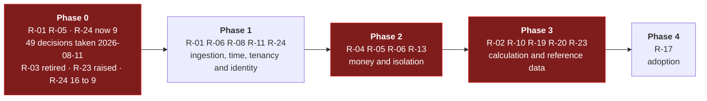

# Risk Register

Scored **likelihood × impact**, each on 1–5. Anything scoring **12 or above** needs an owner and a
mitigation in the plan, not just an entry in a table.

| Score | Band |
| :--: | --- |
| 20–25 | 🔴 Critical |
| 12–16 | 🟠 High |
| 6–10 | 🟡 Medium |
| 1–5 | 🟢 Low |

> **Re-scored 2026-08-11**, on the eleven decisions **[DEC-19]**…**[DEC-29]** that closed the P1 open
> questions. **R-03 is retired**, **R-02** falls from 20 to 15 and **R-07** from 12 to 6. **R-01** and
> **R-05** keep their scores: both were *deferred* rather than answered, and a deferred risk is still
> a risk. **R-09** was reviewed and deliberately left where it was. No risk ID has been reused; the
> retired entry stays in the register, marked.

> **Re-scored again 2026-08-11**, on the thirty-six decisions **[DEC-30]**…**[DEC-65]**. **Two risks
> are new**: **R-23**, the €/kWh surcharge migration **[DEC-35]**, which fails silently by exactly a
> factor of 1000; and **R-24**, the contradiction between **[DEC-20]** and **[DEC-56]** — an identity
> provider was chosen that presupposes a Microsoft tenancy, and there is no tenancy. **R-02 holds at
> 15 but changes character**: it is no longer mostly about *unresolved* rules, it is about *newly
> changed* ones. **R-01**, **R-04**, **R-08** and **R-09** were re-examined and deliberately held —
> each row says what pulled in which direction. Nothing fell. That is not a failure of the round: the
> three expensive decisions **[DEC-33]**, **[DEC-35]** and **[DEC-44]** all *added* work to the two
> areas that carry the most risk.

> **Re-scored a third time 2026-08-11**, on **[DEC-66]** and **[DEC-67]**. **R-24 falls from 16 to 9**
> and is **retitled**: the contradiction it was raised for is **resolved** — Entra ID uses PeakPower's
> existing corporate tenancy, and **[DEC-56]** is clarified rather than reversed — so the harm it was
> scored on, *split employee identity*, can no longer occur. What is left is a different risk under
> the same ID: a **schedule dependency outside the team's control**, plus a **claim mapping that
> [DEC-67] deliberately leaves unproven** until access to that tenancy arrives. No other score moved.
> ⚠ **Falling below 12 takes R-24 off the weekly review, which is exactly when a dated dependency gets
> forgotten** — it stays on the Phase 0 dependency list with an owner and a date
> ([Roadmap §2.1](01-roadmap-and-phasing.md)), and it returns to weekly review the day that date is
> missed.

---

## Top risks

Everything scoring 12 or above, in score order.

### R-01 · PVNed integration cannot be tested before production 🔴 **20**

*Likelihood 4 × Impact 5 — unchanged, and re-examined twice on 2026-08-11. **Deferred by [DEC-21], not
closed.***

Everything the platform shows, trades against and invoices comes through one third-party push
integration. If there is no test environment ([OQ-05]), the first real document arrives in
production and every quirk is discovered live.

**[DEC-21] changes the plan, not the exposure.** The proof of concept ingests generated data in the
PVNed document format, which unblocks phase 1 without a vendor dependency. But the real endpoint, its
authentication mechanism, the acknowledgement format, the retry behaviour on non-2xx and the nine
documentation inconsistencies ([OQ-65]) are all still unvalidated, and the original warning — that
PVNed may never offer a usable test environment — stands untouched. The score does not move; the
discovery does, to a later and more expensive point in the plan.

**The second round narrowed its content without moving its score.** Three decisions answer real
questions about the *document*: **[DEC-38]** fixes the cadence at one document per EAN per day,
**[DEC-57]** closes the correction window at 10 working days with nothing afterwards, and
**[DEC-65]** establishes that no `A01` production series is sent at all for a connection that never
produces. Each is a guess the generator no longer has to make. What none of them touches is the
*transport* — endpoint, authentication, acknowledgement format, retry behaviour, and whether a test
environment will ever exist. This risk is now almost entirely a transport risk with a document
residual ([OQ-65]), which is a more useful thing to hold than a general unease, but it is not a
smaller one. Note also that **[DEC-57]** removes the recovery route: after 10 working days PVNed will
not resend, so a document misread in the first production week cannot be re-fetched, only re-entered
by hand **[DEC-60]**.

**Signals it is materialising:** no test endpoint offered; no sample allocation document (only the
imbalance sample exists today); questions in [OQ-65] going unanswered; the generated data quietly
diverging from the reconstructed sample because a real answer was inconvenient.

**Mitigation**
- Generate the PoC data **against the reconstructed sample message and XSD** in
  [PVNed timeseries](../30-integrations/01-pvned-timeseries.md) — never against a convenient
  simplification.
- Drive it through the **real** webhook, parser and validation path. Fake data that bypasses the
  parser proves nothing.
- Close [OQ-65] before the generator hardens. Under **[DEC-21]** the generator becomes the de facto
  specification, and a wrong guess encoded there is a wrong guess the whole of phase 1 validates
  against.
- Open the PVNed conversation anyway, and early — external parties have their own calendars, and
  **[DEC-21]** buys time rather than removing the dependency.
- Build `DevStubs` as a first-class deliverable, able to produce valid, invalid, DST and correction
  documents ([PVNed integration §11](../30-integrations/01-pvned-timeseries.md)).
- Store every raw payload from day one **[DEC-03]**, so the first surprise is diagnosable and
  replayable rather than lost.
- Treat the nine documented inconsistencies ([§9](../30-integrations/01-pvned-timeseries.md)) as a
  checklist for the first production week.
- Make "mock PVNed in the test environment, then validate against the real integration" a **named
  gate** before any money is invoiced on PVNed data, rather than something phase 1 is assumed to have
  covered.

**Owner:** Lead + PVNed account contact

---

### R-02 · Invoicing is built on rules that keep changing 🟠 **15**

*Likelihood 3 × Impact 5 — was 4 × 5 = 20, reduced to 15 earlier on 2026-08-11, then **held at 15
with its character changed** by the second round.*

**Why it fell, earlier that day.** Of the three unresolved inputs, two went. Energiebelasting is
deferred and invoice line 5 is not implemented **[DEC-24]**; imbalance is out of scope and invoice
line 3 is not implemented **[DEC-25]**. Two of the five invoice line categories no longer exist. The
largest single VAT ambiguity — whether wallet amounts are inclusive or exclusive, worth 21% of every
invoice — is settled: everything is VAT-exclusive **[DEC-26]**.

**Why the second round did not take it lower, despite answering two of the three remaining
questions.** **[DEC-44]** settles [OQ-35] — day-ahead settlement uses the raw price, no spread — and
**[DEC-64]** settles [OQ-82] at 21% on every line category. On the "unresolved rules" reading, this
risk should now be small. It is not, because the same two decisions moved work into it:

- **[DEC-44]** *adds a sixth line category.* Physical export leaves the day-ahead sale leg and
  settles at a per-customer feed-in tariff, which means a new reference-data table, a new pre-flight
  check, four new requirements and a **changed volume identity** — the assertion that is the whole of
  this risk's mitigation had to be restated. And it left its own hole: [OQ-86], the fallback when a
  customer exports and no tariff resolves, is **€662.53 apart on one EAN for one month**, roughly
  five times the net effect of the decision that raised it.
- **[DEC-64]** records the 21% rate *as stated*, not as advised. A foreign entity or any customer
  outside the standard rate reopens it, per invoice.
- **[DEC-35]** is a unit migration with a silent failure mode, now carried as its own entry
  **[R-23]** rather than hidden inside this one. Two risks with different mitigations should not share
  a row.
- [OQ-83] is still open, and **[DEC-41]** removed the buffer that would have absorbed a wrong answer.

**So the character changed.** Before, this was a risk about *not knowing the rules*; that component
genuinely fell. Now it is a risk about *rules that changed after the arithmetic was written* — three
of the thirty-six decisions rewrite specified work, and two of the three land here. Impact stays at
5: invoicing a customer wrongly and finding out a quarter later is not recoverable by an apology.
Likelihood stays at 3. The two movements are close enough in size that pretending to resolve them
into a fourth digit of precision would be false.

**Mitigation**
- **Do not start phase 3 until [OQ-83] and [OQ-86] are closed.** The gate is narrower than it was —
  [OQ-35] and [OQ-82] are gone — but not gone. Stated in
  [F10](../10-features/F10-invoicing-and-settlement.md) and in the roadmap.
- Keep the interim behaviour **[DEC-44]** forced: a month with export and no resolving feed-in tariff
  is **skipped** with `MISSING_FEED_IN_TARIFF` **[F10-R39]**, never defaulted. Skipping is
  recoverable; a wrong credit on a finalised invoice is a credit note.
- Engage a tax advisor on [OQ-77], and revisit **[DEC-64]** for any customer who is not a standard-rate
  Dutch entity **before** their first invoice.
- Keep `IEnergyTaxCalculator` and `billing.energy_tax_tariff` in the model, unpopulated **[DEC-24]**,
  so the deferred calculation drops in rather than being retrofitted through a finished invoice
  engine.
- Parallel-run the first month against the existing process and reconcile to the cent before any
  invoice reaches a customer.
- The volume identity assertion ([F10-R08]) as a permanent guard — simplified by **[DEC-25]**, since
  there is no imbalance term left to reconcile, restated against **net usage** under **[DEC-22]**, and
  restated again under **[DEC-44]** because the sale term now splits in two.

**Owner:** Finance lead

---

### R-04 · Wallet correctness defect 🟠 **15**

*Likelihood 3 × Impact 5 — reviewed 2026-08-11 against **[DEC-33]**, **[DEC-43]** and **[DEC-41]**,
and deliberately held.*

A race, a rounding error or a missed rollback in reserve/settle/release means a customer's money is
wrong. This is the one class of bug that is not recoverable by an apology.

**Three decisions pulled in three directions and the net is a wash.**

- **[DEC-33]** puts a reservation behind a trade nobody has approved yet. The reservation is created
  at acceptance whichever state the trade lands in, and `AWAITING_APPROVAL` can now be left by three
  routes — approved, refused, expired — each of which must release or convert it **exactly once, in
  the same transaction**. `EXPIRED` in particular is the one state whose money column is now
  *conditional*, where before no expiry could touch the wallet at all. By construction these paths
  apply only to the largest trades, because that is what the threshold selects for. That is more
  surface, and more expensive surface.
- **[DEC-43]** removes the refund payout path outright. A whole money-out flow — approval, provider
  versus manual transfer, and reconciliation against a bank payout — no longer exists. That is a
  larger reduction than the four-eyes paths are an addition, in code if not in delicacy.
- **[DEC-41]** confirms the pre-submission check uses 100% of the estimate with **no buffer**, and
  **[DEC-64]** fixes VAT at 21%. Together they turn [OQ-83] from a vague exposure into an exact one:
  if the wallet debit settles the VAT-inclusive total, every reservation is short by exactly 21% and
  there is nothing left to absorb it.

Held at 3 × 5. The additions are sharper and the removal is larger; claiming to know which wins would
be false precision. What did change is the shape of the mitigation, below.

**Mitigation**
- Append-only ledger with computed balances and a daily reconciliation job **[DEC-04]**.
- Row-level locking with a written lock order — wallet before trade, always.
- The eight correctness tests in
  [Solution structure §6.1](../20-architecture/02-solution-structure.md) as a merge gate.
- **Add the four-eyes release paths as named cases to that gate [DEC-33]**: approve, refuse and
  expire from `AWAITING_APPROVAL`, each asserting the reservation is released or converted exactly
  once; plus the races — refuse while approving, expire while approving, two accounts approving at
  the same instant.
- `CHECK (available_after = settled_after - reserved_after)` at the database level.
- Database-level `REVOKE UPDATE, DELETE` on ledger entries.
- Property-based tests on the balance identity under arbitrary operation sequences, now including a
  trade that sits in `AWAITING_APPROVAL` across other wallet movements.
- Settle [OQ-83] before wallet settlement is built. A reservation sized ex-VAT against a
  VAT-inclusive debit is a correctness defect that no amount of locking catches — and after
  **[DEC-41]** there is no buffer to hide it.

**Owner:** Lead

---

### R-05 · Client-money regulation applies 🟠 **15**

*Likelihood 3 × Impact 5 — unchanged. Now explicitly a **go-live gate**.*

[OQ-31] is closed by deferral **[DEC-28]**: no segregated client account and no regulatory analysis,
for now. That defers the work, not the exposure. Holding customer funds in a prepaid wallet may still
carry regulatory obligations — segregated accounts, safeguarding, possibly licensing — and
discovering it near go-live could block launch outright.

**[DEC-28] draws the line explicitly: this is a go-live gate, not a build gate.** The wallet may be
built and exercised, but **the PoC must not hold real customer funds** — test money only. The
question must be answered before any real deposit is accepted, because an adverse answer may imply a
licence application with its own lead time, and lead time is the thing a deferral cannot buy back.

**Mitigation**
- Legal opinion before the first real deposit, not before the first line of wallet code. That
  distinction is the whole of **[DEC-28]**, and the only reason this risk is deferrable at all.
- A hard operational rule while the answer is outstanding: no production payment-provider
  credentials, no real IBAN on the deposit instructions, test money only.
- Design already keeps the wallet reconcilable against a bank account, which is a precondition for
  segregation if it turns out to be required.

**Owner:** Legal / Managing director

---

### R-06 · Tenancy isolation failure 🟠 **15**

*Likelihood 3 × Impact 5*

One customer sees another's consumption profile, trading position or balance. Commercially serious
between competitors, and a reportable GDPR breach.

**[DEC-20] raises the care needed rather than lowering it.** The PoC runs with no authentication, so
the isolation layers have no login to hide behind. The `customer_id` / `account_id` context pipeline
must be built from the first commit, fed by a development context provider, so the query filter, the
row-level security and the 404-not-403 behaviour are exercised the whole way through. Retrofitting
tenancy isolation into a system that never had it is precisely how this risk materialises.

**Mitigation**
- Four independent layers ([Security §2](../20-architecture/07-security.md)).
- An automated test that walks the **entire** customer-API route table as customer A attempting to
  reach customer B's objects — so a new endpoint is covered without anyone remembering.
- `IgnoreQueryFilters` banned by architecture test.
- Row-level security as the last line even if application code is wrong.
- Run the route-table test against the **unauthenticated** PoC too, driven by the development context
  provider. If it cannot be run without a login, the pipeline is not built right.
- External penetration test before go-live [OQ-60].

**Owner:** Lead

---

### R-23 · The €/kWh surcharge migration misprices by exactly 1000× 🟠 **15** *(new)*

*Likelihood 3 × Impact 5 — registered 2026-08-11.*

**[DEC-35]** moves the surcharge from €/MWh to **€/kWh**. It reads like a label change and it is not.
Every other price in the system — block prices, day-ahead prices — stays €/MWh, so the platform now
holds two per-unit conventions side by side, and **[DEC-44]** immediately added a second €/kWh rate,
the feed-in tariff, on the same pattern. Two failure modes follow, and both are silent:

- **The divisor.** The surcharge formula loses its `/1000`. Left in, the line is 1000× too small;
  applied to a rate someone has already converted, 1000× too large. Nothing throws. The invoice
  totals, balances and settles.
- **The precision.** The rate column was `numeric(12,4)`, sized for €/MWh. Read as €/kWh, four
  decimals give a smallest step of €0.0001/kWh — **€0.10/MWh, a thousand times coarser than before**.
  A rate that cannot be represented is silently rounded to one that can.

Impact is 5 for the same reason as [R-02] and [R-04]: a wrong number that looks plausible, discovered
a quarter later, is not recoverable by an apology. Likelihood is 3 rather than higher because the
migration is written down — the required precision **[F09-R11]**, the column rename and back-fill
**[F09-R12]**, and the formula in
[Invoice calculation §6.1](../50-calculations/03-invoice-calculation.md) — and because there is no
production data to migrate yet. It is 3 rather than lower because the change touches two rate tables,
a formula, a column type, every admin screen, every label and every test fixture, and because the
wrong answer is the one that looks right.

**Signals it is materialising:** any formula that contains both a `/1000` and a €/kWh rate; a rate
field or label anywhere still saying €/MWh; a surcharge that survives a round-trip through the admin
screen with a changed value; a feed-in tariff and a surcharge on one invoice in two different units.

**Mitigation**
- **Widen the precision before anything is stored** — `numeric(12,7)` for both rates
  **[F09-R11]**. A migration that changes a unit without changing the type has already lost the
  fine-grained rates.
- Make the unit part of the name, not of the documentation: `rate_eur_per_kwh`, and no bare `rate`
  anywhere.
- A single test that asserts the surcharge line for the worked example in
  [Invoice calculation §11](../50-calculations/03-invoice-calculation.md) to the cent, plus one that
  asserts a 1000× error *fails* — the interesting test is the one that catches the plausible number.
- An architecture or lint rule: no expression may contain a `/1000` and a `_per_kwh` rate.
- Apply the same treatment to the feed-in tariff **[DEC-44]** from the first commit rather than
  copying the surcharge's history into it.
- Reconcile the parallel-run month at line level, not at invoice level. A 1000× error on line 4 alone
  can hide inside a total that is dominated by lines 1 and 2.

**Owner:** Finance lead + Lead

---

### R-08 · Time and DST handling errors 🟠 **12**

*Likelihood 3 × Impact 4 — reviewed 2026-08-11 against **[DEC-36]** and **[DEC-44]**, and
deliberately held.*

92- and 100-interval days, the duplicated autumn hour, `Pos` mapping, peak-day counting, month
boundaries. These bugs are subtle, appear twice a year, and corrupt volumes and money silently.

**One source removed, one added.** **[DEC-36]** fixes the NL day-ahead curve at **18:00 Amsterdam**
and replaces the four-attempt 13:00/14:00/15:00/18:00 schedule with a single scheduled fetch plus
retry. That is three fewer local-time trigger points to get wrong, and the remaining one is stated in
a named zone rather than implied — a real reduction, because a schedule expressed in local time is
where DST bugs like to live. Against it, **[DEC-44]** pushes new arithmetic *down to interval level*:
exported volume is `max(−U, 0)` per interval, the feed-in tariff is resolved **per interval** so a
mid-month change splits into two lines rather than blending **[F09-R15]**, and all of that now has to
be right on a 92-interval day and on a 100-interval day where one local hour occurs twice. The
peak-hour rule being fixed **[DEC-19]** already removed the worst of the calendar ambiguity. Held at
3 × 4: the trigger surface shrank, the arithmetic surface grew, and they are the same order of size.

**Mitigation**
- One `IMarketCalendar` service; no date arithmetic anywhere else, enforced by architecture test.
- Precomputed interval spine so the arithmetic happens once, at generation.
- Property-based tests across three years of calendar.
- Explicit DST test cases in ingestion, charting, coverage and invoicing.
- `interval_count` constrained to `(92, 96, 100)` in the database.
- The peak rule is now fixed — Mon–Fri, `>= 08:00` and `< 20:00`, no exclusions **[DEC-19]** — so test
  the boundary conditions exactly: 07:59, 08:00, 19:59, 20:00, and the two DST days.
- **New cases from [DEC-44]**: an exporting interval inside the repeated autumn hour; a feed-in
  tariff whose `valid_from` falls on a DST day; a month whose export and import both cross the
  boundary, asserted against the volume identity rather than against a total.
- **New case from [DEC-36]**: the 18:00 fetch on both DST days, asserted in Europe/Amsterdam and
  stored in UTC **[DEC-08]** — the single trigger is easier to get right and easier to get silently
  wrong, because there is no second attempt behind it.

**Owner:** Lead

---

### R-09 · Key domain knowledge concentrated in one or two people 🟠 **12**

*Likelihood 3 × Impact 4 — reviewed 2026-08-11 and deliberately left unchanged.*

Peak-hour convention, netting, invoice arithmetic and — more importantly — the reasoning behind them
live in a small number of heads. If one of those people is unavailable, work stops or guesses get
made and are never revisited.

**Considered for a re-score twice on 2026-08-11, and not moved.** The **[DEC-19]**…**[DEC-29]** round
did exactly what the mitigation asks: eleven answers moved out of one or two heads and into the
register *with their reasoning*, which is the part that makes a written decision usable six months
later. The **[DEC-30]**…**[DEC-65]** round did the same for thirty-six more, and reached the trading
conventions and the invoicing practice this entry was mostly about.

**So why does it still stand?** Because forty-nine decisions were extracted from the same two or
three people in a single day, which demonstrates the concentration rather than relieving it — and
because the round surfaced how much is *not* written anywhere. **[DEC-59]** established that the Odoo
chart of accounts and tax-code mapping has no source **and no owner**. **[DEC-33]** left a threshold
that only a person can supply [OQ-85]. **[DEC-53]** left a function set that has to be decided with
operations [OQ-89]. Each is a hole where someone's undocumented knowledge used to be sufficient.
Re-score when the operational practice is written down, not when more of it has been dictated.

**Mitigation**
- Write it down. This specification set is a start, and the decision register with its rationale is
  the working example of what "written down" has to mean.
- Pair on calculation code; no single author for the calendar, coverage or invoice engines.
- Record the reasoning, not just the answer. **[DEC-19]** is worth far more as *"matches the exchange
  convention for Dutch peak-load products"* than as *"no holidays"*.

**Owner:** PO

---

## Retired and reduced on 2026-08-11

### ~~R-03 · Peak-hour definition mismatch~~ ✅ **Retired** *(was 🟠 16)*

**Retired by [DEC-19].** Peak is Monday to Friday, at or after 08:00 and strictly before 20:00
Europe/Amsterdam, and public holidays are **not** excluded — the peak calendar's `excluded_dates[]`
is empty. That is the exchange convention for Dutch power peak-load products, so the profile the
platform bills and the product PeakPower buys are the same profile. The ~8–9 weekdays a year, about
3.5% of annual peak volume, that this risk was entirely about no longer sit anywhere.

**What keeps it retired.** **[DEC-14]** still stands: the calendar is reference data, with the
weekday rule and the exclusion list as data rather than code, and every trade pins the calendar
version it was priced under, so a later change cannot restate a settled trade. One calendar for
pricing, invoicing and the chart overlay — never two. If an exclusion list is ever populated, for gas
or for another market, re-open this entry rather than assuming the answer generalises.

**The ID is retained and not reused**, so older references stay resolvable.

**Owner:** Trading — closed

### R-24 · Entra tenant access is outside the team's control, and the claim mapping stays unproven until it arrives 🟡 **9** *(was 🟠 16)*

*Likelihood 3 × Impact 3 — was 4 × 4 = 16. Re-scored and **retitled** 2026-08-11 on **[DEC-66]** and
**[DEC-67]**. Reduced, **not retired**.*

**What resolved.** The contradiction this risk was registered for is gone. **[DEC-66]** settles it
without moving either decision: Entra ID uses PeakPower's **existing corporate Microsoft tenancy**,
and **[DEC-56]** is **clarified rather than reversed** — "no existing Azure tenancy" means no Azure
**subscription, landing zone or naming standard**, not no Entra directory. The two sit at different
layers, and Azure subscriptions are created **under** the corporate tenant. So the harm this entry was
scored on — *a second Entra tenant splitting employee identity in two, quietly invalidating*
**[DEC-51]** *and* **[DEC-53]** — is no longer available as an outcome. That is the whole of the
impact reduction, and it is a real one.

**What did not resolve, and why the ID stays.** The tenancy exists; **access to it** does not. Access
is granted by an administrator outside the delivery team, so it cannot be closed by deciding — only by
being asked for. **[DEC-67]** then makes that dependency load-bearing *on purpose*: the `customer_id`
claim-mapping spike runs against the corporate tenancy rather than a throwaway developer tenant, which
proves the mapping once against the configuration that will actually run — and puts tenant access on
the critical path by choice. Two things are therefore true at once: the register is no longer
self-contradictory, and the fiddliest part of Entra
([Identity provider](../30-integrations/05-identity-provider.md) §3) stays unproven until an access
request someone else owns is granted.

**Why 3 × 3 and not a rounder number.**

- **Impact 3, down from 4.** The worst case is no longer an operational wart that outlives the
  project. It is Phase 1's F13 OIDC slice waiting on an access request, and a claim-mapping surprise
  landing near the end of Phase 1 with less room to absorb it. Rework is bounded to the provider
  adapter **[F13-R32]**; nothing here misprices an invoice, splits a directory, or touches money. It
  is not 2, because "the fiddliest part of the provider" surfacing late in the phase that owns it is
  more than an inconvenience — Entra's custom claims are the one place **[DEC-20]** admits it could
  still be surprised.
- **Likelihood 3, down from 4.** It was 4 because the contradiction was a fact and the
  cheapest-looking route led straight to the harm. Both halves of that changed: **[DEC-67]** forbids
  the cheap route outright, and the local-OIDC mitigation removes the pressure that made it
  attractive. It is not 2, because the request is outside the team, nothing is blocked *today* — the
  PoC ships unauthenticated **[DEC-20]** — and a dependency with no pain attached to it is the kind
  that gets remembered in week nine. The score assumes the dated Phase 0 dependency in
  [Roadmap §2.1](01-roadmap-and-phasing.md) is actually kept; without it, likelihood is back at 4.

⚠ **9 is below the weekly-review threshold of 12**, which is a consequence worth stating rather than
discovering: this entry now depends on the dependency list rather than on the review cadence to stay
visible. **Put it back on weekly review the day its date is missed.**

**Signals it is materialising:** the access request not yet raised a week after Phase 0 opened; no
named person on the tenant-access row; a developer tenant appearing "just for the spike"; the
claim-mapping spike slipping past the Phase 1 milestone; anyone treating the local Keycloak or
Authentik container as proof that the mapping works.

**Mitigation** — the first two are **not optional [DEC-67]**
- **Build against standard OIDC with a local Keycloak or Authentik container** from day one, so
  discovery, PKCE, token validation and the `customer_id` / `account_id` **claim contract** are all
  exercised before any tenant exists. Everything except the **mapping** is then proven locally. ⚠ A
  green local suite is evidence about the platform, never about Entra's claims configuration.
- **Track tenant access as a dated Phase 0 dependency with a named owner** ([Roadmap §2.1](01-roadmap-and-phasing.md)),
  not as an assumption and not as an open question. It is not in
  [80-open-questions.md](../80-open-questions.md) by design, which is precisely why the roadmap row
  has to carry a date.
- **Do not stand up a second Entra tenant to unblock the spike.** **[DEC-67]** exists to make this
  explicit; a throwaway tenant that differs in policy proves the mapping twice and neither time
  against production.
- Keep the platform's dependency on the provider at the OIDC boundary — the `customer_id` /
  `account_id` mapping is the platform's, the credential is the provider's **[DEC-29]** — so that a
  change of tenant, or of provider, stays a configuration change rather than a data migration.
- Set the naming and landing-zone conventions **[DEC-56]** before the first `deploy/infra` commit,
  now with the constraint **[DEC-66]** adds: the subscriptions sit under the corporate tenant, and
  that is where the managed identities live ([Deployment](../20-architecture/09-deployment.md) §1.1).

**Owner:** IT / Lead

### R-07 · Montel licence restricts showing indications to customers 🟡 **6** *(was 🟠 12)*

*Likelihood 2 × Impact 3 — was 3 × 4 = 12. Reduced 2026-08-11.*

**Why it fell.** [OQ-24] is closed **[DEC-27]**: public display is not permitted, but display inside
the authenticated portal is. Portal display was
[F04](../10-features/F04-price-indications.md)'s whole premise, so the expensive branch — redesigning
it into a PeakPower-derived indication — is off the table, and the public-price element of **[F14]**
is retired outright rather than left at risk.

**Why it is not closed.** Customer CSV export is **not** covered by the answer. Export is
redistribution, so it is treated as not permitted until the licence says otherwise. Impact falls from
4 to 3 because the realistic worst case is now a missing export button rather than a rebuilt feature;
likelihood falls from 3 to 2 because the central question has an explicit answer. The residual is
that the licence, read properly, turns out to restrict portal display too — in which case the
redesign returns.

**Mitigation**
- Confirm the export position explicitly at the next licence touchpoint. It is a contract review,
  not an investigation.
- Keep the product/ticker mapping so the *source* of an indication is configurable, which keeps a
  derived-price fallback cheap if it is ever needed.
- [F04] keeps its "Indication — not an offer" labelling and its stale-data flagging regardless of
  what the licence permits.

**Owner:** Commercial

---

## Full register

Sorted by score. IDs are stable and are never reused; the retired entry stays at the foot of the
table rather than being deleted.

| ID | Risk | L | I | Score | Mitigation summary | Owner |
| --- | --- | :-: | :-: | :-: | --- | --- |
| **R-01** | PVNed cannot be tested pre-production | 4 | 5 | 🔴 20 | Deferred by [DEC-21], not closed — generate against the sample and XSD, through the real parser; close [OQ-65] first. Document half narrowed by [DEC-38] [DEC-57] [DEC-65]; transport half untouched | Lead |
| **R-02** | Invoicing built on rules that keep changing | 3 | 5 | 🟠 15 | Character changed by [DEC-44] [DEC-64] — gate phase 3 on [OQ-83] and [OQ-86]; keep `MISSING_FEED_IN_TARIFF` skipping rather than defaulting; parallel run | Finance |
| **R-04** | Wallet correctness defect | 3 | 5 | 🟠 15 | Append-only ledger; locking; reconciliation; test gate now including the three [DEC-33] release paths; settle [OQ-83] before settlement is built | Lead |
| **R-05** | Client-money regulation applies | 3 | 5 | 🟠 15 | Deferred by [DEC-28] as an explicit **go-live gate**; legal opinion before the first real deposit; test money only | Legal |
| **R-06** | Tenancy isolation failure | 3 | 5 | 🟠 15 | Four layers; route-table test; pen test; build the tenancy pipeline even though [DEC-20] skips auth in the PoC | Lead |
| **R-23** | €/kWh surcharge migration misprices by 1000× | 3 | 5 | 🟠 15 | **New** — [DEC-35] is a unit change, not a label change: widen to `numeric(12,7)` first; unit in the column name; no `/1000` beside a `_per_kwh` rate; reconcile at line level | Finance / Lead |
| **R-08** | Time / DST handling errors | 3 | 4 | 🟠 12 | Single calendar service; interval spine; property tests; peak boundaries fixed by [DEC-19]; new interval-level cases from the [DEC-44] feed-in split | Lead |
| **R-09** | Key domain knowledge concentrated in one or two people | 3 | 4 | 🟠 12 | Reviewed twice on 2026-08-11, unchanged — write it down; pair on calculation code; record reasoning, not answers | PO |
| R-24 | Entra tenant access outside the team's control; claim mapping unproven until it arrives | 3 | 3 | 🟡 9 | **Was 16, retitled** — [DEC-66] resolves the contradiction, [DEC-67] keeps the dependency: build against standard OIDC on a local container; track tenant access as a dated Phase 0 dependency; never stand up a second Entra tenant to unblock the spike | IT / Lead |
| R-10 | Odoo integration harder than expected (version, hosting, API) | 3 | 3 | 🟡 9 | Resolve [OQ-69] early; independent from settlement by design. ⚠ [DEC-59] leaves the mapping with no source and no owner — blocked, not pending | Finance |
| R-11 | Chart performance poor at portfolio scale | 3 | 3 | 🟡 9 | Rollups; spike in phase 0, narrowed to the free field by [DEC-39]; explicit selection over "all" | Frontend |
| R-13 | Payment webhook loss or duplication | 3 | 3 | 🟡 9 | Idempotency; authoritative status fetch; reconciliation job. Surface limited to iDEAL by [DEC-58] | Backend |
| R-15 | Scope creep from gas being pulled forward | 3 | 3 | 🟡 9 | [DEC-15] and [DEC-30] keep the model ready; treat as its own phase; settle the calorific correction [OQ-87] first | PO |
| R-16 | Third-party lead times (contracts, DPIAs, licences) delay go-live | 3 | 3 | 🟡 9 | Start all in phase 0 — [OQ-34], [OQ-58], the SendGrid sending domain [DEC-48], and **Entra tenant access [DEC-66]**, which is a dependency rather than a question and is dated in [Roadmap §2.1](01-roadmap-and-phasing.md); [DEC-27] closed the Montel question | PO |
| R-17 | Customer adoption lower than expected | 3 | 3 | 🟡 9 | Phase 1 ships value before any behaviour change is asked for | Commercial |
| R-12 | Identity provider becomes an availability single point of failure | 2 | 4 | 🟡 8 | Managed provider confirmed — Entra ID on the **corporate tenancy [DEC-66]**; break-glass answered by [DEC-53], bounded by [OQ-89]. ⚠ One directory now gates the portal **and** the Azure control plane, which is why break-glass enablement is a database row [Deployment §5](../20-architecture/09-deployment.md); see also [R-24] | IT |
| R-19 | Reference data (tariffs, calendars) not maintained | 2 | 4 | 🟡 8 | Named owner; annual reminder job; block invoicing on missing tariff. Smaller after [DEC-24], larger again after [DEC-33] and [DEC-44] added a threshold table and a feed-in tariff table | Finance |
| R-07 | Montel licence restricts display | 2 | 3 | 🟡 6 | Reduced by [DEC-27] — portal display permitted; confirm the export position; configurable source | Commercial |
| R-14 | Data volume outgrows a single PostgreSQL | 2 | 3 | 🟡 6 | Partitioning; defined revisit trigger **[DEC-09]**; [OQ-53] | Lead |
| R-18 | Trade desk response times slip in practice | 2 | 3 | 🟡 6 | Real-time desk; urgency ranking; escalation alerts; measure G2 | Trading |
| R-20 | Late metering corrections make true-ups routine rather than exceptional | 3 | 2 | 🟡 6 | Materiality threshold [OQ-76]; monitor correction frequency in phase 1 | Finance |
| R-22 | Insufficient realistic test data for performance work | 3 | 2 | 🟡 6 | `DevStubs` generates volume; production-shaped test environment | QA |
| R-21 | Angular/.NET version drift over a long build | 2 | 2 | 🟢 4 | Central package management; renovate; upgrade budget per phase | Lead |
| ~~R-03~~ | ~~Peak-hour definition mismatch~~ — **retired by [DEC-19]** | — | — | ✅ Retired | Peak includes public holidays, matching the exchange convention; `excluded_dates[]` empty; [DEC-14] keeps the calendar as data | Closed |

---

## Risk posture over time

**Phase 0 did its job and left two risks standing.** The three discovery rounds took forty-nine
decisions between them and closed forty-eight questions: R-03 was retired outright, R-02 and R-07 fell
in the first round, and R-24 fell in the third. R-01 and R-05 did not — **[DEC-21]** and **[DEC-28]**
defer them rather than answering them. So **two** of the **eight** risks scoring 12 or above are still
Phase 0's, and both are closed by a conversation rather than by engineering. R-05 has moved from Phase
0 to Phase 2 as well, because that is where the wallet starts holding money and where the "test money
only" rule has to hold. R-23 is new and lands in Phase 3, where the arithmetic it threatens is
written. R-24 stays a Phase 0 item at 9 — it is now a dependency to raise rather than a contradiction
to resolve, and Phase 0 exits on it being **dated**, not on it being **granted**.

**Nothing fell in the second round, and that is the finding.** Thirty-six answers arrived, and the
register got heavier rather than lighter, because three of them — **[DEC-33]**, **[DEC-35]** and
**[DEC-44]** — rewrite work already specified instead of filling a gap. An answer that adds a state,
a line category or a unit migration buys certainty at the price of code, and code is where these
risks live.

**The third round is the counter-example, and it is a small one.** Two decisions, one risk reduced,
no work added: **[DEC-66]** removes an outcome rather than adding a task, which is the only kind of
answer that makes a register lighter. ⚠ It is also the kind that is easy to over-read. **[DEC-67]**
attached a live dependency to the reduction, and a dependency that has dropped off the weekly review
is a dependency nobody is watching.

## Review cadence

| When | What |
| --- | --- |
| Weekly during a phase | Review everything scoring ≥ 12 — currently **eight** entries (R-01, R-02, R-04, R-05, R-06, R-23, R-08, R-09), down from nine because **R-24 fell to 9** — plus any new risk scoring ≥ 12 |
| At each phase gate | Full register re-scored; closed and retired risks archived with what actually happened |
| On any open question closing | Re-score the risks that referenced it. The three 2026-08-11 rounds are the worked examples: the first closed eleven questions, retired one risk, reduced two and deferred two without a score change; the second closed thirty-six, moved none, and raised two — because a decision that changes specified work is not the same as a decision that removes an unknown; the third closed one and reduced one, because **[DEC-66]** removed an *outcome* rather than adding work |
| Whenever a dated Phase 0 dependency slips | The date is the trigger, not the review. **R-24 specifically** — it sits at 9 and is therefore off the weekly list, so a missed tenant-access date is what puts it back on ([Roadmap §2.1](01-roadmap-and-phasing.md)) |
| Before the four-eyes state is built | R-04 specifically, once [OQ-85] gives it a threshold to exercise |
| Before the first real customer deposit | R-05 specifically — **[DEC-28]** makes it a go-live gate, not a build gate |
| Before the first real customer invoice | R-02 and R-23 specifically, and the reopening of energiebelasting that **[DEC-24]** deferred |
| Before the Entra claim-mapping spike | R-24 specifically. **Which** tenant is settled — the corporate one **[DEC-66]** — and **[DEC-67]** runs the spike against it, so the question at this gate is no longer *which* but *do we have access yet*. If the answer is no, the spike does not move to a developer tenant; the date moves |
| After any production incident | New entry, or re-score an existing one |
