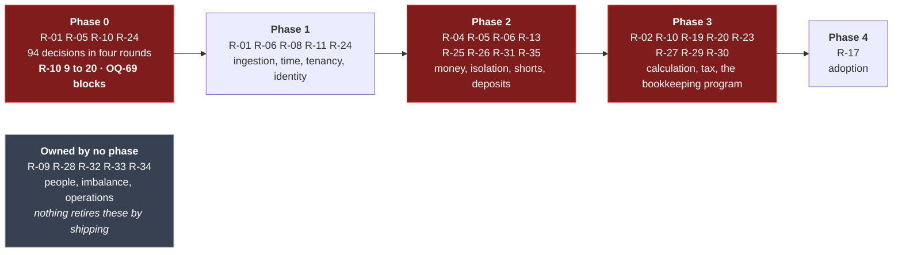

# Risk Register

Scored **likelihood × impact**, each on 1–5. Anything scoring **12 or above** needs an owner and a
mitigation in the plan, not just an entry in a table.

| Score | Band |
| :--: | --- |
| 20–25 | 🔴 Critical |
| 12–16 | 🟠 High |
| 6–10 | 🟡 Medium |
| 1–5 | 🟢 Low |

> **Re-scored 2026-08-11**, on the eleven decisions **[DEC-19]**…**[DEC-29]** that closed the P1 open
> questions. **R-03 is retired**, **R-02** falls from 20 to 15 and **R-07** from 12 to 6. **R-01** and
> **R-05** keep their scores: both were *deferred* rather than answered, and a deferred risk is still
> a risk. **R-09** was reviewed and deliberately left where it was. No risk ID has been reused; the
> retired entry stays in the register, marked.

> **Re-scored again 2026-08-11**, on the thirty-six decisions **[DEC-30]**…**[DEC-65]**. **Two risks
> are new**: **R-23**, the €/kWh surcharge migration **[DEC-35]**, which fails silently by exactly a
> factor of 1000; and **R-24**, the contradiction between **[DEC-20]** and **[DEC-56]** — an identity
> provider was chosen that presupposes a Microsoft tenancy, and there is no tenancy. **R-02 holds at
> 15 but changes character**: it is no longer mostly about *unresolved* rules, it is about *newly
> changed* ones. **R-01**, **R-04**, **R-08** and **R-09** were re-examined and deliberately held —
> each row says what pulled in which direction. Nothing fell. That is not a failure of the round: the
> three expensive decisions **[DEC-33]**, **[DEC-35]** and **[DEC-44]** all *added* work to the two
> areas that carry the most risk.

> **Re-scored a third time 2026-08-11**, on **[DEC-66]** and **[DEC-67]**. **R-24 falls from 16 to 9**
> and is **retitled**: the contradiction it was raised for is **resolved** — Entra ID uses PeakPower's
> existing corporate tenancy, and **[DEC-56]** is clarified rather than reversed — so the harm it was
> scored on, *split employee identity*, can no longer occur. What is left is a different risk under
> the same ID: a **schedule dependency outside the team's control**, plus a **claim mapping that
> [DEC-67] deliberately leaves unproven** until access to that tenancy arrives. No other score moved.
> ⚠ **Falling below 12 takes R-24 off the weekly review, which is exactly when a dated dependency gets
> forgotten** — it stays on the Phase 0 dependency list with an owner and a date
> ([Roadmap §2.1](01-roadmap-and-phasing.md)), and it returns to weekly review the day that date is
> missed.

> **Re-scored a fourth time 2026-08-19**, on the forty-five decisions **[DEC-68]**…**[DEC-112]**. This
> is the largest movement the register has had and the first round in which the *shape* of the
> platform changed rather than its details. The platform **sheds** invoicing mechanics — numbering
> **[DEC-88]**, the PDF and the email **[DEC-89]**, VAT **[DEC-76]**, the surcharge **[DEC-73]**,
> invoice payment matching **[DEC-105]**, chargebacks **[DEC-85]** and settlement from the wallet
> **[DEC-77]** — and **gains** energiebelasting **[DEC-74]**, short selling **[DEC-72]**, configurable
> BRPs **[DEC-69]**, platform-matched bank-transfer deposits **[DEC-106]**, withdrawals **[DEC-83]**,
> a customer usage API **[DEC-97]** and four-eyes as a per-customer-company mode **[DEC-71]**.
>
> **Eleven risks are new — R-25…R-35.** **R-10 rises from 9 to 20** and is the headline: **[OQ-69]** is
> the only blocking question left on the register, and no customer invoice can be issued at all until
> it is answered. **R-20 rises from 6 to 12**, because **[DEC-100]** withdraws the materiality
> threshold its mitigation was built on. **Six fall** — R-02 15 → 12, R-23 15 → 10 and re-pointed,
> R-11, R-13 and R-15 9 → 6, R-07 6 → 4. **Nothing is retired.** R-23 in particular is *re-pointed*
> rather than closed: **[DEC-73]** and **[DEC-87]** cancel both €/kWh rates it was raised for, and
> **[DEC-74]** introduces a third one on the same day.
>
> ⚠ **Entries at 12 or above go from eight to seventeen.** That is a reading list rather than a review,
> and the cadence at the foot of this document is changed to say so rather than pretending the meeting
> is still one hour long.

---

## Top risks

Everything scoring 12 or above, in score order — **seventeen** entries after 2026-08-19, up from
eight. Where a round moved an entry's band, the entry says which decision moved it and in which
direction; nothing here is re-scored silently.

### R-01 · ~~PVNed~~ **BRP** integration cannot be tested before production 🔴 **20**

*Likelihood 4 × Impact 5 — unchanged, re-examined twice on 2026-08-11 and again on 2026-08-19.
**Deferred by [DEC-21], not closed.** Retitled 2026-08-19 by **[DEC-69]**: PVNed is the first BRP, not
the only one, so the score, the owner and the substance are unchanged and the scope of the sentence is
not.*

Everything the platform shows, trades against and invoices comes through one third-party push
integration. If there is no test environment ([OQ-05]), the first real document arrives in
production and every quirk is discovered live.

**[DEC-21] changes the plan, not the exposure.** The proof of concept ingests generated data in the
PVNed document format, which unblocks phase 1 without a vendor dependency. But the real endpoint, its
authentication mechanism, the acknowledgement format, the retry behaviour on non-2xx and the nine
documentation inconsistencies ([OQ-65]) are all still unvalidated, and the original warning — that
PVNed may never offer a usable test environment — stands untouched. The score does not move; the
discovery does, to a later and more expensive point in the plan.

**The second round narrowed its content without moving its score.** Three decisions answer real
questions about the *document*: **[DEC-38]** fixes the cadence at one document per EAN per day,
**[DEC-57]** closes the correction window at 10 working days with nothing afterwards, and
**[DEC-65]** establishes that no `A01` production series is sent at all for a connection that never
produces. Each is a guess the generator no longer has to make. What none of them touches is the
*transport* — endpoint, authentication, acknowledgement format, retry behaviour, and whether a test
environment will ever exist. This risk is now almost entirely a transport risk with a document
residual ([OQ-65]), which is a more useful thing to hold than a general unease, but it is not a
smaller one. Note also that **[DEC-57]** removes the recovery route: after 10 working days PVNed will
not resend, so a document misread in the first production week cannot be re-fetched, only re-entered
by hand **[DEC-60]**.

**The fourth round changes what the integration *is*, and gives back the recovery route the second
round removed.** **[DEC-69]** makes the metering-data source a **configurable BRP**: PVNed is the
first, not the only one. That cuts two ways. Endpoint, credentials, document format, acknowledgement
and retry become reference data plus one adapter behind a port, while raw-payload persistence
**[DEC-03]**, versioning **[DEC-07]** and quarantine stay BRP-agnostic in the pipeline — so a second
source is additive rather than a rewrite — and at the same time every unanswered item on this row
becomes a question *per BRP* rather than a question. ⚠ **The paragraph above is amended by
[DEC-98]**, which reverses **[DEC-57]**: reconciliation data **does** arrive after the 10-working-day
window, sometimes as a manual process, and **[DEC-99]** lets the difference be invoiced whenever it
lands. A document misread in the first production week is therefore no longer unrecoverable — it is
recoverable late, by hand **[DEC-60]**, and at the cost of a correction invoice **[R-20]**. Held at
4 × 5: nothing about the **transport** was answered, and the transport is what this row has been about
since the second round.

**Signals it is materialising:** no test endpoint offered; no sample allocation document (only the
imbalance sample exists today); questions in [OQ-65] going unanswered; the generated data quietly
diverging from the reconstructed sample because a real answer was inconvenient.

**Mitigation**
- Generate the PoC data **against the reconstructed sample message and XSD** in
  [PVNed timeseries](../30-integrations/01-pvned-timeseries.md) — never against a convenient
  simplification.
- Drive it through the **real** webhook, parser and validation path. Fake data that bypasses the
  parser proves nothing.
- Close [OQ-65] before the generator hardens. Under **[DEC-21]** the generator becomes the de facto
  specification, and a wrong guess encoded there is a wrong guess the whole of phase 1 validates
  against.
- Open the PVNed conversation anyway, and early — external parties have their own calendars, and
  **[DEC-21]** buys time rather than removing the dependency.
- Build `DevStubs` as a first-class deliverable, able to produce valid, invalid, DST and correction
  documents ([PVNed integration §11](../30-integrations/01-pvned-timeseries.md)).
- Store every raw payload from day one **[DEC-03]**, so the first surprise is diagnosable and
  replayable rather than lost.
- Treat the nine documented inconsistencies ([§9](../30-integrations/01-pvned-timeseries.md)) as a
  checklist for the first production week.
- Make "mock PVNed in the test environment, then validate against the real integration" a **named
  gate** before any money is invoiced on PVNed data, rather than something phase 1 is assumed to have
  covered.
- **Build the BRP seam in the PoC, not after it [DEC-69].** The adapter, the `brp` reference row and
  the port are cheap now and are the difference between "PVNed is late" and "the platform is late".
  A second BRP is then a configuration exercise; a second BRP retrofitted through a pipeline shaped
  like PVNed's document is this risk a second time.
- Treat reconciliation data **[DEC-98]** as a first-class inbound path, including its manual variant,
  rather than as an exception handled once. It is now the only route by which a first-week mistake
  gets corrected.

**Owner:** Lead + PVNed account contact

---

### R-10 · The bookkeeping program is unnamed, and the invoice now depends on it entirely 🔴 **20** *(was 🟡 9)*

*Likelihood 4 × Impact 5 — was 3 × 3 = 9. Raised 2026-08-19. **[OQ-69] is the only blocking question
left on the register.***

This row used to say "Odoo integration harder than expected". It is not that any more. Five decisions
in one round moved the invoice itself into a program nobody has chosen:

| Decision | What moved out |
| --- | --- |
| **[DEC-88]** | **Invoice numbering.** The platform pushes a draft and never mints a number |
| **[DEC-89]** | The **PDF** and the **email** that carries it |
| **[DEC-105]** | Payment settlement **reconciliation** |
| **[DEC-108]** | **Customer records** — they do not exist there yet; the platform creates them, matched on a stable identifier and never on name |
| **[DEC-109]** | The **deposit view**: that program learns about wallet deposits from its own bank feed, not from the platform |

and two more added to what it must be configured with: **[DEC-74]** an energiebelasting ledger
account, **[DEC-76]** a VAT rate per account. **[DEC-107]** says the chart of accounts and the tax-code
mapping do not exist and must be built; **[DEC-59]** said they have no owner, and that is still true.

**Impact 5.** Not "the invoice is late" and not "the invoice is unnumbered": there is **no customer
invoice at all** until the target is named. The platform can calculate every amount and issue none of
them. **Likelihood 4**, which is higher than any other unanswered question on the register, because
[OQ-69] is not a question that can be closed by reasoning — it is a product somebody has to choose,
buy, host and version. It has been open across four decision rounds while the work landing on it grew
every time, and the three sub-answers it needs (which program, which version, which external API) can
each break the integration on their own.

**Signals it is materialising:** "Odoo, probably" offered as an answer without a version; phase 3
planning starting with the target still unnamed; the chart of accounts still without an owner a month
after **[DEC-107]**; a draft-push adapter written against a guess.

**Mitigation**
- **Name it in phase 0, not in phase 3.** It is a purchase with a lead time, and the answer needs
  three parts: program, version and hosting model, and the external API. Answering one of the three
  is not answering the question.
- **Give [DEC-107]'s chart of accounts and tax-code mapping a named owner on the day the program is
  named.** It grew before it was written — an energiebelasting account **[DEC-74]** and a VAT rate per
  account **[DEC-76]** — and it is the artefact that turns a chosen program into a working push.
- Keep the push **behind a port**, with the calculated draft stored on the platform side. What the
  platform owns is the calculation and the returned number; if the target changes, an adapter changes.
- Build the platform half against a **stub that returns a number**, so phase 3 is not blocked on
  procurement. ⚠ A green stub proves the platform's half and nothing about the other system's.
- Treat **[OQ-92]** (one invoice document or two) as part of this answer rather than after it: it
  decides how many drafts, numbers, PDFs and emails a customer gets per month.

**Owner:** Finance + IT

---

### R-28 · Full imbalance cost sits with PeakPower, and nothing measures it 🟠 **16** *(new)*

*Likelihood 4 × Impact 4 — registered 2026-08-19 on [OQ-15]'s confirmation of **[DEC-25]**.*

*"We take the full imbalance risk."* **[DEC-25]** keeps invoice line 3 unimplemented and stores PVNed
`A12` documents without pricing them, so imbalance is not a customer charge. What the confirmation
adds is where it lands instead: **entirely on PeakPower**, as a cost the platform does not compute,
does not report and does not alert on.

**Likelihood 4.** Imbalance is not an incident, it is the normal condition of a portfolio whose
customers' actual profiles differ from the blocks bought for them — and the platform's own design
generates that deviation deliberately: over-cover is sold at day-ahead and under-cover bought
**[DEC-23]**, at 0,01 MW granularity **[DEC-70]**, on a forecast nobody is contractually held to
**[DEC-112]**.

**Impact 4, and the arithmetic is worth writing down.** On a 10 MW average portfolio over a 30-day
month — 10 MW × 720 h = **7 200 MWh** — the platform's only margin instrument is the spread it quotes
**[DEC-80]**, at its default 2% of a €100/MWh price: **€14 400,00**. A 3% imbalance volume is
**216 MWh**; at an average settlement delta of €50/MWh it costs **€10 800,00** — **75% of the margin
earned on the same volume**. Illustrative figures rather than a forecast; the point is the ratio, and
that the ratio is invisible to everyone in this specification set. It is not 5, because nobody is
invoiced wrongly and the money does show up in the bank account eventually.

**Signals it is materialising:** nobody can state last month's imbalance cost; `A12` documents stored
and never read; a customer whose blocks systematically miss their profile with no conversation
attached; the spread being quoted as "the margin" in a commercial discussion.

**Mitigation**
- **Store `A12` and report it.** Storing was **[DEC-25]**'s cheap option-keeping; the cheapest next
  step is a monthly imbalance-cost figure next to the spread earned, per BRP **[DEC-69]**. It needs no
  invoicing work and no customer-facing change.
- Measure **deviation per customer** even though nobody is charged for it. A systematic misser is a
  commercial conversation, not a defect, and only measurement makes that conversation possible.
- Write the revisit trigger down now, because there is no alert to raise one: **the first month in
  which imbalance cost exceeds the spread earned.**
- ⚠ Do not treat **[DEC-72]**'s short selling as unrelated. A short delivered from nothing *is*
  imbalance until it is covered — see **[R-25]**.

**Owner:** Trading / Managing director

---

### R-04 · Wallet correctness defect 🟠 **15**

*Likelihood 3 × Impact 5 — reviewed 2026-08-11 against **[DEC-33]**, **[DEC-43]** and **[DEC-41]**,
reviewed again 2026-08-19 against **[DEC-71]**, **[DEC-77]**, **[DEC-78]** and **[DEC-83]**, and
deliberately held both times.*

A race, a rounding error or a missed rollback in reserve/settle/release means a customer's money is
wrong. This is the one class of bug that is not recoverable by an apology.

**Three decisions pulled in three directions and the net is a wash.**

- **[DEC-33]** puts a reservation behind a trade nobody has approved yet. The reservation is created
  at acceptance whichever state the trade lands in, and `AWAITING_APPROVAL` can now be left by three
  routes — approved, refused, expired — each of which must release or convert it **exactly once, in
  the same transaction**. `EXPIRED` in particular is the one state whose money column is now
  *conditional*, where before no expiry could touch the wallet at all. By construction these paths
  apply only to the largest trades, because that is what the threshold selects for. That is more
  surface, and more expensive surface.
- **[DEC-43]** removes the refund payout path outright. A whole money-out flow — approval, provider
  versus manual transfer, and reconciliation against a bank payout — no longer exists. That is a
  larger reduction than the four-eyes paths are an addition, in code if not in delicacy.
- **[DEC-41]** confirms the pre-submission check uses 100% of the estimate with **no buffer**, and
  **[DEC-64]** fixes VAT at 21%. Together they turn [OQ-83] from a vague exposure into an exact one:
  if the wallet debit settles the VAT-inclusive total, every reservation is short by exactly 21% and
  there is nothing left to absorb it.

Held at 3 × 5. The additions are sharper and the removal is larger; claiming to know which wins would
be false precision. What did change is the shape of the mitigation, below.

**The fourth round moves four more things, and the net is again close to a wash.**

- **[DEC-78] closes [OQ-83] in the direction this entry feared** — the reservation and the debit are
  **VAT-inclusive**, `round(totalMWh * price * (1 + vatRate), 2)` at 21% **[F05-R70]** — and then
  removes the exposure anyway, because reservation and debit are **the same stored number**, never two
  calculations. The sharpest named defect in this row is gone, and a VAT-rate change between
  acceptance and confirmation can no longer open a gap.
- **[DEC-77] reverses [AS-12]**: invoices are never settled from the wallet, and the `INVOICE_DEBIT`
  entry type is removed. A whole money path leaves the ledger, and with it the negative-balance
  question **[AS-11]** was always uncomfortable about.
- **[DEC-83] reverses [DEC-43]** and **puts the money-out path back** — hold, approve or decline, pay
  manually, debit **[F06-R33]**…**[F06-R37]**. The reduction this row banked on 2026-08-11 is
  withdrawn, and what returns is worse than what left: a payout to an external IBAN, executed by hand.
- **[DEC-71] replaces [DEC-33]'s threshold with a per-company mode.** Fewer moving parts — no
  threshold table and no versioning of one — but **more traffic through the approval paths**: every
  trade of an enabled company, not only those above a value. **[DEC-90]** also removes balance
  thresholds and low-balance alerts, so nothing watches the balance except the pre-trade check
  **[DEC-41]**.

Held at 3 × 5 again. What changed is which paths the test gate has to name, below.

**Mitigation**
- Append-only ledger with computed balances and a daily reconciliation job **[DEC-04]**.
- Row-level locking with a written lock order — wallet before trade, always.
- The eight correctness tests in
  [Solution structure §6.1](../20-architecture/02-solution-structure.md) as a merge gate.
- **Add the four-eyes release paths as named cases to that gate [DEC-33]**: approve, refuse and
  expire from `AWAITING_APPROVAL`, each asserting the reservation is released or converted exactly
  once; plus the races — refuse while approving, expire while approving, two accounts approving at
  the same instant. ⚠ **Amended 2026-08-19 by [DEC-71]**: the paths are unchanged in kind but they
  now apply to **every** trade of a four-eyes company, so the fixtures select on a **company flag**
  **[F01-R42]** rather than on an amount above a threshold, and self-approval must be refused
  **[F01-R48]**.
- **Add the withdrawal paths to the same gate [DEC-83]**: hold, approve, decline, pay, each releasing
  or converting the hold exactly once — plus the races that matter, decline while approving, a
  withdrawal and a trade competing for the same available balance, and a payout against a bank account
  being replaced in one operation **[F01-R46]**.
- `CHECK (available_after = settled_after - reserved_after)` at the database level.
- Database-level `REVOKE UPDATE, DELETE` on ledger entries.
- Property-based tests on the balance identity under arbitrary operation sequences, now including a
  trade that sits in `AWAITING_APPROVAL` across other wallet movements.
- ~~Settle [OQ-83] before wallet settlement is built. A reservation sized ex-VAT against a
  VAT-inclusive debit is a correctness defect that no amount of locking catches — and after
  **[DEC-41]** there is no buffer to hide it.~~ ✅ **Closed 2026-08-19 by [DEC-78]**. The rule that
  replaces it is testable in one line: **the reservation and the debit are the same stored number**
  **[F05-R70]**. Assert it, including across a VAT-rate change.
- ⚠ **The wallet no longer bounds every exposure it used to look like it bounded.** Short selling
  **[DEC-72]** creates a promise the balance does not cover — **[R-25]** — and a bank-transfer deposit
  credits it on a match the platform makes itself — **[R-26]**. Both land in this machinery; neither
  is this row's to solve.

**Owner:** Lead

---

### R-05 · Client-money regulation applies 🟠 **15**

*Likelihood 3 × Impact 5 — unchanged, and held again 2026-08-19 against **[DEC-83]**, **[DEC-84]**,
**[DEC-106]** and the [OQ-31] confirmation. Now explicitly a **go-live gate**.*

[OQ-31] is closed by deferral **[DEC-28]**: no segregated client account and no regulatory analysis,
for now. That defers the work, not the exposure. Holding customer funds in a prepaid wallet may still
carry regulatory obligations — segregated accounts, safeguarding, possibly licensing — and
discovering it near go-live could block launch outright.

**[DEC-28] draws the line explicitly: this is a go-live gate, not a build gate.** The wallet may be
built and exercised, but **the PoC must not hold real customer funds** — test money only. The
question must be answered before any real deposit is accepted, because an adverse answer may imply a
licence application with its own lead time, and lead time is the thing a deferral cannot buy back.

**Deferred still, and the deferral now covers more money.** [OQ-31] was **confirmed rather than
answered** on 2026-08-19 — *"ideally we want to have a third party account. For now just use same bank
account"* — so customer funds sit in PeakPower's own account **by design and on the record**. Three
decisions widen what that means: **[DEC-106]** makes bank transfer a first-class deposit route the
platform matches itself, **[DEC-83]** reinstates real payouts to a customer IBAN, and **[DEC-84]**
removes the minimum and the maximum rather than setting them. The wallet now takes money in by two
routes and pays it out by one, uncapped at both ends.

Held at 3 × 5 — whether the regulation applies did not change, and that is what the likelihood
measures. What changed is how hard the deferral is to hold: **[DEC-28]**'s "test money only" rule now
has to survive a route explicitly designed to receive real bank transfers, which is a stricter thing
to police than a payment-provider sandbox.

**Mitigation**
- Legal opinion before the first real deposit, not before the first line of wallet code. That
  distinction is the whole of **[DEC-28]**, and the only reason this risk is deferrable at all.
- A hard operational rule while the answer is outstanding: no production payment-provider
  credentials, no real IBAN on the deposit instructions, test money only.
- Design already keeps the wallet reconcilable against a bank account, which is a precondition for
  segregation if it turns out to be required.
- **New 2026-08-19:** extend the operational rule to the bank-transfer route — no production IBAN on a
  deposit-instruction screen and no live deposit-intent reference until the opinion lands
  **[DEC-106]**, **[F07-R13]**. A screen that prints a real IBAN is a real deposit waiting to happen.
- The **withdrawal** path **[DEC-83]** is the flow that would have to prove segregation if it is
  required, because it is the only one that moves customer money *out*. Design it reconcilable now
  rather than retrofitting it.

**Owner:** Legal / Managing director

---

### R-06 · Tenancy isolation failure 🟠 **15**

*Likelihood 3 × Impact 5 — held 2026-08-19 against **[DEC-97]** (a new machine-called surface) and
**[DEC-102]** (one fewer check on it).*

One customer sees another's consumption profile, trading position or balance. Commercially serious
between competitors, and a reportable GDPR breach.

**[DEC-20] raises the care needed rather than lowering it.** The PoC runs with no authentication, so
the isolation layers have no login to hide behind. The `customer_id` / `account_id` context pipeline
must be built from the first commit, fed by a development context provider, so the query filter, the
row-level security and the 404-not-403 behaviour are exercised the whole way through. Retrofitting
tenancy isolation into a system that never had it is precisely how this risk materialises.

**Two changes on 2026-08-19, pulling the same way, and the score is held deliberately.** ⚠ The
penetration-test mitigation below is **reversed by [DEC-102]**, and **[DEC-97]** adds a **customer
usage API** — interval and aggregated net usage per metering point, scoped to the calling company,
called by a program rather than by a browser. That is a new tenanted surface with no session behind
it; **[DEC-81]** draws the line it must not cross (usage yes, prices no, no export) and **[OQ-95]**
has not yet chosen between an API and file/FTP, which is a different isolation problem with the same
question underneath. Held at 3 × 5, because the load-bearing control here has always been the
**automated route-table test**, which covers a new endpoint by construction, and because the four
layers are untouched. The loss of external validation is real but general, so it is carried as
**[R-33]** rather than double-counted here.

**Mitigation**
- Four independent layers ([Security §2](../20-architecture/07-security.md)).
- An automated test that walks the **entire** customer-API route table as customer A attempting to
  reach customer B's objects — so a new endpoint is covered without anyone remembering.
- `IgnoreQueryFilters` banned by architecture test.
- Row-level security as the last line even if application code is wrong.
- Run the route-table test against the **unauthenticated** PoC too, driven by the development context
  provider. If it cannot be run without a login, the pipeline is not built right.
- ~~External penetration test before go-live [OQ-60].~~ ⚠ **Reversed 2026-08-19 by [DEC-102]** —
  there is none. **[NFR-36]** stays on the register **unmet**, with a written risk acceptance in its
  place. See **[R-33]**.
- **New 2026-08-19:** the route-table test must enumerate the **customer usage API** **[DEC-97]** as
  well as the portal routes — and, if **[OQ-95]** chooses file delivery, the directory layout too. A
  drop folder is a route table that nobody remembers to test.

**Owner:** Lead

---

### R-25 · Short selling is permitted, with no collateral rule 🟠 **15** *(new)*

*Likelihood 3 × Impact 5 — registered 2026-08-19.*

**[DEC-72] reverses [DEC-34]**: a customer may sell a block they do not hold, and the case that
motivates it is a customer with solar production selling expected surplus. **[F05-R69]** states the
mechanism and the hole in the same requirement: a short is a **promise to deliver**, not a spend. The
prepaid wallet **[AS-11]** does not bound it, because a `SELL` **credits** the wallet on confirmation
**[F05-R35]** rather than debiting it, and the pre-trade balance check **[DEC-41]**, **[F05-R09]**
sizes a *debit* that a short never creates. No collateral rule, no exposure limit and no per-customer
authorisation flag exist — **[OQ-94]**.

**Size it.** At the 0,01 MW minimum increment **[DEC-70]**, a month-long baseload short is
0.01 × 24 × 30 = **7,2 MWh**, and a €40/MWh adverse move costs **€288,00** — nothing. At 0,10 MW it is
**72 MWh** and **€2 880,00**. At 1 MW it is **720 MWh** and **€28 800,00**, against a wallet that may
legitimately hold €0,00 throughout, because **[DEC-84]** sets no minimum deposit and nothing else
obliges a seller to fund anything. The exposure scales linearly with a number nobody has capped.

**Impact 5**: an uncovered short is PeakPower's loss and not the customer's, because the customer's
balance never funded it and there is no credit concept **[AS-11]** to fall back on. **Likelihood 3**,
not higher because **[F05-R69]** says in as many words that the path is "specified but not safe to
open to volumes beyond confirmed holdings", and not lower because that sentence is a note inside a
requirement rather than a gate in the code.

**Signals it is materialising:** the sell wizard shipping to customers with [OQ-94] still open; any
"we will watch it manually" answer; a first short larger than the seller's total historical
production; open short volume that nobody can report on demand.

**Mitigation**
- **Answer [OQ-94] before the sell path is enabled for customers**, not before it is built. The domain
  model may permit the transition; the product must not.
- Until it is answered, keep the old rule as **configuration, not code**: a per-company "may sell
  beyond confirmed holdings" flag, default **off**, so opening it is a switch with a name against it
  **[DEC-17]** and closing it again is not a deployment.
- Whatever the answer is, it is a **wallet** mechanism — a hold, a limit or a margin call — so it
  lands in the same reserve/release machinery as **[R-04]** and belongs on that test gate rather than
  beside it.
- Report **open short volume per customer per delivery period** from the first sell. An exposure
  nobody can see is one nobody sizes.
- ⚠ Cover for an uncovered short is bought at day-ahead **[DEC-23]** into a portfolio that already
  carries the imbalance **[R-28]**. Score the two together, not separately.

**Owner:** Trading / Risk

---

### R-26 · Bank-transfer deposits credit real money on a match the platform makes itself 🟠 **15** *(new)*

*Likelihood 3 × Impact 5 — registered 2026-08-19.*

**[DEC-106]** makes bank transfer a first-class deposit method: the platform issues a unique reference
per deposit intent **[F07-R23]**, matches the incoming payment on it **[F07-R25]**, credits the wallet
and emails the customer **[F07-R27]**. Every step is the platform's, and the last one is money the
customer can trade with immediately **[DEC-77]**. Three things sharpen it:

- **The feed is not chosen — [OQ-93].** A CAMT.053 import, a PSP webhook and a SEPA-instant push have
  different authenticity properties, different latencies and different duplicate semantics. The
  matching logic cannot be written safely before it is known which of the three it reads, which is why
  **[F07-R24]** cannot be built and **[NFR-23]**'s degraded mode is currently a manual one.
- **The fallback matches on IBAN [DEC-61].** A payment with no reference, or a mistyped one, falls back
  to the IBAN on the customer record — a weaker key. **[F01-R45]** already has to say that a
  `PENDING_APPROVAL` bank account is neither a payout destination nor a matching key, and this risk is
  why that sentence exists.
- **There is no cap.** **[DEC-84]** removes the minimum and the maximum rather than configuring them,
  so a mis-matched credit has no ceiling and no "that looks wrong" threshold behind it.

**Impact 5**: crediting the wrong wallet is a money defect of the same class as **[R-04]**, with the
extra property that the customer can spend it before anyone notices, and the reversal now happens in
somebody else's system **[DEC-85]**. **Likelihood 3**: matching on a reference the platform issued is
a well-understood problem and the specification already routes the ambiguous cases to a queue, but
nothing is built and the input format is unknown.

**Signals it is materialising:** a matching job written before [OQ-93] closes; a standing per-customer
reference instead of a per-intent one; an unmatched queue with no owner; a credit posted from a
statement line with no idempotency key.

**Mitigation**
- **Close [OQ-93] before the matching job is written.** It decides the trust model, not just the
  parser.
- Credit **only** on an exact reference match. Everything else — right amount, known IBAN, no
  reference — goes to the unmatched queue for a human. A queue is cheap; a wrong credit is a reversal
  in another system.
- Make the reference **unguessable and single-use**, bound to one intent **[F07-R23]**. A standing
  per-customer code invites a replay of a real payment description.
- **Idempotency on the feed's own transaction identifier**, so a re-delivered statement line cannot
  credit twice — the same discipline **[R-13]** applies to iDEAL webhooks, against a different feed.
- Reconcile the wallet against the bank **daily** **[DEC-04]** and treat a difference as an incident,
  not a report. ⚠ Under **[DEC-104]** that incident reaches one person **[R-32]**.

**Owner:** Backend / Finance

---

### R-27 · The platform now calculates a tax 🟠 **15** *(new)*

*Likelihood 3 × Impact 5 — registered 2026-08-19.*

**[DEC-74] reverses [DEC-24]**: energiebelasting is back as line 5, and it is not a line — it is a
calculator. A versioned bracket table **[F09-R18]**, a per-customer reduction or exemption
**[F09-R20]**, a resolution order that ends in a hard stop **[F09-R21]**, a cumulative year-to-date
ladder per EAN **[F09-R22]**, a 50%-per-bracket split when an EAN transfers mid-year **[F09-R23]**,
and a ledger push **[F09-R24]**. Four properties make it a risk rather than merely new work:

- **It is a legal amount.** A rate with nobody's name against it is not defensible to the
  Belastingdienst, which is why **[F09-R27]** audits every change — and an error here is *systematic*:
  one wrong bracket row is wrong for every customer in that tier, for a year.
- **The rates are edited in production, by design.** **[F09-R25]** puts bracket maintenance on a
  back-office screen with no release, because *"we need to be able to change those prices"* is the
  decision's own wording. The control against a mistake is versioning **[F09-R19]** and audit, not
  review.
- **There is no chart of accounts to push into.** **[DEC-107]** says it must be built, **[DEC-59]**
  says it has no owner, and it now has to carry an energiebelasting account and a VAT rate per account
  **[DEC-76]** before the first push works. This row rides on **[R-10]**.
- **[OQ-96] is open while amounts are being calculated.** The *vermindering* is a **fixed annual credit
  per connection**, so it does not scale with volume: its absence moves every affected invoice by the
  same figure and is invisible to any percentage-based sanity check.

**Impact 5.** For scale, on the same 72 MWh a customer might buy at €100/MWh: the platform's own
margin at the default 2% markup **[DEC-80]** is **€144,00**, while the energiebelasting on
72 000 kWh at an illustrative €0,10/kWh is **€7 200,00** — **fifty times** the revenue the platform
earns on the transaction it is attached to. **Likelihood 3**: the arithmetic is specified in unusual
detail, which is the mitigation already working; what remains human is the year boundary, the transfer
split and a mis-typed rate.

**Signals it is materialising:** a bracket table loaded without a `source`; a year rolling over with
no table for it; a reduction row overlapping another; `MISSING_TAX_TARIFF` being "temporarily"
defaulted to zero; the first mid-year EAN transfer reconciled by hand.

**Mitigation**
- **Close [OQ-96] before the first push**, not before the first calculation. The calculation is right
  either way; the amount is not.
- **Never zero, always stop.** Keep **[F09-R21]** forced: a missing bracket table halts the run with
  `MISSING_TAX_TARIFF` rather than taxing at zero, because zero tax is a legal statement that only an
  explicit `EXEMPT` row may make. This is the same discipline **[R-02]** used to hold for
  `MISSING_FEED_IN_TARIFF`.
- **Snapshot what produced each amount** **[F09-R26]** — version, boundaries, rates, the reduction row
  if one resolved, `ytdBefore`, `ytdAfter`, the split factor. Re-reading a pushed amount must never
  depend on today's reference data.
- Two named people for the annual load, with the ledger push disabled until the year's version is
  closed **[F09-R19]**. Loading next year's rates is additive and can be done any time before
  1 January; doing it on 2 January is the failure this prevents.
- Worked-example tests at every boundary: a tier crossed mid-year, a transfer taxed at 50% of each
  bracket, an exemption, and a December-to-January month **[R-08]**.
- The unit hazard is **[R-23]**'s, not this row's: `rate_eur_kwh` at `numeric(14,8)`, never displayed
  in €/MWh.

**Owner:** Finance lead

---

### R-02 · Invoicing is built on rules that keep changing 🟠 **12** *(was 🟠 15)*

*Likelihood 3 × Impact 4 — was 4 × 5 = 20, reduced to 15 earlier on 2026-08-11, held at 15 through the
second round, and **reduced to 12 on 2026-08-19**.*

**Why it fell, earlier that day.** Of the three unresolved inputs, two went. Energiebelasting is
deferred and invoice line 5 is not implemented **[DEC-24]**; imbalance is out of scope and invoice
line 3 is not implemented **[DEC-25]**. Two of the five invoice line categories no longer exist. The
largest single VAT ambiguity — whether wallet amounts are inclusive or exclusive, worth 21% of every
invoice — is settled: everything is VAT-exclusive **[DEC-26]**.

**Why the second round did not take it lower, despite answering two of the three remaining
questions.** **[DEC-44]** settles [OQ-35] — day-ahead settlement uses the raw price, no spread — and
**[DEC-64]** settles [OQ-82] at 21% on every line category. On the "unresolved rules" reading, this
risk should now be small. It is not, because the same two decisions moved work into it:

- **[DEC-44]** *adds a sixth line category.* Physical export leaves the day-ahead sale leg and
  settles at a per-customer feed-in tariff, which means a new reference-data table, a new pre-flight
  check, four new requirements and a **changed volume identity** — the assertion that is the whole of
  this risk's mitigation had to be restated. And it left its own hole: [OQ-86], the fallback when a
  customer exports and no tariff resolves, is **€662.53 apart on one EAN for one month**, roughly
  five times the net effect of the decision that raised it.
- **[DEC-64]** records the 21% rate *as stated*, not as advised. A foreign entity or any customer
  outside the standard rate reopens it, per invoice.
- **[DEC-35]** is a unit migration with a silent failure mode, now carried as its own entry
  **[R-23]** rather than hidden inside this one. Two risks with different mitigations should not share
  a row.
- [OQ-83] is still open, and **[DEC-41]** removed the buffer that would have absorbed a wrong answer.

**So the character changed.** Before, this was a risk about *not knowing the rules*; that component
genuinely fell. Now it is a risk about *rules that changed after the arithmetic was written* — three
of the thirty-six decisions rewrite specified work, and two of the three land here. Impact stays at
5: invoicing a customer wrongly and finding out a quarter later is not recoverable by an apology.
Likelihood stays at 3. The two movements are close enough in size that pretending to resolve them
into a fourth digit of precision would be false.

**The fourth round answers what was left and moves most of the document out of the platform.** Every
open input this row was waiting on is closed, and three of them are closed by *removal*:

| Was open | Closed by | Effect on this row |
| --- | --- | --- |
| [OQ-83] — is the wallet debit ex- or inclusive of VAT | **[DEC-78]** | Inclusive, and reservation and debit are the **same stored number** **[F05-R70]**. The exposure this row shared with **[R-04]** is gone |
| [OQ-86] — the fallback when export resolves no feed-in tariff | **[DEC-87]** | The question disappears with the tariff. Line 6 is withdrawn; export returns to line 2's sale leg at the raw day-ahead price |
| [OQ-36] — what the surcharge is charged on | **[DEC-73]** | The surcharge leaves the platform. Line 4, its tariff table and its resolution order are withdrawn |
| VAT on every line **[DEC-64]** | **[DEC-76]** | The platform computes **no VAT at all**. It pushes ex-VAT amounts against a ledger account |
| Who mints the number, makes the PDF, sends the email | **[DEC-88]**, **[DEC-89]** | None of them. The platform pushes a draft and stores the number it gets back |

Three implemented line categories remain — 1, 2 and 5
([Invoice calculation §1](../50-calculations/03-invoice-calculation.md)) — where the second round left
four and specified two more.

**Impact falls from 5 to 4, for one specific reason.** The "wrong number found a quarter later is not
recoverable by an apology" argument is weakened by **[DEC-99]**: a difference discovered months later
is now a **correction invoice at any time**, a designed path rather than a credit-note incident. It is
4 and not 3 because the platform still calculates every amount that reaches a customer, and because
**[DEC-88]**'s manual check is a check on a *document*, not a re-computation of the arithmetic behind
it. **Likelihood stays at 3**: the rules changed again, for the third round running, and that churn is
what this row measures.

⚠ **What left this row did not evaporate — it moved to rows with different owners.** **[R-10]** (the
target program, now blocking), **[R-27]** (energiebelasting, which the platform now calculates),
**[R-29]** (the fee and the VAT rate applied downstream) and **[R-30]** (the number). Read the four
together before concluding that invoicing got safer; what it got is *smaller and more dependent*.

**Mitigation**
- ~~**Do not start phase 3 until [OQ-83] and [OQ-86] are closed.** The gate is narrower than it was —
  [OQ-35] and [OQ-82] are gone — but not gone. Stated in
  [F10](../10-features/F10-invoicing-and-settlement.md) and in the roadmap.~~ ⚠ **Amended 2026-08-19**
  — both are closed, by **[DEC-78]** and **[DEC-87]**. The gate is not gone, it moved: **do not start
  phase 3 until [OQ-69] is answered and [OQ-96] is closed** — **[R-10]** and **[R-27]** carry them,
  and the first of the two blocks the phase outright rather than shaping it.
- ~~Keep the interim behaviour **[DEC-44]** forced: a month with export and no resolving feed-in tariff
  is **skipped** with `MISSING_FEED_IN_TARIFF` **[F10-R39]**, never defaulted. Skipping is
  recoverable; a wrong credit on a finalised invoice is a credit note.~~ ⚠ **Withdrawn 2026-08-19 by
  [DEC-87]** — there is no feed-in tariff to fail to resolve. **The principle survives one table
  along**: `MISSING_TAX_TARIFF` **[F09-R21]** stops the run rather than taxing at zero, for the same
  reason and with more at stake, because zero tax is a legal statement **[R-27]**.
- ~~Engage a tax advisor on [OQ-77], and revisit **[DEC-64]** for any customer who is not a standard-rate
  Dutch entity **before** their first invoice.~~ ⚠ **Amended 2026-08-19.** [OQ-77] is closed by
  **[DEC-74]** — 50% of each bracket per period on a mid-year transfer **[F09-R23]** — and **[DEC-64]**
  survives only as the gross-up rate for a wallet reservation **[DEC-78]**, because VAT itself is now
  the bookkeeping program's **[DEC-76]**. The tax advisor is still wanted, on **[OQ-96]** and on the
  bracket table, and now on a calculation the platform actually performs.
- ~~Keep `IEnergyTaxCalculator` and `billing.energy_tax_tariff` in the model, unpopulated **[DEC-24]**,
  so the deferred calculation drops in rather than being retrofitted through a finished invoice
  engine.~~ ⚠ **Reversed 2026-08-19 by [DEC-74]** — both are **implemented**. The retained shell is
  what makes that cheap, and this bullet is kept because it is the clearest worked example in the
  register of a deferral that came back: the mitigation for a deferred calculation is to leave the
  seam in place. See **[R-27]**.
- Parallel-run the first month against the existing process and reconcile to the cent before any
  invoice reaches a customer.
- The volume identity assertion ([F10-R08]) as a permanent guard — simplified by **[DEC-25]**, since
  there is no imbalance term left to reconcile, restated against **net usage** under **[DEC-22]**, and
  restated again under **[DEC-44]** because the sale term now splits in two. ⚠ **Restated a third time
  2026-08-19 by [DEC-87]**: the split is undone and export rejoins the sale leg, so the identity
  returns to the shape it had before **[DEC-44]** — which is the argument for asserting an identity
  rather than a total, three rounds running.
- Parallel-run at **line level, including the lines the platform no longer computes** **[R-29]**. A
  reconciliation that checks only the platform's arithmetic checks the half that was never in doubt.

**Owner:** Finance lead

---

### R-08 · Time and DST handling errors 🟠 **12**

*Likelihood 3 × Impact 4 — reviewed 2026-08-11 against **[DEC-36]** and **[DEC-44]**, reviewed again
2026-08-19 against **[DEC-74]**, **[DEC-87]** and **[DEC-99]**, and deliberately held both times.*

92- and 100-interval days, the duplicated autumn hour, `Pos` mapping, peak-day counting, month
boundaries. These bugs are subtle, appear twice a year, and corrupt volumes and money silently.

**One source removed, one added.** **[DEC-36]** fixes the NL day-ahead curve at **18:00 Amsterdam**
and replaces the four-attempt 13:00/14:00/15:00/18:00 schedule with a single scheduled fetch plus
retry. That is three fewer local-time trigger points to get wrong, and the remaining one is stated in
a named zone rather than implied — a real reduction, because a schedule expressed in local time is
where DST bugs like to live. Against it, **[DEC-44]** pushes new arithmetic *down to interval level*:
exported volume is `max(−U, 0)` per interval, the feed-in tariff is resolved **per interval** so a
mid-month change splits into two lines rather than blending **[F09-R15]**, and all of that now has to
be right on a 92-interval day and on a 100-interval day where one local hour occurs twice. The
peak-hour rule being fixed **[DEC-19]** already removed the worst of the calendar ambiguity. Held at
3 × 4: the trigger surface shrank, the arithmetic surface grew, and they are the same order of size.

**One arithmetic surface removed, one added, and the trigger surface unchanged.** **[DEC-87]**
withdraws the feed-in tariff, so the per-interval tariff resolution **[F09-R15]** and the mid-month
split it caused are gone: export is valued at the day-ahead price for its interval **[DEC-23]**, which
is per-interval by construction and needs no second lookup. In its place **[DEC-74]** adds a
**calendar-year** boundary where there was only a month boundary — the energiebelasting ladder is
cumulative per EAN per year **[F09-R22]**, the 50%-per-bracket split applies on a mid-year transfer
**[F09-R23]**, and a December-to-January month now has money riding on which side of midnight a
kilowatt-hour falls. **[DEC-99]** adds that a correction may land in a finalised month at any time, so
interval arithmetic has to be **re-runnable** long after the month closed. Held at 3 × 4.

**Mitigation**
- One `IMarketCalendar` service; no date arithmetic anywhere else, enforced by architecture test.
- Precomputed interval spine so the arithmetic happens once, at generation.
- Property-based tests across three years of calendar.
- Explicit DST test cases in ingestion, charting, coverage and invoicing.
- `interval_count` constrained to `(92, 96, 100)` in the database.
- The peak rule is now fixed — Mon–Fri, `>= 08:00` and `< 20:00`, no exclusions **[DEC-19]** — so test
  the boundary conditions exactly: 07:59, 08:00, 19:59, 20:00, and the two DST days.
- ~~**New cases from [DEC-44]**: an exporting interval inside the repeated autumn hour; a feed-in
  tariff whose `valid_from` falls on a DST day; a month whose export and import both cross the
  boundary, asserted against the volume identity rather than against a total.~~ ⚠ **Amended
  2026-08-19 by [DEC-87]** — the tariff cases go with the tariff. **The first and third survive**: an
  exporting interval inside the repeated autumn hour, and a month whose export and import both cross
  the boundary, still asserted against the volume identity rather than a total.
- **New cases from [DEC-74]**: a year boundary that is also a DST-free but timezone-sensitive
  boundary — the ladder is per **calendar year in Europe/Amsterdam** while intervals are stored in UTC
  **[DEC-08]**, so the last interval of 31 December is the case to write first; a mid-year transfer at
  50% of each bracket **[F09-R23]** landing on a DST day; and a correction **[DEC-99]** that re-opens
  a prior year's ladder.
- **New case from [DEC-36]**: the 18:00 fetch on both DST days, asserted in Europe/Amsterdam and
  stored in UTC **[DEC-08]** — the single trigger is easier to get right and easier to get silently
  wrong, because there is no second attempt behind it.

**Owner:** Lead

---

### R-09 · Key domain knowledge concentrated in one or two people 🟠 **12**

*Likelihood 3 × Impact 4 — reviewed 2026-08-11, reviewed again 2026-08-19 after a fourth decision
round, and deliberately left unchanged both times.*

Peak-hour convention, netting, invoice arithmetic and — more importantly — the reasoning behind them
live in a small number of heads. If one of those people is unavailable, work stops or guesses get
made and are never revisited.

**Considered for a re-score twice on 2026-08-11, and not moved.** The **[DEC-19]**…**[DEC-29]** round
did exactly what the mitigation asks: eleven answers moved out of one or two heads and into the
register *with their reasoning*, which is the part that makes a written decision usable six months
later. The **[DEC-30]**…**[DEC-65]** round did the same for thirty-six more, and reached the trading
conventions and the invoicing practice this entry was mostly about.

**So why does it still stand?** Because forty-nine decisions were extracted from the same two or
three people in a single day, which demonstrates the concentration rather than relieving it — and
because the round surfaced how much is *not* written anywhere. **[DEC-59]** established that the Odoo
chart of accounts and tax-code mapping has no source **and no owner**. ~~**[DEC-33]** left a threshold
that only a person can supply [OQ-85].~~ ⚠ **Closed 2026-08-19 by [DEC-71]** — there is **no
threshold**, in euros or in megawatts, so the reference table nobody could populate is not built. That
is the good version of this failure mode: the hole was filled by removing the thing that needed
filling. **[DEC-53]** left a function set that has to be decided with operations [OQ-89], and that one
is still open. Each is a hole where someone's undocumented knowledge used to be sufficient.
Re-score when the operational practice is written down, not when more of it has been dictated.

**A fourth round, forty-five more decisions, the same two or three people, one day.** The observation
this entry makes has now happened four times over; ninety-four decisions have been extracted in four
sittings. Two of this round's decisions make the concentration **operational** rather than only
editorial: **[DEC-104]** names **one** operator with no rota — carried separately as **[R-32]** — and
**[DEC-107]** gives the chart of accounts an obligation and still no owner **[DEC-59]**, now with an
energiebelasting account and a VAT rate per account on it **[R-10]**. Pulling the other way,
**[DEC-71]** and **[DEC-74]** wrote down two things that genuinely lived in heads: who may approve
what, and how energiebelasting is actually calculated when an EAN changes hands mid-year. Held at
3 × 4. Re-score when the operational practice is written down **and a second person has run it**, not
when more of it has been dictated.

**Mitigation**
- Write it down. This specification set is a start, and the decision register with its rationale is
  the working example of what "written down" has to mean.
- Pair on calculation code; no single author for the calendar, coverage or invoice engines.
- Record the reasoning, not just the answer. **[DEC-19]** is worth far more as *"matches the exchange
  convention for Dutch peak-load products"* than as *"no holidays"*.

**Owner:** PO

---

### R-20 · Corrections are continuous, and nothing nets them 🟠 **12** *(was 🟡 6)*

*Likelihood 4 × Impact 3 — was 3 × 2 = 6. Raised 2026-08-19.*

Three decisions turn this from a thing to monitor into a workload. **[DEC-98] reverses [DEC-57]**:
reconciliation data **does** arrive after the 10-working-day window, sometimes as a manual process.
**[DEC-99]**: the monthly run is no longer a gate that closes — a correction landing months after a
finalised month produces a **correction invoice for the delta, at any time**. **[DEC-100]**: there is
**no materiality threshold**; every difference is handled individually and the €25 default is removed
rather than set.

⚠ **This row's own mitigation was withdrawn by the answer to its own question.** "Materiality
threshold [OQ-76]" is what **[DEC-100]** deletes, and nothing replaces it: one cent of correction
produces one correction invoice, which under **[DEC-88]** is a draft pushed to the bookkeeping
program, checked by a human and numbered there. The cost per correction is now a manual step in a
system the platform does not control.

**Likelihood 4** because **[DEC-98]** establishes that corrections are routine rather than
exceptional. **Impact 3** because the harm is operational cost and customer confusion rather than a
wrong number — the arithmetic is right, there is simply a lot of it, and every instance consumes
somebody's attention twice **[R-30]**.

**Mitigation**
- **Measure the correction rate in phase 1** — count and size, per BRP per month — before the
  invoicing that depends on it is built. The whole question is whether "individually" means five a
  month or five hundred.
- ⚠ **Take [DEC-100] back to the source before phase 3.** The ledger records the comment as possibly
  misplaced: it is phrased about deposits and withdrawals and sits on the true-up materiality row. A
  threshold of zero is an expensive default to inherit from an ambiguity.
- Batch the **push**, never the **calculation**. If the answer stays "individually", one draft per
  correction is a decision about *documents* **[OQ-92]**, not about arithmetic.
- A correction invoice must name **what it corrects and which original number** **[DEC-88]** it
  corrects, or the customer cannot reconcile it and the support call costs more than the delta.

**Owner:** Finance

---

### R-29 · Margin and tax correctness depend on a system this specification does not describe 🟠 **12** *(new)*

*Likelihood 3 × Impact 4 — registered 2026-08-19.*

**[DEC-73]** and **[DEC-76]** hand two multiplications to the bookkeeping program. The platform pushes
**volume in kWh** — per metering point and as a customer total, with `gross_consumption`,
`production`, `net_usage` and `exported`
([Odoo accounting](../30-integrations/04-odoo-accounting.md)) — and that program multiplies it by the
topup fee. The platform pushes **ex-VAT amounts against a ledger account**, and that program applies
the rate configured on the account. Neither multiplication is visible in this specification set,
neither is exercised by the platform's test suite, and both sit between the right invoice and a
plausible one.

What makes this a risk rather than a division of labour: after **[DEC-73]** the platform's only
remaining margin instrument is the **spread it quotes** **[DEC-80]**, and the topup fee is where the
rest of the money is. A fee entered against the wrong customer, a VAT rate on the wrong ledger
account, or a `net_usage` figure read as MWh — the payload sends kWh precisely to prevent that
**[R-23]** — produces a customer invoice that nobody inside this specification can reconcile.

**Likelihood 3**: it is a configuration screen in a system nobody has chosen **[OQ-69]**, with a
mapping that has no named owner **[DEC-107]**. **Impact 4**: wrong money on a customer document,
correctable by a correction invoice **[DEC-99]** but not *detectable* by the platform.

**Mitigation**
- **Reconcile in the direction the platform still can.** For each pushed month, assert that volume ×
  the fee the platform *believes* applies equals what the bookkeeping program invoiced. The platform
  no longer applies the fee; it can still hold the expectation and alarm on a mismatch.
- Keep the **unit on the field name** in the payload as in the column **[R-23]**: `volume_kwh`, never
  `volume`.
- **One owner for both mappings** — the fee per customer and the VAT rate per ledger account — named
  the day **[OQ-69]** is answered **[DEC-107]**.
- Parallel-run the first month at line level **including the lines the platform no longer computes**
  **[R-02]**.
- ⚠ Ask, once, whether the platform should hold the fee as reference data even though it does not
  apply it. **[DEC-73]** says it should not; this is the cost of that decision, recorded rather than
  argued with.

**Owner:** Finance lead

---

### R-30 · The customer-facing invoice number depends on an integration and a manual check 🟠 **12** *(new)*

*Likelihood 3 × Impact 4 — registered 2026-08-19. **[DEC-45]**'s rationale named exactly this.*

**[DEC-88] reverses [DEC-45]**: the platform calculates and pushes a **draft**, a human checks it in
the bookkeeping program, and that program assigns the number and issues it **[DEC-89]**. The platform
stores the returned number for display and reconciliation and never mints one. Two failure modes
follow, and the decision itself records them rather than leaving them to be discovered:

- **A push that fails leaves the customer with no numbered invoice at all** — not a late one, not an
  unnumbered one: none. The platform holds every amount and can issue nothing.
- **A draft that is pushed and never checked is invisible from the platform side.** The platform's
  state says `PUSHED`; whether a human opened it is the other system's business.

**Likelihood 3**: month-end integrations fail in ordinary ways — a rotated credential, a schema
change, a rate limit — and the manual check is one person's queue at the busiest point of the month.
**Impact 4**: revenue delayed and a customer without a document, recoverable by re-pushing, but the
recovery is manual and lives in a system the platform does not control.

**Mitigation**
- **Model the states honestly:** `CALCULATED` → `PUSHED` → `NUMBERED`, with the returned number as the
  only evidence of the last transition. A draft with no number after a stated number of days is an
  **alert**, not a report.
- **Idempotent push keyed on customer and period**, so a retry cannot create a second draft — a
  duplicate draft becomes a duplicate *number* the moment someone checks both.
- Show the customer what the platform knows, **labelled as what it is**: the calculated data is in the
  portal **[DEC-89]**, and until a number comes back it is explicitly **not an invoice**.
- Reconcile monthly: every customer with a calculated month has exactly one returned number, or an
  exception with a name against it.
- ⚠ Under **[DEC-104]** every alert here reaches one person **[R-32]**, at month end, which is when a
  single operator is least likely to be idle.

**Owner:** Finance + Lead

---

### R-32 · One named operator, no rota 🟠 **12** *(new)*

*Likelihood 4 × Impact 3 — registered 2026-08-19.*

**[DEC-104]** names Thinh as the operator after go-live, with no second tier and no rota.
**[NFR-68]** is written to match rather than to reassure: every P1 alert goes to that one person on
two independent channels, re-notified every 15 minutes, and **an unacknowledged P1 escalates to
nobody**. **[NFR-29]**'s four-hour RTO carries the same qualification.

**Likelihood 4**, because this is not an incident scenario. Over a year one person is asleep, on
holiday, ill or unreachable, and the platform has scheduled work with deadlines behind it: the 18:00
Amsterdam day-ahead fetch **[DEC-36]**, the month-end push **[DEC-88]**, the deposit-matching job
**[DEC-106]**. **Impact 3** rather than higher, because **[DEC-103]** means there is no contractual
remedy to trigger **[R-34]**, most deadlines tolerate hours rather than minutes, and money movements
queue rather than vanish. It is not 2, because a missed month end and an unwatched deposit queue both
cost money and trust.

**Mitigation**
- Say it out loud in the operations plan: this is **accepted, not overlooked**, and it is why
  **[NFR-69]** budgets alerts. An alert nobody reads teaches the one reader to ignore the channel.
- **Automate what a rota would otherwise do**: retry with backoff on every scheduled job, and an
  idempotent next-morning catch-up run for each of them.
- A written and **rehearsed** hand-over for planned absence — including break-glass **[DEC-53]**,
  which stays unusable until **[OQ-89]** gives it a time box and a function set.
- Revisit at the first P1 unacknowledged for longer than the RTO, and on the day a second operator
  exists.

**Owner:** Lead / Managing director

---

### R-33 · Nothing external validates the security before go-live 🟠 **12** *(new)*

*Likelihood 3 × Impact 4 — registered 2026-08-19.*

**[DEC-102]** declines the external penetration test. **[NFR-36]** is **amended rather than
withdrawn**: it stays on the register **unmet**, and what go-live requires instead is a **written risk
acceptance signed by PeakPower**, naming the untested surface and the compensating controls. There is
no compensating control that substitutes for an outside eye — the four isolation layers **[R-06]**,
the route-table test and dependency scanning are all the team checking its own work.

⚠ **The untested surface grew in the same round it stopped being tested.** A **customer usage API**
called by machines rather than browsers **[DEC-97]**; a **payment-matching path that credits real
money** **[DEC-106]**, **[R-26]**; and an **approval control** whose entire value is that it cannot be
bypassed **[DEC-71]**. None of the three existed when **[NFR-36]** was written.

**Likelihood 3** that a finding an external test would have caught reaches production. **Impact 4**: a
tenancy or authentication defect is a reportable GDPR breach and commercially serious between
competing customers, and the first party to probe it from outside will not be under contract.

**Mitigation**
- Write the **[NFR-36]** risk acceptance with the surface named, not as a formality. The list *is* the
  deliverable: usage API, deposit matching, four-eyes approval, admin surface, break-glass.
- Spend a fraction of the declined budget on the cheapest external signal available — an automated
  external scan against the test environment, and a review by someone who did not write the code.
- Keep the go-live checklist item in
  [Security §10](../20-architecture/07-security.md) rather than deleting it, marked **unmet**.
- **Revisit the decision the moment real customer money is held** **[R-05]**. "No budget before
  go-live" is a statement about a date, not about the risk.

**Owner:** Lead / Security

---

## Retired and reduced on 2026-08-11

### ~~R-03 · Peak-hour definition mismatch~~ ✅ **Retired** *(was 🟠 16)*

**Retired by [DEC-19].** Peak is Monday to Friday, at or after 08:00 and strictly before 20:00
Europe/Amsterdam, and public holidays are **not** excluded — the peak calendar's `excluded_dates[]`
is empty. That is the exchange convention for Dutch power peak-load products, so the profile the
platform bills and the product PeakPower buys are the same profile. The ~8–9 weekdays a year, about
3.5% of annual peak volume, that this risk was entirely about no longer sit anywhere.

**What keeps it retired.** **[DEC-14]** still stands: the calendar is reference data, with the
weekday rule and the exclusion list as data rather than code, and every trade pins the calendar
version it was priced under, so a later change cannot restate a settled trade. One calendar for
pricing, invoicing and the chart overlay — never two. If an exclusion list is ever populated, for gas
or for another market, re-open this entry rather than assuming the answer generalises.

**The ID is retained and not reused**, so older references stay resolvable.

**Owner:** Trading — closed

### R-24 · Entra tenant access is outside the team's control, and the claim mapping stays unproven until it arrives 🟡 **9** *(was 🟠 16)*

*Likelihood 3 × Impact 3 — was 4 × 4 = 16. Re-scored and **retitled** 2026-08-11 on **[DEC-66]** and
**[DEC-67]**. Reduced, **not retired**.*

**What resolved.** The contradiction this risk was registered for is gone. **[DEC-66]** settles it
without moving either decision: Entra ID uses PeakPower's **existing corporate Microsoft tenancy**,
and **[DEC-56]** is **clarified rather than reversed** — "no existing Azure tenancy" means no Azure
**subscription, landing zone or naming standard**, not no Entra directory. The two sit at different
layers, and Azure subscriptions are created **under** the corporate tenant. So the harm this entry was
scored on — *a second Entra tenant splitting employee identity in two, quietly invalidating*
**[DEC-51]** *and* **[DEC-53]** — is no longer available as an outcome. That is the whole of the
impact reduction, and it is a real one.

**What did not resolve, and why the ID stays.** The tenancy exists; **access to it** does not. Access
is granted by an administrator outside the delivery team, so it cannot be closed by deciding — only by
being asked for. **[DEC-67]** then makes that dependency load-bearing *on purpose*: the `customer_id`
claim-mapping spike runs against the corporate tenancy rather than a throwaway developer tenant, which
proves the mapping once against the configuration that will actually run — and puts tenant access on
the critical path by choice. Two things are therefore true at once: the register is no longer
self-contradictory, and the fiddliest part of Entra
([Identity provider](../30-integrations/05-identity-provider.md) §3) stays unproven until an access
request someone else owns is granted.

**Why 3 × 3 and not a rounder number.**

- **Impact 3, down from 4.** The worst case is no longer an operational wart that outlives the
  project. It is Phase 1's F13 OIDC slice waiting on an access request, and a claim-mapping surprise
  landing near the end of Phase 1 with less room to absorb it. Rework is bounded to the provider
  adapter **[F13-R32]**; nothing here misprices an invoice, splits a directory, or touches money. It
  is not 2, because "the fiddliest part of the provider" surfacing late in the phase that owns it is
  more than an inconvenience — Entra's custom claims are the one place **[DEC-20]** admits it could
  still be surprised.
- **Likelihood 3, down from 4.** It was 4 because the contradiction was a fact and the
  cheapest-looking route led straight to the harm. Both halves of that changed: **[DEC-67]** forbids
  the cheap route outright, and the local-OIDC mitigation removes the pressure that made it
  attractive. It is not 2, because the request is outside the team, nothing is blocked *today* — the
  PoC ships unauthenticated **[DEC-20]** — and a dependency with no pain attached to it is the kind
  that gets remembered in week nine. The score assumes the dated Phase 0 dependency in
  [Roadmap §2.1](01-roadmap-and-phasing.md) is actually kept; without it, likelihood is back at 4.

⚠ **9 is below the weekly-review threshold of 12**, which is a consequence worth stating rather than
discovering: this entry now depends on the dependency list rather than on the review cadence to stay
visible. **Put it back on weekly review the day its date is missed.**

**Signals it is materialising:** the access request not yet raised a week after Phase 0 opened; no
named person on the tenant-access row; a developer tenant appearing "just for the spike"; the
claim-mapping spike slipping past the Phase 1 milestone; anyone treating the local Keycloak or
Authentik container as proof that the mapping works.

**Mitigation** — the first two are **not optional [DEC-67]**
- **Build against standard OIDC with a local Keycloak or Authentik container** from day one, so
  discovery, PKCE, token validation and the `customer_id` / `account_id` **claim contract** are all
  exercised before any tenant exists. Everything except the **mapping** is then proven locally. ⚠ A
  green local suite is evidence about the platform, never about Entra's claims configuration.
- **Track tenant access as a dated Phase 0 dependency with a named owner** ([Roadmap §2.1](01-roadmap-and-phasing.md)),
  not as an assumption and not as an open question. It is not in
  [80-open-questions.md](../80-open-questions.md) by design, which is precisely why the roadmap row
  has to carry a date.
- **Do not stand up a second Entra tenant to unblock the spike.** **[DEC-67]** exists to make this
  explicit; a throwaway tenant that differs in policy proves the mapping twice and neither time
  against production.
- Keep the platform's dependency on the provider at the OIDC boundary — the `customer_id` /
  `account_id` mapping is the platform's, the credential is the provider's **[DEC-29]** — so that a
  change of tenant, or of provider, stays a configuration change rather than a data migration.
- Set the naming and landing-zone conventions **[DEC-56]** before the first `deploy/infra` commit,
  now with the constraint **[DEC-66]** adds: the subscriptions sit under the corporate tenant, and
  that is where the managed identities live ([Deployment](../20-architecture/09-deployment.md) §1.1).

**Owner:** IT / Lead

### R-07 · Montel licence restricts showing indications to customers 🟡 **6** *(was 🟠 12)*

*Likelihood 2 × Impact 3 — was 3 × 4 = 12. Reduced 2026-08-11.*

**Why it fell.** [OQ-24] is closed **[DEC-27]**: public display is not permitted, but display inside
the authenticated portal is. Portal display was
[F04](../10-features/F04-price-indications.md)'s whole premise, so the expensive branch — redesigning
it into a PeakPower-derived indication — is off the table, and the public-price element of **[F14]**
is retired outright rather than left at risk.

**Why it is not closed.** Customer CSV export is **not** covered by the answer. Export is
redistribution, so it is treated as not permitted until the licence says otherwise. Impact falls from
4 to 3 because the realistic worst case is now a missing export button rather than a rebuilt feature;
likelihood falls from 3 to 2 because the central question has an explicit answer. The residual is
that the licence, read properly, turns out to restrict portal display too — in which case the
redesign returns.

**Mitigation**
- Confirm the export position explicitly at the next licence touchpoint. It is a contract review,
  not an investigation.
- Keep the product/ticker mapping so the *source* of an indication is configurable, which keeps a
  derived-price fallback cheap if it is ever needed.
- [F04] keeps its "Indication — not an offer" labelling and its stale-data flagging regardless of
  what the licence permits.

⚠ **Reduced again 2026-08-19, to 🟢 4 — see [the 2026-08-19 section below](#retired-and-reduced-on-2026-08-19).**
The export residual this entry kept open is answered from the *product* side rather than the licence
side, and **[DEC-96]** removes the greenfield assumption underneath the integration.

**Owner:** Commercial

---

## Retired and reduced on 2026-08-19

Four entries fall into this section and one is **re-pointed** into it. A fifth, **[R-02]**, also fell —
15 → 12 — but stays in the top section, because 12 is still 12. **Nothing is retired.** No risk this
round was answered out of existence; two were answered into a different *shape*, which is not the same
thing and is worth keeping the distinction for.

### R-23 · ~~The €/kWh surcharge migration misprices by exactly 1000×~~ — now the €/kWh **energiebelasting** rate 🟡 **10** *(was 🟠 15)*

*Likelihood 2 × Impact 5 — was 3 × 5 = 15. Re-scored and **re-pointed** 2026-08-19 on **[DEC-73]**,
**[DEC-87]** and **[DEC-74]**. Reduced, **not retired**.*

**What went.** ⚠ **Reversed 2026-08-19 by [DEC-73]** — the surcharge leaves the platform entirely.
`billing.surcharge` is not built, **[F09-R11]**'s widened precision is not needed, and **[F09-R12]**'s
divide-by-1000 back-fill **never happens**. ⚠ **[DEC-87]** removes the feed-in tariff, the second
€/kWh rate, on the same day. The *migration* half of this entry — the expensive, silent half, an
existing populated column reinterpreted in a new unit — is gone with the columns, and the expand /
back-fill / contract work it justified should be retired with it **[F09-R12]**.

**Why the ID stays, and what it now points at.** **[DEC-74]** introduces a third €/kWh rate on the
same day the other two leave: `billing.energy_tax_tariff.rate_eur_kwh`, applied to a **kWh** volume
with **no `/1000`** **[F09-R18]**, in a system where every market price is still €/MWh. The hazard
moved; it did not disappear, and both
[Vision & scope](../00-overview/01-vision-and-scope.md) and the volume payload in
[Odoo accounting](../30-integrations/04-odoo-accounting.md) point here for it. It is also worth more
than the surcharge line ever was: at an illustrative €0,10/kWh, an EAN using 100 000 kWh a year
carries **€10 000,00** of energiebelasting — a slipped divisor makes that **€10,00** or
**€10 000 000,00**, and every one of the three balances.

**Why 2 × 5.**

- **Likelihood 2, down from 3.** There is no migration, no back-fill, and no period in which two units
  live in one column. The table is **greenfield at `numeric(14,8)`** **[F09-R18]** — finer than the
  `numeric(12,7)` this entry argued for — the unit is in the field name, and displaying the rate
  converted to €/MWh is forbidden rather than discouraged. It is not 1, because the ×1000 relationship
  between this rate's unit and every other price in the system is unchanged, and because a bracket
  rate is **typed by a human into a production screen** **[F09-R25]**.
- **Impact 5, unchanged.** A wrong number that looks plausible, on a tax line, discovered a quarter
  later.

⚠ **10 is below the weekly-review threshold of 12** — the same trap **[R-24]** fell into, and worth
stating rather than discovering. What keeps it visible is the phase-3 exit criterion that names it:
reconcile the parallel run **at line level, not at invoice level** ([Roadmap §5](01-roadmap-and-phasing.md)).
The line it protects is now **line 5**, not line 4.

**Mitigation** — unchanged in kind, re-pointed at the surviving rate
- Precision first: `numeric(14,8)` is already specified **[F09-R18]**. Keep it, and make sure no admin
  screen or API contract rounds it on the way in.
- Unit in the name, everywhere it travels: `rate_eur_kwh` in the column, `volume_kwh` in the push
  payload **[DEC-73]**. No bare `rate`, no bare `volume`.
- The lint rule survives verbatim: **no expression may contain a `/1000` and a `_kwh` rate.**
- One worked example asserted to the cent, plus one that asserts a 1000× error **fails**.
- Reconcile the parallel run at line level. A 1000× error on line 5 hides inside a total dominated by
  lines 1 and 2, exactly as it would have on line 4.

⚠ <b>The original 2026-08-11 entry, kept readable — its subject is superseded above</b>

**[DEC-35]** moves the surcharge from €/MWh to **€/kWh**. It reads like a label change and it is not.
Every other price in the system — block prices, day-ahead prices — stays €/MWh, so the platform now
holds two per-unit conventions side by side, and **[DEC-44]** immediately added a second €/kWh rate,
the feed-in tariff, on the same pattern. Two failure modes follow, and both are silent:

- **The divisor.** The surcharge formula loses its `/1000`. Left in, the line is 1000× too small;
  applied to a rate someone has already converted, 1000× too large. Nothing throws. The invoice
  totals, balances and settles.
- **The precision.** The rate column was `numeric(12,4)`, sized for €/MWh. Read as €/kWh, four
  decimals give a smallest step of €0.0001/kWh — **€0.10/MWh, a thousand times coarser than before**.
  A rate that cannot be represented is silently rounded to one that can.

Impact is 5 for the same reason as [R-02] and [R-04]: a wrong number that looks plausible, discovered
a quarter later, is not recoverable by an apology. Likelihood is 3 rather than higher because the
migration is written down — the required precision **[F09-R11]**, the column rename and back-fill
**[F09-R12]**, and the formula in
[Invoice calculation §6.1](../50-calculations/03-invoice-calculation.md) — and because there is no
production data to migrate yet. It is 3 rather than lower because the change touches two rate tables,
a formula, a column type, every admin screen, every label and every test fixture, and because the
wrong answer is the one that looks right.

**Signals it is materialising:** any formula that contains both a `/1000` and a €/kWh rate; a rate
field or label anywhere still saying €/MWh; a surcharge that survives a round-trip through the admin
screen with a changed value; a feed-in tariff and a surcharge on one invoice in two different units.

**Mitigation**
- **Widen the precision before anything is stored** — `numeric(12,7)` for both rates
  **[F09-R11]**. A migration that changes a unit without changing the type has already lost the
  fine-grained rates.
- Make the unit part of the name, not of the documentation: `rate_eur_per_kwh`, and no bare `rate`
  anywhere.
- A single test that asserts the surcharge line for the worked example in
  [Invoice calculation §11](../50-calculations/03-invoice-calculation.md) to the cent, plus one that
  asserts a 1000× error *fails* — the interesting test is the one that catches the plausible number.
- An architecture or lint rule: no expression may contain a `/1000` and a `_per_kwh` rate.
- Apply the same treatment to the feed-in tariff **[DEC-44]** from the first commit rather than
  copying the surcharge's history into it.
- Reconcile the parallel-run month at line level, not at invoice level. A 1000× error on line 4 alone
  can hide inside a total that is dominated by lines 1 and 2.

**Owner:** Finance lead + Lead

---

### R-11 · Chart performance poor at portfolio scale 🟡 **6** *(was 🟡 9)*

*Likelihood 2 × Impact 3 — was 3 × 3 = 9. Reduced 2026-08-19.*

⚠ **[DEC-79] reverses [DEC-39]**: the charting library **may be commercially licensed**. The spike now
judges a library on fit rather than on licence cost, and the commercial field is precisely where the
proven large-series interactive charts are — which is what this row was about, since the hard case is
a year of 96-interval days for a whole portfolio. Likelihood falls from 3 to 2. Impact is unchanged at
3: a slow chart is still the first thing a customer sees
([F03](../10-features/F03-consumption-visualisation.md)), and rollups remain the real fix regardless of
which library draws them. What the reversal adds is a small procurement item, carried on **[R-16]**
rather than here.

**Owner:** Frontend

### R-13 · Payment webhook loss or duplication 🟡 **6** *(was 🟡 9)*

*Likelihood 2 × Impact 3 — was 3 × 3 = 9. Reduced 2026-08-19.*

Two things leave this row. **[DEC-85]** puts **chargebacks and reversals** in the bookkeeping program,
and **[DEC-105]** puts **payment settlement reconciliation** there too — so the platform no longer
consumes a settlement report and no longer has a manual-adjustment path to get wrong. What remains is
iDEAL webhooks, with no provider chosen **[DEC-86]** and a provider-agnostic port that now clearly
earns its keep. Likelihood falls from 3 to 2 on surface alone.

⚠ **The incoming bank feed [DEC-106] is deliberately not carried here.** It is a different
integration with a different failure mode — a wrong *match* rather than a lost *message* — and it has
its own entry, **[R-26]**. Two risks with different mitigations should not share a row; that argument
retires **[DEC-35]**'s from this register and it applies here too.

**Owner:** Backend

### R-15 · Scope creep from gas being pulled forward 🟡 **6** *(was 🟡 9)*

*Likelihood 2 × Impact 3 — was 3 × 3 = 9. Reduced 2026-08-19.*

⚠ **[DEC-68] reverses [DEC-30]**: **gas is out of scope.** No gas pricing, no m³ unit and no gas
tariff work; **[OQ-87]** (calorific correction) closes as *not applicable while gas is out* and
reopens with it. **[DEC-15]** stands — the `commodity` discriminator stays on metering point, product,
tariff and price — which is exactly what this row always said makes gas cheap to add later, and it
survives the reversal intact.

Likelihood falls to 2 rather than to 1 for one reason: the decision says **"for now"**. The pressure to
pull gas forward is deferred, not removed, and the discriminator is the very thing that will make
pulling it forward look free when someone asks. Impact stays at 3.

**Owner:** PO

### R-07 · Montel licence restricts display 🟢 **4** *(was 🟡 6)*

*Likelihood 2 × Impact 2 — was 2 × 3 = 6. Reduced 2026-08-19.*

The residual this entry kept — **customer CSV export** — is settled from the product side rather than
the licence side, which is the cheapest way a risk can go away. **[DEC-81]**: customers see the
**current** forward curve, with **no history and no export**. **[DEC-97]**: the customer API exposes
usage and **nothing priced**. There is no longer a feature waiting to be refused.

Impact falls from 3 to 2 because the worst case is now a portal that shows a **derived** figure rather
than a raw one — and **[DEC-80]** already requires exactly that: a quote plus a configurable
percentage, default **2%**, never raw, never firm unless PeakPower says so. The redesign this row was
scored on has, in effect, already been specified for a different reason. ⚠ **[OQ-23] survives as a ⏸
partial**: the Montel ticker symbols were never supplied, and the sources disagree on whether the
markup sits on the **bid** (OQ-25's comment, which governs) or the **ask** (OQ-23's answer). Both ride
on **[R-16]**'s licence touchpoint. **[DEC-96]** also removes an assumption underneath this work —
there is an **existing Montel service** built in-house to integrate with first, so the price board
starts from something that already speaks to Montel rather than from the API.

**Owner:** Commercial

### New on 2026-08-19, below the review threshold

Three entries were registered this round that do **not** reach 12. They are recorded here rather than
in the top section so that the reason each one is small is on the record and can be argued with.

| ID | Risk | L | I | Score | Why it is not higher — and what would raise it |
| --- | --- | :-: | :-: | :-: | --- |
| **R-31** | Four-eyes needs two admins, and a company can run short of them | 3 | 3 | 🟡 9 | ⚠ **The obvious failure mode is designed out.** A one-admin company cannot have the control *silently* absent: **[F01-R43]** refuses to **enable** four-eyes below two `ACTIVE` admin accounts, and **[F01-R50]** refuses any change that would drop below two while it is on. What is left is the opposite and smaller harm — a company that loses an admin to illness or departure is **blocked** on trades, withdrawals, bank-account changes and user additions until a PeakPower employee clears the flag **[F01-R42]**, an audited action that under **[DEC-104]** reaches one person **[R-32]**. Impact 3: commercially bad during a delivery window, fully recoverable. **Raise it to 12 if the degenerate case is ever softened to self-approval** — **[F01-R48]** forbidding self-approval is what holds this at 9 |
| **R-34** | No contractual SLA removes the external forcing function on availability | 3 | 3 | 🟡 9 | **[DEC-103]** makes every availability figure an **internal engineering goal** with no remedy behind it, and **[NFR-17]**'s trade-offs get cheaper to wave through — the register itself records one dissolving outright. The live consequence is **[OQ-62]**, single region versus a warm secondary, which must now be decided on **[NFR-29]**'s RPO/RTO and on **[DEC-104]**'s single operator **[R-32]** against roughly double the infrastructure cost, with nothing contractual on the other side of the scale. Impact 3 because the harm is under-investment discovered *during* an incident rather than the incident itself. **Raise it if a customer contract ever names a number** |
| **R-35** | A 30-minute offer dies in one person's calendar | 3 | 2 | 🟡 6 | ⚠ **[DEC-111] reverses [DEC-63]**: only the account that raised the request is notified, plus the approving admin when four-eyes is on **[DEC-71]**. **[DEC-63]**'s rationale was precisely this scenario, and the reversal accepts it deliberately — **[DEC-18]** still lets **any** account of the company accept, so the offer is not unacceptable, only **unseen**. Likelihood 3: a 30-minute window and a meeting are both ordinary. Impact 2: a lapsed offer is re-requestable, and the real loss is the trader's time and a customer's patience. **Raise it if offer expiry becomes a measured cause of lost trades** — G2 in [F05](../10-features/F05-energy-block-trading.md) is where that would show |

---

## Full register

Sorted by score. IDs are stable and are never reused; the retired entry stays at the foot of the
table rather than being deleted. **34 live entries after 2026-08-19** (R-01…R-35 less the retired
R-03), of which **17 score 12 or above**.

| ID | Risk | L | I | Score | Mitigation summary | Owner |
| --- | --- | :-: | :-: | :-: | --- | --- |
| **R-01** | ~~PVNed~~ **BRP** integration cannot be tested pre-production | 4 | 5 | 🔴 20 | Deferred by [DEC-21], not closed — generate against the sample and XSD, through the real parser; close [OQ-65] first. Document half narrowed by [DEC-38] [DEC-65]; **transport half untouched**. ⚠ 2026-08-19: [DEC-69] makes the source a **configurable BRP** — build the seam in the PoC; [DEC-98] reverses [DEC-57] and gives back a late recovery route | Lead |
| **R-10** | **The bookkeeping program is unnamed, and the invoice depends on it entirely** | 4 | 5 | 🔴 20 | **Was 9. [OQ-69] is the register's only blocking question** — [DEC-88] [DEC-89] [DEC-105] [DEC-108] [DEC-109] moved numbering, the document, its email, settlement reconciliation and customer records out; [DEC-74] [DEC-76] added to the mapping [DEC-107], which still has no owner. Name it in phase 0; port + stored draft + stub | Finance / IT |
| **R-28** | **Full imbalance cost sits with PeakPower, and nothing measures it** | 4 | 4 | 🟠 16 | **New** — [OQ-15] confirms [DEC-25]: *"we take the full imbalance risk"*. Store `A12` **and report it**; measure deviation per customer; revisit the first month imbalance cost exceeds the spread earned [DEC-80] | Trading / MD |
| **R-04** | Wallet correctness defect | 3 | 5 | 🟠 15 | Append-only ledger; locking; reconciliation; test gate. ⚠ 2026-08-19: [OQ-83] closed by [DEC-78] (reservation = debit, one stored number); [DEC-77] removes `INVOICE_DEBIT`; **[DEC-83] puts the payout path back**; [DEC-71] routes **every** trade of an enabled company through approval | Lead |
| **R-05** | Client-money regulation applies | 3 | 5 | 🟠 15 | Deferred by [DEC-28] as an explicit **go-live gate**; legal opinion before the first real deposit; test money only. ⚠ 2026-08-19: [OQ-31] confirmed — same bank account for now — while [DEC-106] [DEC-83] [DEC-84] add an uncapped wire-in and a real payout | Legal |
| **R-06** | Tenancy isolation failure | 3 | 5 | 🟠 15 | Four layers; route-table test; build the pipeline even though [DEC-20] skips auth in the PoC. ⚠ 2026-08-19: pen test **withdrawn** [DEC-102] → [R-33]; the **customer usage API** [DEC-97] joins the route-table test | Lead |
| **R-25** | **Short selling is permitted, with no collateral rule** | 3 | 5 | 🟠 15 | **New** — [DEC-72] reverses [DEC-34]; a short is a promise to deliver that [AS-11] and [DEC-41] do not bound [F05-R69]. Answer **[OQ-94] before the sell path opens**; keep the old rule as a default-off flag; report open short volume | Trading / Risk |
| **R-26** | **Bank-transfer deposits credit real money on a platform-made match** | 3 | 5 | 🟠 15 | **New** — [DEC-106]; **[OQ-93] picks the feed and must close first**. Credit only on an exact reference match, everything else to the unmatched queue; single-use unguessable reference; idempotency on the feed's transaction id; daily bank reconciliation | Backend / Finance |
| **R-27** | **The platform now calculates a tax** | 3 | 5 | 🟠 15 | **New** — [DEC-74] reverses [DEC-24]: brackets [F09-R18], reductions [F09-R20], YTD ladder [F09-R22], 50%-per-bracket transfer [F09-R23], ledger push [F09-R24]. Rates edited in production [F09-R25]; **close [OQ-96]**; never zero, always `MISSING_TAX_TARIFF`; snapshot every push | Finance |
| **R-02** | Invoicing built on rules that keep changing | 3 | 4 | 🟠 12 | **Was 15.** [OQ-83] [OQ-86] [OQ-36] all closed; lines 4 and 6 withdrawn; VAT, number, PDF and email out. Impact 5 → 4 because [DEC-99] makes a late difference a **correction invoice** rather than an incident. Gate moves to **[OQ-69] and [OQ-96]**; parallel-run at line level | Finance |
| **R-08** | Time / DST handling errors | 3 | 4 | 🟠 12 | Single calendar service; interval spine; property tests; peak boundaries fixed by [DEC-19]. ⚠ 2026-08-19: the [DEC-44] feed-in cases go with [DEC-87]; **[DEC-74] adds a calendar-year boundary** and [DEC-99] requires re-runnable months | Lead |
| **R-09** | Key domain knowledge concentrated in one or two people | 3 | 4 | 🟠 12 | Reviewed four times, unchanged — write it down; pair on calculation code; record reasoning. ⚠ 2026-08-19: **94 decisions in four sittings**; [DEC-104] makes it operational [R-32]; [DEC-107] still ownerless | PO |
| **R-20** | **Corrections are continuous, and nothing nets them** | 4 | 3 | 🟠 12 | **Was 6.** [DEC-98] reverses [DEC-57]; [DEC-99] invoices a delta at any time; **[DEC-100] withdraws the materiality threshold this row's mitigation depended on**. Measure the correction rate in phase 1; take [DEC-100] back to the source | Finance |
| **R-29** | **Margin and tax correctness depend on a downstream system** | 3 | 4 | 🟠 12 | **New** — [DEC-73] pushes volume for someone else to price, [DEC-76] pushes ex-VAT for someone else to tax. Assert the expected fee × volume against what was invoiced; unit on the field name; one named owner for both mappings [DEC-107] | Finance |
| **R-30** | **A push failure or an unchecked draft leaves the customer with no invoice** | 3 | 4 | 🟠 12 | **New** — [DEC-88] reverses [DEC-45] and its rationale named this. `CALCULATED → PUSHED → NUMBERED` with an **alert** on a draft that never gets a number; idempotent push per customer and period; the portal shows calculated data labelled *not an invoice* | Finance / Lead |
| **R-32** | **One named operator, no rota** | 4 | 3 | 🟠 12 | **New** — [DEC-104]; [NFR-68] says it plainly: an unacknowledged P1 escalates to nobody. Automate what a rota would do — retries and an idempotent catch-up run; rehearsed hand-over; break-glass still blocked on [OQ-89] | Lead / MD |
| **R-33** | **Nothing external validates the security before go-live** | 3 | 4 | 🟠 12 | **New** — [DEC-102]; [NFR-36] stays **unmet** with a written risk acceptance. Name the untested surface — usage API [DEC-97], deposit matching [DEC-106], four-eyes [DEC-71], admin, break-glass; buy the cheapest external signal; revisit when real money is held [R-05] | Lead / Security |
| R-23 | ~~€/kWh surcharge migration~~ **€/kWh energiebelasting rate** misprices by 1000× | 2 | 5 | 🟡 10 | **Was 15, re-pointed** — [DEC-73] and [DEC-87] cancel both €/kWh rates and the migration with them; [DEC-74] introduces a third. Greenfield `numeric(14,8)` [F09-R18]; unit in every field name; no `/1000` beside a `_kwh` rate; reconcile at **line level** | Finance / Lead |
| R-16 | Third-party lead times (contracts, DPIAs, licences) delay go-live | 3 | 3 | 🟡 9 | Start all in phase 0 — **Entra tenant access [DEC-66]**, dated in [Roadmap §2.1](01-roadmap-and-phasing.md). ⚠ 2026-08-19: [OQ-58] closed — Kikker holds the DPIA for the test phase and **the transfer to PeakPower is a dated go-live item [DEC-101]**; new items are the charting licence [DEC-79], the PSP that is still unchosen [DEC-86] and the bookkeeping program [R-10] | PO |
| R-17 | Customer adoption lower than expected | 3 | 3 | 🟡 9 | Phase 1 ships value before any behaviour change is asked for. ⚠ 2026-08-19: **[DEC-92]** makes MFA mandatory and the onboarding friction is accepted; **[DEC-94]** gives the mockups the peakpower.nl brand to work from | Commercial |
| R-24 | Entra tenant access outside the team's control; claim mapping unproven until it arrives | 3 | 3 | 🟡 9 | **Was 16, retitled** — [DEC-66] resolves the contradiction, [DEC-67] keeps the dependency: build against standard OIDC on a local container; dated Phase 0 dependency; never a second tenant. ⚠ 2026-08-19: **[DEC-92]** adds a Conditional Access policy to configure in that same tenancy, and **[DEC-110]** confirms there is nothing to migrate from | IT / Lead |
| **R-31** | **Four-eyes needs two admins, and a company can run short of them** | 3 | 3 | 🟡 9 | **New** — the silent-absence case is designed out by [F01-R43] and [F01-R50]; what is left is a **lockout** cleared by a PeakPower employee [F01-R42], which under [DEC-104] means one person [R-32]. Rises to 12 if self-approval is ever allowed [F01-R48] | Lead / PO |
| **R-34** | **No contractual SLA removes the forcing function on availability** | 3 | 3 | 🟡 9 | **New** — [DEC-103]; availability targets are internal goals with no remedy. [OQ-62] must now be decided on [NFR-29] and [DEC-104] against roughly double the cost, with nothing contractual opposite | IT / Lead |
| R-12 | Identity provider becomes an availability single point of failure | 2 | 4 | 🟡 8 | Managed provider — Entra ID on the **corporate tenancy [DEC-66]**; break-glass answered by [DEC-53], bounded by [OQ-89]. ⚠ One directory gates the portal **and** the Azure control plane [Deployment §5](../20-architecture/09-deployment.md); see [R-24]. ⚠ 2026-08-19: **[DEC-92]** makes MFA mandatory, so a Conditional Access misconfiguration now locks customers out too | IT |
| R-19 | Reference data (tariffs, calendars) not maintained | 2 | 4 | 🟡 8 | Named owner; annual reminder job; block invoicing on missing tariff. ⚠ 2026-08-19: **three tables leave and three arrive** — surcharge [DEC-73], feed-in [DEC-87] and the four-eyes threshold [DEC-71] go; the **energiebelasting brackets [DEC-74]**, the price markup [DEC-80] and the **`brp` table [DEC-69]** arrive. Held at 8 deliberately: the annual bracket load is scored on **[R-27]**, not counted twice here | Finance |
| R-11 | Chart performance poor at portfolio scale | 2 | 3 | 🟡 6 | **Was 9** — ⚠ [DEC-79] reverses [DEC-39]: a **commercial licence is allowed**, so the spike judges fit rather than cost. Rollups; explicit selection over "all"; the licence becomes a procurement item on [R-16] | Frontend |
| R-13 | Payment webhook loss or duplication | 2 | 3 | 🟡 6 | **Was 9** — chargebacks [DEC-85] and settlement reconciliation [DEC-105] both leave the platform; what remains is iDEAL with no PSP chosen [DEC-86]. Idempotency; authoritative status fetch; reconciliation job. ⚠ The **incoming bank feed [DEC-106] is [R-26]**, not this row | Backend |
| R-14 | Data volume outgrows a single PostgreSQL | 2 | 3 | 🟡 6 | Partitioning; defined revisit trigger **[DEC-09]**; [OQ-53]. ⚠ 2026-08-19: [DEC-70]'s 0,01 MW increment multiplies trade rows, not interval rows, which is the smaller table | Lead |
| R-15 | Scope creep from gas being pulled forward | 2 | 3 | 🟡 6 | **Was 9** — ⚠ **[DEC-68] reverses [DEC-30]: gas is out of scope**, and [OQ-87] closes as not applicable until it returns. [DEC-15]'s discriminator stays, which is what keeps the later addition cheap — and what will make it look free when someone asks | PO |
| R-18 | Trade desk response times slip in practice | 2 | 3 | 🟡 6 | Real-time desk; urgency ranking; escalation alerts; measure G2. ⚠ 2026-08-19: [DEC-70]'s 0,01 MW minimum means more, smaller requests per trader-hour | Trading |
| R-22 | Insufficient realistic test data for performance work | 3 | 2 | 🟡 6 | `DevStubs` generates volume; production-shaped test environment. ⚠ 2026-08-19: it must now generate **per BRP** [DEC-69] and cover a **correction arriving months late** [DEC-98] [DEC-99] | QA |
| **R-35** | **A 30-minute offer dies in one person's calendar** | 3 | 2 | 🟡 6 | **New** — ⚠ [DEC-111] reverses [DEC-63]: the requester is notified, plus the approving admin under four-eyes [DEC-71]. [DEC-18] still lets any account accept, so the offer is unseen rather than unacceptable. Measure lapsed offers before widening it again | Commercial |
| R-07 | Montel licence restricts display | 2 | 2 | 🟢 4 | **Was 6** — [DEC-81] settles the residual from the product side: current curve, **no history, no export**; [DEC-97] keeps prices out of the customer API; [DEC-80] already shows a **derived** figure. ⚠ [OQ-23] stays a ⏸ partial (ticker symbols, bid-versus-ask); [DEC-96] adds an existing Montel service to reuse | Commercial |
| R-21 | Angular/.NET version drift over a long build | 2 | 2 | 🟢 4 | Central package management; renovate; upgrade budget per phase | Lead |
| ~~R-03~~ | ~~Peak-hour definition mismatch~~ — **retired by [DEC-19]** | — | — | ✅ Retired | Peak includes public holidays, matching the exchange convention; `excluded_dates[]` empty; [DEC-14] keeps the calendar as data. ✅ Confirmed verbatim 2026-08-19 by [OQ-02] — *"Peak is Mo-Fr 08:00 - 20:00"* | Closed |

⚠ **Two entries sit below 12 and are load-bearing anyway.** **[R-23]** at 10 is what the phase-3
line-level reconciliation exists for, and **[R-24]** at 9 is a dated dependency. Both are off the
weekly list by score and stay visible only because something else — an exit criterion and a dependency
row — names them. That is a pattern worth watching rather than a coincidence.

---

## Risk posture over time

**Phase 0 did its job and left two risks standing.** The three discovery rounds took forty-nine
decisions between them and closed forty-eight questions: R-03 was retired outright, R-02 and R-07 fell
in the first round, and R-24 fell in the third. R-01 and R-05 did not — **[DEC-21]** and **[DEC-28]**
defer them rather than answering them. So **two** of the **eight** risks scoring 12 or above are still
Phase 0's, and both are closed by a conversation rather than by engineering. R-05 has moved from Phase
0 to Phase 2 as well, because that is where the wallet starts holding money and where the "test money
only" rule has to hold. R-23 is new and lands in Phase 3, where the arithmetic it threatens is
written. R-24 stays a Phase 0 item at 9 — it is now a dependency to raise rather than a contradiction
to resolve, and Phase 0 exits on it being **dated**, not on it being **granted**.

⚠ **Amended 2026-08-19.** The counts in the paragraph above are the 2026-08-11 ones and are kept as
written. After the fourth round Phase 0 owns **three** of the **seventeen** risks scoring 12 or above —
R-01, R-05 and now **R-10**, which is the largest of the three and the only one that blocks a later
phase outright. All three are still closed by a conversation rather than by engineering, which is the
observation this paragraph was making and the one thing four decision rounds have not changed.

**Nothing fell in the second round, and that is the finding.** Thirty-six answers arrived, and the
register got heavier rather than lighter, because three of them — **[DEC-33]**, **[DEC-35]** and
**[DEC-44]** — rewrite work already specified instead of filling a gap. An answer that adds a state,
a line category or a unit migration buys certainty at the price of code, and code is where these
risks live.

**The third round is the counter-example, and it is a small one.** Two decisions, one risk reduced,
no work added: **[DEC-66]** removes an outcome rather than adding a task, which is the only kind of
answer that makes a register lighter. ⚠ It is also the kind that is easy to over-read. **[DEC-67]**
attached a live dependency to the reduction, and a dependency that has dropped off the weekly review
is a dependency nobody is watching.

**The fourth round did both at once, and the register got bigger.** Forty-five decisions: **five**
entries fell (R-02, R-07, R-11, R-13, R-15), a sixth was **re-pointed** downward (R-23), **two were
raised** (R-10 9 → 20, R-20 6 → 12), **eleven were registered** (R-25…R-35) and **none was retired**.
The
arithmetic is worth stating plainly — entries at 12 or above go from **8 to 17**, and the register
from **24** entries to **35**.

⚠ **Sheddings do not subtract risk; they move it across an interface.** Numbering **[DEC-88]**, the
document and its email **[DEC-89]**, VAT **[DEC-76]**, the surcharge **[DEC-73]**, invoice payment
matching **[DEC-105]**, chargebacks **[DEC-85]** and invoice settlement from the wallet **[DEC-77]**
all left the platform, and **[R-02]** duly fell — but four new or raised entries now sit on the far
side of that interface: **[R-10]**, **[R-27]**, **[R-29]** and **[R-30]**. The platform builds less
and depends on more. Whether that is a good trade is a commercial judgement and not this register's
call; what the register can say is that the *dependency* is now concentrated in a single unanswered
question, which is a worse shape than the same risk spread over code the team writes.

**Three of the eleven new entries were created by a decision that granted a capability without its
control.** Short selling with no collateral rule **[R-25]**, **[OQ-94]**; a deposit route with no
chosen payment feed **[R-26]**, **[OQ-93]**; a tax calculation with no chart of accounts and an open
*vermindering* question **[R-27]**, **[OQ-96]**. That is not an argument against any of the three
decisions. It is the reason each one has a gate written into its mitigation rather than a note asking
people to be careful.

**Two entries are structural rather than technical, and neither belongs to a phase.** **[R-28]** —
PeakPower carries the whole imbalance cost and nothing in the platform measures it — and **[R-32]** —
one operator, no rota. Neither is closed by shipping anything; both are closed by a decision somebody
has to take on purpose. They sit in the diagram outside the phase chain for exactly that reason.

## Review cadence

⚠ **Changed 2026-08-19, because the old rule stopped being executable.** "Review everything at 12 or
above, weekly" worked at eight entries. At **seventeen** it is a reading list, and a review that
cannot finish is one that quietly stops happening. The **threshold for the register is unchanged at
12** — nothing is downgraded to make a meeting shorter. What changes is the *weekly* list.

| When | What |
| --- | --- |
| Weekly during a phase | ~~Review everything scoring ≥ 12 — currently **eight** entries~~ ⚠ **Amended 2026-08-19.** Review **everything scoring ≥ 15** — **nine** entries (R-01, R-10, R-28, R-04, R-05, R-06, R-25, R-26, R-27) — **plus every entry scoring 12–14 that belongs to the phase in flight**, plus any new risk scoring ≥ 12 on the day it is raised. In phase 3 that adds R-02, R-20, R-29 and R-30 and the weekly list is thirteen; in phase 1 it adds R-08 and the list is ten |
| Monthly, out of phase | The entries that belong to **no** phase and sit below 15 — **R-09, R-32, R-33 and R-34**. (**R-28** belongs to no phase either, but at 16 it is already on the weekly list.) Nothing about these changes with a sprint, and nothing retires them by shipping — each closes only when somebody decides something on purpose |
| At each phase gate | Full register re-scored; closed and retired risks archived with what actually happened |
| On any open question closing | Re-score the risks that referenced it. The four rounds are the worked examples: the first closed eleven questions, retired one risk, reduced two and deferred two without a score change; the second closed thirty-six, moved none, and raised two — because a decision that changes specified work is not the same as a decision that removes an unknown; the third closed one and reduced one, because **[DEC-66]** removed an *outcome* rather than adding work; the fourth closed thirty-one, reduced four, re-pointed one, raised two and registered eleven — **a round can answer almost everything and still leave the register heavier**, if what it answers it answers by moving the work somewhere else |
| Whenever a dated Phase 0 dependency slips | The date is the trigger, not the review. **R-24 specifically** — it sits at 9 and is therefore off the weekly list, so a missed tenant-access date is what puts it back on ([Roadmap §2.1](01-roadmap-and-phasing.md)) |
| ~~Before the four-eyes state is built~~ | ~~R-04 specifically, once [OQ-85] gives it a threshold to exercise~~ ⚠ **Amended 2026-08-19 by [DEC-71]** — there is **no threshold**; [OQ-85] is closed. Review **R-04 and R-31** together instead, once the per-company mode has two admin accounts to exercise **[F01-R43]** |
| Before the sell path opens to customers | **R-25** specifically. **[OQ-94]** is the gate: [DEC-72] permits the short, and nothing yet bounds it |
| Before the bank-transfer deposit route goes live | **R-26** specifically, and only once **[OQ-93]** has named the payment feed. A matching rule written against a guessed feed is the risk, not a step towards it |
| Before the first energiebelasting push | **R-27** and **R-23** together — the calculation and the unit — with **[OQ-96]** closed and the bracket version for the year **closed to edits** **[F09-R19]** |
| Before phase 3 is **planned** | **R-10** specifically. **[OQ-69]** is the register's only blocking question: with the bookkeeping program still unnamed, phase 3 cannot be estimated, and building the push against a guess is the failure this row describes rather than a step towards closing it |
| Before the first real customer deposit | R-05 specifically — **[DEC-28]** makes it a go-live gate, not a build gate |
| Before the first real customer invoice | ~~R-02 and R-23 specifically, and the reopening of energiebelasting that **[DEC-24]** deferred~~ ⚠ **Amended 2026-08-19** — the reopening happened **[DEC-74]**. Review **R-02, R-10, R-23, R-27, R-29 and R-30**: the calculation, the target system, the unit, the tax, the downstream multiplications and the number. ⚠ **[OQ-69] is a hard stop** — without it there is no invoice to review |
| Before the Entra claim-mapping spike | R-24 specifically. **Which** tenant is settled — the corporate one **[DEC-66]** — and **[DEC-67]** runs the spike against it, so the question at this gate is no longer *which* but *do we have access yet*. If the answer is no, the spike does not move to a developer tenant; the date moves |
| After any production incident | New entry, or re-score an existing one. ⚠ Under **[DEC-104]** the incident and the review reach the same one person **[R-32]**; book the review with somebody else in the room |
