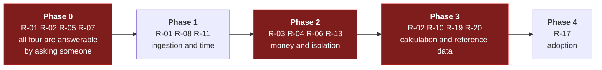

# Risk Register

Scored **likelihood × impact**, each on 1–5. Anything scoring **12 or above** needs an owner and a
mitigation in the plan, not just an entry in a table.

| Score | Band |
| :--: | --- |
| 20–25 | 🔴 Critical |
| 12–16 | 🟠 High |
| 6–10 | 🟡 Medium |
| 1–5 | 🟢 Low |

---

## Top risks

### R-01 · PVNed integration cannot be tested before production 🔴 **20**

*Likelihood 4 × Impact 5*

Everything the platform shows, trades against and invoices comes through one third-party push
integration. If there is no test environment ([OQ-05]), the first real document arrives in
production and every quirk is discovered live.

**Signals it is materialising:** no test endpoint offered; no sample allocation document (only the
imbalance sample exists today); questions in [OQ-65] going unanswered.

**Mitigation**
- Open the PVNed conversation **first**, before phase 1 planning — external parties have their own
  calendars.
- Build `DevStubs` as a first-class deliverable, able to produce valid, invalid, DST and correction
  documents ([PVNed integration §11](../30-integrations/01-pvned-timeseries.md)).
- Store every raw payload from day one **[DEC-03]**, so the first surprise is diagnosable and
  replayable rather than lost.
- Treat the nine documented inconsistencies ([§9](../30-integrations/01-pvned-timeseries.md)) as a
  checklist for the first production week.

**Owner:** Lead + PVNed account contact

---

### R-02 · Invoicing is built on unresolved rules 🔴 **20**

*Likelihood 4 × Impact 5*

Three inputs are unresolved — energiebelasting tariffs [OQ-14], imbalance allocation [OQ-15], VAT
treatment [OQ-17] — and each changes the arithmetic rather than a constant. Building on assumptions
means rewriting, or worse, invoicing customers wrongly and discovering it a quarter later.

**Mitigation**
- **Do not start phase 3 until all three are closed.** This is stated in
  [F10](../10-features/F10-invoicing-and-settlement.md) and in the roadmap.
- Engage a tax advisor on [OQ-14], [OQ-17] and [OQ-77] — these are fiscal questions, not
  engineering ones.
- Parallel-run the first month against the existing process and reconcile to the cent before any
  invoice reaches a customer.
- The volume identity assertion ([F10-R08]) as a permanent guard.

**Owner:** Finance lead

---

### R-03 · Peak-hour definition mismatch creates a hidden P&L exposure 🟠 **16**

*Likelihood 4 × Impact 4*

[OQ-02]. Exchange-traded Dutch peak-load products conventionally include public holidays; the brief
says "working days only". If the platform bills a holiday-excluding profile while PeakPower buys a
holiday-including product, PeakPower carries roughly 8–9 weekdays of peak volume a year — about 3.5%
of annual peak volume — and it will not be obvious on any screen.

**Mitigation**
- Resolve [OQ-02] explicitly with the trading desk before phase 2.
- **[DEC-14]** already makes the calendar reference data, and every trade pins the calendar version
  it was priced under, so a later change cannot restate a settled trade.
- Use one calendar for pricing, invoicing and the chart overlay — never two.

**Owner:** Trading

---

### R-04 · Wallet correctness defect 🟠 **15**

*Likelihood 3 × Impact 5*

A race, a rounding error or a missed rollback in reserve/settle/release means a customer's money is
wrong. This is the one class of bug that is not recoverable by an apology.

**Mitigation**
- Append-only ledger with computed balances and a daily reconciliation job **[DEC-04]**.
- Row-level locking with a written lock order — wallet before trade, always.
- The eight correctness tests in
  [Solution structure §6.1](../20-architecture/02-solution-structure.md) as a merge gate.
- `CHECK (available_after = settled_after - reserved_after)` at the database level.
- Database-level `REVOKE UPDATE, DELETE` on ledger entries.
- Property-based tests on the balance identity under arbitrary operation sequences.

**Owner:** Lead

---

### R-05 · Client-money regulation applies 🟠 **15**

*Likelihood 3 × Impact 5*

[OQ-31]. Holding customer funds in a prepaid wallet may carry regulatory obligations — segregated
accounts, safeguarding, possibly licensing. Discovering this near go-live could block launch
outright.

**Mitigation**
- Legal opinion **now**, in phase 0. This is a question, not a project.
- Design already keeps the wallet reconcilable against a bank account, which is a precondition for
  segregation if it turns out to be required.

**Owner:** Legal / Managing director

---

### R-06 · Tenancy isolation failure 🟠 **15**

*Likelihood 3 × Impact 5*

One customer sees another's consumption profile, trading position or balance. Commercially serious
between competitors, and a reportable GDPR breach.

**Mitigation**
- Four independent layers ([Security §2](../20-architecture/07-security.md)).
- An automated test that walks the **entire** customer-API route table as customer A attempting to
  reach customer B's objects — so a new endpoint is covered without anyone remembering.
- `IgnoreQueryFilters` banned by architecture test.
- Row-level security as the last line even if application code is wrong.
- External penetration test before go-live [OQ-60].

**Owner:** Lead

---

### R-07 · Montel licence restricts showing indications to customers 🟠 **12**

*Likelihood 3 × Impact 4*

[OQ-24]. If onward display is not permitted, [F04](../10-features/F04-price-indications.md) has to be
redesigned — possibly into a PeakPower-derived indication rather than a market price. That is a phase
2 discovery loop appearing mid-phase.

**Mitigation**
- Ask the licence question in phase 0. It is a contract review, not an investigation.
- Design the product/ticker mapping so the *source* of an indication is configurable, which keeps a
  derived-price fallback cheap.

**Owner:** Commercial

---

### R-08 · Time and DST handling errors 🟠 **12**

*Likelihood 3 × Impact 4*

92- and 100-interval days, the duplicated autumn hour, `Pos` mapping, peak-day counting, month
boundaries. These bugs are subtle, appear twice a year, and corrupt volumes and money silently.

**Mitigation**
- One `IMarketCalendar` service; no date arithmetic anywhere else, enforced by architecture test.
- Precomputed interval spine so the arithmetic happens once, at generation.
- Property-based tests across three years of calendar.
- Explicit DST test cases in ingestion, charting, coverage and invoicing.
- `interval_count` constrained to `(92, 96, 100)` in the database.

**Owner:** Lead

---

## Full register

| ID | Risk | L | I | Score | Mitigation summary | Owner |
| --- | --- | :-: | :-: | :-: | --- | --- |
| **R-01** | PVNed cannot be tested pre-production | 4 | 5 | 🔴 20 | Stub generator; raw retention; early engagement | Lead |
| **R-02** | Invoicing built on unresolved rules | 4 | 5 | 🔴 20 | Gate phase 3; tax advisor; parallel run | Finance |
| **R-03** | Peak-hour definition mismatch | 4 | 4 | 🟠 16 | Resolve [OQ-02]; calendar as data; version pinning | Trading |
| **R-04** | Wallet correctness defect | 3 | 5 | 🟠 15 | Append-only ledger; locking; reconciliation; test gate | Lead |
| **R-05** | Client-money regulation applies | 3 | 5 | 🟠 15 | Legal opinion in phase 0 | Legal |
| **R-06** | Tenancy isolation failure | 3 | 5 | 🟠 15 | Four layers; route-table test; pen test | Lead |
| **R-07** | Montel licence restricts display | 3 | 4 | 🟠 12 | Contract review in phase 0; configurable source | Commercial |
| **R-08** | Time / DST handling errors | 3 | 4 | 🟠 12 | Single calendar service; interval spine; property tests | Lead |
| R-09 | Key domain knowledge concentrated in one or two people | 3 | 4 | 🟠 12 | Write it down — this spec set is a start; pair on calculation code | PO |
| R-10 | Odoo integration harder than expected (version, hosting, API) | 3 | 3 | 🟡 9 | Resolve [OQ-69] early; independent from settlement by design | Finance |
| R-11 | Chart performance poor at portfolio scale | 3 | 3 | 🟡 9 | Rollups; spike in phase 0; explicit selection over "all" | Frontend |
| R-12 | Identity provider becomes an availability single point of failure | 2 | 4 | 🟡 8 | Prefer managed [OQ-03]; break-glass [OQ-44] | IT |
| R-13 | Payment webhook loss or duplication | 3 | 3 | 🟡 9 | Idempotency; authoritative status fetch; reconciliation job | Backend |
| R-14 | Data volume outgrows a single PostgreSQL | 2 | 3 | 🟡 6 | Partitioning; defined revisit trigger **[DEC-09]**; [OQ-53] | Lead |
| R-15 | Scope creep from gas being pulled forward | 3 | 3 | 🟡 9 | [DEC-15] keeps the model ready; treat as its own phase | PO |
| R-16 | Third-party lead times (contracts, DPIAs, licences) delay go-live | 3 | 3 | 🟡 9 | Start all in phase 0 — [OQ-34], [OQ-58], [OQ-24] | PO |
| R-17 | Customer adoption lower than expected | 3 | 3 | 🟡 9 | Phase 1 ships value before any behaviour change is asked for | Commercial |
| R-18 | Trade desk response times slip in practice | 2 | 3 | 🟡 6 | Real-time desk; urgency ranking; escalation alerts; measure G2 | Trading |
| R-19 | Reference data (tariffs, calendars) not maintained | 2 | 4 | 🟡 8 | Named owner; annual reminder job; block invoicing on missing tariff | Finance |
| R-20 | Late metering corrections make true-ups routine rather than exceptional | 3 | 2 | 🟡 6 | Materiality threshold; monitor correction frequency in phase 1 | Finance |
| R-21 | Angular/.NET version drift over a long build | 2 | 2 | 🟢 4 | Central package management; renovate; upgrade budget per phase | Lead |
| R-22 | Insufficient realistic test data for performance work | 3 | 2 | 🟡 6 | `DevStubs` generates volume; production-shaped test environment | QA |

---

## Risk posture over time

**Phase 0 carries four of the eight top risks, and every one of them is closed by a conversation
rather than by engineering.** That is the strongest argument for not skipping it.

## Review cadence

| When | What |
| --- | --- |
| Weekly during a phase | Top-eight review; any new risk scoring ≥ 12 |
| At each phase gate | Full register re-scored; closed risks archived with what actually happened |
| On any open question closing | Re-score the risks that referenced it |
| After any production incident | New entry, or re-score an existing one |
